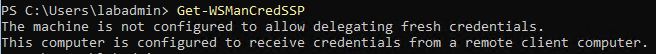
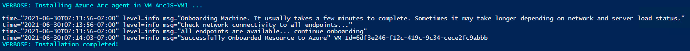

## Deploy a Windows Server virtual machine in Azure Stack HCI and connect it to Azure Arc using PowerShell

The following README will guide you on how to use the provided PowerShell script to deploy a Windows Server Virtual Machine on an [Azure Stack HCI](https://docs.microsoft.com/en-us/azure-stack/hci/overview) cluster and connect it as an Azure Arc-enabled server.

This guide will **not** provide instructions on how to deploy and set up Azure Stack HCI and it assumes you already have it provisioned. If you don't have any Azure Stack HCI cluster created, please have a look at the following [Azure Stack HCI 20H2 Evaluation Guide](https://github.com/Azure/AzureStackHCI-EvalGuide).

The commands below and the Powershell script described in this guide should be run on the **management computer**.

## Prerequisites

* Clone the Azure Arc Jumpstart repository

    ```shell
    git clone https://github.com/microsoft/azure_arc.git
    ```

* Enable subscription with the resource provider for Azure Arc-enabled Servers. Registration is an asynchronous process, and registration may take approximately 10 minutes.

  ```powershell
  Register-AzResourceProvider -ProviderNamespace Microsoft.HybridCompute
  Get-AzResourceProvider -ListAvailable | Select-Object ProviderNamespace, RegistrationState | Select-String  -Pattern "Microsoft.HybridCompute"

  Register-AzResourceProvider -ProviderNamespace Microsoft.GuestConfiguration
  Get-AzResourceProvider -ListAvailable | Select-Object ProviderNamespace, RegistrationState | Select-String  -Pattern "Microsoft.GuestConfiguration"
  ```

* Create Azure service principal (SP)

    To be able to complete the scenario and its related automation, an Azure service principal assigned with the “Contributor” role is required. To create it, login to your Azure account using PowerShell and run the below command.

    ```powershell
    Connect-AzAccount
    $sp = New-AzADServicePrincipal -DisplayName "<Unique SP Name>" -Role 'Contributor'
    ```

    For example:

    ```powershell
    $sp = New-AzADServicePrincipal -DisplayName "AzureStackHCI-VM-Jumpstart" -Role 'Contributor'
    ```

    This command will create a variable with a secure string as shown below:

    ```shell
    Secret                : System.Security.SecureString
    ServicePrincipalNames : {XXXXXXXXXXXXXXXXXXXXXXXXXXXX, http://AzureStackHCI-VM-Jumpstart}
    ApplicationId         : XXXXXXXXXXXXXXXXXXXXXXXXXXXX
    ObjectType            : ServicePrincipal
    DisplayName           : AzureStackHCI-VM-Jumpstart
    Id                    : XXXXXXXXXXXXXXXXXXXXXXXXXXXX
    Type                  :
    ```

    To expose the generated password use the below code to export the secret:

    ```powershell
    $BSTR = [System.Runtime.InteropServices.Marshal]::SecureStringToBSTR($sp.Secret)
    $UnsecureSecret = [System.Runtime.InteropServices.Marshal]::PtrToStringAuto($BSTR)
    ```

    Copy and save the Service Principal ApplicationId and Secret as you will need it for later on in the automation.

    > **Note: It is optional but highly recommended to scope the SP to a specific [Azure subscription and resource group](https://docs.microsoft.com/en-us/powershell/module/az.resources/new-azadserviceprincipal?view=azps-5.4.0)**

* Enable CredSSP in the Host Server

    The PowerShell script leverages [CredSSP](https://docs.microsoft.com/en-us/windows/win32/secauthn/credential-security-support-provider) to delegate credentials from the management server to the target server for remote authentication. It's required to allow the host server to receive credentials from a remote computer.

    ```powershell
    Enable-WSManCredSSP -Role Server
    ```

    

    Confirm if CredSSP enabled the host server to receive credentials:

    ```powershell
    Get-WSManCredSSP
    ```

    

## Automation Flow

For you to get familiar with the automation and deployment flow, below is an explanation.

1. User is editing the PowerShell script environment variables (1-time edit). These variables values are being used throughout the deployment and Azure Arc onboarding.

2. User is running the PowerShell script to deploy a basic Windows Server Virtual Machine on Azure Stack HCI and onboard onto Azure Arc. Runtime script will:
    * Set local OS variables
    * Download VHDX file with Windows Server 2019 Datacenter installed
    * Enable CredSSP on the management VM, for allowing the credential delegation to the host server
    * Create a new Virtual Machine based on the VHDX file
    * Add Virtual Machine to Server Cluster (optional)
    * Assign Static IP address to Virtual Machine (optional)
    * Install Azure Arc agent and onboarding

## Deployment

 > **Note: Once more, please make sure all the steps mentioned below are done in your management server.**

As mentioned, this deployment will leverage this [PowerShell script](https://github.com/microsoft/azure_arc/blob/main/azure_arc_servers_jumpstart/azure_stack_hci/powershell/azstack_hci_vm_deploy.ps1) to deploy all the needed componenets. Before running the script, it's important to edit the script variables for matching the parameters of your environment. We can split it in three sets of variables:

1. Environment variables for optional configurations

    * **DHCPEnabled:** Select _$true_ if DHCP is enabled on your environment, or _$false_ if a static IP assignment is needed.
        * If **DHCPEnabled** = _$false_, please provide the networking parameters described below to assign to the VM. If **DHCPEnabled** = _$true_, please attribute _$null_ to all the paramenters below:
            * **IPAddress:**  Provide the static IP address to assign to the VM.
            * **Prefix Lenght:** Provide the subnet length to assign to the VM.
            * **DefaultGateway:** Provide the default gateway to assign to the VM.
            * **DNSServer:** Provide the DNS Server to assign to the VM.
    * **ServerClusterEnabled:** Select _$true_ if you have a server cluster created, _$false_ if not.
        * If **ServerClusterEnabled** = _$true_, please provide the path to the cluster storage in the following format:
            * **vmdir:** Disk Letter:\ClusterStorage
        * If **ServerClusterEnabled** = _$false_, please provide the path to the folder where the VM will be created in the following format:
            * **vmdir:** Disk Letter:\Folder

    

    As an example:
    * **DHCPEnabled:** _$false_
    * **IPAddress:** '192.168.0.11'
    * **PrefixLenght:** '24'
    * **DefaultGateway:** '192.168.0.1'
    * **DNSServer:** '192.168.0.2'
    * **ServerClusterEnabled:** _$true_
    * **vmdir:** "C:\ClusterStorage\VMSTORAGE"

2. Environment variables for the VM creation

    * **NodeName:** Provide the name of the node where the VM will be created.
    * **DomainName:** Provide the name of the domain where the node is added.
    * **VMName:** Provide the name of the VM.
    * **VSwitchCreation:** = Select _$true_ if an external VSwitch creation is needed, _$false_ if already created
    * **VSwitchName:** Provide the name of the Virtual Switch.

    

    As an example:
    * **NodeName:** 'AZSHCINODE001'
    * **DomainName:** 'azshci.local'
    * **VMName:** 'ArcJS-VM1'
    * **VSwitchCreation:** _$false_
    * **VSwitchName:** 'Internet-vSwitch'

3. Environment variables to onboard the VM to Azure Arc

    * **subID:** Provide the subscriptionID
    * **appID:** Provide the Service Principal ApplicationID
    * **secret:** Provide the Service Principal Secret
    * **tID:** Provide the tenantID
    * **rgroup:** Provide the Resource Group Name
    * **location:** Provide the Region

    

    As an example:
    * **subID:** "XXXXXXXX-XXXX-XXXX-XXXX-XXXXXXXX"
    * **appID:** "XXXXXXXX-XXXX-XXXX-XXXX-XXXXXXXX"
    * **secret:** "XXXXXXXXXX"
    * **tID:** "XXXXXXXX-XXXX-XXXX-XXXX-XXXXXXXX"
    * **rgroup:** "arc-vms-rg"
    * **location:** "West Europe"

* After editing the variables, to run the script open PowerShell as an administrator, navigate to the [script folder](https://github.com/microsoft/azure_arc/tree/main/azure_arc_servers_jumpstart/azure_stack_hci/powershell) and run:

  ```powershell
  .\azstack_hci_vm_deploy.ps1
  ```

  > **Note: The script takes some minutes to deploy, specially during the .VHDX download**  

    

  > **Note: You'll be asked to provide the credentials for accessing your host server. If prompted with any other authorization requests (CredSSP, networking related, etc), please answer _Yes_ to all of them.**

    

* Once the script run has finished, the output will look like the following:

    

* From the Windows Admin Center, you can see as well the VM created:

    

* The Windows Virtual Machine created in Azure Stack HCI will be projected as a new Azure Arc-enabled Server resource.

    

## Delete the deployment

The most straightforward way is to delete the Azure Arc-enabled server resource via the Azure Portal, just select the cluster and delete it.


To delete the Windows Virtual Machine on Azure Stack HCI run the below command in the management server:

```powershell
$VMName = 'Provide the VM name'
$NodeName = 'Provide the node name'
$DomainName = 'Provide the domain name'

$CustomCred = Get-Credential
$s = New-PSSession -ComputerName "$NodeName.$DomainName" -Credential $CustomCred -Authentication Credssp 

Invoke-Command -Session $s -ScriptBlock{
    
    Stop-VM -Name $using:VMName
    Get-VMHardDiskDrive -VMName $using:VMName | Remove-VMHardDiskDrive
    Get-VM -Name $using:VMName -ComputerName $using:NodeName | Remove-VM

}
```
