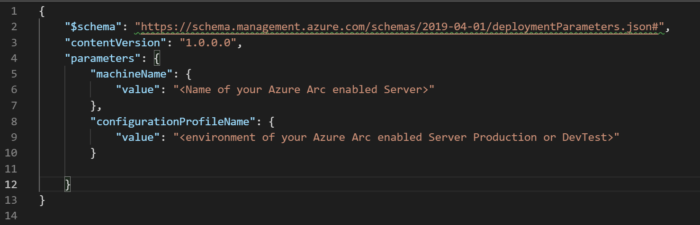
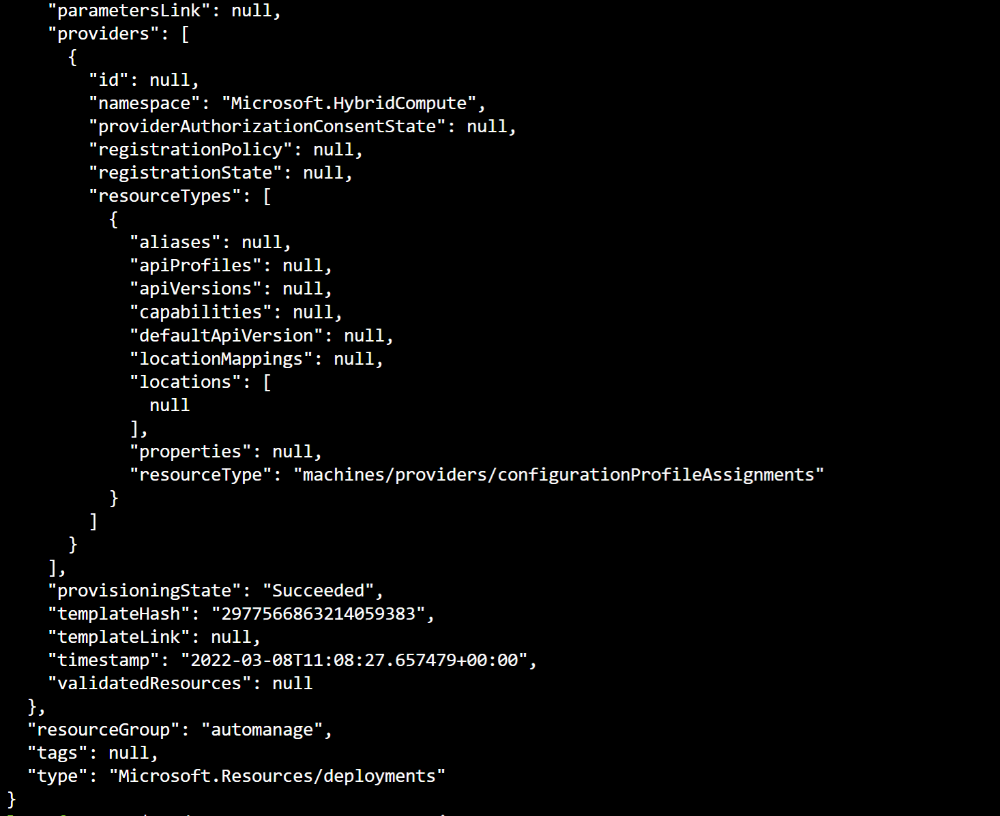

## Enable Azure Automanage on an Azure Arc enabled server using an ARM template

The following README will guide you on how to onboard an Azure Arc enabled server on to [Azure Automanage](https://docs.microsoft.com/en-us/azure/automanage/automanage-virtual-machines#prerequisites), so you can follow best practices in reliability, security and management for Azure Arc enabled servers using Azure services such as [Azure Update Management](https://docs.microsoft.com/en-us/azure/automation/update-management/overview) and [Azure Backup](https://docs.microsoft.com/en-us/azure/backup/backup-overview).

Azure Automanage removes the need to discover virtual machines manually and automatically onboards and configures certain services in Azure following best practices as defined in [Microsoft Cloud Adoption Framework for Azure](https://docs.microsoft.com/en-us/azure/cloud-adoption-framework/manage/best-practices). Azure services included in Azure Automanage are:

- [Azure Backup](https://docs.microsoft.com/en-us/azure/backup/backup-overview)
- [Azure Security Center](https://docs.microsoft.com/en-us/azure/security-center/security-center-introduction)
- [Azure Monitor](https://docs.microsoft.com/en-us/azure/azure-monitor/overview)
- [Azure Automation](https://docs.microsoft.com/en-us/azure/automation/automation-intro)

By the end of this guide, you will have an Azure Arc enabled server with Azure Automanage enabled and configured following Microsoft Cloud Adoption Framework best practices for Dev/Test or Production environments.

> **Note: This guide assumes you already deployed VMs or servers that are running on-premises or other clouds and you have connected them to Azure Arc but If you haven't, this repository offers you a way to do so in an automated fashion:**

* **[Azure Stack HCI Windows VM](https://azurearcjumpstart.io/azure_arc_jumpstart/azure_arc_servers/azure_stack_hci/azure_stack_hci_windows/)**
* **[GCP Ubuntu instance](https://azurearcjumpstart.io/azure_arc_jumpstart/azure_arc_servers/gcp/gcp_terraform_ubuntu/)**
* **[GCP Windows instance](https://azurearcjumpstart.io/azure_arc_jumpstart/azure_arc_servers/gcp/gcp_terraform_windows/)**
* **[AWS Ubuntu EC2 instance](https://azurearcjumpstart.io/azure_arc_jumpstart/azure_arc_servers/aws/aws_terraform_ubuntu/)**
* **[AWS Amazon Linux 2 EC2 instance](https://azurearcjumpstart.io/azure_arc_jumpstart/azure_arc_servers/aws/aws_terraform_al2/)**
* **[Azure Ubuntu VM](https://azurearcjumpstart.io/azure_arc_jumpstart/azure_arc_servers/azure/azure_arm_template_linux/)**
* **[Azure Windows VM](https://azurearcjumpstart.io/azure_arc_jumpstart/azure_arc_servers/azure/azure_arm_template_win/)**
* **[VMware vSphere Ubuntu VM](https://azurearcjumpstart.io/azure_arc_jumpstart/azure_arc_servers/vmware/vmware_terraform_ubuntu/)**
* **[VMware vSphere Windows Server VM](https://azurearcjumpstart.io/azure_arc_jumpstart/azure_arc_servers/vmware/vmware_terraform_winsrv/)**
* **[Vagrant Ubuntu box](https://azurearcjumpstart.io/azure_arc_jumpstart/azure_arc_servers/vagrant/local_vagrant_ubuntu/)**
* **[Vagrant Windows box](https://azurearcjumpstart.io/azure_arc_jumpstart/azure_arc_servers/vagrant/local_vagrant_windows/)**

## Prerequisites

* Clone the Azure Arc Jumpstart repository

    ```shell
    git clone https://github.com/microsoft/azure_arc.git
    ```

* As mentioned, this guide starts at the point where you already deployed and connected VMs or bare-metal servers to Azure Arc. For this scenario we will be using a Google Cloud Platform (GCP) instance that has been already connected to Azure Arc and is visible as a resource in Azure.

    

    

* [Install or update Azure CLI](https://docs.microsoft.com/en-us/cli/azure/install-azure-cli?view=azure-cli-latest). Azure CLI should be running version 2.7** or later. Use ```az --version``` to check your current installed version.

* Create Azure service principal (SP)

    To connect a VM or bare-metal server to Azure Arc, Azure service principal assigned with the "Contributor" role is required. To create it, login to your Azure account run the below command (this can also be done in [Azure Cloud Shell](https://shell.azure.com/)).

    ```shell
    az login
    az ad sp create-for-rbac -n "<Unique SP Name>" --role contributor
    ```

    For example:

    ```shell
    az ad sp create-for-rbac -n "http://AzureArcServers" --role contributor
    ```

    Output should look like this:

    ```json
    {
    "appId": "XXXXXXXXXXXXXXXXXXXXXXXXXXXX",
    "displayName": "AzureArcServers",
    "name": "http://AzureArcServers",
    "password": "XXXXXXXXXXXXXXXXXXXXXXXXXXXX",
    "tenant": "XXXXXXXXXXXXXXXXXXXXXXXXXXXX"
    }
    ```

  > **Note: It is optional but highly recommended to scope the SP to a specific [Azure subscription](https://docs.microsoft.com/en-us/cli/azure/ad/sp?view=azure-cli-latest). To create an Automanage Account used by the Automanage services, you need the Owner or Contributor permissions on your subscription along with User Access Administrator roles.**

## Automation Flow

For you to get familiar with the automation and deployment flow, below is an explanation.

* User is editing the shell script to provide environment variables (1-time edit). These variables are being used throughout the deployment.

* The script will edit the ARM templates parameters file that will be used for the deployment. There are three ARM templates that will:

  * Create an Azure Automanage Account.
  * Grant permissions to the Azure Automanage Account.
  * Enable Azure Automanage on the Azure Arc enabled server.

## Enable Azure Automanage on an Azure Arc enabled server

* In order to keep your local environment clean and untouched, we will use Azure Cloud Shell to run the `arcAutomanage.sh` shell script against the Azure Arc enabled server.

  

* To run the automation, navigate to the [deployment folder](https://github.com/microsoft/azure_arc/tree/main/azure_arc_servers_jumpstart/automanage/artifacts) and edit [the script's](https://github.com/microsoft/azure_arc/tree/main/azure_arc_servers_jumpstart/automanage/artifacts/arcAutomanage.sh) environment variables:
  *  _`automanageAccountName`_: name of your Automanage Account identity, make sure it is unique.
  * _`location`_: Azure Region where your Arc enabled server is registered to.
  * _`resourceGroup`_: Azure Resource Group where your Azure Arc enabled Server is registered to.
  * _`machineName`_: Name of your Azure Arc enabled server as it is shown in the Azure Portal.
  * _`profile`_: refers to the environment of your Azure Arc enabled server as Azure Automanage has different profiles. Values can be "Production" or "DevTest".

  

* From the deployment folder run the below command:

  ```shell
    . ./arcAutomanage.sh
  ```

  

  > **Note: For the script to work properly you must run this command from the deployment folder. The extra dot is due to the shell script has an *export* function and needs to have the vars exported in the same shell session as the rest of the commands.**

* After the script has finished its run you will have Azure Automanage enabled. You should be able to see the Azure Arc enabled Server under 'Automanage – Azure machine best practices' with the Status set in 'Configured'.

  
  

  > **Note: it may take upto 30 minutes for the script to finish its run**

## Clean up environment

Complete the following steps to clean up your environment. To disable Azure Automanage you will use the Azure portal, go to the Automanage – Azure virtual machine best practices page that lists all of your auto-managed VMs. Select the checkbox next to the Azure Arc enabled Server you want to disable from Automanage, then click on the Disable _automanagement_ button.

  

* Remove the virtual machines from each environment by following the teardown instructions from each guide.

* **[Azure Stack HCI Windows VM](https://azurearcjumpstart.io/azure_arc_jumpstart/azure_arc_servers/azure_stack_hci/azure_stack_hci_windows/)**
* **[GCP Ubuntu instance](https://azurearcjumpstart.io/azure_arc_jumpstart/azure_arc_servers/gcp/gcp_terraform_ubuntu/)**
* **[GCP Windows instance](https://azurearcjumpstart.io/azure_arc_jumpstart/azure_arc_servers/gcp/gcp_terraform_windows/)**
* **[AWS Ubuntu EC2 instance](https://azurearcjumpstart.io/azure_arc_jumpstart/azure_arc_servers/aws/aws_terraform_ubuntu/)**
* **[AWS Amazon Linux 2 EC2 instance](https://azurearcjumpstart.io/azure_arc_jumpstart/azure_arc_servers/aws/aws_terraform_al2/)**
* **[Azure Ubuntu VM](https://azurearcjumpstart.io/azure_arc_jumpstart/azure_arc_servers/azure/azure_arm_template_linux/)**
* **[Azure Windows VM](https://azurearcjumpstart.io/azure_arc_jumpstart/azure_arc_servers/azure/azure_arm_template_win/)**
* **[VMware vSphere Ubuntu VM](https://azurearcjumpstart.io/azure_arc_jumpstart/azure_arc_servers/vmware/vmware_terraform_ubuntu/)**
* **[VMware vSphere Windows Server VM](https://azurearcjumpstart.io/azure_arc_jumpstart/azure_arc_servers/vmware/vmware_terraform_winsrv/)**
* **[Vagrant Ubuntu box](https://azurearcjumpstart.io/azure_arc_jumpstart/azure_arc_servers/vagrant/local_vagrant_ubuntu/)**
* **[Vagrant Windows box](https://azurearcjumpstart.io/azure_arc_jumpstart/azure_arc_servers/vagrant/local_vagrant_windows/)**
