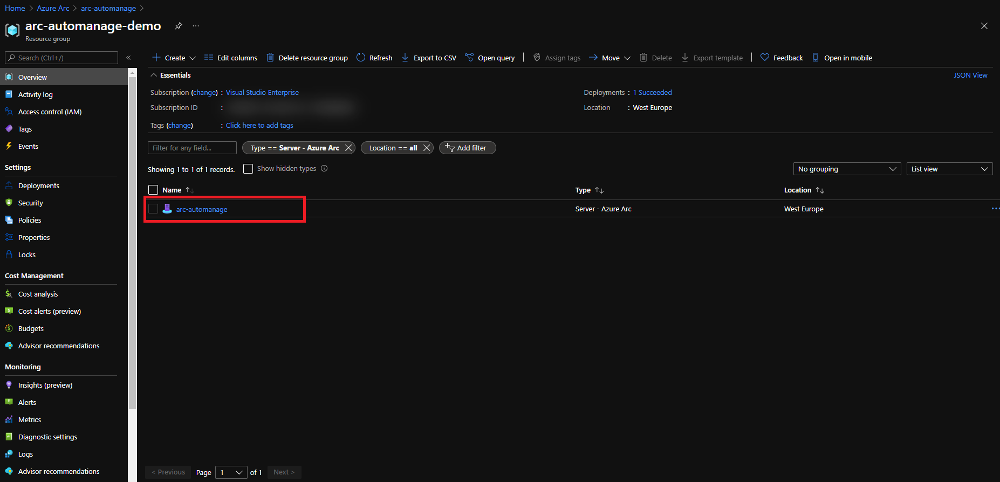
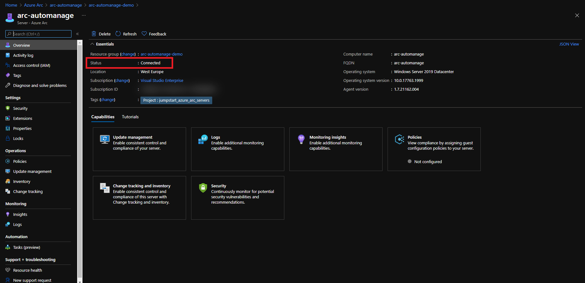
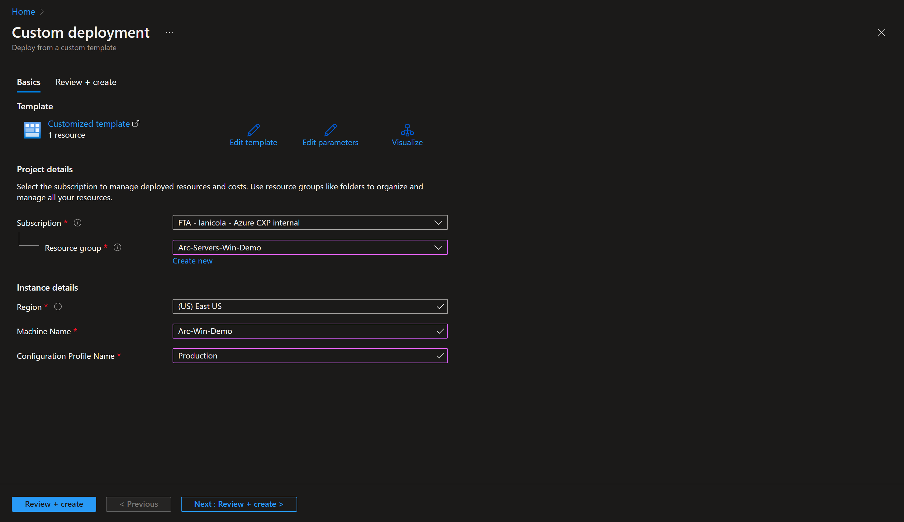
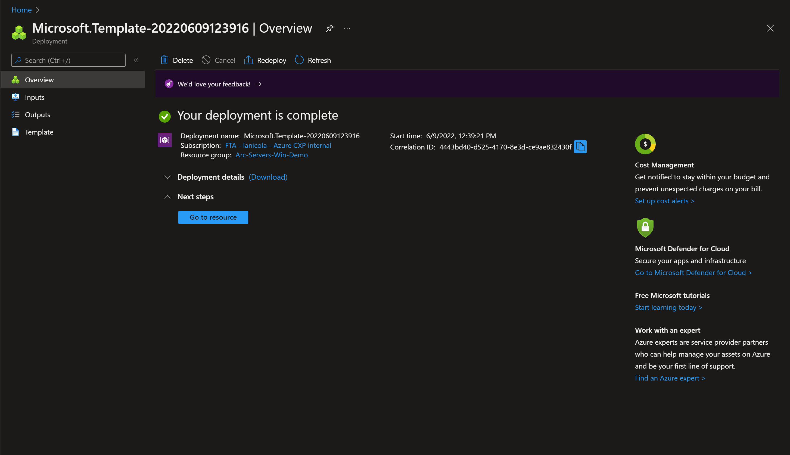
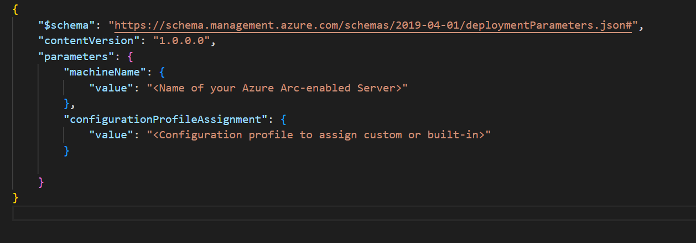
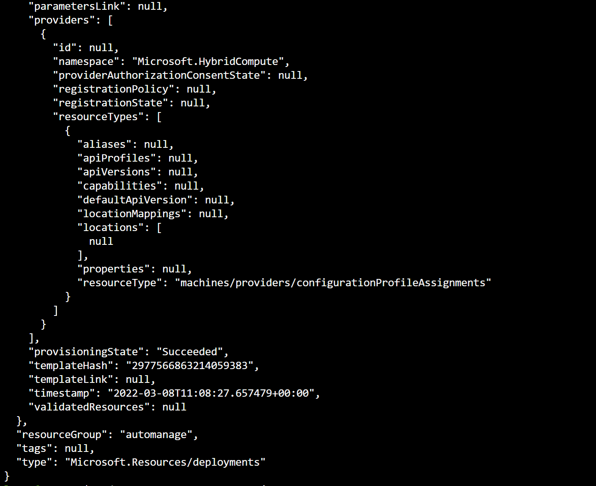
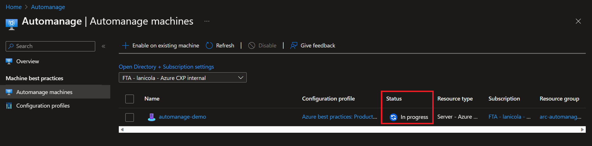
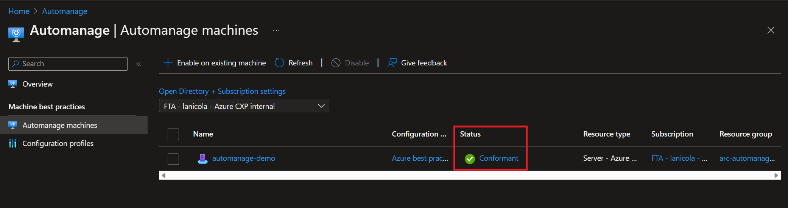
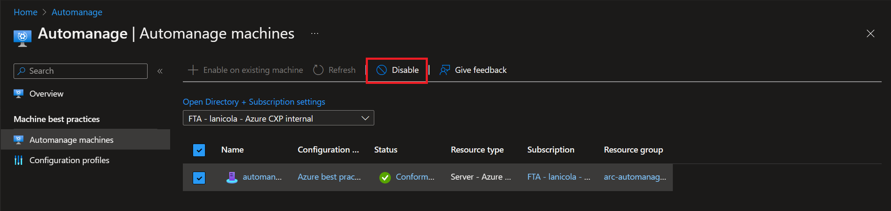

## Enable Azure Automanage built-in profiles on an Azure Arc-enabled servers using an ARM Template

The following Jumpstart scenario will guide you on how to onboard an Azure Arc-enabled server onto [Azure Automanage](https://docs.microsoft.com/azure/automanage/automanage-virtual-machines#prerequisites), so you can follow best practices in reliability, security, and management for Azure Arc-enabled servers using Azure services such as [Azure Update Management](https://docs.microsoft.com/azure/automation/update-management/overview) and [Azure Monitor](https://docs.microsoft.com/azure/azure-monitor/vm/vminsights-overview).

Azure Automanage removes the need to discover virtual machines manually and automatically onboards and configures certain services in Azure following best practices as defined in [Microsoft Cloud Adoption Framework for Azure](https://docs.microsoft.com/azure/cloud-adoption-framework/manage/best-practices). Azure services included in Azure Automanage are:

- [Microsoft Antimalware](https://docs.microsoft.com/azure/security/fundamentals/antimalware)
- [Change Tracking & Inventory](https://docs.microsoft.com/azure/automation/change-tracking/overview)
- [Update Management](https://docs.microsoft.com/azure/automation/update-management/overview)
- [Machines Insights Monitoring](https://docs.microsoft.com/azure/azure-monitor/vm/vminsights-overview)
- [Azure Guest Configuration](https://docs.microsoft.com/azure/governance/policy/concepts/guest-configuration)
- [Azure Automation Account](https://docs.microsoft.com/azure/automation/automation-create-standalone-account)
- [Log Analytics workspace](https://docs.microsoft.com/azure/azure-monitor/logs/log-analytics-overview)

By the end of this scenario, you will have an Azure Arc-enabled server with Azure Automanage enabled and configured following Microsoft Cloud Adoption Framework best practices for Dev/Test or Production environments.

> **NOTE: This guide assumes you already deployed VMs or servers that are running on-premises or other clouds and you have connected them to Azure Arc. If you haven't, this repository offers you a way to do so in an automated fashion:**

- **[Azure Stack HCI Windows VM](https://azurearcjumpstart.io/azure_arc_jumpstart/azure_arc_servers/azure_stack_hci/azure_stack_hci_windows/)**
- **[GCP Ubuntu instance](https://azurearcjumpstart.io/azure_arc_jumpstart/azure_arc_servers/gcp/gcp_terraform_ubuntu/)**
- **[GCP Windows instance](https://azurearcjumpstart.io/azure_arc_jumpstart/azure_arc_servers/gcp/gcp_terraform_windows/)**
- **[AWS Ubuntu EC2 instance](https://azurearcjumpstart.io/azure_arc_jumpstart/azure_arc_servers/aws/aws_terraform_ubuntu/)**
- **[AWS Amazon Linux 2 EC2 instance](https://azurearcjumpstart.io/azure_arc_jumpstart/azure_arc_servers/aws/aws_terraform_al2/)**
- **[Azure Ubuntu VM](https://azurearcjumpstart.io/azure_arc_jumpstart/azure_arc_servers/azure/azure_arm_template_linux/)**
- **[Azure Windows VM](https://azurearcjumpstart.io/azure_arc_jumpstart/azure_arc_servers/azure/azure_arm_template_win/)**
- **[VMware vSphere Ubuntu VM](https://azurearcjumpstart.io/azure_arc_jumpstart/azure_arc_servers/vmware/vmware_terraform_ubuntu/)**
- **[VMware vSphere Windows Server VM](https://azurearcjumpstart.io/azure_arc_jumpstart/azure_arc_servers/vmware/vmware_terraform_winsrv/)**
- **[Vagrant Ubuntu box](https://azurearcjumpstart.io/azure_arc_jumpstart/azure_arc_servers/vagrant/local_vagrant_ubuntu/)**
- **[Vagrant Windows box](https://azurearcjumpstart.io/azure_arc_jumpstart/azure_arc_servers/vagrant/local_vagrant_windows/)**

## Prerequisites

- As mentioned, this scenario starts at the point where you already deployed and connected VMs or bare-metal servers to Azure Arc. For this scenario we will be using a Google Cloud Platform (GCP) instance that has been already connected to Azure Arc and is visible as a resource in Azure.

    

    

- [Install or update Azure CLI](https://docs.microsoft.com/cli/azure/install-azure-cli?view=azure-cli-latest). Azure CLI should be running version 2.49.0 or later. Use ```az --version``` to check your current installed version.

- Create Azure service principal (SP)

    To connect a VM or bare-metal server to Azure Arc, Azure service principal assigned with the "Contributor" role is required. To create it, login to your Azure account run the below command (this can also be done in [Azure Cloud Shell](https://shell.azure.com/)).

    ```shell
    az login
    subscriptionId=$(az account show --query id --output tsv)
    az ad sp create-for-rbac -n "<Unique SP Name>" --role "Contributor" --scopes /subscriptions/$subscriptionId
    ```

    For example:

    ```shell
    az login
    subscriptionId=$(az account show --query id --output tsv)
    az ad sp create-for-rbac -n "JumpstartArc" --role "Contributor" --scopes /subscriptions/$subscriptionId
    ```

    Output should look like this:

    ```json
    {
    "appId": "XXXXXXXXXXXXXXXXXXXXXXXXXXXX",
    "displayName": "JumpstartArc",
    "password": "XXXXXXXXXXXXXXXXXXXXXXXXXXXX",
    "tenant": "XXXXXXXXXXXXXXXXXXXXXXXXXXXX"
    }
    ```

    > **NOTE: If you create multiple subsequent role assignments on the same service principal, your client secret (password) will be destroyed and recreated each time. Therefore, make sure you grab the correct password**.

    > **NOTE: The Jumpstart scenarios are designed with as much ease of use in-mind and adhering to security-related best practices whenever possible. It is optional but highly recommended to scope the service principal to a specific [Azure subscription and resource group](https://docs.microsoft.com/cli/azure/ad/sp?view=azure-cli-latest) as well considering using a [less privileged service principal account](https://docs.microsoft.com/azure/role-based-access-control/best-practices)**

## Deployment Options and Automation Flow

This Jumpstart scenario provides multiple paths for deploying and configuring resources. Deployment options include:

- Azure portal
- ARM template via Azure CLI

For you to get familiar with the automation and deployment flow, below is an explanation.

- User provides the ARM template parameter values, either via the portal or editing the parameters file. These parameters values are used throughout the deployment.

- User will run the ARM template at resource group level.

## Deployment Option 1: Azure portal

- Click the <a href="https://portal.azure.com/#create/Microsoft.Template/uri/https%3A%2F%2Fraw.githubusercontent.com%2Fmicrosoft%2Fazure_arc%2Fmain%2Fazure_arc_servers_jumpstart%2Fautomanage_builtin_profile%2Fazuredeploy.json" target="_blank"></a> button and enter values for the the ARM template parameters.

  

  

## Deployment Option 2: ARM template with Azure CLI

- In order to keep your local environment clean and untouched, we will use Azure Cloud Shell to run the ARM template.

  

- Clone the Azure Arc Jumpstart repository

    ```shell
    git clone https://github.com/microsoft/azure_arc.git
    ```

- To run the automation, navigate to the [deployment folder](https://github.com/microsoft/azure_arc/tree/main/azure_arc_servers_jumpstart/automanage_builtin_profile/) and edit [the parameters file](https://github.com/microsoft/azure_arc/tree/main/azure_arc_servers_jumpstart/automanage_builtin_profile/azuredeploy.parameters.json)
  - _`machineName`_: Name of your Azure Arc-enabled server as it is shown in the Azure Portal.
  - _`configurationProfile`_: refers to the environment of your Azure Arc-enabled server as Azure Automanage has different built-in profiles. Values can be:
    - _`Production environment`_: "/providers/Microsoft.Automanage/bestPractices/AzureBestPracticesProduction"
    - _`DevTest environments`_"/providers/Microsoft.Automanage/bestPractices/AzureBestPracticesDevTest"

  

- From the deployment folder run the below command:

  ```shell
    az deployment group create --resource-group <your_resource_group> --template-file azuredeploy.json --parameters azuredeploy.parameters.json
  ```

  

  > **NOTE: For the script to work properly you must run this command from the deployment folder. The extra dot is due to the shell script having an _export_ function and needs to have the vars exported in the same shell session as the rest of the commands.**

- After the script has finished its run you will have Azure Automanage enabled. You should be able to see the Azure Arc-enabled Server under 'Automanage' with the Status set in 'In progress', after a few minutes it will change to Conformant.

  
  

## Clean up environment

Complete the following steps to clean up your environment. To disable Azure Automanage you will use the Azure portal, go to the Automanage page that lists all of your auto-managed VMs. Select the checkbox next to the Azure Arc-enabled Server you want to disable from Automanage, then click on the _Disable_ button.

  

- Remove the virtual machines from each environment by following the teardown instructions from each guide.

- **[Azure Stack HCI Windows VM](https://azurearcjumpstart.io/azure_arc_jumpstart/azure_arc_servers/azure_stack_hci/azure_stack_hci_windows/)**
- **[GCP Ubuntu instance](https://azurearcjumpstart.io/azure_arc_jumpstart/azure_arc_servers/gcp/gcp_terraform_ubuntu/)**
- **[GCP Windows instance](https://azurearcjumpstart.io/azure_arc_jumpstart/azure_arc_servers/gcp/gcp_terraform_windows/)**
- **[AWS Ubuntu EC2 instance](https://azurearcjumpstart.io/azure_arc_jumpstart/azure_arc_servers/aws/aws_terraform_ubuntu/)**
- **[AWS Amazon Linux 2 EC2 instance](https://azurearcjumpstart.io/azure_arc_jumpstart/azure_arc_servers/aws/aws_terraform_al2/)**
- **[Azure Ubuntu VM](https://azurearcjumpstart.io/azure_arc_jumpstart/azure_arc_servers/azure/azure_arm_template_linux/)**
- **[Azure Windows VM](https://azurearcjumpstart.io/azure_arc_jumpstart/azure_arc_servers/azure/azure_arm_template_win/)**
- **[VMware vSphere Ubuntu VM](https://azurearcjumpstart.io/azure_arc_jumpstart/azure_arc_servers/vmware/vmware_terraform_ubuntu/)**
- **[VMware vSphere Windows Server VM](https://azurearcjumpstart.io/azure_arc_jumpstart/azure_arc_servers/vmware/vmware_terraform_winsrv/)**
- **[Vagrant Ubuntu box](https://azurearcjumpstart.io/azure_arc_jumpstart/azure_arc_servers/vagrant/local_vagrant_ubuntu/)**
- **[Vagrant Windows box](https://azurearcjumpstart.io/azure_arc_jumpstart/azure_arc_servers/vagrant/local_vagrant_windows/)**
