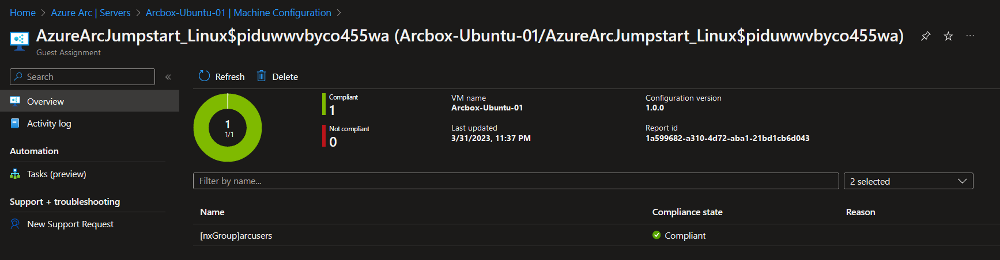

## Create Automanage Machine Configuration custom configurations

The following Jumpstart scenario will guide you on how to create and assign Automanage Machine Configuration custom configurations to an Azure Arc-enabled server. Automanage makes it easy to follow best practices in reliability, security, and management for Azure Arc-enabled servers using Azure services such as [Azure Update Management](https://docs.microsoft.com/azure/automation/update-management/overview) and [Azure Monitor](https://docs.microsoft.com/azure/azure-monitor/vm/vminsights-overview).


By the end of this scenario, you will have both Linux and Windows Azure Arc-enabled servers with Automanage Machine Configuration custom configurations assigned.

> **NOTE: This guide assumes you already deployed VMs or servers that are running on-premises or other clouds and you have connected them to Azure Arc but If you haven't, this repository offers you a way to do so in an automated fashion:**

- **[Azure Stack HCI Windows VM](https://azurearcjumpstart.io/azure_arc_jumpstart/azure_arc_servers/azure_stack_hci/azure_stack_hci_windows/)**
- **[GCP Ubuntu instance](https://azurearcjumpstart.io/azure_arc_jumpstart/azure_arc_servers/gcp/gcp_terraform_ubuntu/)**
- **[GCP Windows instance](https://azurearcjumpstart.io/azure_arc_jumpstart/azure_arc_servers/gcp/gcp_terraform_windows/)**
- **[AWS Ubuntu EC2 instance](https://azurearcjumpstart.io/azure_arc_jumpstart/azure_arc_servers/aws/aws_terraform_ubuntu/)**
- **[AWS Amazon Linux 2 EC2 instance](https://azurearcjumpstart.io/azure_arc_jumpstart/azure_arc_servers/aws/aws_terraform_al2/)**
- **[Azure Ubuntu VM](https://azurearcjumpstart.io/azure_arc_jumpstart/azure_arc_servers/azure/azure_arm_template_linux/)**
- **[Azure Windows VM](https://azurearcjumpstart.io/azure_arc_jumpstart/azure_arc_servers/azure/azure_arm_template_win/)**
- **[VMware vSphere Ubuntu VM](https://azurearcjumpstart.io/azure_arc_jumpstart/azure_arc_servers/vmware/vmware_terraform_ubuntu/)**
- **[VMware vSphere Windows Server VM](https://azurearcjumpstart.io/azure_arc_jumpstart/azure_arc_servers/vmware/vmware_terraform_winsrv/)**
- **[Vagrant Ubuntu box](https://azurearcjumpstart.io/azure_arc_jumpstart/azure_arc_servers/vagrant/local_vagrant_ubuntu/)**
- **[Vagrant Windows box](https://azurearcjumpstart.io/azure_arc_jumpstart/azure_arc_servers/vagrant/local_vagrant_windows/)**


This scenario starts at the point where you already deployed and connected VMs or bare-metal servers to Azure Arc. For demonstrations in this scenario, we will be using the Azure Arc-enabled servers that are provisioned by default by [Jumpstart ArcBox](https://azurearcjumpstart.io/azure_jumpstart_arcbox/itpro/) and is visible as resources in Azure.


The custom configurations are written using PowerShell Desired State Configuration (DSC), and needs to be authored from a machine running the target operating system for the configurations.
We will need 1 Windows machine and 1 Linux machine for the authoring process, as this scenario will show-case custom configurations for both operating systems.
After the configurations has been authored and published into your Azure environment, they can be assigned to any Linux or Windows Azure Arc-enabled server in your environment.
This scenario will assign it to the resource group ArcBox is deployed to.

## Base requirements - configuration authoring

Operating systems:

- Linux: Ubuntu 18 (required by the GuestConfiguration module)
- Windows: [Any supported version of Windows for PowerShell 7](https://learn.microsoft.com/en-us/powershell/scripting/install/installing-powershell-on-windows?view=powershell-7.3#supported-versions-of-windows)

Software:

- [PowerShell 7](https://learn.microsoft.com/en-us/powershell/scripting/install/installing-powershell?view=powershell-7.3).
    - Run ```$PSVersionTable``` to check your currently installed version.

PowerShell modules:

```powershell
Install-Module -Name Az.Accounts -Force -RequiredVersion 2.12.1
Install-Module -Name Az.PolicyInsights -Force -RequiredVersion 1.5.1
Install-Module -Name Az.Resources -Force -RequiredVersion 6.5.2
Install-Module -Name Az.Az.Ssh -Force -RequiredVersion 0.1.1
Install-Module -Name Az.Storage -Force -RequiredVersion 5.4.0

Install-Module -Name GuestConfiguration -Force -RequiredVersion 4.4.0
```

The GuestConfiguration module automates the process of creating custom content including:

  - Creating a guest configuration content artifact (.zip)
  - Validating the package meets requirements
  - Installing the guest configuration agent locally for testing
  - Validating the package can be used to audit settings in a machine
  - Validating the package can be used to configure settings in a machine

The Azure PowerShell modules is used for:
  - Publishing the package to Azure storage
  - Creating a policy definition
  - Publishing the policy
  - Connecting to the Azure Arc-enabled servers

## Prerequisites - Linux

```powershell
Install-Module PSDesiredStateConfiguration -AllowPreRelease -Force -RequiredVersion 3.0.0-beta1

Install-Module nxtools -Force -RequiredVersion 0.0.4
```

Desired State Configuration version 3 is currently in beta, but is the only version supported for Linux-based DSC configurations.

The nxtools module will help in managing common tasks such as:

- User and group management
- File system operations (changing mode, owner, listing, set/replace content)
- Service management (start, stop, restart, remove, add)
- Archive operations (compress, extract)
- Package Management (list, search, install, uninstall packages)

## Prerequisites - Windows

Desired State Configuration version 3 is removing the dependency on MOF.
Initially, there are only support for DSC Resources written as PowerShell classes.
Due to using MOF-based DSC resources for the Windows demo-configuration, we are using version 2.0.5.

```powershell
Install-Module PSDesiredStateConfiguration -Force -RequiredVersion 2.0.5
```


## Shared resources

Authenticate to Azure

```powershell
Connect-AzAccount

$ResourceGroupName = "arcbox-demo-rg"
$Location = "northeurope"
```

Create storage account for storing DSC artifacts

```powershell
$storageaccountsuffix = -join ((97..122) | Get-Random -Count 5 | % {[char]$_})

New-AzStorageAccount -ResourceGroupName $ResourceGroupName -Name "arcboxmachineconfig$storageaccountsuffix" -SkuName 'Standard_LRS' -Location $Location -OutVariable storageaccount | New-AzStorageContainer -Name machineconfiguration -Permission Blob
```

> *Make a note of the storage account name, as this will be needed in later steps.*

## Linux configuration

The following steps needs to be executed from PowerShell 7 on the authoring machine for Linux.

```powershell
Import-Module PSDesiredStateConfiguration -RequiredVersion 3.0.0

Configuration AzureArcJumpstart_Linux
{

    Import-DscResource -ModuleName nxtools -ModuleVersion 0.4.0

    Node localhost
    {

      nxGroup arcusers {
        GroupName = "arcusers"
        Ensure = "Present"
      }

    }
}

$OutputPath = "$HOME/arc_automanage_machine_configuration_custom_linux"
New-Item $OutputPath -Force -ItemType Directory

AzureArcJumpstart_Linux -PasswordCredential $linuxCreds -ConfigurationData $ConfigurationData -OutputPath $OutputPath
```

Create a package that will audit and apply the configuration (Set)

```powershell
New-GuestConfigurationPackage `
-Name 'AzureArcJumpstart_Linux' `
-Configuration "$OutputPath/localhost.mof" `
-Type AuditAndSet `
-Path $OutputPath `
-Force
```

Test applying the configuration to the local machine

```powershell
Start-GuestConfigurationPackageRemediation -Path "$OutputPath/AzureArcJumpstart_Linux.zip"
```

Upload the configuration package to Azure Storage.
Insert the correct storage account name on the first line in place of the placeholder value for the -Name parameter based on the output of the storage account created in the step *"Shared resources"*.

```powershell
$StorageAccount = Get-AzStorageAccount -Name <insert-storage-account-name> -ResourceGroupName $ResourceGroupName

$StorageAccountKey = Get-AzStorageAccountKey -Name $storageaccount.StorageAccountName -ResourceGroupName $storageaccount.ResourceGroupName
$Context = New-AzStorageContext -StorageAccountName $storageaccount.StorageAccountName -StorageAccountKey $StorageAccountKey[0].Value

Set-AzStorageBlobContent -Container "machineconfiguration" -File  "$OutputPath/AzureArcJumpstart_Linux" -Blob "AzureArcJumpstart_Linux" -Context $Context -Force

$contenturi = New-AzStorageBlobSASToken -Context $Context -FullUri -Container machineconfiguration -Blob "AzureArcJumpstart_Linux" -Permission rwd
```

Create an Azure Policy definition

```powershell
$PolicyId = (New-Guid).Guid

New-GuestConfigurationPolicy `
  -PolicyId $PolicyId `
  -ContentUri $ContentUri `
  -DisplayName '(AzureArcJumpstart) [Linux] Custom configuration' `
  -Description 'Azure Arc Jumpstart Linux demo configuration' `
  -Path  $OutputPath `
  -Platform 'Linux' `
  -PolicyVersion 1.0.0 `
  -Mode ApplyAndAutoCorrect `
  -Verbose -OutVariable Policy

  $PolicyParameterObject = @{'IncludeArcMachines'='true'}

  New-AzPolicyDefinition -Name '(AzureArcJumpstart) [Linux] Custom configuration' -Policy $Policy.Path -OutVariable PolicyDefinition
```

Assign the Azure Policy definition to the target resource group

```powershell
$ResourceGroup = Get-AzResourceGroup -Name $ResourceGroupName

New-AzPolicyAssignment -Name '(AzureArcJumpstart) [Linux] Custom configuration' -PolicyDefinition $PolicyDefinition[0] -Scope $ResourceGroup.ResourceId -PolicyParameterObject $PolicyParameterObject -IdentityType SystemAssigned -Location $Location -DisplayName '(ArcBox) [Linux] Custom configuration' -OutVariable PolicyAssignment
```

In order for the newly assigned policy to remediate existing resources, the policy must be assigned a managed identity and a policy remediation must be performed. Hence, the next steps are:

 - Grant a managed identity defined roles with PowerShell
 - Create a remediation task through Azure PowerShell

See the [documentation](https://docs.microsoft.com/en-us/azure/governance/policy/how-to/remediate-resources) for more information.


```powershell
$PolicyAssignment = Get-AzPolicyAssignment -PolicyDefinitionId $PolicyDefinition.PolicyDefinitionId | Where-Object Name -eq '(ArcBox) [Linux] Custom configuration'

$roleDefinitionIds =  $PolicyDefinition.Properties.policyRule.then.details.roleDefinitionIds

# Wait for eventual consistency
Start-Sleep 20

if ($roleDefinitionIds.Count -gt 0)
 {
     $roleDefinitionIds | ForEach-Object {
         $roleDefId = $_.Split("/") | Select-Object -Last 1
         New-AzRoleAssignment -Scope $resourceGroup.ResourceId -ObjectId $PolicyAssignment.Identity.PrincipalId -RoleDefinitionId $roleDefId
     }
 }

 $job = Start-AzPolicyRemediation -AsJob -Name ($PolicyAssignment.PolicyAssignmentId -split '/')[-1] -PolicyAssignmentId $PolicyAssignment.PolicyAssignmentId -ResourceGroupName $ResourceGroup.ResourceGroupName -ResourceDiscoveryMode ReEvaluateCompliance

 $job | Wait-Job | Receive-Job
```

Check policy compliance by following these steps:

- In the Azure Portal, navigate to *Policy* -> *Compliance*
- Set the scope to the resource group your instance of ArcBox is deployed to
- Filter for *(AzureArcJumpstart) [Linux] Custom configuration*


It may take 15-20 minutes for the policy remediation to be completed.

Get a Machine Configuration specific view by following these steps:

- In the Azure Portal, navigate to *Azure Arc* -> *Servers*
- Click on Arcbox-Ubuntu-01 -> Machine Configuration
- If the status for *Arcbox-Ubuntu-01/AzureArcJumpstart_Linux* is not *Compliant*, wait a few more minutes and click *Refresh*


Click on *Arcbox-Ubuntu-01/AzureArcJumpstart_Linux* to get a per-resource view of the compliance state in the assigned configuration



### Verify that the operating system level settings are in place

Login to Arcbox-Ubuntu-01 by running the below command
- Enter the password **ArcDemo123!!** when prompted

```powershell
Enter-AzVM -ResourceGroupName $ResourceGroupName -Name Arcbox-Ubuntu-01 -LocalUser arcdemo
```

Verify that the local group **arcusers** exists by running ```cat /etc/group | grep arcusers```


If you want to evaluate how remediation works, try to make one of the above configuration settings non-compliant by, for example, removing the group arcusers: ```groupdel arcusers```

Trigger a [manual evaluation](https://learn.microsoft.com/en-us/powershell/module/az.policyinsights/start-azpolicycompliancescan?view=azps-9.4.0) or wait until the next policy evaluation cycle has completed and observe that the policy is now non-compliant.

Next, perform the steps outlined in [Create a remediation task](https://learn.microsoft.com/en-us/azure/governance/policy/how-to/remediate-resources?tabs=azure-portal#create-a-remediation-task) for the ArcBox-policies to bring the machine back into compliance.

To learn more, check out [Remediation options for machine configuration](https://learn.microsoft.com/en-gb/azure/governance/machine-configuration/machine-configuration-policy-effects) in the documentation.

## Summary

In this scenario you have performed the following tasks:

- [Created a package artifact](https://learn.microsoft.com/en-us/azure/governance/machine-configuration/machine-configuration-create) for machine configuration.
- [Tested the package artifact](https://learn.microsoft.com/en-us/azure/governance/machine-configuration/machine-configuration-create-test) from your development environment.
- [Published the package artifact](https://learn.microsoft.com/en-us/azure/governance/machine-configuration/machine-configuration-create-publish) so it is accessible to your machines.
- Used the GuestConfiguration module to [create an Azure Policy definition](https://learn.microsoft.com/en-us/azure/governance/machine-configuration/machine-configuration-create-definition) for at-scale management of your environment.
- [Assigned your custom policy definition](https://learn.microsoft.com/en-us/azure/governance/policy/assign-policy-portal) to the ArcBox resource group.

> *NOTE: For ArcBox exploration, it is recommended to perform the assignment at the resource group level where the Azure Arc-enabled servers reside to not accidentally apply the configuration to other machines in your environment*

## Next steps

For Linux, the [nxtools module](https://www.powershellgallery.com/packages/nxtools) will help in managing common tasks such as:

- User and group management
- File system operations (changing mode, owner, listing, set/replace content)
- Service management (start, stop, restart, remove, add)
- Archive operations (compress, extract)
- Package Management (list, search, install, uninstall packages)

For Windows, there are many Resource Modules provided by the [DSC Community](https://dsccommunity.org/) - such as:

- **ActiveDirectoryDsc** - contains DSC resources for deployment and configuration of Active Directory. These DSC resources allow you to configure new domains, child domains, and high availability domain controllers, establish cross-domain trusts and manage users, groups and OUs.
- **ComputerManagementDsc** - allow you to perform computer management tasks, such as renaming the computer, joining a domain and scheduling tasks as well as configuring items such as virtual memory, event logs, time zones and power settings.
- **SqlServerDsc** - deployment and configuration of Microsoft SQL Server.

Should your needs not be covered by an existing DSC resource module, check out [Create a class-based DSC Resource for machine configuration](https://learn.microsoft.com/en-us/powershell/dsc/tutorials/create-dsc-resource-machine-config?view=dsc-2.0) in the DSC documentation.

You might also want to check out the following resources:

- [Azure Automation state configuration to machine configuration migration planning](https://learn.microsoft.com/en-gb/azure/governance/machine-configuration/machine-configuration-azure-automation-migration)
- [Planning a change from Desired State Configuration extension for Linux to machine configuration](https://learn.microsoft.com/en-gb/azure/governance/machine-configuration/machine-configuration-dsc-extension-migration)


## Clean up environment

Complete the following steps to clean up your environment. To disable Azure Automanage you will use the Azure portal. Go to the Automanage page that lists all of your auto-managed VMs. Select the checkbox next to the Azure Arc-enabled Server you want to disable from Automanage, then click on the _Disable_ button.

```powershell
Remove-AzPolicyAssignment -Name '(AzureArcJumpstart) [Linux] Custom configuration'

Remove-AzPolicyDefinition -Name '(AzureArcJumpstart) [Linux] Custom configuration'

Remove-AzPolicyAssignment -Name '(AzureArcJumpstart) [Windows] Custom configuration'

Remove-AzPolicyDefinition -Name '(AzureArcJumpstart) [Windows] Custom configuration'

Get-AzStorageAccount -Name <insert-storage-account-name> -ResourceGroupName $ResourceGroupName | Remove-AzStorageAccount
```