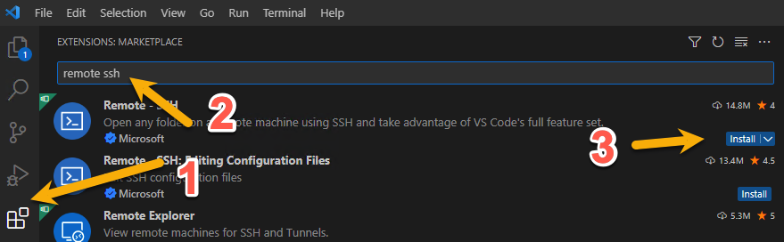
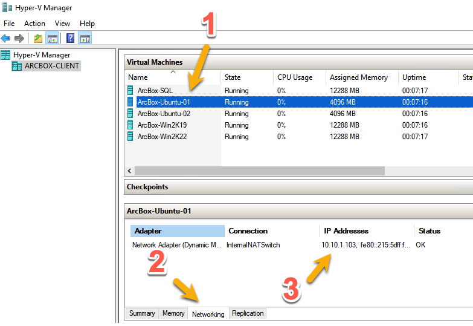
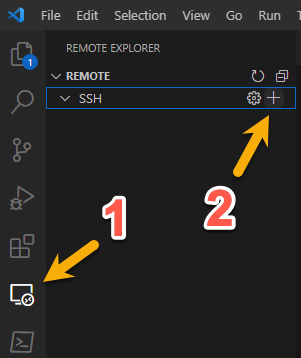
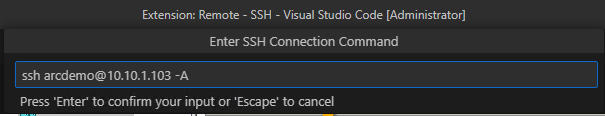
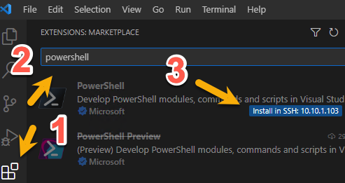
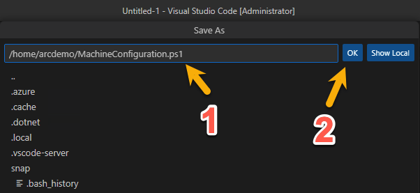
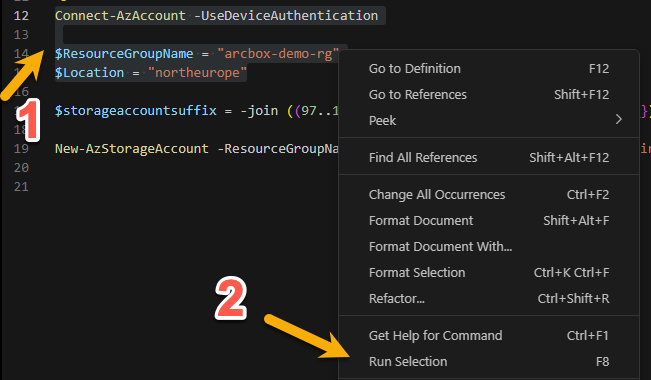

## Create Automanage Machine Configuration custom configurations for Linux

The following Jumpstart scenario will guide you on how to create and assign a custom Automanage Machine Configuration to an Azure Arc-enabled Linux server. Automanage makes it easy to follow best practices in reliability, security, and management for Azure Arc-enabled servers using Azure services such as [Azure Update Management](https://docs.microsoft.com/azure/automation/update-management/overview) and [Azure Monitor](https://docs.microsoft.com/azure/azure-monitor/vm/vminsights-overview).

While the use of custom configurations in Automanage Machine Configuration feature is based on PowerShell Desired State Configuration (DSC), there are [Changes to behavior in PowerShell DSC for Machine Configuration](https://learn.microsoft.com/azure/governance/machine-configuration/machine-configuration-custom?view=dsc-2.0) to be aware of, the most significant being the use of PowerShell 7.

By the end of this scenario, you will have both Linux and Windows Azure Arc-enabled servers with Automanage Machine Configuration custom configurations assigned.

This scenario starts at the point where you already deployed **[Jumpstart ArcBox for IT Pros](https://azurearcjumpstart.io/azure_jumpstart_arcbox/itpro/)** and have 5 Azure Arc-enabled servers in the resource group is deployed to visible as resources in Azure.


The custom configurations are written using PowerShell Desired State Configuration (DSC), and needs to be authored from a machine running the target operating system for the configurations (Linux-machine for Linux configurations and Windows-machine for Windows configurations).

After the configurations has been authored and published into your Azure environment, they can be assigned to any Linux-based Azure Arc-enabled server (or Azure VM) in your environment.

This scenario will assign it to the resource group ArcBox is deployed to.

## Base requirements - configuration authoring

Operating system:

- Ubuntu 18 (required by the GuestConfiguration module)

In this scenario, we will be using the ArcBox Client virtual machine for the configuration authoring - and connect to a nested Linux VM.

You can [connect to the ArcBox machine as described in the documentation](https://azurearcjumpstart.io/azure_jumpstart_arcbox/itpro/#connecting-to-the-arcbox-client-virtual-machine) and perform the following:

- Open Visual Studio Code from the desktop shortcut.
- Install the [Remote SSH extension](https://marketplace.visualstudio.com/items?itemName=ms-vscode-remote.remote-ssh).



Open Hyper-V Manager and determine the IP address of the ArcBox-Ubuntu-01 VM:





- Open VS Code and add a new Remote SSH target:
  - Enter the value ```ssh arcdemo@10.10.1.103 -A``` and press Enter two times



- Click Connect in the following dialogue box:


- Select Linux in the following dialogue box and press Enter:


- When prompted for password, enter ```ArcDemo123!!```

- As indicated in the lower left corner, VS Code should now be connected to the remote machine:


- In the VS Code menu, click Terminal -> New
- Install [PowerShell 7](https://learn.microsoft.com/powershell/scripting/install/install-ubuntu?view=powershell-7.3#installation-via-direct-download) by running the following in the terminal window:

```bash
wget https://github.com/PowerShell/PowerShell/releases/download/v7.3.3/powershell_7.3.3-1.deb_amd64.deb
sudo dpkg -i /home/arcdemo/powershell_7.3.3-1.deb_amd64.deb
```

- Followed by ```pwsh``` to ensure PowerShell is available.


- Due to a specific prerequisite (libmi) for packaging Machine Configurations, install the PSWSMan module which contains the required dependencies:

```bash
sudo pwsh
Install-Module -Force -PassThru -Name PSWSMan
Install-WSMan
```


- Install the PowerShell extension in VS Code.



- Click *File -> New Text File*, click Ctrl + S and specify ```/home/arcdemo/MachineConfiguration.ps1``` as the path for the new file.



- Paste and run the following commands by pressing F5 in order to install the required PowerShell modules for this scenario:

```powershell
Install-Module -Name Az.Accounts -Force -RequiredVersion 2.12.1
Install-Module -Name Az.PolicyInsights -Force -RequiredVersion 1.5.1
Install-Module -Name Az.Resources -Force -RequiredVersion 6.5.2
Install-Module -Name Az.Ssh -Force -RequiredVersion 0.1.1
Install-Module -Name Az.Storage -Force -RequiredVersion 5.4.0

Install-Module -Name GuestConfiguration -Force -RequiredVersion 4.4.0

Install-Module PSDesiredStateConfiguration -AllowPreRelease -Force -RequiredVersion 3.0.0-beta1
Install-Module nxtools -Force -RequiredVersion 0.4.0-preview0001 -AllowPrerelease
```

The GuestConfiguration module automates the process of creating custom content including:

- Creating a guest configuration content artifact (.zip)
- Validating the package meets requirements
- Installing the guest configuration agent locally for testing
- Validating the package can be used to audit settings in a machine
- Validating the package can be used to configure settings in a machine

The Azure PowerShell modules is used for:

- Publishing the package to Azure storage
- Creating a policy definition
- Publishing the policy
- Connecting to the Azure Arc-enabled servers

Desired State Configuration version 3 is currently in beta, but is the only version supported for Linux-based DSC configurations.

The nxtools module contains DSC resources used for the demo configuration.

## Azure resources

> **NOTE: For the remaining code blocks in this article, copy the code into ```/home/arcdemo/MachineConfiguration.ps1``` , mark the lines you want to run and click F8. Alternatively, right click the selected commands and click Run Selection:**



Authenticate to Azure

```powershell
Connect-AzAccount -UseDeviceAuthentication

# Update the values to reflect your ArcBox deployment
$ResourceGroupName = "arcbox-demo-rg"
$Location = "northeurope"
```

Create storage account for storing DSC artifacts

```powershell
$storageaccountsuffix = -join ((97..122) | Get-Random -Count 5 | % {[char]$_})

New-AzStorageAccount -ResourceGroupName $ResourceGroupName -Name "arcboxmachineconfig$storageaccountsuffix" -SkuName 'Standard_LRS' -Location $Location -OutVariable storageaccount | New-AzStorageContainer -Name machineconfiguration -Permission Blob
```

> *Make a note of the storage account name, as this will be needed in later steps.*

## Custom configuration for Linux

The following steps needs to be executed from PowerShell 7 on the authoring machine for Linux.

```powershell
Import-Module PSDesiredStateConfiguration -RequiredVersion 3.0.0

Configuration AzureArcJumpstart_Linux
{

    Import-DscResource -ModuleName nxtools -ModuleVersion 0.4.0

    Node localhost
    {

      nxPackage nginx
      {
          Name = "nginx"
          Ensure = "Present"
      }
      nxPackage hello
      {
          Name = "hello"
          Ensure = "Present"
      }
<#

    Due to a known issue with multiple class-based resources
    we currently can`t leverage more than 1 DSC resource:
    https://github.com/Azure/nxtools/issues/15

      nxPackage powershell
      {
          Name = "powershell"
          Version = "7.3.3"
          Ensure = "Present"
          #PackageType = "snap"
      }

      nxFile demo {
        DestinationPath = "/tmp/arc-demo"
        Ensure = "Present"
        Contents = "Hello Arc!"
        }

      nxGroup arcusers {
        GroupName = "arcusers"
        Ensure = "Present"
      }
#>

    }
}

$OutputPath = "$HOME/arc_automanage_machine_configuration_custom_linux"
New-Item $OutputPath -Force -ItemType Directory

AzureArcJumpstart_Linux -OutputPath $OutputPath
```

Create a package that will audit and apply the configuration (Set)

```powershell
New-GuestConfigurationPackage `
-Name 'AzureArcJumpstart_Linux' `
-Configuration "$OutputPath/localhost.mof" `
-Type AuditAndSet `
-Path $OutputPath `
-Force
```

Optionally, test applying the configuration to the local machine by copying and pasting the following commands into the terminal.

```powershell
# Need to run with elevated credentials since the configuration is performing system wide operations
sudo pwsh

Install-Module -Name GuestConfiguration -Force -RequiredVersion 4.4.0

Start-GuestConfigurationPackageRemediation -Path /home/arcdemo/arc_automanage_machine_configuration_custom_linux/AzureArcJumpstart_Linux.zip -Verbose

exit
```

Upload the configuration package to Azure Storage.
Insert the correct storage account name on the first line in place of the placeholder value for the -Name parameter based on the output of the storage account created in the step *"Shared resources"*.

```powershell
$StorageAccount = Get-AzStorageAccount -Name <insert-storage-account-name> -ResourceGroupName $ResourceGroupName

$StorageAccountKey = Get-AzStorageAccountKey -Name $storageaccount.StorageAccountName -ResourceGroupName $storageaccount.ResourceGroupName
$Context = New-AzStorageContext -StorageAccountName $storageaccount.StorageAccountName -StorageAccountKey $StorageAccountKey[0].Value

Set-AzStorageBlobContent -Container "machineconfiguration" -File  "$OutputPath/AzureArcJumpstart_Linux.zip" -Blob "AzureArcJumpstart_Linux.zip" -Context $Context -Force

$contenturi = New-AzStorageBlobSASToken -Context $Context -FullUri -Container machineconfiguration -Blob "AzureArcJumpstart_Linux.zip" -Permission r
```

Create an Azure Policy definition

```powershell
$PolicyId = (New-Guid).Guid

New-GuestConfigurationPolicy `
  -PolicyId $PolicyId `
  -ContentUri $ContentUri `
  -DisplayName '(AzureArcJumpstart) [Linux] Custom configuration' `
  -Description 'Azure Arc Jumpstart Linux demo configuration' `
  -Path  $OutputPath `
  -Platform 'Linux' `
  -PolicyVersion 1.0.0 `
  -Mode ApplyAndAutoCorrect `
  -Verbose -OutVariable Policy

  $PolicyParameterObject = @{'IncludeArcMachines'='true'}

  New-AzPolicyDefinition -Name '(AzureArcJumpstart) [Linux] Custom configuration' -Policy $Policy.Path -OutVariable PolicyDefinition
```

Assign the Azure Policy definition to the target resource group

```powershell
$ResourceGroup = Get-AzResourceGroup -Name $ResourceGroupName

New-AzPolicyAssignment -Name '(AzureArcJumpstart) [Linux] Custom configuration' -PolicyDefinition $PolicyDefinition[0] -Scope $ResourceGroup.ResourceId -PolicyParameterObject $PolicyParameterObject -IdentityType SystemAssigned -Location $Location -DisplayName '(AzureArcJumpstart) [Linux] Custom configuration' -OutVariable PolicyAssignment
```

In order for the newly assigned policy to remediate existing resources, the policy must be assigned a managed identity and a policy remediation must be performed. Hence, the next steps are:

- Grant a managed identity defined roles with PowerShell
- Create a remediation task through Azure PowerShell

See the [documentation](https://docs.microsoft.com/azure/governance/policy/how-to/remediate-resources) for more information.

```powershell
$PolicyAssignment = Get-AzPolicyAssignment -PolicyDefinitionId $PolicyDefinition.PolicyDefinitionId | Where-Object Name -eq '(AzureArcJumpstart) [Linux] Custom configuration'

$roleDefinitionIds =  $PolicyDefinition.Properties.policyRule.then.details.roleDefinitionIds

# Wait for eventual consistency
Start-Sleep 20

if ($roleDefinitionIds.Count -gt 0)
 {
     $roleDefinitionIds | ForEach-Object {
         $roleDefId = $_.Split("/") | Select-Object -Last 1
         New-AzRoleAssignment -Scope $resourceGroup.ResourceId -ObjectId $PolicyAssignment.Identity.PrincipalId -RoleDefinitionId $roleDefId
     }
 }

 $job = Start-AzPolicyRemediation -AsJob -Name ($PolicyAssignment.PolicyAssignmentId -split '/')[-1] -PolicyAssignmentId $PolicyAssignment.PolicyAssignmentId -ResourceGroupName $ResourceGroup.ResourceGroupName -ResourceDiscoveryMode ReEvaluateCompliance

 $job | Wait-Job | Receive-Job
```

Check policy compliance by following these steps:

- In the Azure Portal, navigate to *Policy* -> *Compliance*
- Set the scope to the resource group your instance of ArcBox is deployed to
- Filter for *(AzureArcJumpstart) [Linux] Custom configuration*


It may take 15-20 minutes for the policy remediation to be completed.

Get a Machine Configuration specific view by following these steps:

- In the Azure Portal, navigate to *Azure Arc* -> *Servers*
- Click on Arcbox-Ubuntu-01 -> Machine Configuration
- If the status for *Arcbox-Ubuntu-01/AzureArcJumpstart_Linux* is not *Compliant*, wait a few more minutes and click *Refresh*


Click on *Arcbox-Ubuntu-01/AzureArcJumpstart_Linux* to get a per-resource view of the compliance state in the assigned configuration


### Verify that the operating system level settings are in place

Login to Arcbox-Ubuntu-01 by running the below command

- Enter the password **ArcDemo123!!** when prompted

```powershell
Enter-AzVM -ResourceGroupName $ResourceGroupName -Name Arcbox-Ubuntu-01 -LocalUser arcdemo
```

Verify that the packages **hello** and **nginx** are installed by running ```apt list --installed | grep 'hello\|nginx/focal'```


You can also verify that nginx is running and available by accessing [http://10.10.1.103/](http://10.10.1.103/) from Microsoft Edge on the ArcBox Client virtual machine.


If you want to evaluate how remediation works, try to make one of the above configuration settings non-compliant by, for example, removing the package hello: ```sudo apt remove hello```

Trigger a [manual evaluation](https://learn.microsoft.com/powershell/module/az.policyinsights/start-azpolicycompliancescan?view=azps-9.4.0) or wait until the next policy evaluation cycle has completed and observe that the policy is now non-compliant.

Next, perform the steps outlined in [Create a remediation task](https://learn.microsoft.com/azure/governance/policy/how-to/remediate-resources?tabs=azure-portal#create-a-remediation-task) for the ArcBox-policies to bring the machine back into compliance.

To learn more, check out [Remediation options for machine configuration](https://learn.microsoft.com/azure/governance/machine-configuration/machine-configuration-policy-effects) in the documentation.

## Summary

In this scenario you have performed the following tasks:

- [Created a package artifact](https://learn.microsoft.com/azure/governance/machine-configuration/machine-configuration-create) for machine configuration.
- [Tested the package artifact](https://learn.microsoft.com/azure/governance/machine-configuration/machine-configuration-create-test) from your development environment.
- [Published the package artifact](https://learn.microsoft.com/azure/governance/machine-configuration/machine-configuration-create-publish) so it is accessible to your machines.
- Used the GuestConfiguration module to [create an Azure Policy definition](https://learn.microsoft.com/azure/governance/machine-configuration/machine-configuration-create-definition) for at-scale management of your environment.
- [Assigned your custom policy definition](https://learn.microsoft.com/azure/governance/policy/assign-policy-portal) to the ArcBox resource group.

> *NOTE: For ArcBox exploration, it is recommended to perform the assignment at the resource group level where the Azure Arc-enabled servers reside to not accidentally apply the configuration to other machines in your environment*

## Next steps

After going through this scenario you may want to write your own configurations to meet your organization`s needs and requirements.

- [Desired State Configuration overview](https://learn.microsoft.com/powershell/dsc/overview?view=dsc-2.0)
- [Installing DSC Resources](https://learn.microsoft.com/powershell/dsc/how-tos/installing-dsc-resources?view=dsc-2.0)
- [Write and compile a DSC Configuration](https://learn.microsoft.com/powershell/dsc/how-tos/configurations/write-and-compile?view=dsc-2.0)

For Linux, the [nxtools module](https://www.powershellgallery.com/packages/nxtools) will help in managing common tasks - such as:

- `nxGroup`: Resource to manage [nxLocalGroup] and group members.
- `nxUser`: Resource to manage [nxLocalUser] accounts.
- `nxService`: Manage the state of daemons/services.
- `nxPackage`: Audit whether a package is installed or not in a system.
- `nxFile`: Manage a file or a folder to make sure it's present/absent, its content, mode, owner group.
- `nxFileLine`: Ensure an exact line is present/absent in a file, and remediate by appending, inserting, deleting as needed.
- `nxFileContentReplace`: Replace the content in a file if a pattern is found.

Should your needs not be covered by an existing DSC resource module, check out [Create a class-based DSC Resource for machine configuration](https://learn.microsoft.com/powershell/dsc/tutorials/create-dsc-resource-machine-config?view=dsc-2.0) in the DSC documentation.

You might also want to have a look at the following resources if you have been using DSC in the past:

- [Azure Automation state configuration to machine configuration migration planning](https://learn.microsoft.com/azure/governance/machine-configuration/machine-configuration-azure-automation-migration)
- [Planning a change from Desired State Configuration extension for Linux to machine configuration](https://learn.microsoft.com/azure/governance/machine-configuration/machine-configuration-dsc-extension-migration)

## Clean up environment

Complete the following steps to clean up your environment. To disable Azure Automanage you will use the Azure portal. Go to the Automanage page that lists all of your auto-managed VMs. Select the checkbox next to the Azure Arc-enabled Server you want to disable from Automanage, then click on the *Disable* button.

```powershell
Remove-AzPolicyAssignment -Name '(AzureArcJumpstart) [Linux] Custom configuration'

Remove-AzPolicyDefinition -Name '(AzureArcJumpstart) [Linux] Custom configuration'

Get-AzStorageAccount -Name <insert-storage-account-name> -ResourceGroupName $ResourceGroupName | Remove-AzStorageAccount
```
