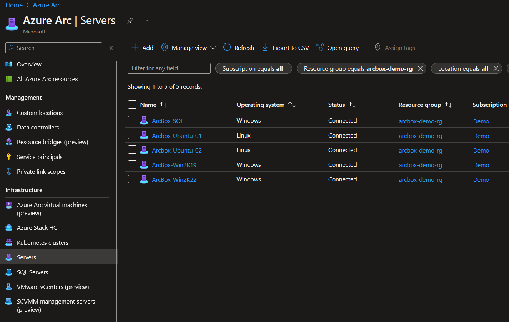
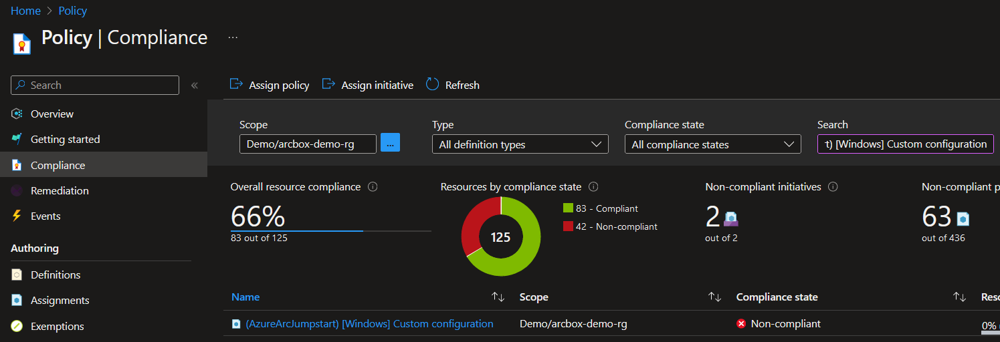
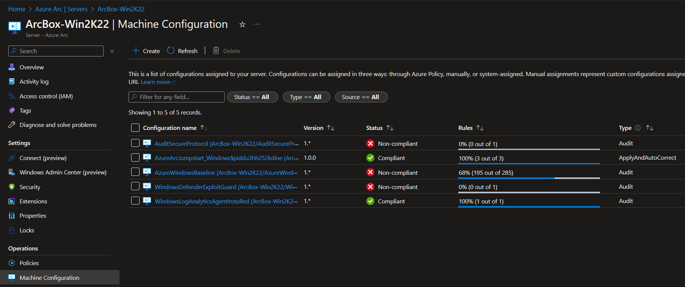
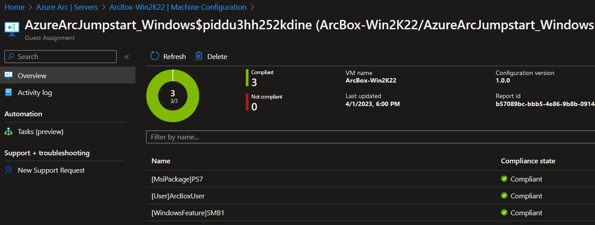
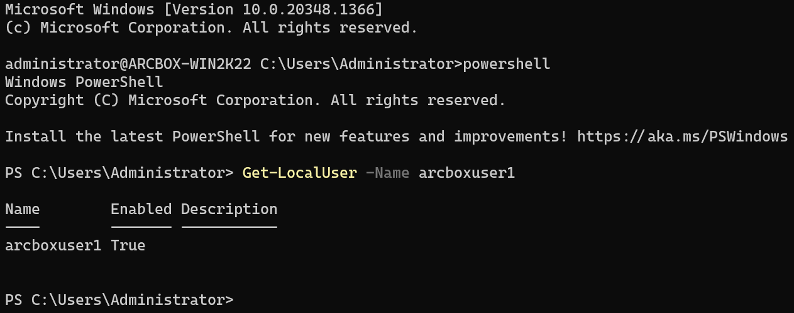
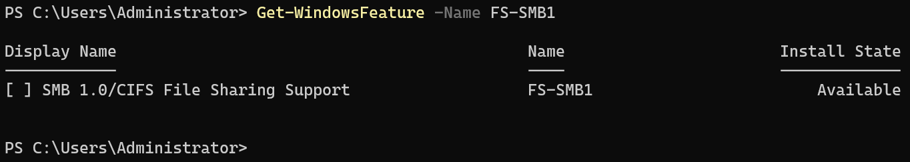
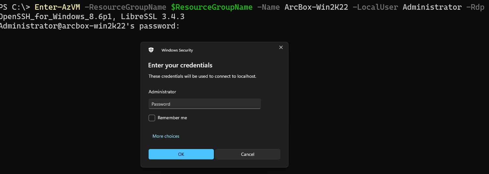

## Create Automanage Machine Configuration custom configurations for Windows

The following Jumpstart scenario will guide you on how to create and assign a custom Automanage Machine Configuration to an Azure Arc-enabled Windows server. Automanage makes it easy to follow best practices in reliability, security, and management for Azure Arc-enabled servers using Azure services such as [Azure Update Management](https://docs.microsoft.com/azure/automation/update-management/overview) and [Azure Monitor](https://docs.microsoft.com/azure/azure-monitor/vm/vminsights-overview).

While the use of custom configurations in Automanage Machine Configuration feature is based on PowerShell Desired State Configuration (DSC), there are [Changes to behavior in PowerShell DSC for Machine Configuration](https://learn.microsoft.com/azure/governance/machine-configuration/machine-configuration-custom?view=dsc-2.0) to be aware of, the most significant being the use of PowerShell 7.

By the end of this scenario, you will have Windows Azure Arc-enabled servers with a custom Automanage Machine Configuration assigned.

This scenario starts at the point where you already deployed **[Jumpstart ArcBox for IT Pros](https://azurearcjumpstart.io/azure_jumpstart_arcbox/itpro/)** and have 5 Azure Arc-enabled servers in the resource group is deployed to visible as resources in Azure.



The custom configurations are written using PowerShell Desired State Configuration (DSC), and needs to be authored from a machine running the target operating system for the configurations (Linux-machine for Linux configurations and Windows-machine for Windows configurations).

After the configurations has been authored and published into your Azure environment, they can be assigned to any Windows-based Azure Arc-enabled server (or Azure VM) in your environment.

This scenario will assign it to the resource group ArcBox is deployed to.

## Base requirements - configuration authoring

Operating system:

- [Any supported version of Windows for PowerShell 7](https://learn.microsoft.com/powershell/scripting/install/installing-powershell-on-windows?view=powershell-7.3#supported-versions-of-windows)

In this scenario, we will be using the ArcBox Client virtual machine for the configuration authoring.

You can [connect to the ArcBox machine as described in the documentation](https://azurearcjumpstart.io/azure_jumpstart_arcbox/itpro/#connecting-to-the-arcbox-client-virtual-machine) and perform the following:

- Install [PowerShell 7](https://learn.microsoft.com/powershell/scripting/install/installing-powershell?view=powershell-7.3).
  - Run ```$PSVersionTable``` to check your currently installed version.
- Open Visual Studio Code from the desktop shortcut.
- Install the PowerShell extension.
- Create C:\ArcBox\MachineConfiguration.ps1, then paste and run the following commands to install the required PowerShell modules for this scenario:

```powershell
Install-Module -Name Az.Accounts -Force -RequiredVersion 2.12.1
Install-Module -Name Az.PolicyInsights -Force -RequiredVersion 1.5.1
Install-Module -Name Az.Resources -Force -RequiredVersion 6.5.2
Install-Module -Name Az.Ssh -Force -RequiredVersion 0.1.1
Install-Module -Name Az.Storage -Force -RequiredVersion 5.4.0

Install-Module -Name GuestConfiguration -Force -RequiredVersion 4.4.0

Install-Module PSDesiredStateConfiguration -Force -RequiredVersion 2.0.5
Install-Module PSDscResources -Force -RequiredVersion 2.12.0.0
```

The Azure PowerShell modules is used for:

- Publishing the package to Azure storage
- Creating a policy definition
- Publishing the policy
- Connecting to the Azure Arc-enabled servers

The GuestConfiguration module automates the process of creating custom content including:

- Creating a machine configuration content artifact (.zip)
- Validating the package meets requirements
- Installing the machine configuration agent locally for testing
- Validating the package can be used to audit settings in a machine
- Validating the package can be used to configure settings in a machine

Desired State Configuration version 3 is removing the dependency on MOF.
Initially, there are only support for DSC Resources written as PowerShell classes.
Due to using MOF-based DSC resources for the Windows demo-configuration, we are using version 2.0.5.

## Azure resources

> **NOTE: For the remaining code blocks in this article, copy the code into ```C:\ArcBox\MachineConfiguration.ps1```, mark the lines you want to run and click F8.**

Authenticate to Azure

```powershell
Connect-AzAccount

# Update the values to reflect your ArcBox deployment
$ResourceGroupName = "arcbox-demo-rg"
$Location = "northeurope"
```

Create storage account for storing DSC artifacts

```powershell
$storageaccountsuffix = -join ((97..122) | Get-Random -Count 5 | % {[char]$_})

New-AzStorageAccount -ResourceGroupName $ResourceGroupName -Name "arcboxmachineconfig$storageaccountsuffix" -SkuName 'Standard_LRS' -Location $Location -OutVariable storageaccount | New-AzStorageContainer -Name machineconfiguration -Permission Blob
```

> *Make a note of the storage account name, as this will be needed in later steps.*

## Custom configuration for Windows

The following steps needs to be executed from PowerShell 7 on the authoring machine for Windows.

```powershell
Import-Module PSDesiredStateConfiguration -RequiredVersion 2.0.5

Configuration AzureArcJumpstart_Windows
{
    param (
        [Parameter(Mandatory)]
        [System.Management.Automation.PSCredential]
        [System.Management.Automation.Credential()]
        $PasswordCredential
    )

    Import-DscResource -ModuleName 'PSDscResources' -ModuleVersion 2.12.0.0

    Node localhost
    {
        MsiPackage PS7
        {
            ProductId = '{323AD147-6FC4-40CB-A810-2AADF26D868A}'
            Path = 'https://github.com/PowerShell/PowerShell/releases/download/v7.3.2/PowerShell-7.3.2-win-x64.msi'
            Ensure = 'Present'
        }
        User ArcBoxUser
        {
            UserName = 'arcboxuser1'
            FullName = 'ArcBox User 1'
            Password = $PasswordCredential
            Ensure = 'Present'
        }
        WindowsFeature SMB1 {
            Name = 'FS-SMB1'
            Ensure = 'Absent'
        }
    }
}

Write-Host "Creating credentials for arcbox user 1"
$nestedWindowsUsername = "arcboxuser1"
$nestedWindowsPassword = "ArcDemo123!!"  # In real-world scenarios this could be retrieved from an Azure Key Vault

# Create Windows credential object
$secWindowsPassword = ConvertTo-SecureString $nestedWindowsPassword -AsPlainText -Force
$winCreds = New-Object System.Management.Automation.PSCredential ($nestedWindowsUsername, $secWindowsPassword)

$ConfigurationData = @{
    AllNodes = @(
        @{
            NodeName = 'localhost'
            PSDscAllowPlainTextPassword = $true
        }
    )
}

$OutputPath = "$HOME/arc_automanage_machine_configuration_custom_windows"
New-Item $OutputPath -Force -ItemType Directory

AzureArcJumpstart_Windows -PasswordCredential $winCreds -ConfigurationData $ConfigurationData -OutputPath $OutputPath

```

Create a package that will audit and apply the configuration (Set)

```powershell
New-GuestConfigurationPackage `
-Name 'AzureArcJumpstart_Windows' `
-Configuration "$OutputPath/localhost.mof" `
-Type AuditAndSet `
-Path $OutputPath `
-Force
```

Test applying the configuration to the local machine

```powershell
Start-GuestConfigurationPackageRemediation -Path "$OutputPath/AzureArcJumpstart_Windows.zip"
```

Upload the configuration package to Azure Storage.
Insert the correct storage account name on the first line in place of the placeholder value for the -Name parameter based on the output of the storage account created in the step *"Shared resources"*.

```powershell
$StorageAccount = Get-AzStorageAccount -Name <insert-storage-account-name> -ResourceGroupName $ResourceGroupName

$StorageAccountKey = Get-AzStorageAccountKey -Name $storageaccount.StorageAccountName -ResourceGroupName $storageaccount.ResourceGroupName
$Context = New-AzStorageContext -StorageAccountName $storageaccount.StorageAccountName -StorageAccountKey $StorageAccountKey[0].Value

Set-AzStorageBlobContent -Container "machineconfiguration" -File  "$OutputPath/AzureArcJumpstart_Windows.zip" -Blob "AzureArcJumpstart_Windows.zip" -Context $Context -Force

$contenturi = New-AzStorageBlobSASToken -Context $Context -FullUri -Container machineconfiguration -Blob "AzureArcJumpstart_Windows.zip" -Permission r
```

Create an Azure Policy definition

```powershell
$PolicyId = (New-Guid).Guid

New-GuestConfigurationPolicy `
  -PolicyId $PolicyId `
  -ContentUri $ContentUri `
  -DisplayName '(AzureArcJumpstart) [Windows] Custom configuration' `
  -Description 'Azure Arc Jumpstart Windows demo configuration' `
  -Path  $OutputPath `
  -Platform 'Windows' `
  -PolicyVersion 1.0.0 `
  -Mode ApplyAndAutoCorrect `
  -Verbose -OutVariable Policy

  $PolicyParameterObject = @{'IncludeArcMachines'='true'}

  New-AzPolicyDefinition -Name '(AzureArcJumpstart) [Windows] Custom configuration' -Policy $Policy.Path -OutVariable PolicyDefinition
```

Assign the Azure Policy definition to the target resource group

```powershell
$ResourceGroup = Get-AzResourceGroup -Name $ResourceGroupName

New-AzPolicyAssignment -Name '(AzureArcJumpstart) [Windows] Custom configuration' -PolicyDefinition $PolicyDefinition[0] -Scope $ResourceGroup.ResourceId -PolicyParameterObject $PolicyParameterObject -IdentityType SystemAssigned -Location $Location -DisplayName '(AzureArcJumpstart) [Windows] Custom configuration' -OutVariable PolicyAssignment
```

In order for the newly assigned policy to remediate existing resources, the policy must be assigned a managed identity and a policy remediation must be performed. Hence, the next steps are:

- Grant a managed identity defined roles with PowerShell
- Create a remediation task through Azure PowerShell

See the [documentation](https://docs.microsoft.com/azure/governance/policy/how-to/remediate-resources) for more information.

```powershell
$PolicyAssignment = Get-AzPolicyAssignment -PolicyDefinitionId $PolicyDefinition.PolicyDefinitionId | Where-Object Name -eq '(AzureArcJumpstart) [Windows] Custom configuration'

$roleDefinitionIds =  $PolicyDefinition.Properties.policyRule.then.details.roleDefinitionIds

# Wait for eventual consistency
Start-Sleep 20

if ($roleDefinitionIds.Count -gt 0)
 {
     $roleDefinitionIds | ForEach-Object {
         $roleDefId = $_.Split("/") | Select-Object -Last 1
         New-AzRoleAssignment -Scope $resourceGroup.ResourceId -ObjectId $PolicyAssignment.Identity.PrincipalId -RoleDefinitionId $roleDefId
     }
 }

 $job = Start-AzPolicyRemediation -AsJob -Name ($PolicyAssignment.PolicyAssignmentId -split '/')[-1] -PolicyAssignmentId $PolicyAssignment.PolicyAssignmentId -ResourceGroupName $ResourceGroup.ResourceGroupName -ResourceDiscoveryMode ReEvaluateCompliance

 $job | Wait-Job | Receive-Job
```

Check policy compliance by following these steps:

- In the Azure Portal, navigate to *Policy* -> *Compliance*
- Set the scope to the resource group your instance of ArcBox is deployed to
- Filter for *(AzureArcJumpstart) [Windows] Custom configuration*



It may take 15-20 minutes for the policy remediation to be completed.

Get a Machine Configuration specific view by following these steps:

- In the Azure Portal, navigate to *Azure Arc* -> *Servers*
- Click on ArcBox-Win2K22 -> Machine Configuration
- If the status for *ArcBox-Win2K22/AzureArcJumpstart_Windows* is not *Compliant*, wait a few more minutes and click *Refresh*



Click on *ArcBox-Win2K22/AzureArcJumpstart_Windows* to get a per-resource view of the compliance state in the assigned configuration



### Verify that the operating system level settings are in place

Login to ArcBox-Win2K22 by running the below command

- Enter the password **ArcDemo123!!** when prompted

```powershell
Enter-AzVM -ResourceGroupName $ResourceGroupName -Name ArcBox-Win2K22 -LocalUser Administrator
```

Verify that the local group **arcusers** exists by first running ```powershell``` followed by ```Get-LocalUser -Name arcboxuser1```.



Verify that the SMB1 feature is not installed by running ```Get-WindowsFeature -Name FS-SMB1```.

- The output should show that the feature is *Available*, not *Installed*



Verify that PowerShell 7 is installed by running ```pwsh```.


> *NOTE: If you prefer to log on interactively to a Remote Desktop session in order to verify the configuration settings, add -Rdp to the Enter-AzVM command:

```powershell
Enter-AzVM -ResourceGroupName $ResourceGroupName -Name ArcBox-Win2K22 -LocalUser Administrator -Rdp
```



If you want to evaluate how remediation works, try to make one of the above configuration settings non-compliant by, for example, removing the user arcboxuser1: ```Get-LocalUser -Name arcboxuser1 | Remove-LocalUser```

Trigger a [manual evaluation](https://learn.microsoft.com/powershell/module/az.policyinsights/start-azpolicycompliancescan?view=azps-9.4.0) or wait until the next policy evaluation cycle has completed and observe that the policy is now non-compliant.

Next, perform the steps outlined in [Create a remediation task](https://learn.microsoft.com/azure/governance/policy/how-to/remediate-resources?tabs=azure-portal#create-a-remediation-task) for the ArcBox-policies to bring the machine back into compliance.

To learn more, check out [Remediation options for machine configuration](https://learn.microsoft.com/azure/governance/machine-configuration/machine-configuration-policy-effects) in the documentation.

## Summary

In this scenario you have performed the following tasks:

- [Created a package artifact](https://learn.microsoft.com/azure/governance/machine-configuration/machine-configuration-create) for machine configuration.
- [Tested the package artifact](https://learn.microsoft.com/azure/governance/machine-configuration/machine-configuration-create-test) from your development environment.
- [Published the package artifact](https://learn.microsoft.com/azure/governance/machine-configuration/machine-configuration-create-publish) so it is accessible to your machines.
- Used the GuestConfiguration module to [create an Azure Policy definition](https://learn.microsoft.com/azure/governance/machine-configuration/machine-configuration-create-definition) for at-scale management of your environment.
- [Assigned your custom policy definition](https://learn.microsoft.com/azure/governance/policy/assign-policy-portal) to the ArcBox resource group.

> *NOTE: For ArcBox exploration, it is recommended to perform the assignment at the resource group level where the Azure Arc-enabled servers reside to not accidentally apply the configuration to other machines in your environment*

## Next steps

After going through this scenario you may want to write your own configurations to meet your organization`s needs and requirements.

- [Desired State Configuration overview](https://learn.microsoft.com/powershell/dsc/overview?view=dsc-2.0)
- [Installing DSC Resources](https://learn.microsoft.com/powershell/dsc/how-tos/installing-dsc-resources?view=dsc-2.0)
- [Write and compile a DSC Configuration](https://learn.microsoft.com/powershell/dsc/how-tos/configurations/write-and-compile?view=dsc-2.0)

For Windows, there are many Resource Modules provided by the [DSC Community](https://dsccommunity.org/) - such as:

- `ActiveDirectoryDsc`: Contains DSC resources for deployment and configuration of Active Directory. These DSC resources allow you to configure new domains, child domains, and high availability domain controllers, establish cross-domain trusts and manage users, groups and OUs.
- `ComputerManagementDsc`: Allow you to perform computer management tasks, such as renaming the computer, joining a domain and scheduling tasks as well as configuring items such as virtual memory, event logs, time zones and power settings.
- `SqlServerDsc`: Deployment and configuration of Microsoft SQL Server.

Should your needs not be covered by an existing DSC resource module, check out [Create a class-based DSC Resource for machine configuration](https://learn.microsoft.com/powershell/dsc/tutorials/create-dsc-resource-machine-config?view=dsc-2.0) in the DSC documentation.

You might also want to have a look at the following resources if you have been using DSC in the past:

- [Azure Automation state configuration to machine configuration migration planning](https://learn.microsoft.com/azure/governance/machine-configuration/machine-configuration-azure-automation-migration)
- [Planning a change from Desired State Configuration extension for Linux to machine configuration](https://learn.microsoft.com/azure/governance/machine-configuration/machine-configuration-dsc-extension-migration)

## Clean up environment

Complete the following steps to clean up your environment. To disable Azure Automanage you will use the Azure portal. Go to the Automanage page that lists all of your auto-managed VMs. Select the checkbox next to the Azure Arc-enabled Server you want to disable from Automanage, then click on the *Disable* button.

```powershell
$PolicyDefinition = Get-AzPolicyDefinition -Name '(AzureArcJumpstart) [Windows] Custom configuration'

Get-AzPolicyAssignment -PolicyDefinitionId $PolicyDefinition.PolicyDefinitionId | Remove-AzPolicyAssignment

$PolicyDefinition  | Remove-AzPolicyDefinition

Get-AzStorageAccount -Name <insert-storage-account-name> -ResourceGroupName $ResourceGroupName | Remove-AzStorageAccount
```
