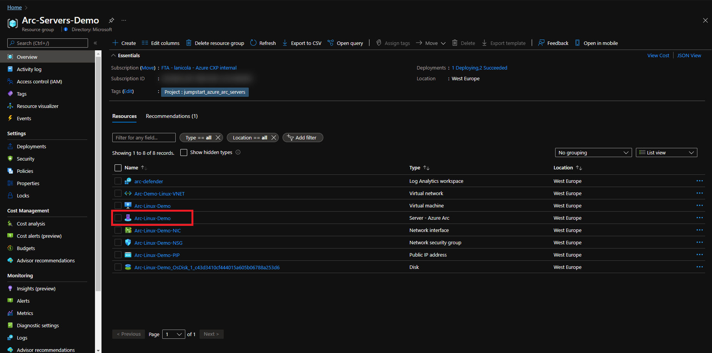
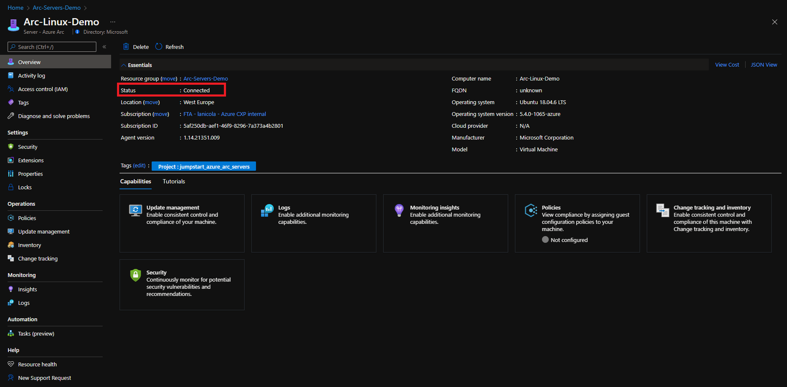
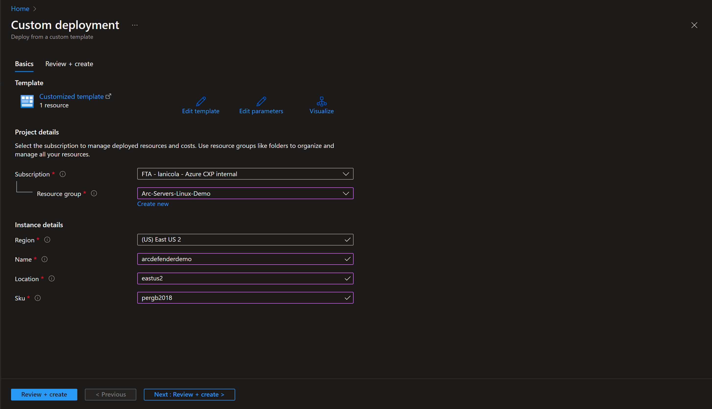
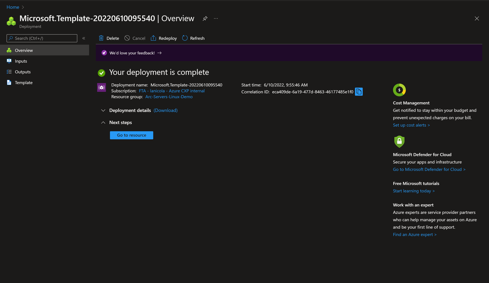
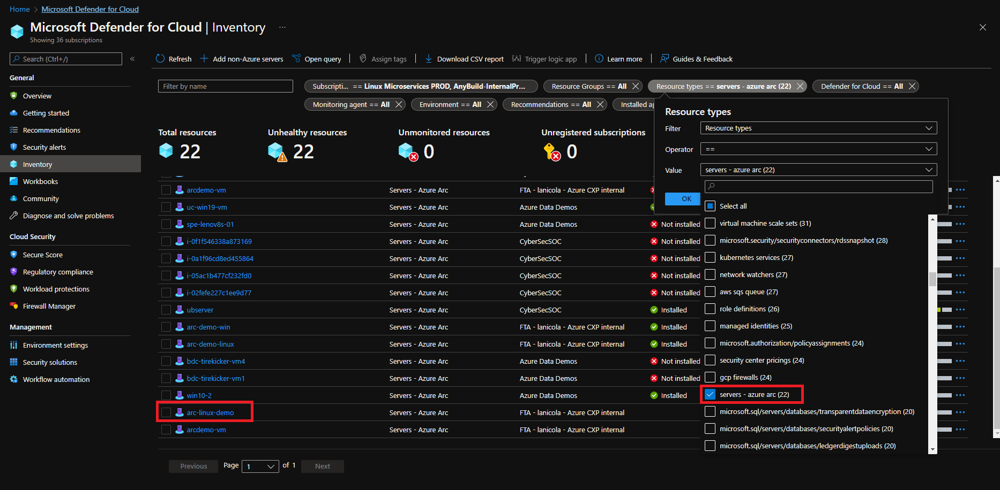
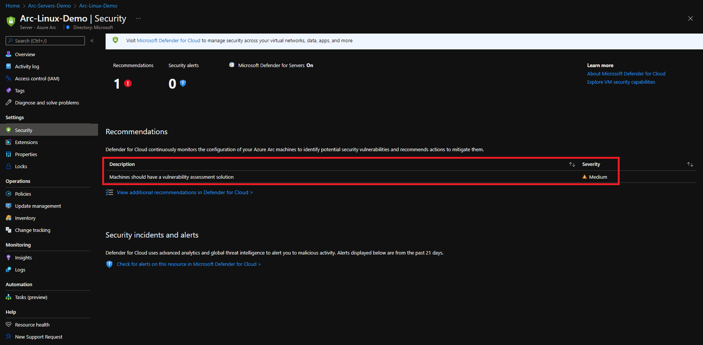
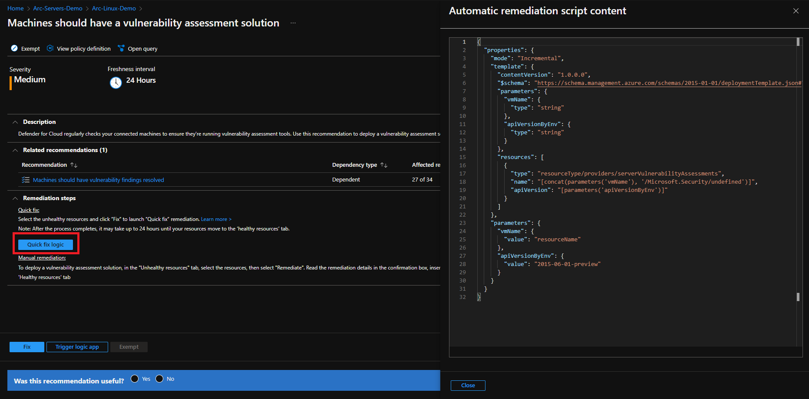

## Connect Azure Arc-enabled servers to Microsoft Defender for Cloud

The following README will guide you on how to onboard an Azure Arc-enabled server on to [Microsoft Defender for Cloud](https://docs.microsoft.com/en-us/azure/defender-for-cloud/), so you can start collecting security-related configurations as well as event logs to recommend actions and improve your overall Azure security posture.

Microsoft Defender for Cloud is Microsoft's integrated cloud workload protection platform, it provides advance thread protection for Azure and hybrid resources. To access Microsoft Defender for Cloud you need to enable the plan on Microsoft Defender for Cloud.

In this guide, you will enable and configure Microsoft Defender for Cloud on your Azure subscription, which will provide you with advanced threat protection (ATP) and detection capabilities for your hybrid resources. To complete this process you will:

* Setup a Log Analytics Workspace where logs and events will be aggregated for analysis.

* Enable Microsoft Defender for Cloud.

* Assign Microsoft Defender for Cloud’s default security policies.

* Review Microsoft Defender for Cloud recommendations.

* Apply recommended configurations on Azure Arc-enabled servers using the ***Quick Fix*** remediations.

> **Note: This guide assumes you already deployed VMs or servers that are running on-premises or other clouds and you have connected them to Azure Arc but If you haven't, this repository offers you a way to do so in an automated fashion:**

* **[GCP Ubuntu instance](https://azurearcjumpstart.io/azure_arc_jumpstart/azure_arc_servers/gcp/gcp_terraform_ubuntu/)**
* **[GCP Windows instance](https://azurearcjumpstart.io/azure_arc_jumpstart/azure_arc_servers/gcp/gcp_terraform_windows/)**
* **[AWS Ubuntu EC2 instance](https://azurearcjumpstart.io/azure_arc_jumpstart/azure_arc_servers/aws/aws_terraform_ubuntu/)**
* **[AWS Amazon Linux 2 EC2 instance](https://azurearcjumpstart.io/azure_arc_jumpstart/azure_arc_servers/aws/aws_terraform_al2/)**
* **[Azure Ubuntu VM](https://azurearcjumpstart.io/azure_arc_jumpstart/azure_arc_servers/azure/azure_arm_template_linux/)**
* **[Azure Windows VM](https://azurearcjumpstart.io/azure_arc_jumpstart/azure_arc_servers/azure/azure_arm_template_win/)**
* **[VMware vSphere Ubuntu VM](https://azurearcjumpstart.io/azure_arc_jumpstart/azure_arc_servers/vmware/vmware_terraform_ubuntu/)**
* **[VMware vSphere Windows Server VM](https://azurearcjumpstart.io/azure_arc_jumpstart/azure_arc_servers/vmware/vmware_terraform_winsrv/)**
* **[Vagrant Ubuntu box](https://azurearcjumpstart.io/azure_arc_jumpstart/azure_arc_servers/vagrant/local_vagrant_ubuntu/)**
* **[Vagrant Windows box](https://azurearcjumpstart.io/azure_arc_jumpstart/azure_arc_servers/vagrant/local_vagrant_windows/)**

## Prerequisites

* Clone the Azure Arc Jumpstart repository

    ```shell
    git clone https://github.com/microsoft/azure_arc.git
    ```

* As mentioned, this guide starts at the point where you already deployed and connected VMs or bare-metal servers to Azure Arc. For this scenario, as can be seen in the screenshots below, we will be using a Google Cloud Platform (GCP) instance that has been already connected to Azure Arc and is visible as a resource in Azure.

    

    

* [Install or update Azure CLI](https://docs.microsoft.com/en-us/cli/azure/install-azure-cli?view=azure-cli-latest). Azure CLI should be running version 2.7** or later. Use ```az --version``` to check your current installed version.

* Create Azure service principal (SP)

    To connect a VM or bare-metal server to Azure Arc, Azure service principal assigned with the "Contributor" role is required. To create it, login to your Azure account run the below command (this can also be done in [Azure Cloud Shell](https://shell.azure.com/)).

    ```shell
    az login
    az ad sp create-for-rbac -n "<Unique SP Name>" --role contributor
    ```

    For example:

    ```shell
    az ad sp create-for-rbac -n "http://AzureArcServers" --role contributor
    ```

    Output should look like this:

    ```json
    {
    "appId": "XXXXXXXXXXXXXXXXXXXXXXXXXXXX",
    "displayName": "AzureArcServers",
    "name": "http://AzureArcServers",
    "password": "XXXXXXXXXXXXXXXXXXXXXXXXXXXX",
    "tenant": "XXXXXXXXXXXXXXXXXXXXXXXXXXXX"
    }
    ```

  > **Note: It is optional but highly recommended to scope the SP to a specific [Azure subscription and resource group](https://docs.microsoft.com/en-us/cli/azure/ad/sp?view=azure-cli-latest).**

## Onboarding Microsoft Defender for Cloud

* Data collected by Microsoft Defender for Cloud is stored in a Log Analytics workspace. You can either use the default one created by Defender or a custom one created by you. If you want to create a dedicated workspace, you can automate the deployment by editing the ARM template [parameters file](https://github.com/microsoft/azure_arc/blob/main/azure_arc_servers_jumpstart/defender/arm/log_analytics-template.parameters.json), provide a name and location for your workspace:

    

* To deploy the ARM template, navigate to the [deployment folder](https://github.com/microsoft/azure_arc/tree/main/azure_arc_servers_jumpstart/defender/arm) and run the below command:

  ```shell
    az deployment group create --resource-group <Name of the Azure resource group> \
    --template-file <The *log_analytics-template.json* template file location> \
    --parameters <The *log_analytics-template.parameters.json* template file location>
  ```

* If you are going for an user-defined workspace, you should instruct Microsoft Defender for Cloud to use it instead of the default one, use the below command:

  ```shell
    az security workspace-setting create --name default \
    --target-workspace '/subscriptions/<Your subscription ID>/resourceGroups/<Name of the Azure resource group>/providers/Microsoft.OperationalInsights/workspaces/<Name of the Log Analytics Workspace>'
  ```

* Microsoft Defender for Cloud is enabled on all your Azure subscriptions by default and will provide continuous security assessment and actionable security recommendations. In this guide, you will use Microsoft Defender for Cloud for Virtual Machines that extends these capabilities providing unified security management and threat protection across your hybrid cloud workloads. To enable Microsoft Defender for Cloud for VMs run the command below:

    ```shell
    az security pricing create -n VirtualMachines --tier 'standard'
    ```

* Now you need to assign the default Microsoft Defender for Cloud policy initiative. Defender makes its security recommendations based on policies. There is an specific initiative that groups Microsoft Defender for Cloud policies with the definition ID '1f3afdf9-d0c9-4c3d-847f-89da613e70a8'. The command below will assign the Defender initiative to your subscription:

    ```shell
    az policy assignment create --name 'ASC Default <Your subscription ID>' \
    --scope '/subscriptions/<Your subscription ID>' \
    --policy-set-definition '1f3afdf9-d0c9-4c3d-847f-89da613e70a8'
    ```

## Azure Arc and Microsoft Defender for Cloud Integration

Now that you have successfully onboarded Microsoft Defender for Cloud, you will get recommendations to help you protect your resources, including your Azure Arc-enabled servers. Microsoft Defender for Cloud will then periodically analyze the security state of your Azure resources to identify potential security vulnerabilities.

Microsoft Defender for Cloud will collect data from your Arc-enabled servers to monitor for security vulnerabilities and threats. The data collection will allow greater visibility into missing updates, non-secure OS settings, endpoint protection status, health and threat protection. You will get recommendations even if you do not provision an agent, however to fully benefit it is recommended to install the Log Analytics agent. The agent will read security-related configurations and event logs from the Arc-enabled server and send the data to the corresponding Log Analytics workspace where you enabled Microsoft Defender for Cloud. To install the agent on your Arc-enabled server you can use the extension management feature as it is described [here](https://github.com/microsoft/azure_arc/blob/main/docs/azure_arc_jumpstart/azure_arc_servers/day2/arc_vm_extension_mma_arm/_index.md) or by configuring policies as shown [here](https://github.com/microsoft/azure_arc/blob/main/docs/azure_arc_jumpstart/azure_arc_servers/day2/arc_policies_mma/_index.md)

>**Note: it may take upto 30 minutes for your Azure Arc-enabled server to be shown in Microsoft Defender for Cloud Dashboard**

* Once you have configured your workspace and deployed the MMA agent, using the [Azure Portal](https://portal.azure.com/) navigate to Microsoft Defender for Cloud. In the "Inventory" section under "VM and Servers", Defender will provide you with an overview of all the discovered security recommendations for your VMs and computers, including Azure VMs, Azure Classic VMs, servers and **Azure Arc Machines**.

    

* Select your Azure Arc-enabled server, Microsoft Defender for Cloud will provide security recommendation. Each of them will include:
  * A short description of what is being recommended.
  * A secure score impact.
  * The remediation steps to carry out in order to implement the recommendation. For specific recommendations, you may also get a ***Quick Fix*** that enables you to quickly remediate a recommendation on multiple resources.

    

* For this Azure Arc-enabled server the recommendation "A vulnerability assessment solution should be enabled on your virtual machine" provides a ***Quick Fix***. It is using an ARM template to deploy the an extention to enable a vulnerability assessment solution on the Azure Arc machine.

    

* You can trigger the remediation and selecting: "Deploy the integrated vulnerability scanner powered by Qualys (included with Microsoft Defender for servers)" and clicking on "Proceed", select the Azure Arc-enabled server and click on "Fix 1 resource".

    

* After you apply the recommendation it will be now marked as healthy.

    

> **Note:It can take several minutes after remediation completes to see the resources in the 'healthy resources' tab**

## Clean up environment

Complete the following steps to clean up your environment.

* Remove the virtual machines from each environment by following the teardown instructions from each guide.

* **[GCP Ubuntu instance](https://azurearcjumpstart.io/azure_arc_jumpstart/azure_arc_servers/gcp/gcp_terraform_ubuntu/)**
* **[GCP Windows instance](https://azurearcjumpstart.io/azure_arc_jumpstart/azure_arc_servers/gcp/gcp_terraform_windows/)**
* **[AWS Ubuntu EC2 instance](https://azurearcjumpstart.io/azure_arc_jumpstart/azure_arc_servers/aws/aws_terraform_ubuntu/)**
* **[AWS Amazon Linux 2 EC2 instance](https://azurearcjumpstart.io/azure_arc_jumpstart/azure_arc_servers/aws/aws_terraform_al2/)**
* **[Azure Ubuntu VM](https://azurearcjumpstart.io/azure_arc_jumpstart/azure_arc_servers/azure/azure_arm_template_linux/)**
* **[Azure Windows VM](https://azurearcjumpstart.io/azure_arc_jumpstart/azure_arc_servers/azure/azure_arm_template_win/)**
* **[VMware vSphere Ubuntu VM](https://azurearcjumpstart.io/azure_arc_jumpstart/azure_arc_servers/vmware/vmware_terraform_ubuntu/)**
* **[VMware vSphere Windows Server VM](https://azurearcjumpstart.io/azure_arc_jumpstart/azure_arc_servers/vmware/vmware_terraform_winsrv/)**
* **[Vagrant Ubuntu box](https://azurearcjumpstart.io/azure_arc_jumpstart/azure_arc_servers/vagrant/local_vagrant_ubuntu/)**
* **[Vagrant Windows box](https://azurearcjumpstart.io/azure_arc_jumpstart/azure_arc_servers/vagrant/local_vagrant_windows/)**

* Remove the Log Analytics workspace by executing the following script in AZ CLI. Provide the workspace name you used when creating the Log Analytics Workspace.

    ```shell
    az monitor log-analytics workspace delete --resource-group <Name of the Azure resource group> --workspace-name <Log Analytics Workspace Name> --yes
    ```
