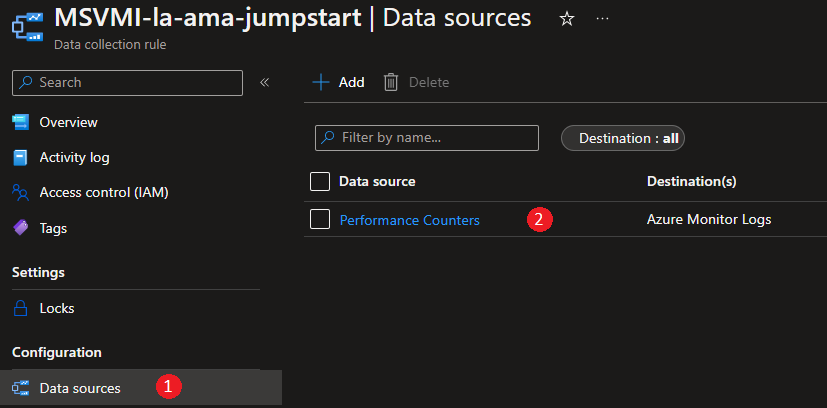
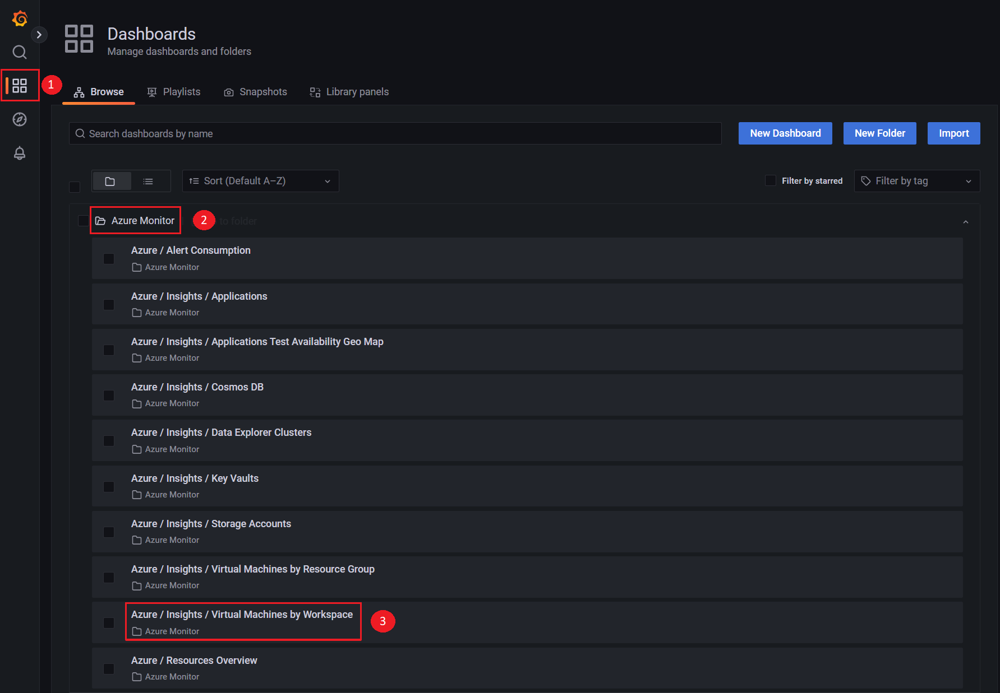

## Dashboard visualization on Azure Arc-enabled servers with Azure Managed Grafana and Azure Monitor Agent

The following scenario will guide you on how to deploy the [Azure Monitor Agent (AMA)](https://docs.microsoft.com/azure/azure-monitor/agents/azure-monitor-agent-overview) as an extension on your Windows Azure Arc-enabled servers, as well as deploying Azure Managed Grafana for dashboard visualization to extend monitoring capabilities across hybrid multi-cloud and on-premises environments. [Azure Managed Grafana](https://azure.microsoft.com/services/managed-grafana/#overview) is a fully managed service for analytics and monitoring solutions.

  > **NOTE: This scenario assumes you already deployed VMs or servers that are running on-premises or other clouds and you have connected them to Azure Arc. If you haven't, this repository offers you a way to do so in an automated fashion:**

- **[GCP Ubuntu instance](https://azurearcjumpstart.io/azure_arc_jumpstart/azure_arc_servers/gcp/gcp_terraform_ubuntu/)**
- **[GCP Windows instance](https://azurearcjumpstart.io/azure_arc_jumpstart/azure_arc_servers/gcp/gcp_terraform_windows/)**
- **[AWS Ubuntu EC2 instance](https://azurearcjumpstart.io/azure_arc_jumpstart/azure_arc_servers/aws/aws_terraform_ubuntu/)**
- **[AWS Amazon Linux 2 EC2 instance](https://azurearcjumpstart.io/azure_arc_jumpstart/azure_arc_servers/aws/aws_terraform_al2/)**
- **[Azure Ubuntu VM](https://azurearcjumpstart.io/azure_arc_jumpstart/azure_arc_servers/azure/azure_arm_template_linux/)**
- **[Azure Windows VM](https://azurearcjumpstart.io/azure_arc_jumpstart/azure_arc_servers/azure/azure_arm_template_win/)**
- **[VMware vSphere Ubuntu VM](https://azurearcjumpstart.io/azure_arc_jumpstart/azure_arc_servers/vmware/vmware_terraform_ubuntu/)**
- **[VMware vSphere Windows Server VM](https://azurearcjumpstart.io/azure_arc_jumpstart/azure_arc_servers/vmware/vmware_terraform_winsrv/)**
- **[Vagrant Ubuntu box](https://azurearcjumpstart.io/azure_arc_jumpstart/azure_arc_servers/vagrant/local_vagrant_ubuntu/)**
- **[Vagrant Windows box](https://azurearcjumpstart.io/azure_arc_jumpstart/azure_arc_servers/vagrant/local_vagrant_windows/)**

Please review the [Azure Monitor Agent (AMA) supported OS documentation](https://docs.microsoft.com/azure/azure-monitor/agents/agents-overview#supported-operating-systems) and ensure that the VMs you will use for this exercise are supported.

## Prerequisites

- As mentioned, this scenario starts at the point where you already deployed and connected VMs or servers to Azure Arc. In the screenshots below, you can see a Windows server that have been connected with Azure Arc and is visible as a resource in Azure.

    

    

- [Install or update Azure CLI](https://docs.microsoft.com/cli/azure/install-azure-cli?view=azure-cli-latest). Azure CLI should be running version 2.49.0 or later. Use ```az --version``` to check your current installed version.

## Deployment Options and Automation Flow

This Jumpstart scenario provides multiple paths for deploying and configuring resources. Deployment options include:

- Azure portal
- ARM template via Azure CLI

The steps below will help you get familiar with the automation and deployment flow.

1. User provides the ARM template parameter values, either via the portal or by editing the parameters file. These parameter values are used throughout the deployment.

2. User deploys the ARM template at the resource group level.

3. User is verifying the successful deployment of Log Analytics workspace, Azure Managed Grafana, AMA extension, and data collection rules creation.

## Deployment Option 1: Azure portal

- Click the <a href="https://portal.azure.com/#create/Microsoft.Template/uri/https%3A%2F%2Fraw.githubusercontent.com%2Fmicrosoft%2Fazure_arc%2Fmain%2Fazure_arc_servers_jumpstart%2Fgrafana%2Fgrafana-template.json" target="_blank"></a> button and enter values for the the ARM template parameters.

  > **NOTE:** Use the following command to get the AAD id of the current signed in user and copy it to the Grafana Adminprincipal Id parameter:

  ```shell
  az ad signed-in-user show --query id -o tsv
  ```

  

  

## Deployment Option 2: ARM template with Azure CLI

As mentioned, this deployment will leverage ARM templates.

- Clone the Azure Arc Jumpstart repository

    ```shell
    git clone https://github.com/microsoft/azure_arc.git
    ```

- Edit the [_parameters file_](https://github.com/microsoft/azure_arc/blob/main/azure_arc_servers_jumpstart/grafana/grafana-template.parameters.json) providing the values that match your configuration as described above.

    

- Locate the [_ARM template_](https://github.com/microsoft/azure_arc/blob/main/azure_arc_servers_jumpstart/grafana/grafana-template.json) and deploy it by running the following command:

    ```shell
    az deployment group create --resource-group <Name of the Azure resource group> \
    --template-uri "https://raw.githubusercontent.com/microsoft/azure_arc/main/azure_arc_servers_jumpstart/grafana/grafana-template.json" \
    --parameters <grafana-template.parameters.json parameter file location>
    ```

- Once the template has completed its run, you should see an output as follows:

    

- You will have the Azure Monitor Agent (AMA) deployed on your Windows or Linux system and reporting to the Log Analytics workspace that has been created. You can verify by going back to your Azure Arc-enabled server, **Extensions** section:

    

- Moreover, a **Data Collection Rule (DCR)** is created to send logs from the Azure Arc-enabled servers to the new **Log Analytics workspace**. In addition, the **Azure Managed Grafana** service is deployed which we will explore later in this scenario.

    

- Note that the template deployment has also created a required role assignment at the resource group level. It will be used by **Azure Managed Grafana** to be able to access your monitoring data from its **Managed Identity**:

    

- If you click on the **Data Collection Rule (DCR)**, you will see the **Resources** attached to it and the collected **Data Sources**.

  - On the **Resources** blade, you will see your Windows Azure Arc-enabled server:

    

  - On the **Data Sources** blade, you will see _Performance Counters_

    

  - If you click on _Performance Counters_, you will see the **Data source** that is collected and the **Destination**, which is the Log Analytics workspace created as part of this scenario:

    

    

- Go back to your **resource group** and click on the **Log Analytics Workspace**:

  

- Click on **Logs** and close the **Queries** pop-up window:

  

- **Run** the following **query**. It will show you the **data types collected** by the **Azure Monitor Agent (AMA)** on each machine by using the **Data Collection Rules (DCR)**:

  ```shell
  search * 
  | distinct Computer, Type
  | where Type != "Heartbeat" and Type != "Usage"
  | sort by Computer asc
  ```

  

- It is time to explore **Azure Managed Grafana** and the included sample dashboard. Go back to your **resource group** and click on **Azure Managed Grafana**:

  

- In the **Azure Managed Grafana** overview click on the **Endpoint** url to open the Grafana web interface.

    > **NOTE: Authenticate to Grafana with the user account name you provided in the template deployment (_grafanaAdminprincipalId_) or add your current user account name to one of the Azure Role-based access control (RBAC) roles: _Grafana Admin_, _Grafana Editor_, _Grafana Viewer_**.

  

- Click on **Dashboards** and expand **Azure Monitor** to explore the included sample dashboards. Click on **Azure / Insights / Virtual Machines by Workspace**.

  

- Finally, explore the included panels with monitoring data from your **Log Analytics workspace** and Azure Arc-enabled server.

  

- As an added bonus, you also have the flexibility to use Azure Monitor and Virtual Machine Insights to visualize the monitoring data collected by **Azure Monitor Agent (AMA)**.

  

## Clean up environment

Complete the following steps to clean up your environment:

- [Remove Data Collection Rule Association](https://docs.microsoft.com/powershell/module/az.monitor/remove-azdatacollectionruleassociation?view=azps-8.1.0)
- [Remove Data Collection Rule](https://docs.microsoft.com/powershell/module/az.monitor/remove-azdatacollectionrule?view=azps-8.1.0)
- [Uninstall Azure Monitor Agent (AMA)](https://docs.microsoft.com/azure/azure-monitor/agents/azure-monitor-agent-manage?tabs=ARMAgentPowerShell%2CPowerShellWindows%2CPowerShellWindowsArc%2CCLIWindows%2CCLIWindowsArc#uninstall-on-azure-arc-enabled-servers)
- [Delete the Log Analytics workspace](https://docs.microsoft.com/azure/azure-monitor/logs/delete-workspace#powershell)
- [Delete Azure Managed Grafana instance](https://learn.microsoft.com/cli/azure/grafana?view=azure-cli-latest#az-grafana-delete)

As an alternative you can use this [_clean-up script_](https://github.com/microsoft/azure_arc/blob/main/azure_arc_servers_jumpstart/grafana/grafana-cleanup-script.sh). Edit the variables in the script to fit your environment.
