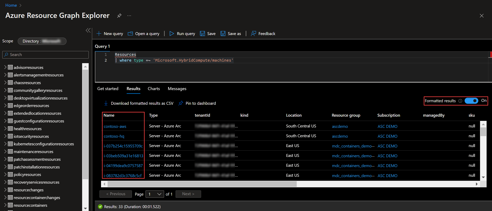

## Azure Arc-enabled servers inventory management using Resource Graph Explorer

This scenario will guide you on how to use Azure Arc-enabled servers to provide server inventory management capabilities across hybrid multi-cloud and on-premises environments.

Azure Arc-enabled servers allows you to manage your Windows and Linux machines hosted outside of Azure on your corporate network or other cloud provider, similarly to how you manage native Azure virtual machines. When a hybrid machine is connected to Azure, it becomes a connected machine and is treated as a resource in Azure. Each connected machine has a Resource ID, it is managed as part of a resource group inside a subscription, and benefits from standard Azure constructs such as Azure Policy and applying tags. The ability to easily organize and manage server inventory using Azure as a management engine greatly reduces administrative complexity and provides a consistent strategy for hybrid and multi-cloud environments.

In this scenario, we will use [Resource Graph Explorer](https://docs.microsoft.com/azure/governance/resource-graph/overview) to demonstrate querying server inventory across multiple clouds from a single pane of glass in Azure.

> **NOTE: This scenario assumes you already deployed VMs or servers that are running on-premises or other clouds and you have connected them to Azure Arc. If you haven't, this repository offers you a way to do so in an automated fashion:**

- **[GCP Ubuntu instance](https://azurearcjumpstart.io/azure_arc_jumpstart/azure_arc_servers/gcp/gcp_terraform_ubuntu/)**
- **[GCP Windows instance](https://azurearcjumpstart.io/azure_arc_jumpstart/azure_arc_servers/gcp/gcp_terraform_windows/)**
- **[AWS Ubuntu EC2 instance](https://azurearcjumpstart.io/azure_arc_jumpstart/azure_arc_servers/aws/aws_terraform_ubuntu/)**
- **[AWS Amazon Linux 2 EC2 instance](https://azurearcjumpstart.io/azure_arc_jumpstart/azure_arc_servers/aws/aws_terraform_al2/)**
- **[Azure Ubuntu VM](https://azurearcjumpstart.io/azure_arc_jumpstart/azure_arc_servers/azure/azure_arm_template_linux/)**
- **[Azure Windows VM](https://azurearcjumpstart.io/azure_arc_jumpstart/azure_arc_servers/azure/azure_arm_template_win/)**
- **[VMware vSphere Ubuntu VM](https://azurearcjumpstart.io/azure_arc_jumpstart/azure_arc_servers/vmware/vmware_terraform_ubuntu/)**
- **[VMware vSphere Windows Server VM](https://azurearcjumpstart.io/azure_arc_jumpstart/azure_arc_servers/vmware/vmware_terraform_winsrv/)**
- **[Vagrant Ubuntu box](https://azurearcjumpstart.io/azure_arc_jumpstart/azure_arc_servers/vagrant/local_vagrant_ubuntu/)**
- **[Vagrant Windows box](https://azurearcjumpstart.io/azure_arc_jumpstart/azure_arc_servers/vagrant/local_vagrant_windows/)**

## Prerequisites

- As mentioned before, this scenario starts at the point where you already deployed and connected VMs or bare-metal servers to Azure Arc.

## Apply resource tags to Azure Arc-enabled servers

In this first step, we will assign Azure resource tags to some of your Azure Arc-enabled servers. This gives you the ability to easily organize and manage server inventory.

- Enter **Servers - Azure Arc** in the top search bar in the Azure portal and select it.

  

- Click on any of your Azure Arc-enabled servers:

  

- Click on **Tags**. Add a new tag with **Name="Scenario"** and **Value="jumpstart_azure_arc_servers_inventory"**. Click **Apply** when ready.

  

- Repeat the same process in other Azure Arc-enabled servers. This new tag will be used later when working with Resource Graph Explorer queries.

## Using Resource Graph Explorer to Review Server Inventory

We will use Resource Graph Explorer to query our hybrid server inventory.

- Enter **Resource Graph Explorer** in the top search bar in the Azure portal and select it.

  

  

- Scope Azure Resource Graph Explorer to the Directory, Management Group or Subscription where you have your Azure Arc-enabled servers. In this case, we will work at Directory level. Click **Apply** when finished.

  

- In the query window, run the following query that will show you all Azure Arc-enabled servers in your subscription. Enter the query and then click **Run Query**:

  ```shell
  Resources
  | where type =~ 'Microsoft.HybridCompute/machines'
  ```

  

- You should see your Azure Arc-enabled servers in the results pane. Toggle the **Formatted Results** switch for a cleaner table:

  

- Still on the results pane, go to the right and click on the **See details** link of any of the results:

  

- Here you can see all the Azure Arc-enabled server metadata that you can query using Resource Graph explorer:

  

- For example, by leveraging that metadata, you could run the following query to get the number of Azure Arc-enabled servers hosted in _Amazon Web Services (AWS)_ or in _Google Cloud Platform (GCP)_:

  ```shell
  Resources
  | where type =~ 'Microsoft.HybridCompute/machines'
  | extend cloudProvider = tostring(properties.detectedProperties.cloudprovider)
  | where  cloudProvider in ("AWS", "GCP")
  | summarize serversCount = count() by cloudProvider
  ```

  

- Moreover, you could render those results using the available **Charts**:

  

- Let's now build a query that uses the tag we assigned before to some of our Azure Arc-enabled servers. Use the following query that includes a check for resources that have a value for the **Scenario** tag:

  ```shell
  Resources
  | where type =~ 'Microsoft.HybridCompute/machines' and isnotempty(tags['Scenario'])
  | extend Scenario = tags['Scenario']
  | project name, tags
  ```

  

- We can also use Resource Graph Explorer to list extensions installed on our Azure Arc-enabled servers:

  ```shell
  Resources
  | where type == 'microsoft.hybridcompute/machines'
  | project id, JoinID = toupper(id), ComputerName = tostring(properties.osProfile.computerName), OSName = tostring(properties.osName)
  | join kind=leftouter(
      Resources
      | where type == 'microsoft.hybridcompute/machines/extensions'
      | project MachineId = toupper(substring(id, 0, indexof(id, '/extensions'))), ExtensionName = name
  ) on $left.JoinID == $right.MachineId
  | summarize Extensions = make_list(ExtensionName) by id, ComputerName, OSName
  | order by tolower(OSName) desc
  ```

  

- As mentioned before, Azure Arc provides additional properties on the Azure Arc-enabled server resource that we can query with Resource Graph Explorer. In the following example, we list some of these key properties, like the Azure Arc Agent version installed on your Azure Arc-enabled servers:

  ```shell
  Resources
  | where type =~ 'Microsoft.HybridCompute/machines'
  | extend arcAgentVersion = tostring(properties.['agentVersion']), osName = tostring(properties.['osName']), osVersion = tostring(properties.['osVersion']), osSku = tostring(properties.['osSku']),
  lastStatusChange = tostring(properties.['lastStatusChange'])
  | project name, arcAgentVersion, osName, osVersion, osSku, lastStatusChange
  ```

  

## Clean up environment

Complete the following steps to clean up your environment.

- Remove the virtual machines from each environment by following the teardown instructions from each scenario.

  - **[GCP Ubuntu instance](https://azurearcjumpstart.io/azure_arc_jumpstart/azure_arc_servers/gcp/gcp_terraform_ubuntu/)**
  - **[GCP Windows instance](https://azurearcjumpstart.io/azure_arc_jumpstart/azure_arc_servers/gcp/gcp_terraform_windows/)**
  - **[AWS Ubuntu EC2 instance](https://azurearcjumpstart.io/azure_arc_jumpstart/azure_arc_servers/aws/aws_terraform_ubuntu/)**
  - **[AWS Amazon Linux 2 EC2 instance](https://azurearcjumpstart.io/azure_arc_jumpstart/azure_arc_servers/aws/aws_terraform_al2/)**
  - **[Azure Ubuntu VM](https://azurearcjumpstart.io/azure_arc_jumpstart/azure_arc_servers/azure/azure_arm_template_linux/)**
  - **[Azure Windows VM](https://azurearcjumpstart.io/azure_arc_jumpstart/azure_arc_servers/azure/azure_arm_template_win/)**
  - **[VMware vSphere Ubuntu VM](https://azurearcjumpstart.io/azure_arc_jumpstart/azure_arc_servers/vmware/vmware_terraform_ubuntu/)**
  - **[VMware vSphere Windows Server VM](https://azurearcjumpstart.io/azure_arc_jumpstart/azure_arc_servers/vmware/vmware_terraform_winsrv/)**
  - **[Vagrant Ubuntu box](https://azurearcjumpstart.io/azure_arc_jumpstart/azure_arc_servers/vagrant/local_vagrant_ubuntu/)**
  - **[Vagrant Windows box](https://azurearcjumpstart.io/azure_arc_jumpstart/azure_arc_servers/vagrant/local_vagrant_windows/)**
