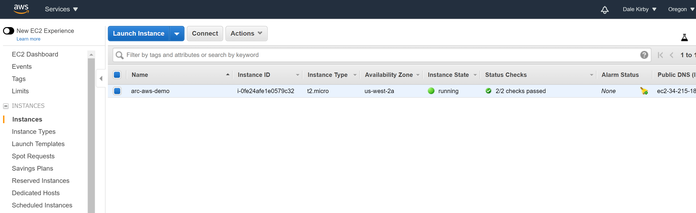
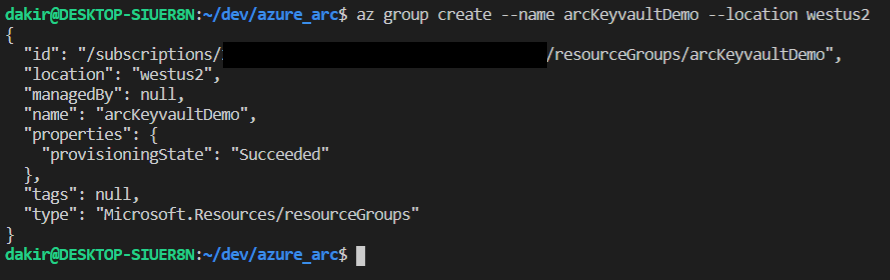
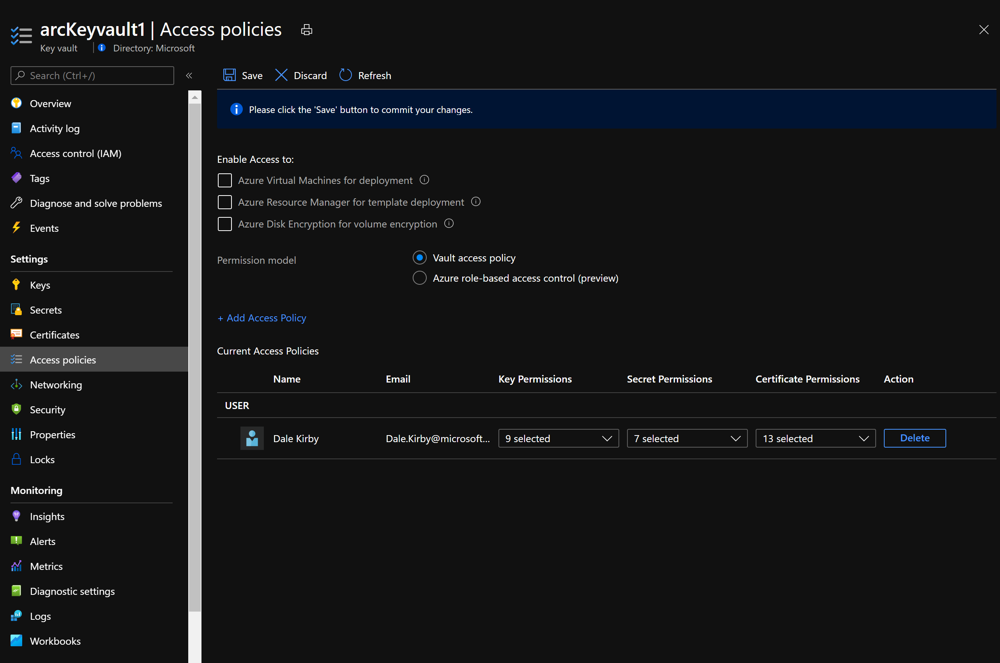
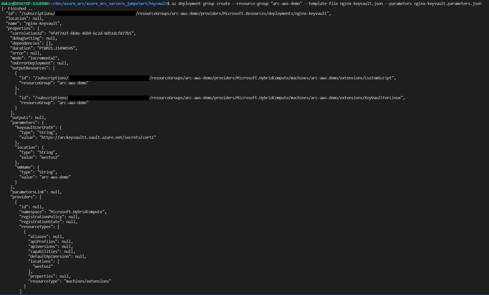
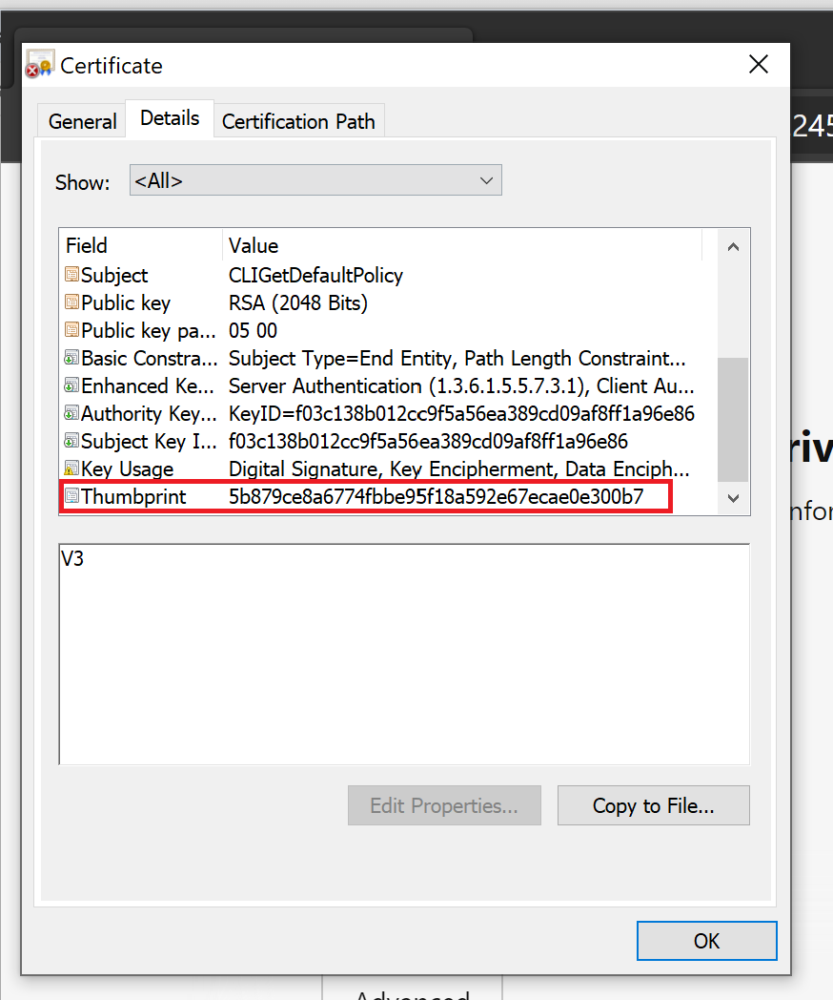

## Deploy Azure Key Vault Extension to Azure Arc-enabled Ubuntu server and use a Key Vault managed certificate with Nginx

The scenario will show you how to onboard the [Azure Key Vault](https://docs.microsoft.com/en-us/azure/virtual-machines/extensions/key-vault-linux) extension on an Azure Arc-enabled server, and then use a certificate managed by Azure Key Vault to secure web traffic with TLS on a web server.

In this guide, we will focus on securing an Ubuntu web server. The only prerequisite you need to complete for this scenario is an existing Azure Arc-enabled server running Ubuntu 18.04 (other Ubuntu releases may also work but have not been tested).

> **Note: This guide assumes you already deployed an Ubuntu server that is running on-premises or in other clouds and you have connected them to Azure Arc but If you haven't, this repository offers you a way to do so in an automated fashion:**

* **[GCP Ubuntu instance](https://azurearcjumpstart.io/azure_arc_jumpstart/azure_arc_servers/gcp/gcp_terraform_ubuntu/)**
* **[AWS Ubuntu EC2 instance](https://azurearcjumpstart.io/azure_arc_jumpstart/azure_arc_servers/aws/aws_terraform_ubuntu/)**
* **[Azure Ubuntu VM](https://azurearcjumpstart.io/azure_arc_jumpstart/azure_arc_servers/azure/azure_arm_template_linux/)**
* **[VMware vSphere Ubuntu VM](https://azurearcjumpstart.io/azure_arc_jumpstart/azure_arc_servers/vmware/vmware_terraform_ubuntu/)**
* **[Vagrant Ubuntu box](https://azurearcjumpstart.io/azure_arc_jumpstart/azure_arc_servers/vagrant/local_vagrant_ubuntu/)**

## Prerequisites

* Clone the Azure Arc Jumpstart repository

    ```shell
    git clone https://github.com/microsoft/azure_arc.git
    ```

* As mentioned, this guide starts at the point where you already deployed and connected VMs or bare-metal servers to Azure Arc. For this scenario, as can be seen in the screenshots below, we will be using an Amazon Web Services (AWS) EC2 instance that has been already connected to Azure Arc and is visible as a resource in Azure.

    

    

* [Install or update Azure CLI to version 2.25.0 and above](https://docs.microsoft.com/en-us/cli/azure/install-azure-cli?view=azure-cli-latest). Use the below command to check your current installed version.

  ```shell
  az --version
  ```

## Create an Azure Key Vault and a new self-signed certificate

First, we will create a new Azure resource group, Azure Key Vault and a self-signed certificate from an Az CLI.

* Create a new resource group to hold the key vault resource.

    ```shell
    az group create --name <name for your resource group> --location <location for your resource group>
    ```

    

* Create a new key vault resource. Note that key vault names must be globally unique.

    ```shell
    az keyvault create --name <name for your keyvault> --location <location> --resource-group <name of your resource group>
    ```

    

* Create a new self-signed certificate with keyvault.

    ```shell
    az keyvault certificate create --vault-name arckeyvault1 -n cert1 -p "$(az keyvault certificate get-default-policy)"
    ```

    

## Install and configure Nginx on your Azure Arc-enabled Ubuntu server

We will use the Azure Custom Script extension on your Azure Arc-enabled server to install and configure an Nginx web server. Before installing Nginx, we must open the right inbound ports on our AWS EC2 instance's security group. Then we will deploy an ARM template that will use the custom script extension to install Nginx.

* Navigate to your EC2 instance on the AWS cloud console and open the "allow-all-sg" security group.

    

* Click on the "Inbound" tab of the security group and then click "Edit".

    

    

* Click "Add Rule" and add HTTP and HTTPS rules, keeping all the default seeings as seen in the screenshot. Click Save.

    

    

* Configure Key Vault to allow Azure Arc-enabled server to access secrets

  * Navigate to your Key Vault and open the "Access Policies" blade

    

  * Click "Add access policy" and in the dropdown for "Secret Permissions" check Get and List.

    

  * Next to "Select principal" Click "None selected" and search for your Azure Arc-enabled server machine name and select it.

    
  
  * Click "Save" to commit the changes.

    

* Use Custom Script extension to install Nginx and configure Key Vault extension

  * Modify the values of nginx-keyvault.parameters.json for the following parameters with values for your environment:

    

  * Run the deployment with the following Az CLI command.

    ```shell
    az deployment group create --resource-group <name of your resource group> --template-file nginx-keyvault.json --parameters nginx-keyvault.parameters.json
    ```

    

* SSH into your Azure Arc-enabled server to update the Nginx configuration to use the certificate.

  

  * Open */etc/nginx/conf.d/ssl.conf*  using nano or your preferred text editor.

    ```shell
    nano /etc/nginx/conf.d/ssl.conf
    ```

    

  * Edit the file updating the following lines with the correct path to your certificate.

    ```shell
    ssl_certificate /etc/ssl/certs/<your cert filename>;
    ssl_certificate_key /etc/ssl/certs/<your cert filename>;
    ```
  
    Your filename will be of the format 'keyvault_name'.'certificate_name' (all lowercase). For example, if your Key Vault is named "myKeyVault" and your certificate is named "cert1" then your filename will be "mykeyvault.cert1". See the screens below for a before and after example.

    

    

  * Restart the nginx service by running the following command.

    ```shell
    sudo service nginx restart
    ```

    

* Test everything by accessing your Nginx webserver over HTTPS. Open a browser and enter "https://XX.XX.XX.XX" into the address bar, replacing the placeholder with the public IP address of your server.

  * You should see a warning describing that your connection is not private or secure. The message will vary depending on which web browser you use.

    

  * If you are using Microsoft Edge, you can validate that your certificate is being used by comparing the certificate thumbprint reported in the browser with your certificate thumbprint in Key Vault, as seen in the screenshots below. Click the "Not secure" box to the left of the address bar, then click "Certificate (not valid)" and open the "Details" tab to view the thumbprint.

    

    

    

## Clean up environment

Complete the following steps to clean up your environment.

* Delete the key vault resource by running the following command in Az CLI.

  ```shell
  az keyvault delete --name <name of your keyvault>
  ```

  

* Remove the virtual machines from each environment by following the teardown instructions from each guide.

  * **[GCP Ubuntu instance](https://azurearcjumpstart.io/azure_arc_jumpstart/azure_arc_servers/gcp/gcp_terraform_ubuntu/)**
  * **[AWS Ubuntu EC2 instance](https://azurearcjumpstart.io/azure_arc_jumpstart/azure_arc_servers/aws/aws_terraform_ubuntu/)**
  * **[Azure Ubuntu VM](https://azurearcjumpstart.io/azure_arc_jumpstart/azure_arc_servers/azure/azure_arm_template_linux/)**
  * **[VMware vSphere Ubuntu VM](https://azurearcjumpstart.io/azure_arc_jumpstart/azure_arc_servers/vmware/vmware_terraform_ubuntu/)**
  * **[Vagrant Ubuntu box](https://azurearcjumpstart.io/azure_arc_jumpstart/azure_arc_servers/vagrant/local_vagrant_ubuntu/)**
