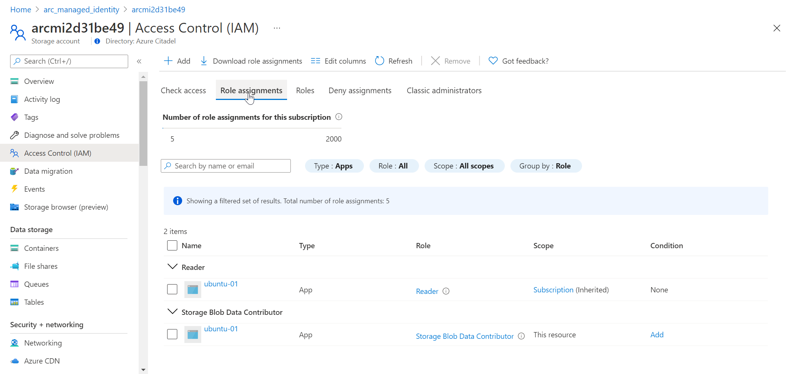
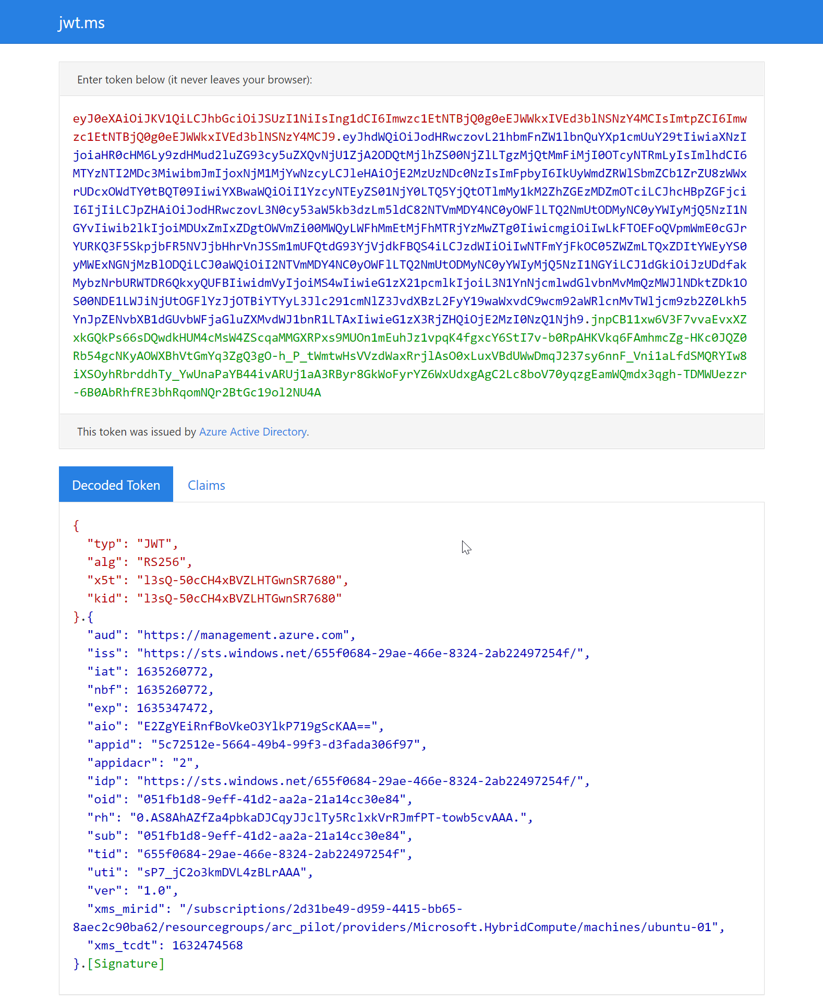
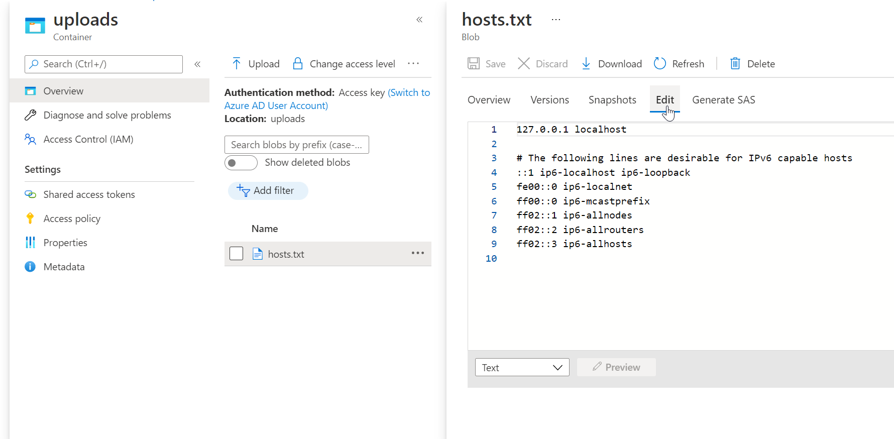

## Use Managed Identity on an Azure Arc-enabled linux server

The following README will guide you on how to work with the Hybrid Instance Metadata Service on an Azure Arc-enabled Ubuntu server, and authenticate the system assigned Managed Identity against Azure APIs.

In this guide you will use Bash commands and REST API calls to:

- Query the Hybrid Instance Metadata Service (HIMDS)
- Get challenge tokens and resource tokens
- List subscription tags using the main Azure Resource Manager REST API
- Read a secret from an Azure Key Vault
- Upload a blob to an Azure Storage Account


## Prerequisites

* An onboarded Ubuntu VM or server running on-premises or other clouds connected to Azure Arc

    If you haven't, this repository offers you a way to do so in an automated fashion:

    * **[GCP Ubuntu instance](https://azurearcjumpstart.io/azure_arc_jumpstart/azure_arc_servers/gcp/gcp_terraform_ubuntu/)**
    * **[AWS Ubuntu EC2 instance](https://azurearcjumpstart.io/azure_arc_jumpstart/azure_arc_servers/aws/aws_terraform_ubuntu/)**
    * **[Azure Ubuntu VM](https://azurearcjumpstart.io/azure_arc_jumpstart/azure_arc_servers/azure/azure_arm_template_linux/)**
    * **[VMware vSphere Ubuntu VM](https://azurearcjumpstart.io/azure_arc_jumpstart/azure_arc_servers/vmware/vmware_terraform_ubuntu/)**
    * **[Vagrant Ubuntu box](https://azurearcjumpstart.io/azure_arc_jumpstart/azure_arc_servers/vagrant/local_vagrant_ubuntu/)**

* jq and curl

    Your Ubuntu server will need the jq and curl packages installed.

    ```shell
    sudo apt-get update && sudo apt-get install -y jq curl
    ```

    > Note that Ubuntu 20.04 should have both packages installed by default.

* Azure Key Vault and Azure Storage Account

    The lab will access a secret in an Azure Key Vault and upload a blob to an Azure Storage Account container. You may use the following commands to create example resources.

    Login to your Azure account to run the commands. (This can also be done in [Azure Cloud Shell](https://shell.azure.com/bash).)

  * Set variables

    ```shell
    rg=your_resource_group_name
    loc=your_azure_region
    ```

    For example:

    ```shell
    rg=arc_managed_identity
    loc=westeurope
    ```

  * Create a resource group

    ```shell
    az group create --name $rg --location $loc
    rgid=$(az group show --name $rg --query id --output tsv)
    ```

  * Create a unique name for the FQDNs

    The fully qualified domain names must be globally unique. The command below will use the first eight characters from the subscription ID and suffix to `arcmi`.

    ```shell
    name=arcmi$(az account show --query id --output tsv | cut -f1 -d-)
    echo "Name: $name"
    ```

  * Create a Storage Account and container

    ```shell
    az storage account create --name $name --sku Standard_LRS --resource-group $rg --location $loc
    az storage container create --name uploads --account-name $name
    ```

  * Create a Key Vault and example secret

    ```shell
    az keyvault create --name $name --retention-days 7 --resource-group $rg --location $loc
    az keyvault secret set --vault-name $name --name portal --value "The cake is a lie."
    ```

## Adding RBAC roles for Arc-enabled VMs

By default, the managed identity will have no access to Azure resources. Use standard RBAC assignments to give the required access.

In the following sections you will:

1. List the subscription tags using the ARM REST API
    * Requires Reader role at the subscription level
1. Read a secret from a Key Vault
    * Using an Azure Key Vault access policy
1. Upload a blob to a Key Vault
    * Using the Storage Blob Data Contributor role

Run the following commands in a Cloud Shell session (or equivalent).

* Get the Managed Identity's object ID

    ```shell
    objectId=$(az connectedmachine show --name my_ubuntu_vm --resource-group my_resource_group --query identity.principalId --output tsv)
    ```

    Change the `--name` and `--resource-group` values to the correct values for your onboarded Ubuntu VM.

* Add the Reader role to the subscription scope

    ```shell
    subscriptionScope=/subscriptions/$(az account show --query id --output tsv)
    az role assignment create --assignee $objectId --role Reader --scope $subscriptionScope
    ```

* Add an access policy to the key vault

    ```shell
    az keyvault set-policy --name my_key_vault --object-id $objectId --secret-permissions list get
    ```

    Change the `--name` to the correct value for your Azure Key Vault.

    > Note that RBAC role assignments are also an option for Azure Key Vault

* Get the storage account's resource ID

    ```shell
    saId=$(az storage account show --name my_storage_account --resource-group my_resource_group --query id --output tsv)
    ```

    Change the `--name` and `--resource-group` values to the correct values for your storage account.

* Add the Storage Blob Data Contributor role to the storage account

    ```shell
    az role assignment create --assignee $objectId --role "Storage Blob Data Contributor" --scope $saId
    ```

Example storage account permissions, filtered to Type:Apps.



The onboarded Ubuntu VM's managed identity now has sufficient access to complete the lab.

## Hybrid Instance Metadata Service

The Hybrid Instance Metedata Service (HIMDS) is the hybrid counterpart to the [IMDS](https://docs.microsoft.com/azure/virtual-machines/linux/instance-metadata-service?tabs=linux) endpoint.

Here are the endpoints for comparison:

| Service | IMDS_ENDPOINT | IDENTITY_ENDPOINT |
|---|---|---|
| IMDS | `http://169.254.169.254` | `http://169.254.169.254/metadata/identity/oauth2/token`
| HIMDS | `http://localhost:40342` | `http://localhost:40342/metadata/identity/oauth2/token`

The HIMDS endpoint provides information about the onboarded server (e.g. subscription, resource group, tags etc.) as well as an endpoint to acquire the Managed Identity's authentication tokens.

* SSH to your Arc-enabled Ubuntu server

* Access the HIMDS endpoint

    ```shell
    curl -sSL -H Metadata:true http://localhost:40342/metadata/instance?api-version=2020-06-01 | jq .
    ```

    Example output:

    ```json
    {
      "compute": {
        "azEnvironment": "AzurePublicCloud",
        "isHostCompatibilityLayerVm": "",
        "location": "westeurope",
        "name": "ubuntu-01",
        "offer": "",
        "osType": "linux",
        "placementGroupId": "",
        "plan": {
          "name": "",
          "product": "",
          "publisher": ""
        },
        "platformFaultDomain": "",
        "platformUpdateDomain": "",
        "provider": "",
        "publicKeys": null,
        "publisher": "",
        "resourceGroupName": "my_onboarded_linux_vms",
        "customData": "",
        "resourceId": "/subscriptions/2d31be49-d959-4415-bb65-8aec2c90ba62/resourceGroups/my_onboarded_linux_vms/providers/Microsoft.HybridCompute/machines/ubuntu-01",
        "securityProfile": {
          "secureBootEnabled": "",
          "virtualTpmEnabled": ""
        },
        "sku": "Ubuntu 18.04.6 LTS",
        "storageProfile": {},
        "subscriptionId": "2d31be49-d959-4415-bb65-8aec2c90ba62",
        "tags": "cluster:POC;platform:VMware vSphere",
        "tagsList": [
          {
            "name": "cluster",
            "value": "POC"
          },
          {
            "name": "platform",
            "value": "VMware vSphere"
          }
        ],
        "version": "5.4.0-1061-azure",
        "vmId": "40ef12f9-4cf7-4d6a-9829-78dbf60c67cd",
        "vmScaleSetName": "",
        "vmSize": "",
        "zone": ""
      },
      "network": {}
    }

* Use values from the HIMDS

    Example commands to set variables

    ```shell
    imds=$(curl -sSL -H Metadata:true http://localhost:40342/metadata/instance?api-version=2020-06-01)
    subscriptionId=$(jq -r .compute.subscriptionId <<< $imds)
    resourceGroupName=$(jq -r .compute.resourceGroupName <<< $imds)
    echo "Subscription ID: $subscriptionId; Resource Group name: $resourceGroupName"
    ```

* Working with tags and jq

    The examples below show the tags and tags list and then pulls the value for a tag called platform.

    ```shell
    jq .compute.tags <<< $imds
    jq -r '.compute.tagsList' <<< $imds
    jq -r '.compute.tagsList[] | select(.name == "platform")' <<< $imds
    platform=$(jq -r '.compute.tagsList[] | select(.name == "platform") | .value' <<< $imds)
    echo "Platform: $platform"
    ```

## Challenge toke and resource token

The token process for an onboarded Azure Arc-enabled server is two-step:

1. First, a challenge token is created in a path that only the root and himds IDs can access
1. The identity endpoint is then accessed again with the challenge token in the headers

* Get the challenge token and resource token

    ```shell
    challengeTokenPath=$(curl -s -D - -H Metadata:true "http://127.0.0.1:40342/metadata/identity/oauth2/token?api-version=2019-11-01&resource=https%3A%2F%2Fmanagement.azure.com" | grep Www-Authenticate | cut -d "=" -f 2 | tr -d "[:cntrl:]")
    challengeToken=$(sudo cat $challengeTokenPath)
    token=$(curl -s -H Metadata:true -H "Authorization: Basic $challengeToken" "http://127.0.0.1:40342/metadata/identity/oauth2/token?api-version=2019-11-01&resource=https%3A%2F%2Fmanagement.azure.com" | jq -r .access_token)
    ```


The resulting token is valid for 24 hours. The challenge token files are ephemeral and can only be used once.

## JWT Token

Note the resulting token may be pasted into <https://jwt.ms> to decode it and view the claims.



## Accessing the ARM REST API

* List out the tags used in the subscription

    This command is purely to demonstrate that the Azure Resource Manager API can be accessed by the trusted compute.

    ```shell
    curl -sSL -X GET -H "Authorization: Bearer $token" -H "Content-Type: application/json" https://management.azure.com/subscriptions/$subscriptionId/tagNames?api-version=2021-04-01 | jq .value[].tagName
    ```

    This REST API call will fail if you have not assigned the Reader role to the subscription scope for the managed identity.

## Accessing Key Vault secrets

You will access other endpoints when using PaaS services such as Azure Key Vault, Azure Storage Account, Azure PaaS databases etc.

The token acquisition process is the same except you have to change the resource (or audience) in the query of the call.

* Acquire a token for the Key Vault service

    ```shell
    challengeTokenPath=$(curl -s -D - -H Metadata:true "http://127.0.0.1:40342/metadata/identity/oauth2/token?api-version=2019-11-01&resource=https%3A%2F%2Fvault.azure.net" | grep Www-Authenticate | cut -d "=" -f 2 | tr -d "[:cntrl:]")
    challengeToken=$(sudo cat $challengeTokenPath)
    vaultToken=$(curl -s -H Metadata:true -H "Authorization: Basic $challengeToken" "http://127.0.0.1:40342/metadata/identity/oauth2/token?api-version=2019-11-01&resource=https%3A%2F%2Fvault.azure.net" | jq -r .access_token)
    ```

    > Note that the resource is set to `https://vault.azure.net` in the query.

* Set variables

    ```shell
    kv=my_key_vault_name
    secret_name=my_secret_name
    ```

    Change the values to the correct ones for your key vault.

* Query the secret's value

    The REST call headers and URI are based on the [Get Secret](https://docs.microsoft.com/rest/api/keyvault/get-secret/get-secret) page.

    ```shell
    curl -sSL -X GET -H "Authorization: Bearer $vaultToken" -H "Content-Type: application/json" https://$kv.vault.azure.net/secrets/$secret_name/?api-version=7.2 | jq .
    ```

* Read into a Bash variable

    ```shell
    secret=$(curl -sSL -X GET -H "Authorization: Bearer $vaultToken" -H "Content-Type: application/json" https://$kv.vault.azure.net/secrets/$secret_name/?api-version=7.2 | jq -r .value)
    echo "$secret"
    ```

## Uploading a file to Azure Storage Account blob service

* Acquire the token

    ```shell
    challengeTokenPath=$(curl -s -D - -H Metadata:true "http://127.0.0.1:40342/metadata/identity/oauth2/token?api-version=2019-11-01&resource=https%3A%2F%2Fstorage.azure.com" | grep Www-Authenticate | cut -d "=" -f 2 | tr -d "[:cntrl:]")
    challengeToken=$(sudo cat $challengeTokenPath)
    storageToken=$(curl -s -H Metadata:true -H "Authorization: Basic $challengeToken" "http://127.0.0.1:40342/metadata/identity/oauth2/token?api-version=2019-11-01&resource=https%3A%2F%2Fstorage.azure.com" | jq -r .access_token)
    ```

    > Note that the resource is set to `https://storage.azure.com` in the query.

* Set variables

    ```shell
    sa=my_storage_account_name
    container=my_container_name
    ```

* Upload a file

    The following REST API call (from the [Put Blob](https://docs.microsoft.com/rest/api/storageservices/put-blob) page) authenticates with the Azure Active Directory token and uploads the server's hosts file.

    ```shell
     curl -i -X PUT -H "Authorization: Bearer $storageToken" -H "x-ms-blob-type: BlockBlob" -H "x-ms-version: 2020-10-02" --data-binary @/etc/hosts https://$sa.blob.core.windows.net/$container/hosts.txt
    ```

    The `-i` (or `--include`) displays the headers in the response including the md5sum.


* Check the blob in the portal

  


## Clean up environment

* If you created the resource group, key vault and storage account using the example pre-requisite commands then you can delete the whole resource group in the portal.

* To remove the Ubuntu virtual machines from each environment by following the teardown instructions from each guide.

    * **[GCP Ubuntu instance](https://azurearcjumpstart.io/azure_arc_jumpstart/azure_arc_servers/gcp/gcp_terraform_ubuntu/)**
    * **[AWS Ubuntu EC2 instance](https://azurearcjumpstart.io/azure_arc_jumpstart/azure_arc_servers/aws/aws_terraform_ubuntu/)**
    * **[Azure Ubuntu VM](https://azurearcjumpstart.io/azure_arc_jumpstart/azure_arc_servers/azure/azure_arm_template_linux/)**
    * **[VMware vSphere Ubuntu VM](https://azurearcjumpstart.io/azure_arc_jumpstart/azure_arc_servers/vmware/vmware_terraform_ubuntu/)**
    * **[Vagrant Ubuntu box](https://azurearcjumpstart.io/azure_arc_jumpstart/azure_arc_servers/vagrant/local_vagrant_ubuntu/)**
