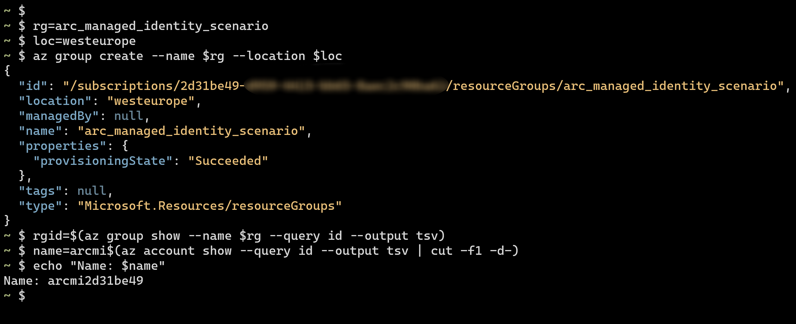
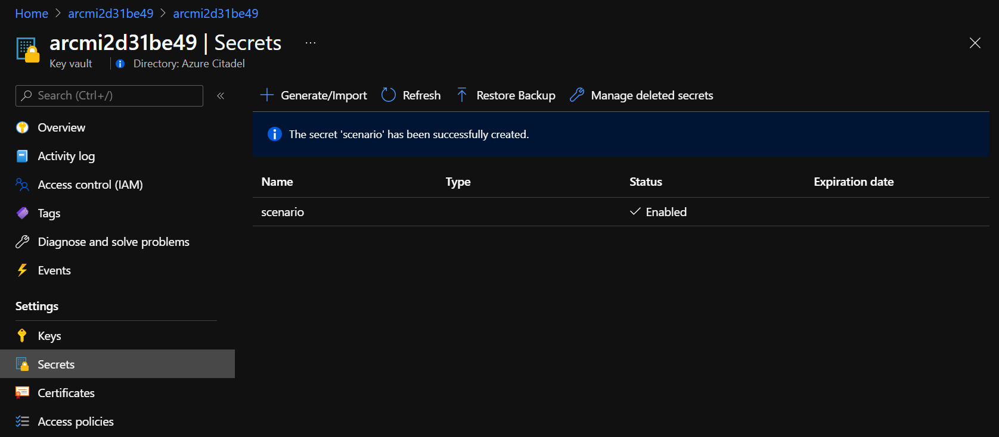
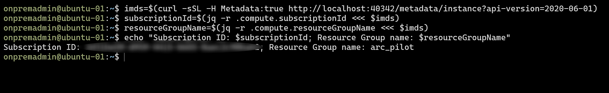
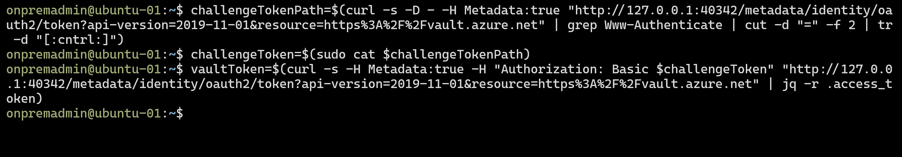
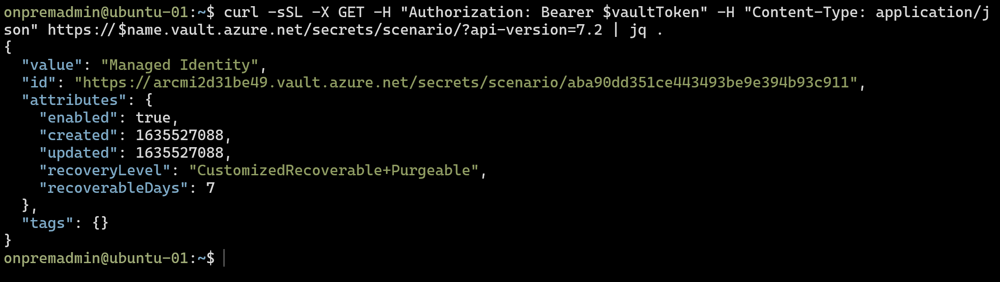

## Using Managed Identity on an Ubuntu Azure Arc-enabled server

The following README will guide you on how to work with the Hybrid Instance Metadata Service on an Azure Arc-enabled server, and authenticate the system assigned Managed Identity against Azure APIs.

In this guide you will use Bash commands and REST API calls to:

- Query the Hybrid Instance Metadata Service (HIMDS)
- Get challenge tokens and resource tokens
- Use the main Azure Resource Manager REST API
- Read a secret from an Azure Key Vault
- Upload a blob to an Azure Storage Account

## Prerequisites

- An onboarded Ubuntu server running on-premises or other clouds connected to Azure Arc

    If you haven't, this repository offers you a way to do so in an automated fashion:

  - **[GCP Ubuntu instance](https://azurearcjumpstart.io/azure_arc_jumpstart/azure_arc_servers/gcp/gcp_terraform_ubuntu/)**
  - **[AWS Ubuntu EC2 instance](https://azurearcjumpstart.io/azure_arc_jumpstart/azure_arc_servers/aws/aws_terraform_ubuntu/)**
  - **[Azure Ubuntu VM](https://azurearcjumpstart.io/azure_arc_jumpstart/azure_arc_servers/azure/azure_arm_template_linux/)**
  - **[VMware vSphere Ubuntu VM](https://azurearcjumpstart.io/azure_arc_jumpstart/azure_arc_servers/vmware/vmware_terraform_ubuntu/)**
  - **[Vagrant Ubuntu box](https://azurearcjumpstart.io/azure_arc_jumpstart/azure_arc_servers/vagrant/local_vagrant_ubuntu/)**

- Tagging

    Add a tag to your Azure Arc-enabled server.
    
    - Tag: **scenario**
    - Value: **Managed Identity**

    The tag will be seen later in the guide when accessing the Hybrid Instance Metadata Service.

    

- *jq* and *curl*

    SSH on to the Ubuntu server and install the _jq_ and _curl_ packages.

    ```shell
    sudo apt-get update && sudo apt-get install -y jq curl
    ```

## Azure Key Vault and Azure Storage account

This scenario will demonstrate how to integrate with Azure services by accessing a secret in an Azure Key Vault and uploading a blob to an Azure Storage account.

Login to your Azure account to run the commands. (This can also be done in [Azure Cloud Shell](https://shell.azure.com/bash).)

- Set variables

    ```shell
    rg=arc_managed_identity_scenario
    loc=westeurope
    ```

- Create an Azure resource group

    ```shell
    az group create --name $rg --location $loc
    rgid=$(az group show --name $rg --query id --output tsv)
    ```

    

- Create a unique name for the FQDNs

  The fully qualified domain names must be globally unique.

    ```shell
    name=arcmi$(az account show --query id --output tsv | cut -f1 -d-)
    echo "Name: $name"
    ```

    The command uses the first eight characters from your subscription ID and suffixes to the string `arcmi` to create a name for the FQDNs.

    

    > **Note that your value for `$name` will be different to the one in the screenshot above.**

- Create an Azure Storage account

    ```shell
    az storage account create --name $name --sku Standard_LRS --resource-group $rg --location $loc
    ```

    

- Create an Azure Key Vault

    ```shell
    az keyvault create --name $name --retention-days 7 --resource-group $rg --location $loc
    ```

    

- Create an example secret.

    ```shell
    az keyvault secret set --vault-name $name --name scenario --value "Managed Identity"
    ```

    The below image represents a secret example. In your environment, secrets are more likely to be passwords, database connection strings, etc.

    

## Add RBAC role assignments for the managed identity

By default, the managed identity on an Azure Arc-enabled server will have no access to Azure resources. The steps below will show how to use standard RBAC assignments to give the required access.

- Get the Managed Identity's object ID. Use the below command to output the object ID to a parameter by changing the `--name` and `--resource-group` values to the correct values for your onboarded Ubuntu Azure Arc-enabled server.

    ```shell
    objectId=$(az connectedmachine show --name my_ubuntu_vm --resource-group my_resource_group --query identity.principalId --output tsv)
    ```

- Add the Reader role to the subscription scope

    ```shell
    subscriptionScope=/subscriptions/$(az account show --query id --output tsv)
    az role assignment create --assignee $objectId --role Reader --scope $subscriptionScope
    ```

  

- Add an access policy to the Azure Key Vault

    ```shell
    az keyvault set-policy --name $name --object-id $objectId --secret-permissions get list
    ```

  

- Get the storage account's resource ID

    ```shell
    saId=$(az storage account show --name $name --resource-group $rg --query id --output tsv)
    ```

- Add the Storage Blob Data Contributor role to the storage account

    ```shell
    az role assignment create --assignee $objectId --role "Storage Blob Data Contributor" --scope $saId
    ```

  

  The onboarded Ubuntu Azure Arc-enabled server managed identity now has sufficient access to complete the lab.

## Hybrid Instance Metadata Service

The Hybrid Instance Metadata Service (HIMDS) is the hybrid counterpart to the [IMDS](https://docs.microsoft.com/azure/virtual-machines/linux/instance-metadata-service?tabs=linux) endpoint.

Below are the endpoints for comparison:

- Instance Metadata Service (IMDS)
    - Availability: Azure virtual machines, Azure containers (AKS/ACI)
    - IMDS_ENDPOINT:  `http://169.254.169.254`
    - IDENTITY_ENDPOINT: `http://169.254.169.254/metadata/identity/oauth2/token`
- Hybrid Instance Metadata Service (IMDS)
    - Availability: Azure Arc-enabled servers
    - IMDS_ENDPOINT:  `http://localhost:40342`
    - IDENTITY_ENDPOINT: `http://localhost:40342/metadata/identity/oauth2/token`

The HIMDS endpoint provides information about the onboarded server (e.g. subscription, resource group, tags, etc.) as well as an endpoint to acquire the Managed Identity's authentication tokens.

- SSH on to your Ubuntu server

   From this point onwards the scenario will be working purely on the Ubuntu server that you have onboarded.

- Access the HIMDS endpoint

    ```shell
    curl -sSL -H Metadata:true http://localhost:40342/metadata/instance?api-version=2020-06-01 | jq .
    ```

    Example output:

    ```json
    {
      "compute": {
        "azEnvironment": "AzurePublicCloud",
        "isHostCompatibilityLayerVm": "",
        "location": "westeurope",
        "name": "<name>",
        "offer": "",
        "osType": "linux",
        "placementGroupId": "",
        "plan": {
          "name": "",
          "product": "",
          "publisher": ""
        },
        "platformFaultDomain": "",
        "platformUpdateDomain": "",
        "provider": "",
        "publicKeys": null,
        "publisher": "",
        "resourceGroupName": "<resource_group_name>",
        "customData": "",
        "resourceId": "/subscriptions/<subscription_id>/resourceGroups/<resource_group_name>/providers/Microsoft.HybridCompute/machines/<name>",
        "securityProfile": {
          "secureBootEnabled": "",
          "virtualTpmEnabled": ""
        },
        "sku": "Ubuntu 18.04.6 LTS",
        "storageProfile": {},
        "subscriptionId": "<subscription_id>",
        "tags": "scenario:Managed Identity",
        "tagsList": [
          {
            "name": "scenario",
            "value": "Managed Identity"
          }
        ],
        "version": "<version>",
        "vmId": "<vmId>",
        "vmScaleSetName": "",
        "vmSize": "",
        "zone": ""
      },
      "network": {}
    }
    ```

- Use values from the HIMDS. Below is an example commands to set variables:

    ```shell
    imds=$(curl -sSL -H Metadata:true http://localhost:40342/metadata/instance?api-version=2020-06-01)
    subscriptionId=$(jq -r .compute.subscriptionId <<< $imds)
    resourceGroupName=$(jq -r .compute.resourceGroupName <<< $imds)
    echo "Subscription ID: $subscriptionId; Resource Group name: $resourceGroupName"
    ```

  

- Working with tags and _jq_

    The example commands below display the tags and then set a variable using a tag's value.

    ```shell
    jq .compute.tags <<< $imds
    jq -r '.compute.tagsList[] | select(.name == "scenario")' <<< $imds
    scenario=$(jq -r '.compute.tagsList[] | select(.name == "scenario") | .value' <<< $imds)
    echo "Scenario: $scenario"
    ```

  

## Challenge token and resource token

The token process for an onboarded Azure Arc-enabled server is multi-step.

- Access the identity endpoint to create a challenge token

    ```shell
    challengeTokenPath=$(curl -s -D - -H Metadata:true "http://127.0.0.1:40342/metadata/identity/oauth2/token?api-version=2019-11-01&resource=https%3A%2F%2Fmanagement.azure.com" | grep Www-Authenticate | cut -d "=" -f 2 | tr -d "[:cntrl:]")
    ```

    The file path is included in the headers returned by the REST API call.

    

    The file is created in a path that only the root and HIMDS IDs can access.

- Read the content of the file into a variable. The challenge token files may only be used once and are automatically removed.

    ```shell
    challengeToken=$(sudo cat $challengeTokenPath)
    ```

    

- Access the identity endpoint to acquire the resource token

    ```shell
    token=$(curl -s -H Metadata:true -H "Authorization: Basic $challengeToken" "http://127.0.0.1:40342/metadata/identity/oauth2/token?api-version=2019-11-01&resource=https%3A%2F%2Fmanagement.azure.com" | jq -r .access_token)
    ```

    Note the resource value in the query and the challenge token in the header and that the resulting token is valid for 24 hours.

    

## JWT Token

- The resulting token may be pasted into <https://jwt.ms> to decode it and view the claims.

  

## Accessing the ARM REST API

- List out the tags used in the subscription. The below command demonstrates that the Azure Resource Manager API can be accessed by a trusted computer.

    ```shell
    curl -sSL -X GET -H "Authorization: Bearer $token" -H "Content-Type: application/json" https://management.azure.com/subscriptions/$subscriptionId/tagNames?api-version=2021-04-01 | jq .value[].tagName
    ```

    

    The above REST API call will fail if you have not assigned the _Reader_ role to the subscription scope for the managed identity.

## Accessing Key Vault secrets

You will access other endpoints when using PaaS services such as Azure Key Vault, Azure Storage Account, Azure PaaS databases, etc. The token acquisition process is the same except you have to change the resource (or audience) in the query of the call.

- Acquire a token for the Key Vault service with resource set to `https://vault.azure.net` in the query

    ```shell
    challengeTokenPath=$(curl -s -D - -H Metadata:true "http://127.0.0.1:40342/metadata/identity/oauth2/token?api-version=2019-11-01&resource=https%3A%2F%2Fvault.azure.net" | grep Www-Authenticate | cut -d "=" -f 2 | tr -d "[:cntrl:]")
    challengeToken=$(sudo cat $challengeTokenPath)
    vaultToken=$(curl -s -H Metadata:true -H "Authorization: Basic $challengeToken" "http://127.0.0.1:40342/metadata/identity/oauth2/token?api-version=2019-11-01&resource=https%3A%2F%2Fvault.azure.net" | jq -r .access_token)
    ```

    

- Query the secret's value

    ```shell
    curl -sSL -X GET -H "Authorization: Bearer $vaultToken" -H "Content-Type: application/json" https://$name.vault.azure.net/secrets/scenario/?api-version=7.2 | jq .
    ```

    

- Set a variable to the secret's value

    ```shell
    secret=$(curl -sSL -X GET -H "Authorization: Bearer $vaultToken" -H "Content-Type: application/json" https://$name.vault.azure.net/secrets/scenario/?api-version=7.2 | jq -r .value)
    echo "$secret"
    ```

    

## Uploading a file to Azure Storage Account blob service

- Acquire the token with resource set to `https://storage.azure.com`

    ```shell
    challengeTokenPath=$(curl -s -D - -H Metadata:true "http://127.0.0.1:40342/metadata/identity/oauth2/token?api-version=2019-11-01&resource=https%3A%2F%2Fstorage.azure.com" | grep Www-Authenticate | cut -d "=" -f 2 | tr -d "[:cntrl:]")
    challengeToken=$(sudo cat $challengeTokenPath)
    storageToken=$(curl -s -H Metadata:true -H "Authorization: Basic $challengeToken" "http://127.0.0.1:40342/metadata/identity/oauth2/token?api-version=2019-11-01&resource=https%3A%2F%2Fstorage.azure.com" | jq -r .access_token)
    ```

    

- Create a container named `uploads`

    ```shell
    curl -X PUT -d "" -H "Authorization: Bearer $storageToken" -H "x-ms-version: 2020-10-02" https://$name.blob.core.windows.net/uploads?restype=container
    ```

- Upload a file

    ```shell
    curl -i -X PUT -H "Authorization: Bearer $storageToken" -H "x-ms-blob-type: BlockBlob" -H "x-ms-version: 2020-10-02" --data-binary @/etc/hosts https://$name.blob.core.windows.net/uploads/hosts.txt
    ```

    The `-i` (or `--include`) displays the headers in the response including the md5sum.

    

- Check the blob in the Azure portal. Notice how the managed identity on the Azure Arc-enabled server has successfully uploaded a file to an Azure Storage account.

  

## Clean up environment

- Delete the _arc_managed_identity_scenario_ resource group in the portal.

  

- To remove the Ubuntu virtual machines from each environment by following the teardown instructions from each guide.

  - **[GCP Ubuntu instance](https://azurearcjumpstart.io/azure_arc_jumpstart/azure_arc_servers/gcp/gcp_terraform_ubuntu/)**
  - **[AWS Ubuntu EC2 instance](https://azurearcjumpstart.io/azure_arc_jumpstart/azure_arc_servers/aws/aws_terraform_ubuntu/)**
  - **[Azure Ubuntu VM](https://azurearcjumpstart.io/azure_arc_jumpstart/azure_arc_servers/azure/azure_arm_template_linux/)**
  - **[VMware vSphere Ubuntu VM](https://azurearcjumpstart.io/azure_arc_jumpstart/azure_arc_servers/vmware/vmware_terraform_ubuntu/)**
  - **[Vagrant Ubuntu box](https://azurearcjumpstart.io/azure_arc_jumpstart/azure_arc_servers/vagrant/local_vagrant_ubuntu/)**
