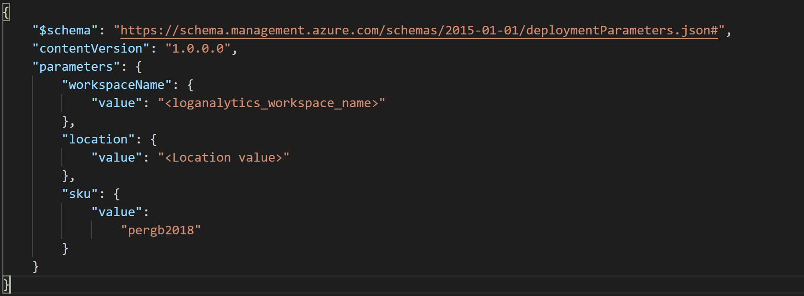

## Deploy Monitoring Agent Extension to Azure Arc Linux and Windows servers using Azure Policy

The following README will guide you on how to use Azure Arc-enabled servers to assign Azure Policies to VMs outside of Azure, whether they are on-premises or other clouds. With this feature you can now use Azure Policy to audit settings in the operating system of an Azure Arc-enabled server, if a setting is not compliant you can also trigger a remediation task.

In this case, you will assign a policy to audit if the Azure Arc connected machine has the (Microsoft Monitoring Agent) MMA agent installed, if not, you will use the extensions feature to automatically deploy it to the VM, an enrollment experience that levels to Azure VMs. This approach can be used to make sure all your servers are onboard to services such as Azure Monitor, Azure Security Center, Azure Sentinel, etc.

You can use the Azure Portal, an ARM template or PowerShell script to assign policies to Azure subscriptions or resource groups. In this guide, you will use an ARM template to assign built-in policies.

> **Note: This guide assumes you already deployed VMs or servers that are running on-premises or other clouds and you have connected them to Azure Arc but If you haven't, this repository offers you a way to do so in an automated fashion:**

* **[GCP Ubuntu instance](https://azurearcjumpstart.io/azure_arc_jumpstart/azure_arc_servers/gcp/gcp_terraform_ubuntu/)**
* **[GCP Windows instance](https://azurearcjumpstart.io/azure_arc_jumpstart/azure_arc_servers/gcp/gcp_terraform_windows/)**
* **[AWS Ubuntu EC2 instance](https://azurearcjumpstart.io/azure_arc_jumpstart/azure_arc_servers/aws/aws_terraform_ubuntu/)**
* **[AWS Amazon Linux 2 EC2 instance](https://azurearcjumpstart.io/azure_arc_jumpstart/azure_arc_servers/aws/aws_terraform_al2/)**
* **[Azure Ubuntu VM](https://azurearcjumpstart.io/azure_arc_jumpstart/azure_arc_servers/azure/azure_arm_template_linux/)**
* **[Azure Windows VM](https://azurearcjumpstart.io/azure_arc_jumpstart/azure_arc_servers/azure/azure_arm_template_win/)**
* **[VMware vSphere Ubuntu VM](https://azurearcjumpstart.io/azure_arc_jumpstart/azure_arc_servers/vmware/vmware_terraform_ubuntu/)**
* **[VMware vSphere Windows Server VM](https://azurearcjumpstart.io/azure_arc_jumpstart/azure_arc_servers/vmware/vmware_terraform_winsrv/)**
* **[Vagrant Ubuntu box](https://azurearcjumpstart.io/azure_arc_jumpstart/azure_arc_servers/vagrant/local_vagrant_ubuntu/)**
* **[Vagrant Windows box](https://azurearcjumpstart.io/azure_arc_jumpstart/azure_arc_servers/vagrant/local_vagrant_windows/)**

Please review the [Azure Monitor supported OS documentation](https://docs.microsoft.com/en-us/azure/azure-monitor/insights/vminsights-enable-overview#supported-operating-systems) and ensure that the VMs you will use for this guide are supported. For Linux VMs, check both the Linux distribution and kernel to ensure you are using a supported configuration.

## Prerequisites

* Clone the Azure Arc Jumpstart repository

    ```shell
    git clone https://github.com/microsoft/azure_arc.git
    ```

* As mentioned, this guide starts at the point where you already deployed and connected VMs or servers to Azure Arc. In the screenshots below we can see a GCP server has been connected with Azure Arc and is visible as a resource in Azure.

    

    

* [Install or update Azure CLI](https://docs.microsoft.com/en-us/cli/azure/install-azure-cli?view=azure-cli-latest). Azure CLI should be running version 2.7** or later. Use ```az --version``` to check your current installed version.

* Create Azure service principal (SP)

    To connect a VM or bare-metal server to Azure Arc, Azure service principal assigned with the "contributor" role is required. To create it, login to your Azure account run the below command (this can also be done in [Azure Cloud Shell](https://shell.azure.com/)).

    ```shell
    az login
    subscriptionId=$(az account show --query id --output tsv)
    az ad sp create-for-rbac -n "<Unique SP Name>" --role "Contributor" --scopes /subscriptions/$subscriptionId
    ```

    For example:

    ```shell
    az login
    subscriptionId=$(az account show --query id --output tsv)
    az ad sp create-for-rbac -n "JumpstartArc" --role "Contributor" --scopes /subscriptions/$subscriptionId
    ```

    Output should look like this:

    ```json
    {
    "appId": "XXXXXXXXXXXXXXXXXXXXXXXXXXXX",
    "displayName": "JumpstartArc",
    "password": "XXXXXXXXXXXXXXXXXXXXXXXXXXXX",
    "tenant": "XXXXXXXXXXXXXXXXXXXXXXXXXXXX"
    }
    ```

    > **NOTE: If you create multiple subsequent role assignments on the same service principal, your client secret (password) will be destroyed and recreated each time. Therefore, make sure you grab the correct password**.

    > **NOTE: The Jumpstart scenarios are designed with as much ease of use in-mind and adhering to security-related best practices whenever possible. It is optional but highly recommended to scope the service principal to a specific [Azure subscription and resource group](https://docs.microsoft.com/cli/azure/ad/sp?view=azure-cli-latest) as well considering using a [less privileged service principal account](https://docs.microsoft.com/azure/role-based-access-control/best-practices)**

* You will also need to have a Log Analytics workspace deployed. You can automate the deployment by editing the ARM template [parameters file](https://github.com/microsoft/azure_arc/blob/main/azure_arc_servers_jumpstart/policies/arm/log_analytics-template.parameters.json), provide a name and location for your workspace.

    

  To deploy the ARM template, navigate to the [deployment folder](https://github.com/microsoft/azure_arc/tree/main/azure_arc_servers_jumpstart/policies/arm) and run the below command:

  ```shell
    az deployment group create --resource-group <Name of the Azure resource group> \
    --template-file <The *log_analytics-template.json* template file location> \
    --parameters <The *log_analytics-template.parameters.json* template file location>
  ```

## Azure Policies on Azure Arc connected machines

* Now that you have all the prerequisites set, you can assign policies to our Arc connected machines. Edit the [parameters file](https://github.com/microsoft/azure_arc/blob/main/azure_arc_servers_jumpstart/policies/arm/policy.json) to provide your subscription ID as well as the Log Analytics workspace.

    

  To start the deployment, use the below command:

  ```shell
  az policy assignment create --name 'Enable Azure Monitor for VMs' \
  --scope '/subscriptions/<Your subscription ID>/resourceGroups/<Name of the Azure resource group>' \
  --policy-set-definition '55f3eceb-5573-4f18-9695-226972c6d74a' \
  -p <The *policy.json* template file location> \
  --assign-identity --location <Azure Region>
  ```

  The flag *policy-set-definition* points to the initiative "Enable Azure Monitor" definition ID.

* Once the initiative is assigned, it takes around 30 minutes for the assignment to be applied to the defined scope. After those 30 minutes, Azure Policy will start the evaluation cycle against the Azure Arc connected machine and recognize it as "Non-compliant" (since it still does not have the Log Analytics Agent configuration deployed). To check this, go to the Azure Arc connected Machine under the Policies section.

  

* Now, you will assign a remediation task to the non-compliant resource to put into a compliant state.

  

* Under 'Policy to remediate' choose '[Preview] Deploy Log Analytics Agent to Linux Azure Arc machines' and select 'Remediate'. This remediation task is instructing Azure Policy to run the deployIfNotExists effect and use the Azure Arc extension management capabilities to deploy the Log Analytics agent on the VM

  

* Once you have assigned remediation task, the policy will be evaluated again and show that the server on GCP is compliant and that the Microsoft Monitoring Agent extension is installed on the Azure Arc machine.

  

  

## Clean up environment

Complete the following steps to clean up your environment.

Remove the virtual machines from each environment by following the teardown instructions from each guide.

* **[GCP Ubuntu instance](https://azurearcjumpstart.io/azure_arc_jumpstart/azure_arc_servers/gcp/gcp_terraform_ubuntu/)**
* **[GCP Windows instance](https://azurearcjumpstart.io/azure_arc_jumpstart/azure_arc_servers/gcp/gcp_terraform_windows/)**
* **[AWS Ubuntu EC2 instance](https://azurearcjumpstart.io/azure_arc_jumpstart/azure_arc_servers/aws/aws_terraform_ubuntu/)**
* **[AWS Amazon Linux 2 EC2 instance](https://azurearcjumpstart.io/azure_arc_jumpstart/azure_arc_servers/aws/aws_terraform_al2/)**
* **[Azure Ubuntu VM](https://azurearcjumpstart.io/azure_arc_jumpstart/azure_arc_servers/azure/azure_arm_template_linux/)**
* **[Azure Windows VM](https://azurearcjumpstart.io/azure_arc_jumpstart/azure_arc_servers/azure/azure_arm_template_win/)**
* **[VMware vSphere Ubuntu VM](https://azurearcjumpstart.io/azure_arc_jumpstart/azure_arc_servers/vmware/vmware_terraform_ubuntu/)**
* **[VMware vSphere Windows Server VM](https://azurearcjumpstart.io/azure_arc_jumpstart/azure_arc_servers/vmware/vmware_terraform_winsrv/)**
* **[Vagrant Ubuntu box](https://azurearcjumpstart.io/azure_arc_jumpstart/azure_arc_servers/vagrant/local_vagrant_ubuntu/)**
* **[Vagrant Windows box](https://azurearcjumpstart.io/azure_arc_jumpstart/azure_arc_servers/vagrant/local_vagrant_windows/)**

Remove the Azure Policy assignment by executing the following script in Azure CLI.

  ```shell
  az policy assignment delete --name 'Enable Azure Monitor for VMs' --resource-group <resource_group>
  ```

Remove the Log Analytics workspace by executing the following script in Azure CLI. Provide the workspace name you used when creating the Log Analytics workspace.

  ```shell
  az monitor log-analytics workspace delete --resource-group <Name of the Azure resource group> --workspace-name <Log Analytics workspace Name> --yes
  ```
