## Use Azure Private Link to securely connect networks to Azure Arc

The following README will guide you on how to use [Azure Private Link](https://docs.microsoft.com/en-us/azure/private-link/private-link-overview) to securely connect from an Azure Arc-enabled server to Azure PaaS services. [This feature](https://docs.microsoft.com/en-us/azure/azure-arc/servers/private-link-security) not only allows you to link your Azure PaaS services to your virtual network using private endpoints but also enables you to connect your on-premises or multi-cloud resources with Azure Arc and ensure that all traffic is being sent over a VPN or ExpressRoute connection.

In this guide, you will emulate a hybrid environment connected to Azure over a VPN with hybrid resources that will be Arc-enabled, and Azure Private Link will be used to connect to an Azure PaaS service over a private connection. To complete this process you will:

- Create two separate resource groups in different Azure regions:

  - "On-premises" resource group: will simulate a private on-premises environment with a Linux virtual machine. This VM does will not have a public IP address assigned to it so [Azure Bastion](https://docs.microsoft.com/en-us/azure/bastion/bastion-overview) is deployed to have access to the operating system. The Linux virtual machine is an Azure Arc-enabled server by installing the Azure Arc-connected machine agent.
  - Azure resource group: in this resource group, you will be deploying all Azure PaaS resources, in this case, [Azure DNS](https://docs.microsoft.com/en-us/azure/dns/dns-overview) and [Azure SQL](https://docs.microsoft.com/en-us/azure/azure-sql/database/sql-database-paas-overview). In order to establish a private connection to these Azure services, Azure Private Link will be deployed as well.

- Both resource groups have their own virtual networks and address spaces, however, they are connected via Azure VPN gateways to set up a hybrid private connection.

  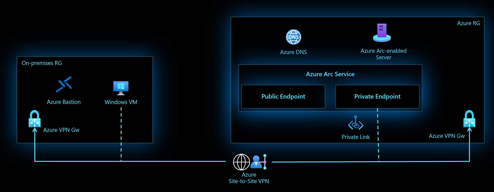

Once everything is deployed, you will be able to access the Azure SQL private IP address from the "on-premises" Linux machine, traffic will go over the VPN connection and be kept within the Azure VNET via Private Link to access the database service.

## Prerequisites

- Clone the Azure Arc Jumpstart repository

    ```shell
    git clone https://github.com/microsoft/azure_arc.git
    ```

- [Install or update Azure CLI](https://docs.microsoft.com/en-us/cli/azure/install-azure-cli?view=azure-cli-latest). Azure CLI should be running version 2.7** or later. Use ```az --version``` to check your current installed version.

- Create Azure service principal (SP)

    To connect a VM or bare-metal server to Azure Arc, Azure service principal assigned with the "Contributor" role is required. To create it, login to your Azure account run the below command (this can also be done in [Azure Cloud Shell](https://shell.azure.com/)).

    ```shell
    az login
    az ad sp create-for-rbac -n "<Unique SP Name>" --role contributor
    ```

    For example:

    ```shell
    az ad sp create-for-rbac -n "http://AzureArcServers" --role contributor
    ```

    Output should look like this:

    ```json
    {
    "appId": "XXXXXXXXXXXXXXXXXXXXXXXXXXXX",
    "displayName": "AzureArcServers",
    "name": "http://AzureArcServers",
    "password": "XXXXXXXXXXXXXXXXXXXXXXXXXXXX",
    "tenant": "XXXXXXXXXXXXXXXXXXXXXXXXXXXX"
    }
    ```

- Azure Arc-enabled servers depends on the following Azure resource providers in your subscription in order to use this service. Registration is an asynchronous process, and registration may take approximately 10 minutes.

  - Microsoft.HybridCompute
  - Microsoft.GuestConfiguration

      ```shell
      az provider register --namespace 'Microsoft.HybridCompute'
      az provider register --namespace 'Microsoft.GuestConfiguration'
      ```

      You can monitor the registration process with the following commands:

      ```shell
      az provider show --namespace 'Microsoft.HybridCompute'
      az provider show --namespace 'Microsoft.GuestConfiguration'
      ```

  > **Note: It is optional but highly recommended to scope the SP to a specific [Azure subscription and resource group](https://docs.microsoft.com/en-us/cli/azure/ad/sp?view=azure-cli-latest).**

## Automation Flow

For you to get familiar with the automation and deployment flow, below is an explanation.

1. User is editing the ARM templates parameters file (1-time edit). These parameter values are being used throughout the deployment. Two separate files are provided, one per resource group.

2. User creates two resource groups in two different regions:
    - Azure Resource Group
    - On-premises Resource Group

3. User deploys the ARM template for the resources in the Azure Resource Group. The ARM template will create:

    - Azure SQL server and a SQL database
    - Azure Private Link
    - Azure Private DNS zone
    - Azure VPN Gateway and its public IP address
    - Azure VNET

4. User deploys the ARM template for the resources in the On-premises resource group. The ARM template will create:

    - Azure VNET
    - Azure Bastion
    - Azure VPN Gateway and its public IP address
    - Azure Linux Virtual Machine with a custom script extension that will run the [_install_arc_agent.sh_](https://github.com/microsoft/azure_arc/blob/main/azure_arc_servers_jumpstart/azure/linux/arm_template/scripts/install_arc_agent.sh) shell script to Arc-enable the Azure VM.

        > **Note: The [_install_arc_agent.sh_](https://github.com/microsoft/azure_arc/blob/main/azure_arc_servers_jumpstart/azure/linux/arm_template/scripts/install_arc_agent.sh) shell script will enable the OS firewall and set up new rules for incoming and outgoing connections. By default all incoming and outgoing traffic will be allowed, except blocking Azure IMDS outbound traffic to the *169.254.169.254* remote address.**

5. User uses Azure Bastion to connect to Linux VM which will start the _install_arc_agent.sh_ script execution and will onboard the VM to Azure Arc.

6. User tests private connectivity to Azure SQL server from the Azure Linux Virtual Machine.

## Deployment

As mentioned, this deployment will leverage ARM templates. You will deploy an ARM template per resource group that is responsible for creating all the Azure resources as well as the "on-premises" resources that will be onboarded to Azure Arc.

- Before deploying the ARM template, login to Azure using AZ CLI with the ```az login``` command.

- Create two resource groups in two different regions:

  - Azure Resource Group
  - On-premises Resource Group

    ```shell
    az group create --name <Name of the Azure resource group> --location <Azure region> --tags "Project=jumpstart_azure_arc_servers"
    az group create --name <Name of the On-premise resource group> --location <Azure region> --tags "Project=jumpstart_azure_arc_servers"
    ```

    For example:

    ```shell
    az group create --name Arc-Azure-PL-demo --location "westeurope" --tags "Project=jumpstart_azure_arc_servers"
    az group create --name Arc-Onpremise-PL-Demo --location "northeurope" --tags "Project=jumpstart_azure_arc_servers"
    ```

- The deployment will use two ARM template parameters file. Before initiating the deployment, edit the [*azuredeploy.parameters.json*](https://github.com/microsoft/azure_arc/blob/main/azure_arc_servers_jumpstart/privatelink/azuredeploy.parameters.json) file located in your local cloned repository folder and the edit the [*onpremisedeploy.parameters.json*](https://github.com/microsoft/azure_arc/blob/main/azure_arc_servers_jumpstart/privatelink/onpremisedeploy.parameters.json). Example parameters files are located [here](https://github.com/microsoft/azure_arc/blob/main/azure_arc_servers_jumpstart/privatelink/azuredeploy.example.parameters.json) and [here](https://github.com/microsoft/azure_arc/blob/main/azure_arc_servers_jumpstart/privatelink/onpremisedeploy.example.parameters.json).

- To deploy the ARM template, navigate to the local cloned [deployment folder](https://github.com/microsoft/azure_arc/tree/main/azure_arc_servers_jumpstart/privatelink) and run the below command, start deploying resources in the Azure resource group first:

    ```shell
    az deployment group create \
    --resource-group <Name of the Azure resource group> \
    --name <The name of this deployment> \
    --template-uri https://raw.githubusercontent.com/microsoft/azure_arc/main/azure_arc_servers_jumpstart/azure/privatelink/azuredeploy.json \
    --parameters <The *azuredeploy.parameters.json* parameters file location>
    ```

    For example:

    ```shell
    az deployment group create \
    --resource-group Arc-Azure-PL-demo \
    --name arcpldemo \
    --template-uri https://raw.githubusercontent.com/microsoft/azure_arc/main/azure_arc_servers_jumpstart/azure/privatelink/azuredeploy.json \
    --parameters azuredeploy.parameters.json
    ```

     > **Note: The deployment may take around 20-30 minutes to complete**

- Verify the resources are created on the Azure Portal.

    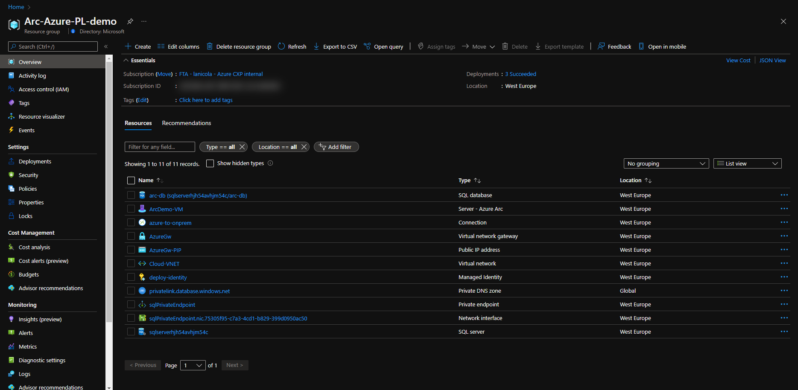

- Once the deployment is done, create resources in the on-premises resource group. To deploy the ARM template, navigate to the local cloned [deployment folder](https://github.com/microsoft/azure_arc/tree/main/azure_arc_servers_jumpstart/privatelink) and run the below command:

    ```shell
    az deployment group create \
    --resource-group <Name of the on-premise resource group> \
    --name <The name of this deployment> \
    --template-uri https://raw.githubusercontent.com/microsoft/azure_arc/main/azure_arc_servers_jumpstart/azure/privatelink/onpremise.json \
    --parameters <The *azuredeploy.parameters.json* parameters file location>
    ```

    For example:

    ```shell
    az deployment group create \
    --resource-group Arc-Onpremise-PL-Demo \
    --name arcpldemo \
    --template-uri https://raw.githubusercontent.com/microsoft/azure_arc/main/azure_arc_servers_jumpstart/azure/privatelink/onpremise.json \
    --parameters onpremisedeploy.parameters.json
    ```

     > **Note: The deployment may take around 20-30 minutes to complete**

- Verify the resources are created on the Azure Portal.

    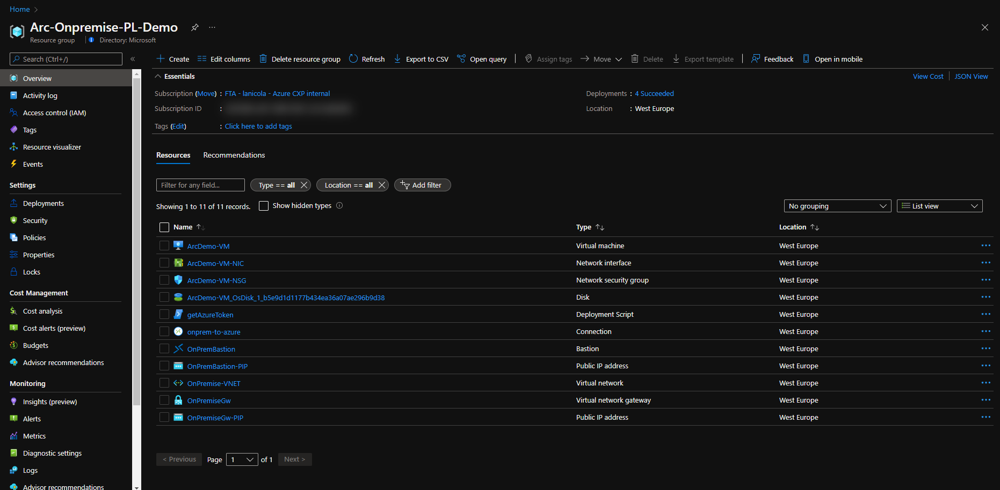

- Once deployed, connect to the Linux virtual machine using Azure Bastion. Once you login, the *install_arc_agent.sh* script execution will start and will onboard the VM to Azure Arc.

    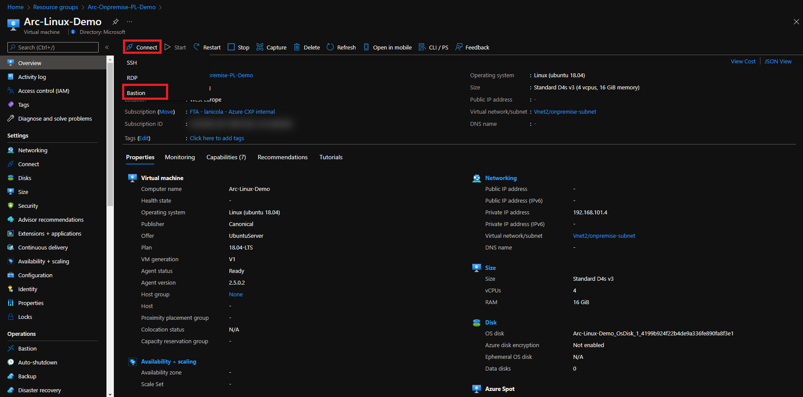

    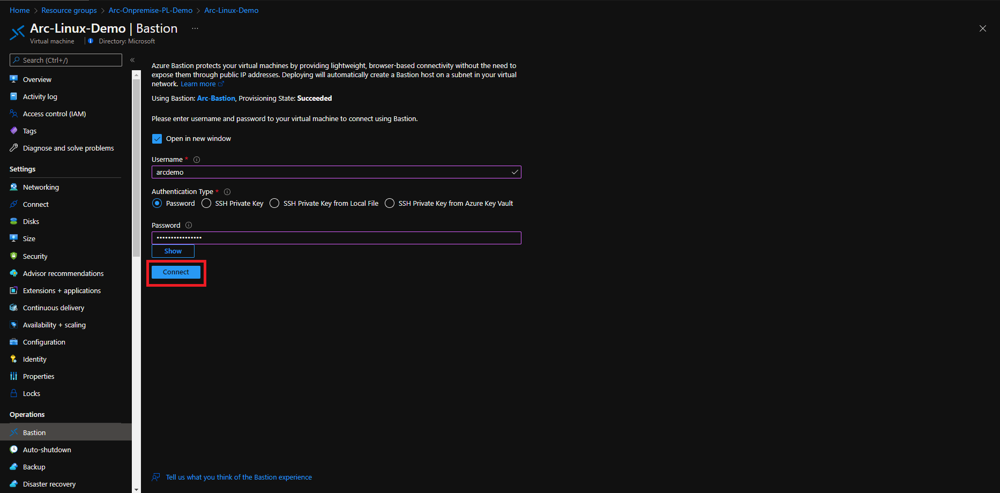

    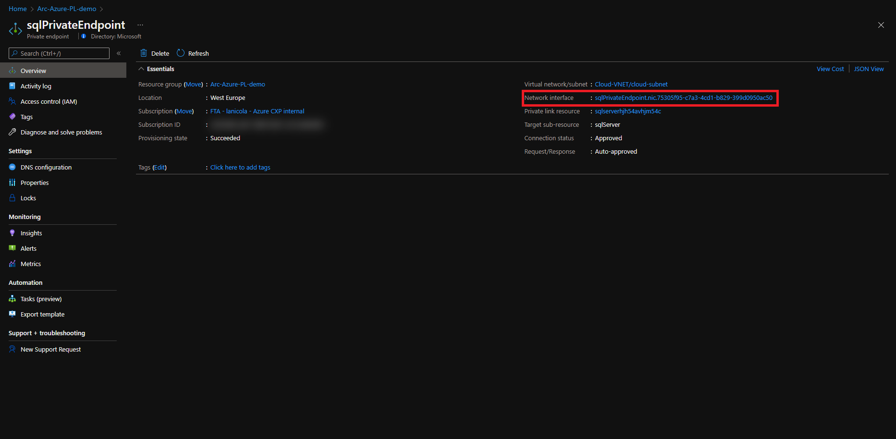

    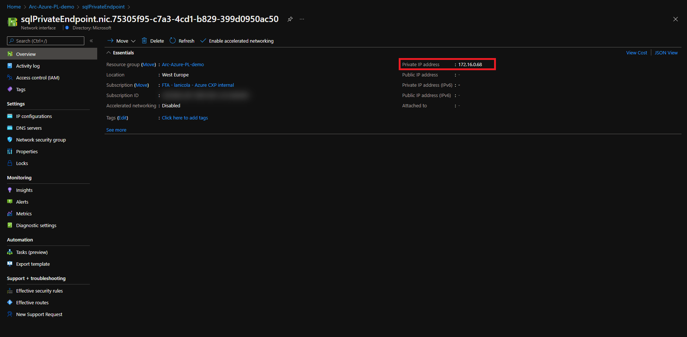

- The Azure Arc-enabled server will be shown in the Azure resource group as a new resource.

    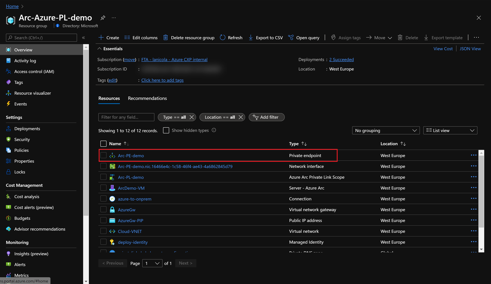

## Connectivity test

- Now that all resources are deployed in both resources groups, you can verify that there is a private connection from the Azure Arc-enabled server to the Azure SQL database, this connection will go through the VPN gateways that connect the two VNETs and the traffic will continue over the Microsoft's network to reach the PaaS service on its private IP address since Azure Private link has been enabled.

- To perform the test you will need the database's private IP address, navigate to the Azure's resource group in the Azure Portal as described below:

  - Select the Private endpoint resource:

      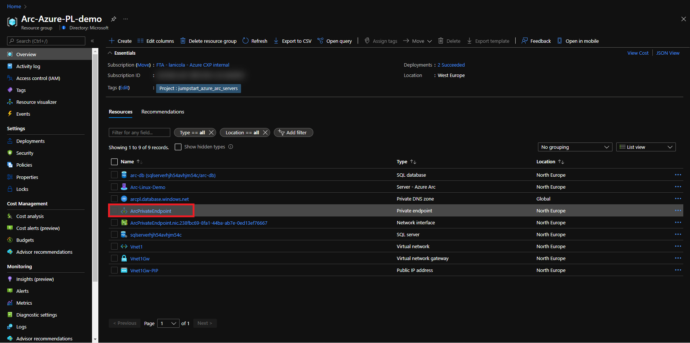

  - Select the Private Enpoint's network interface:

      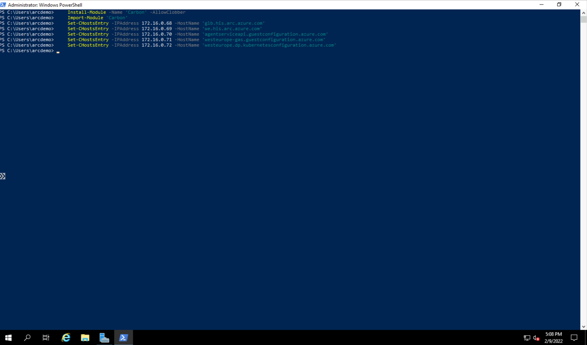

  - Copy the private IP address:

      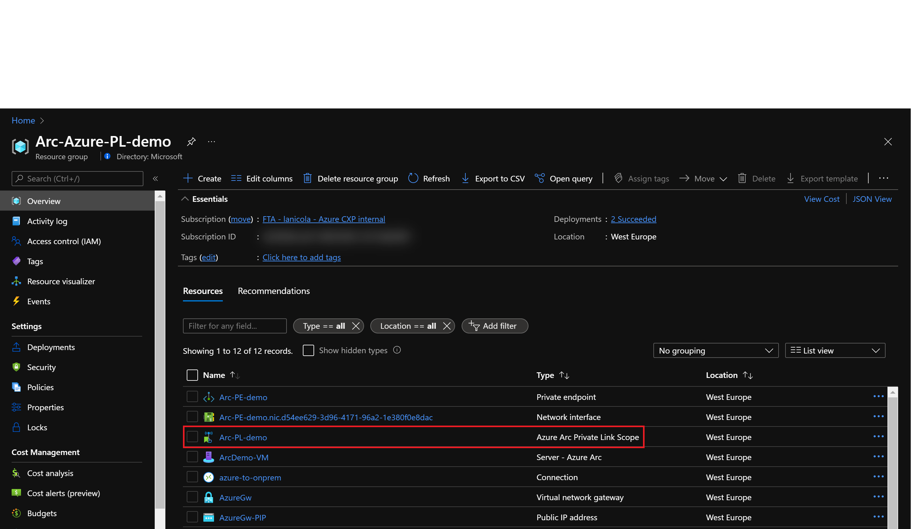

- You can then do some connectivity checks to ensure that the on-premises VM is connecting to SQL Database via the private endpoint, you will use telnet for this purpose. Run the below command on the Azure Bastion session:

    ```shell
    telnet <private_endpoint_IP> 1433
    ```

  For example:

    ```shell
    telnet 192.168.100.4 1433
    ```

- When Telnet connects successfully, you'll see a message like the below image:

  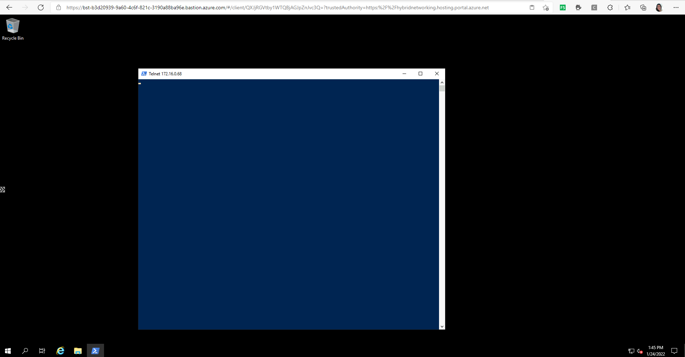

## Clean up environment

To delete the entire deployment, simply delete both resources groups from the Azure portal.

  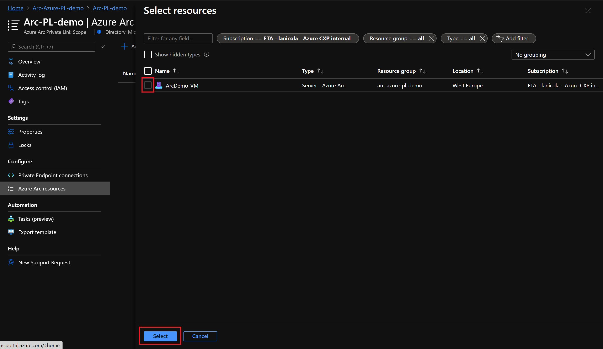

  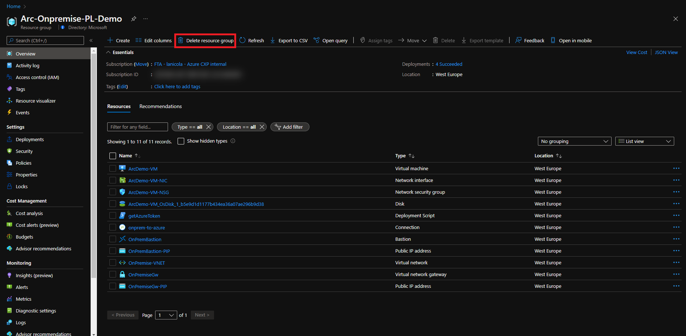
  