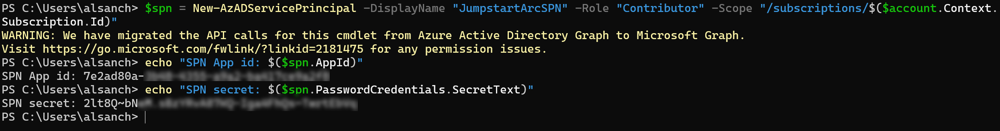
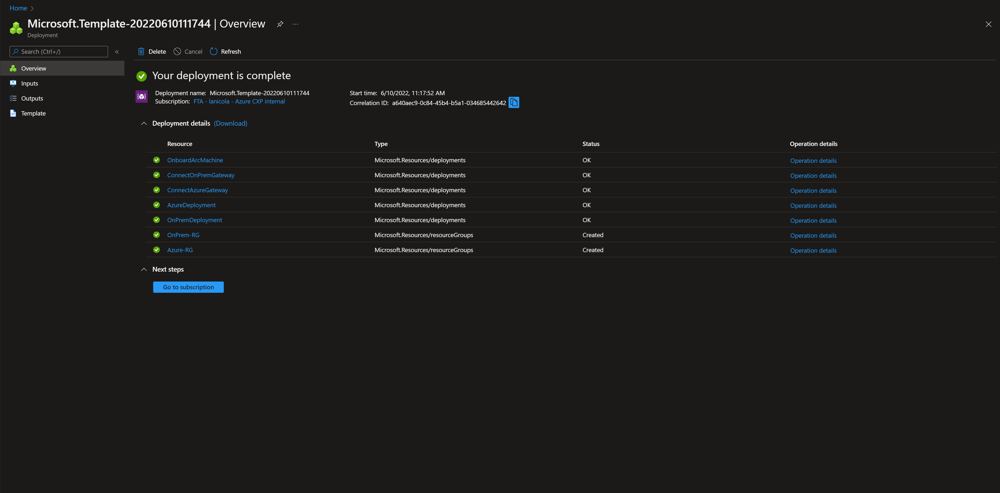
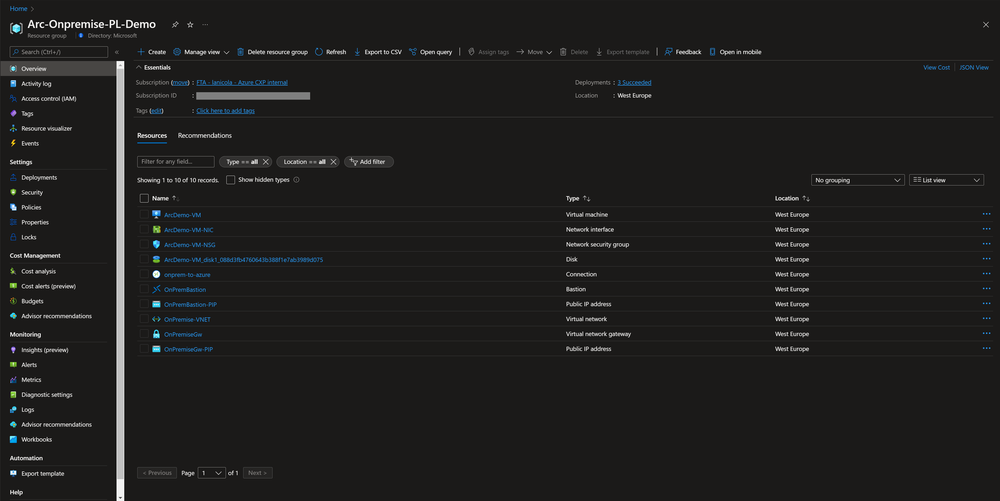
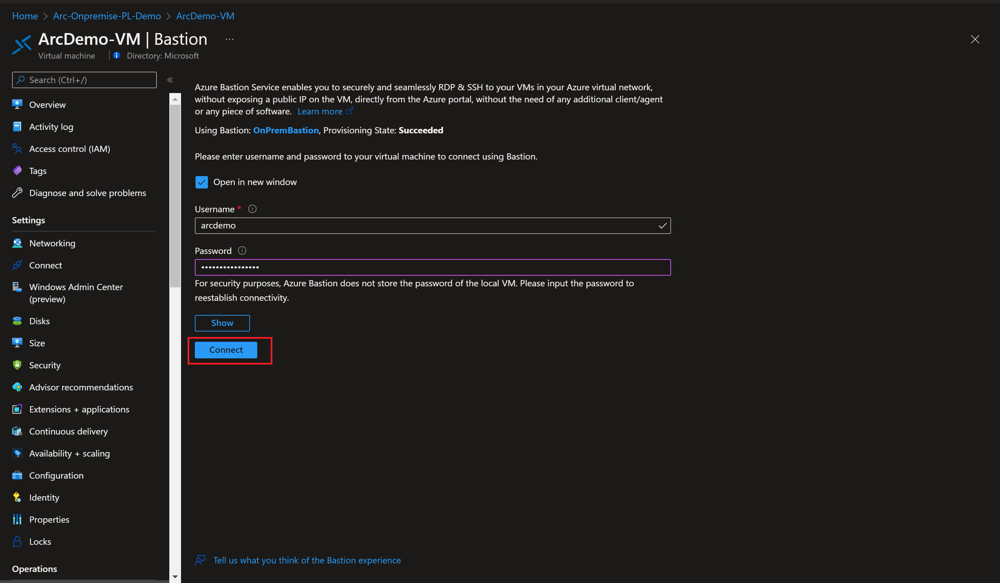
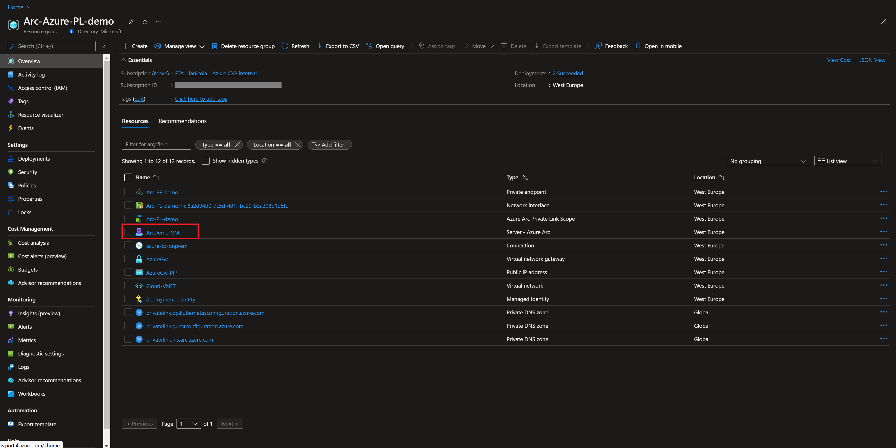
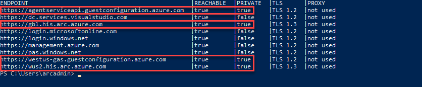
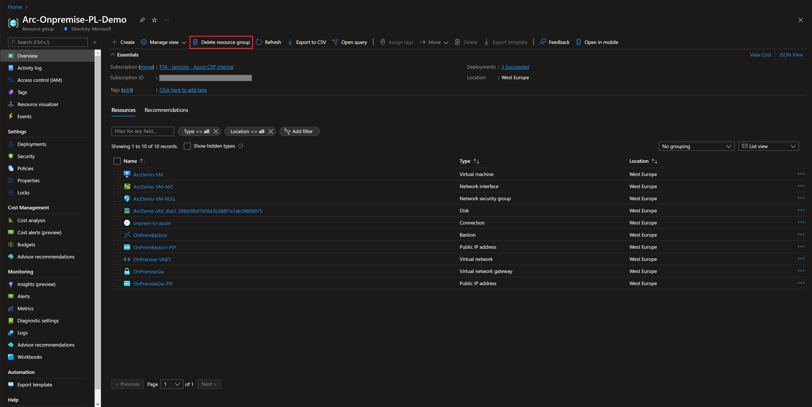
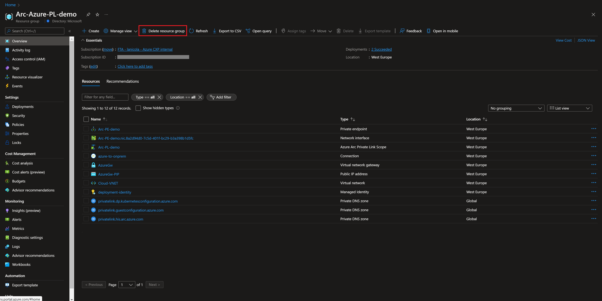

## Use Azure Private Link to securely connect networks to Azure Arc-enabled servers

The following Jumpstart scenario will guide you on how to use [Azure Private Link](https://docs.microsoft.com/azure/private-link/private-link-overview) to securely connect from an Azure Arc-enabled server to Azure using a VPN. [This feature](https://docs.microsoft.com/azure/azure-arc/servers/private-link-security) allows you to connect privately to Azure Arc without opening up public network access but rather using private endpoints over a VPN or ExpressRoute connection, ensuring that all traffic is being sent to Azure privately.

In this scenario, you will emulate a hybrid environment connected to Azure over a VPN with hybrid resources that will be Azure Arc-enabled, and Azure Private Link Scope will be used to connect over a private connection. To complete this process you deploy a single ARM template that will:

- Create two separate resource groups:

  - "On-premises" resource group will contain resources that simulate a private on-premises environment with a Windows virtual machine. This VM will not have a public IP address assigned to it so [Azure Bastion](https://docs.microsoft.com/azure/bastion/bastion-overview) is deployed to have administrative access to the operating system. The Windows virtual machine is an Azure Arc-enabled server by installing the Azure Arc connected machine agent using Azure Private Link.
  - "Azure" resource group will contain the Azure Arc-enabled server and its Private Link Scope.

- Both resource groups have their own virtual networks and address spaces, and they are connected via Azure VPN gateways to set up a hybrid private connection.

  

  > **NOTE: It is not expected for an Azure VM to be projected as an Azure Arc-enabled server. The below scenario is unsupported and should ONLY be used for demo and testing purposes.**
  > **NOTE: The below scenario assumes the on-premises VM has outbound internet connectivity for the deployment of the Azure Arc connected machine agent. For internet disconnected environments you will need to adjust the automation to retrieve the agent's software from locally accessible storage**

## Prerequisites

- [Install or update Azure CLI](https://docs.microsoft.com/cli/azure/install-azure-cli?view=azure-cli-latest). Azure CLI should be running version 2.49.0 or later. Use ```az --version``` to check your current installed version.

- Azure Arc-enabled servers depends on the following Azure resource providers in your subscription in order to use this service. Registration is an asynchronous process, and registration may take approximately 10 minutes.

  - Microsoft.HybridCompute
  - Microsoft.GuestConfiguration
  - Microsoft.HybridConnectivity

      ```shell
      az provider register --namespace 'Microsoft.HybridCompute'
      az provider register --namespace 'Microsoft.GuestConfiguration'
      az provider register --namespace 'Microsoft.HybridConnectivity'
      ```

      You can monitor the registration process with the following commands:

      ```shell
      az provider show --namespace 'Microsoft.HybridCompute'
      az provider show --namespace 'Microsoft.GuestConfiguration'
      az provider show --namespace 'Microsoft.HybridConnectivity'
      ```

- Create Azure service principal (SP). To deploy this scenario, an Azure service principal assigned with the _Contributor_ Role-based access control (RBAC) role is required. You can use Azure Cloud Shell (or other Bash shell), or PowerShell to create the service principal.

  - (Option 1) Create service principal using [Azure Cloud Shell](https://shell.azure.com/) or Bash shell with Azure CLI:

    ```shell
    az login
    subscriptionId=$(az account show --query id --output tsv)
    az ad sp create-for-rbac -n "<Unique SP Name>" --role "Contributor" --scopes /subscriptions/$subscriptionId
    ```

    For example:

    ```shell
    az login
    subscriptionId=$(az account show --query id --output tsv)
    az ad sp create-for-rbac -n "JumpstartArc" --role "Contributor" --scopes /subscriptions/$subscriptionId
    ```

    Output should look similar to this:

    ```json
    {
    "appId": "XXXXXXXXXXXXXXXXXXXXXXXXXXXX",
    "displayName": "JumpstartArc",
    "password": "XXXXXXXXXXXXXXXXXXXXXXXXXXXX",
    "tenant": "XXXXXXXXXXXXXXXXXXXXXXXXXXXX"
    }
    ```
  
  - (Option 2) Create service principal using PowerShell. If necessary, follow [this documentation](https://learn.microsoft.com/powershell/azure/install-az-ps?view=azps-8.3.0) to install Azure PowerShell modules.

    ```PowerShell
    $account = Connect-AzAccount
    $spn = New-AzADServicePrincipal -DisplayName "<Unique SPN name>" -Role "Contributor" -Scope "/subscriptions/$($account.Context.Subscription.Id)"
    echo "SPN App id: $($spn.AppId)"
    echo "SPN secret: $($spn.PasswordCredentials.SecretText)"
    ```

    For example:

    ```PowerShell
    $account = Connect-AzAccount
    $spn = New-AzADServicePrincipal -DisplayName "JumpstartArcSPN" -Role "Contributor" -Scope "/subscriptions/$($account.Context.Subscription.Id)"
    echo "SPN App id: $($spn.AppId)"
    echo "SPN secret: $($spn.PasswordCredentials.SecretText)"
    ```

    Output should look similar to this:

    

    > **NOTE: If you create multiple subsequent role assignments on the same service principal, your client secret (password) will be destroyed and recreated each time. Therefore, make sure you grab the correct password.**.

    > **NOTE: The Jumpstart scenarios are designed with as much ease of use in-mind and adhering to security-related best practices whenever possible. It is optional but highly recommended to scope the service principal to a specific [Azure subscription and resource group](https://docs.microsoft.com/cli/azure/ad/sp?view=azure-cli-latest) as well considering using a [less privileged service principal account](https://docs.microsoft.com/azure/role-based-access-control/best-practices)**

## Deployment Options and Automation Flow

This Jumpstart scenario provides multiple paths for deploying and configuring resources. Deployment options include:

- Azure portal
- ARM template via Azure CLI

For you to get familiar with the automation and deployment flow, below is an explanation.

1. User provides the ARM template parameter values, either via the portal or editing the parameters file. These parameter values are being used throughout the deployment.

2. User deploys the ARM template at subscription level. The ARM template will create two resources groups with:

    - Azure resource group, automated by the template [**cloudDeploy.json**](https://raw.githubusercontent.com/microsoft/azure_arc/main/azure_arc_servers_jumpstart/privatelink/ARM/cloudDeploy.json):
        - Azure Arc Private Link Scope
        - Azure Arc-enabled server
        - Azure Private Link Endpoint for the Azure Arc-enabled Server
        - Three Azure Private DNS zones, to overwrite Azure Arc's public endpoints DNS configuration to connect using a private endpoint
        - Azure VPN Gateway and its public IP address
        - Azure VNET

    - On-premises resource group, automated by the template [**onPremisesDeploy.json**](https://raw.githubusercontent.com/microsoft/azure_arc/main/azure_arc_servers_jumpstart/privatelink/ARM/onPremisesDeploy.json):
        - Azure VNET
        - Azure Bastion
        - Azure VPN Gateway and its public IP address
        - Azure Windows Virtual Machine with a custom script extension that runs the [**Bootstrap.ps1**](https://raw.githubusercontent.com/microsoft/azure_arc/main/azure_arc_servers_jumpstart/privatelink/artifacts/Bootstrap.ps1) script

        > **NOTE: The [_installArcAgent.ps1_](https://raw.githubusercontent.com/microsoft/azure_arc/main/azure_arc_servers_jumpstart/privatelink/artifacts/installArcAgent.ps1) script will enable the OS firewall and set up new rules for incoming and outgoing connections. By default all incoming and outgoing traffic will be allowed, except blocking Azure IMDS outbound traffic to the _169.254.169.254_ remote address.**

3. User logs in to the on-premises VM using Azure Bastion to trigger the Azure Arc onboarding script.

## Deployment Option 1: Azure portal

- Click the <a href="https://portal.azure.com/#create/Microsoft.Template/uri/https%3A%2F%2Fraw.githubusercontent.com%2Fmicrosoft%2Fazure_arc%2Fmain%2Fazure_arc_servers_jumpstart%2Fprivatelink%2Fazuredeploy.json" target="_blank"></a> button and enter values for the the ARM template parameters.

  

  

## Deployment Option 2: ARM template with Azure CLI

As mentioned, this deployment will leverage ARM templates. You will deploy a single ARM template at subscription scope that will deploy resources to the Azure's resource group as well as the "On-premises" resources that will be onboarded to Azure Arc.

- Clone the Azure Arc Jumpstart repository

    ```shell
    git clone https://github.com/microsoft/azure_arc.git
    ```

- Before deploying the ARM template, login to Azure using AZ CLI with the ```az login``` command.

- The deployment will use an ARM template parameters file to customize your environment. Before initiating the deployment, edit the [_azuredeploy.parameters.json_](https://github.com/microsoft/azure_arc/blob/main/azure_arc_servers_jumpstart/privatelink/azuredeploy.parameters.json) file located in your local cloned repository folder. Example parameters files is located [here](https://github.com/microsoft/azure_arc/blob/main/azure_arc_servers_jumpstart/privatelink/azuredeploy.example.parameters.json).

- To deploy the ARM template, navigate to the local cloned [deployment folder](https://github.com/microsoft/azure_arc/tree/main/azure_arc_servers_jumpstart/privatelink) and run the below command, start deploying resources:

    ```shell
    az deployment sub create \
    --location <Azure Region Location> \
    --template-file <The *azuredeploy.json* template file location> \
    --parameters <The *azuredeploy.parameters.json* parameters file location>
    ```

    For example:

    ```shell
    az deployment sub create \
    --location eastus \
    --template-uri https://raw.githubusercontent.com/microsoft/azure_arc/main/azure_arc_servers_jumpstart/privatelink/azuredeploy.json \
    --parameters azuredeploy.example.parameters.json
    ```

     > **NOTE: The deployment may take around 45 minutes to complete.**

- Verify the resources are created on the Azure Portal for both resource groups:

    

    

## Windows Login & Post Deployment

- Now that the Windows Server VM is created and the VPN connections are established, it is time to RDP to it using Azure Bastion.

  - On the "on-premises" resource group select the Windows VM:

    

  - Under "Connect" choose Bastion:

    

  - Provide the VM credentials and click on "Connect":

    

- At first login, as mentioned in the "Automation Flow" section, a logon script will get executed. This script was created as part of the automated deployment process.

- Let the script to run its course and **do not close** the Powershell session, this will be done for you once completed.

    > **NOTE: The script run time is ~1-2min long.**

    

- Upon successful run, a new Azure Arc-enabled server will be added to the resource group.

  

## Azure Arc-enabled server Private Link connectivity

To make sure that your Azure Arc-enabled server is using Private Link for its connection. Use your Azure Bastion session to run the command below:

  ```powershell
    azcmagent check --location <your Azure Region> --enable-pls-check --verbose
  ```

It should show private reachable connections for the agent's endpoints.

  

## Delete the deployment

The most straightforward way is to delete both resource groups:

  
  
  
