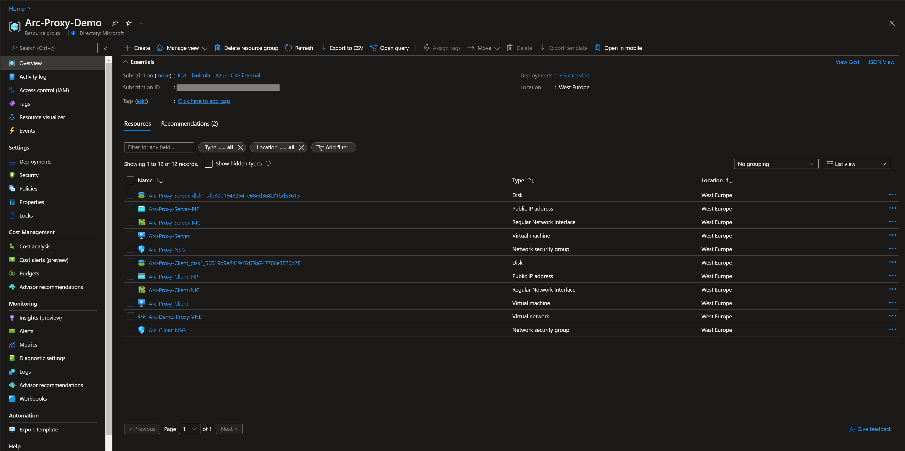

## Azure Arc-enabled servers connectivity behind a proxy server

The following Jumpstart scenario will guide you on how to configure your [Azure Arc-enabled server if the machine uses a proxy server](https://docs.microsoft.com/azure/cloud-adoption-framework/scenarios/hybrid/arc-enabled-servers/eslz-arc-servers-connectivity) to communicate over the internet.

In this scenario, you will emulate a full proxy-client configuration. The scenario will deploy both the proxy server and a client that will be Arc-enabled automatically with the agent configured to use the proxy. The automation for the proxy server deployment makes sure that the Azure Arc network service tags and IP addresses range are not blocked. To complete this process you deploy a single ARM template that will:

- Deploy two Azure Linux VMs:
  - Proxy Server.
  - Client VM.
- Two network security groups:
  - Proxy Server NSG: allows inbound connections to port 22 and 3128 (proxy's port).
  - Client VM NSG: denies all outbound connections and only allows inbound for SSH.
- Each VM will have a custom script extension deployed:
  - Proxy Server: will have a script to deploy and configure [Squid proxy](https://ubuntu.com/server/docs/proxy-servers-squid).
  - Client VM: will use the custom script extension to install and configure the Connected Machine agent using the proxy connection.

    > **NOTE: It is not expected for an Azure VM to be projected as an Azure Arc-enabled server. The below scenario is unsupported and should ONLY be used for demo and testing purposes.**

## Prerequisites

- Clone the Azure Arc Jumpstart repository

    ```shell
    git clone https://github.com/microsoft/azure_arc.git
    ```

- [Install or update Azure CLI](https://docs.microsoft.com/cli/azure/install-azure-cli?view=azure-cli-latest). Azure CLI should be running version 2.36.0 or later. Use ```az --version``` to check your current installed version.

- Azure Arc-enabled servers depends on the following Azure resource providers in your subscription in order to use this service. Registration is an asynchronous process, and registration may take approximately 10 minutes.

  - Microsoft.HybridCompute
  - Microsoft.GuestConfiguration

      ```shell
      az provider register --namespace 'Microsoft.HybridCompute'
      az provider register --namespace 'Microsoft.GuestConfiguration'
      ```

      You can monitor the registration process with the following commands:

      ```shell
      az provider show --namespace 'Microsoft.HybridCompute'
      az provider show --namespace 'Microsoft.GuestConfiguration'
      ```

## Automation Flow

For you to get familiar with the automation and deployment flow, below is an explanation.

1. User is editing the ARM template parameters file (1-time edit). These parameter values are being used throughout the deployment.

2. User deploys the ARM template at the resource group level.

3. User logs in to the Client's VM using SSH or Azure Bastion to trigger the Azure Arc onboarding script.

## Deployment

As mentioned, this deployment will leverage ARM templates. You will deploy a single ARM template at resource group scope.

- Before deploying the ARM template, login to Azure using AZ CLI with the ```az login``` command.

- The deployment will use an ARM template parameters file to customize your environment. Before initiating the deployment, edit the [_azuredeploy.parameters.json_](https://github.com/microsoft/azure_arc/blob/main/azure_arc_servers_jumpstart/proxy/azuredeploy.parameters.json) file located in your local cloned repository folder. Example parameters files are located [here](https://github.com/microsoft/azure_arc/blob/main/azure_arc_servers_jumpstart/proxy/azuredeploy.example.parameters.json). Fill out the parameters according to your environment:

  - _`vmSize`_: Client and proxy server Azure VM size.
  - _`vmName`_: Client Azure VM name.
  - _`ProxyvmName`_: Proxy server Azure VM name.
  - _`adminUsername`_: Azure VMs admin username.
  - _`adminPassword`_: A password for Client and Server.
  - _`dnsLabelPrefix`_: DNS label for the Public IP address of the client.
  - _`proxydnsLabelPrefix`_: DNS label for the Public IP address of the server.
  - _`ProxysubnetName`_: Proxy subnet name.
  - _`subnetName`_: Client subnet name.
  - _`proxyNSG`_: Proxy NSG name.
  - _`vmNSG`_: Client NSG name.
  - _`subscriptionID`_: your Subscription ID.
  - _`servicePrincipalClient`_: Service Principal AppId.
  - _`servicePrincipalClientSecret`_: Service Principal password.
  - _`tenantID`_: your tenant ID.
  - _`resourceGroup`_: your resource group.
  - _`deployBastion`_: boolean, true or false if you want to deploy bastion to connect to the VMs.
  - _`bastionHostName`_: Azure Bastion Host name.

- To deploy the ARM template, navigate to the local cloned [deployment folder](https://github.com/microsoft/azure_arc/tree/main/azure_arc_servers_jumpstart/proxy) and run the below command.

    ```shell
    az group create --name <Name of the Azure resource group> --location <Azure region> --tags "Project=jumpstart_azure_arc_servers"
    az deployment group create \
    --location <Azure Region Location> \
    --resource-group <Resource Group Name> \
    --name <Deployment Name> \
    --template-file <The *azuredeploy.json* template file location> \
    --parameters <The *azuredeploy.parameters.json* parameters file location>
    ```

    > **NOTE: make sure that you are using the same Azure resource group name as the one you’ve just used in the azuredeploy.parameters.json file**

    For example:

    ```shell
    az group create --name Arc-Proxy-Demo --location <Azure region> --tags "Project=jumpstart_azure_arc_servers" 
    az deployment group create \
    --location eastus \
    --resource-group Arc-Proxy-Demo \
    --name proxy \
    --template-uri https://raw.githubusercontent.com/microsoft/azure_arc/main/azure_arc_servers_jumpstart/azure/proxy/azuredeploy.json \
    --parameters azuredeploy.example.parameters.json
    ```

- Verify the resources are created on the Azure portal on the resource group:

    

## Linux Login & Post Deployment

- Now that the resources are created, it is time to connect to the client's VM.

- At first login, as mentioned in the "Automation Flow" section, a logon script will get executed. This script was created as part of the automated deployment process.

- Let the script to run its course and **do not close** the shell session.

    > **NOTE: The script run time is ~1-2min long.**

    

- Upon successful run, a new Azure Arc-enabled server will be added to the resource group.

  

## Azure Arc-enabled server Proxy connectivity

To make sure that your Azure Arc-enabled server is using the proxy for its connection. Connect to the server and run the command below:

  ```powershell
    sudo azcmagent.exe show
  ```

  

## Delete the deployment

The most straightforward way is to delete the resource groups:

  
