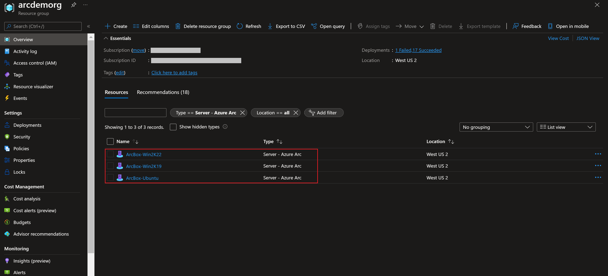
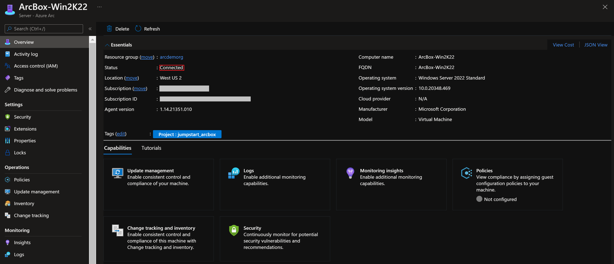

## Use Azure Policy to audit if Azure Arc-enabled servers meet security baseline requiements

The following README will guide you on how to use Azure Policy to push Azure Security Baseline to Arc-enabled Windows and Linux servers. With this feature you can now use Azure Portal to view compliance status of Azure Arc-enabled servers whether they meet security baseline requirements, and if not, why.

You can use the Azure Portal, an ARM template or PowerShell script to assign policies to Azure subscriptions or resource groups. In this guide, you will use PowerShell script to assign Azure security baseline policies.

> **NOTE: This guide assumes you already deployed VMs or servers that are running on-premises or other clouds and you have connected them to Azure Arc but If you haven't, this repository offers you a way to do so in an automated fashion:**

- **[GCP Ubuntu instance](https://azurearcjumpstart.io/azure_arc_jumpstart/azure_arc_servers/gcp/gcp_terraform_ubuntu/)**
- **[GCP Windows instance](https://azurearcjumpstart.io/azure_arc_jumpstart/azure_arc_servers/gcp/gcp_terraform_windows/)**
- **[AWS Ubuntu EC2 instance](https://azurearcjumpstart.io/azure_arc_jumpstart/azure_arc_servers/aws/aws_terraform_ubuntu/)**
- **[AWS Amazon Linux 2 EC2 instance](https://azurearcjumpstart.io/azure_arc_jumpstart/azure_arc_servers/aws/aws_terraform_al2/)**
- **[Azure Ubuntu VM](https://azurearcjumpstart.io/azure_arc_jumpstart/azure_arc_servers/azure/azure_arm_template_linux/)**
- **[Azure Windows VM](https://azurearcjumpstart.io/azure_arc_jumpstart/azure_arc_servers/azure/azure_arm_template_win/)**
- **[VMware vSphere Ubuntu VM](https://azurearcjumpstart.io/azure_arc_jumpstart/azure_arc_servers/vmware/vmware_terraform_ubuntu/)**
- **[VMware vSphere Windows Server VM](https://azurearcjumpstart.io/azure_arc_jumpstart/azure_arc_servers/vmware/vmware_terraform_winsrv/)**
- **[Vagrant Ubuntu box](https://azurearcjumpstart.io/azure_arc_jumpstart/azure_arc_servers/vagrant/local_vagrant_ubuntu/)**
- **[Vagrant Windows box](https://azurearcjumpstart.io/azure_arc_jumpstart/azure_arc_servers/vagrant/local_vagrant_windows/)**

## Prerequisites

- As mentioned, this guide starts at the point where you already deployed and connected VMs or servers to Azure Arc. In the screenshots below we can see two Windows servers and one Linux server have been connected with Azure Arc and are visible as resources in Azure.

    

    

## Azure Security Basline on Azure Arc connected machines

- Now you can assign Azure security baseline policies to your Arc connected machines. Note that there are different policies for Windows and Linux machines.

  To start the deployment on your Arc connected Windows machines, use the below command:

  ```powershell
  $policy=Get-AzPolicyDefinition -Name '72650e9f-97bc-4b2a-ab5f-9781a9fcecbc'
  $ResourceGroup = Get-AzResourceGroup -Name '<Name of the Azure resource group>'
  $Parameter= @{'IncludeArcMachines'=('true')}

  New-AzPolicyAssignment -Name 'Windows machines should meet requirements of the Azure compute security baseline' -PolicyDefinition $Policy -Scope $ResourceGroup.ResourceId -Location '<Azure Region>' -IdentityType 'SystemAssigned' -PolicyParameterObject $Parameter
  ```

  To start the deployment on your Arc connected Linux machines, use the below command:

  ```powershell
  $policy=Get-AzPolicyDefinition -Name 'fc9b3da7-8347-4380-8e70-0a0361d8dedd'
  $ResourceGroup = Get-AzResourceGroup -Name '<Name of the Azure resource group>'
  $Parameter= @{'IncludeArcMachines'=('true')}

  New-AzPolicyAssignment -Name 'Linux machines should meet requirements for the Azure compute security baseline' -PolicyDefinition $Policy -Scope $ResourceGroup.ResourceId -Location '<Azure Region>' -IdentityType 'SystemAssigned' -PolicyParameterObject $Parameter
  ```

- Once the policy is assigned, it takes around 30 minutes for the assignment to be applied to the defined scope. After those 30 minutes, Azure Policy will start the evaluation cycle against the Azure Arc connected machines and recognize them as "Compliant" or "Non-compliant" to the Azure security baseline. To check this, go to the Compliance section under Policy.

  

- Now, you can view the evaluated details of why an Azure Arc-enabled server is not compliant with security baselines.

  
  
  

## Cleanup

Complete the following steps to clean up your environment.

Remove the virtual machines from each environment by following the teardown instructions from each guide.

- **[GCP Ubuntu instance](https://azurearcjumpstart.io/azure_arc_jumpstart/azure_arc_servers/gcp/gcp_terraform_ubuntu/)**
- **[GCP Windows instance](https://azurearcjumpstart.io/azure_arc_jumpstart/azure_arc_servers/gcp/gcp_terraform_windows/)**
- **[AWS Ubuntu EC2 instance](https://azurearcjumpstart.io/azure_arc_jumpstart/azure_arc_servers/aws/aws_terraform_ubuntu/)**
- **[AWS Amazon Linux 2 EC2 instance](https://azurearcjumpstart.io/azure_arc_jumpstart/azure_arc_servers/aws/aws_terraform_al2/)**
- **[Azure Ubuntu VM](https://azurearcjumpstart.io/azure_arc_jumpstart/azure_arc_servers/azure/azure_arm_template_linux/)**
- **[Azure Windows VM](https://azurearcjumpstart.io/azure_arc_jumpstart/azure_arc_servers/azure/azure_arm_template_win/)**
- **[VMware vSphere Ubuntu VM](https://azurearcjumpstart.io/azure_arc_jumpstart/azure_arc_servers/vmware/vmware_terraform_ubuntu/)**
- **[VMware vSphere Windows Server VM](https://azurearcjumpstart.io/azure_arc_jumpstart/azure_arc_servers/vmware/vmware_terraform_winsrv/)**
- **[Vagrant Ubuntu box](https://azurearcjumpstart.io/azure_arc_jumpstart/azure_arc_servers/vagrant/local_vagrant_ubuntu/)**
- **[Vagrant Windows box](https://azurearcjumpstart.io/azure_arc_jumpstart/azure_arc_servers/vagrant/local_vagrant_windows/)**

Remove the Azure security baseline policy assignments by executing the powershell script

```powershell
$ResourceGroup = Get-AzResourceGroup -Name '<Name of the Azure resource group>'

Remove-AzPolicyAssignment -Name 'Windows machines should meet requirements of the Azure compute security baseline' -Scope $ResourceGroup.ResourceId -Confirm

Remove-AzPolicyAssignment -Name 'Linux machines should meet requirements for the Azure compute security baseline' -Scope $ResourceGroup.ResourceId -Confirm
```
