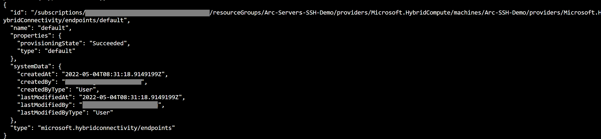
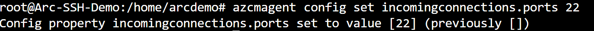
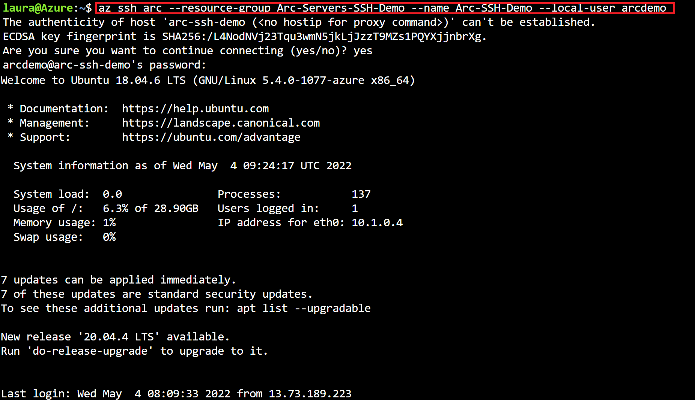

## Enable SSH access to Azure Arc-enabled servers

The following Jumpstart scenario will guide you on how to enable [SSH access to Azure Arc-enabled servers](https://docs.microsoft.com/en-us/azure/azure-arc/servers/ssh-arc-overview), this feature allows you to connect over SSH to your Arc-enabled servers both Linux and Windows without requiring a public IP address or additional open ports.

> **NOTE: SSH for Arc-enabled servers is currently in Preview**

> **NOTE: This guide assumes you already deployed VMs or servers that are running on-premises or other clouds and you have connected them to Azure Arc but if you haven't, this repository offers you a way to do so in an automated fashion:**

- **[GCP Ubuntu instance](https://azurearcjumpstart.io/azure_arc_jumpstart/azure_arc_servers/gcp/gcp_terraform_ubuntu/)**
- **[GCP Windows instance](https://azurearcjumpstart.io/azure_arc_jumpstart/azure_arc_servers/gcp/gcp_terraform_windows/)**
- **[AWS Ubuntu EC2 instance](https://azurearcjumpstart.io/azure_arc_jumpstart/azure_arc_servers/aws/aws_terraform_ubuntu/)**
- **[AWS Amazon Linux 2 EC2 instance](https://azurearcjumpstart.io/azure_arc_jumpstart/azure_arc_servers/aws/aws_terraform_al2/)**
- **[Azure Ubuntu VM](https://azurearcjumpstart.io/azure_arc_jumpstart/azure_arc_servers/azure/azure_arm_template_linux/)**
- **[Azure Windows VM](https://azurearcjumpstart.io/azure_arc_jumpstart/azure_arc_servers/azure/azure_arm_template_win/)**
- **[VMware vSphere Ubuntu VM](https://azurearcjumpstart.io/azure_arc_jumpstart/azure_arc_servers/vmware/vmware_terraform_ubuntu/)**
- **[VMware vSphere Windows Server VM](https://azurearcjumpstart.io/azure_arc_jumpstart/azure_arc_servers/vmware/vmware_terraform_winsrv/)**
- **[Vagrant Ubuntu box](https://azurearcjumpstart.io/azure_arc_jumpstart/azure_arc_servers/vagrant/local_vagrant_ubuntu/)**
- **[Vagrant Windows box](https://azurearcjumpstart.io/azure_arc_jumpstart/azure_arc_servers/vagrant/local_vagrant_windows/)**

## Prerequisites

- Clone the Azure Arc Jumpstart repository

    ```shell
    git clone https://github.com/microsoft/azure_arc.git
    ```

- [Install or update Azure CLI to version 2.42.0 and above](https://docs.microsoft.com/cli/azure/install-azure-cli?view=azure-cli-latest). Use the below command to check your current installed version.

- Create Azure service principal (SP)

    To be able to complete the scenario and its related automation, Azure service principal assigned with the “Contributor” role is required. To create it, login to your Azure account run the below command (this can also be done in [Azure Cloud Shell](https://shell.azure.com/)).

    ```shell
    az login
    subscriptionId=$(az account show --query id --output tsv)
    az ad sp create-for-rbac -n "<Unique SP Name>" --role "Contributor" --scopes /subscriptions/$subscriptionId
    ```

    For example:

    ```shell
    az login
    subscriptionId=$(az account show --query id --output tsv)
    az ad sp create-for-rbac -n "JumpstartArc" --role "Contributor" --scopes /subscriptions/$subscriptionId
    ```

    Output should look like this:

    ```json
    {
    "appId": "XXXXXXXXXXXXXXXXXXXXXXXXXXXX",
    "displayName": "JumpstartArc",
    "password": "XXXXXXXXXXXXXXXXXXXXXXXXXXXX",
    "tenant": "XXXXXXXXXXXXXXXXXXXXXXXXXXXX"
    }
    ```

    > **NOTE: If you create multiple subsequent role assignments on the same service principal, your client secret (password) will be destroyed and recreated each time. Therefore, make sure you grab the correct password**.

    > **NOTE: The Jumpstart scenarios are designed with as much ease of use in-mind and adhering to security-related best practices whenever possible. It is optional but highly recommended to scope the service principal to a specific [Azure subscription and resource group](https://docs.microsoft.com/cli/azure/ad/sp?view=azure-cli-latest) as well considering using a [less privileged service principal account](https://docs.microsoft.com/azure/role-based-access-control/best-practices)**

- Azure Arc-enabled servers SSH feature depends on the following Azure resource provider in your subscription in order to use this service. Registration is an asynchronous process, and registration may take approximately 10 minutes.

  - Microsoft.HybridCompute
  - Microsoft.GuestConfiguration
  - Microsoft.HybridConnectivity
  
      ```shell
      az provider register --namespace 'Microsoft.HybridCompute'
      az provider register --namespace 'Microsoft.GuestConfiguration'
      az provider register --namespace 'Microsoft.HybridConnectivity'

      ```

      You can monitor the registration process with the following commands:

      ```shell
      az provider show --namespace 'Microsoft.HybridCompute'
      az provider show --namespace 'Microsoft.GuestConfiguration'
      az provider show --namespace 'Microsoft.HybridConnectivity'
      ```

## Automation Flow

For you to get familiar with the automation and deployment flow, below is an explanation.

1. User is editing the shell script (1-time edit) environment variables section. These environment values are being used throughout the deployment.

2. User runs the shell script. The script will:

    - Add the required CLI extensions
    - Create the default connectivity endpoint

3. User connects to the Arc-enabled server and enables connections on the hybrid agent.

4. User tests SSH connection.

## Deployment

- To run the automation, navigate to the [deployment folder](https://github.com/microsoft/azure_arc/tree/main/azure_arc_servers_jumpstart/ssh) and edit the environment section of the [shell script](https://github.com/microsoft/azure_arc/tree/main/azure_arc_servers_jumpstart/ssh/enable_ssh.sh)

  - _`subscription`_: your Azure subscription ID.
  - _`resourceGroup`_: Resource Group where your Azure Arc-enabled server is registered to.
  - _`arcServer`_: Name of your Azure Arc-enabled server as it is shown in the Azure Portal.

    

- From the deployment folder run the below command:

  ```shell
    . ./enable_ssh.sh
  ```

  > **NOTE: The extra dot is due to the script having an _export_ function and needs to have the vars exported in the same shell session as the other commands.**

    

- It is required to connect to the Azure Arc-enabled server for allowing connectivity to the Connected Machine agent. To do that, connect to the server and open an administrative session and run the below command.

  ```shell
    azcmagent config set incomingconnections.ports 22
  ```

    

## SSH connection test

- Once the script has finished its run, you should be able to connect via SSH to the Azure Arc-enabled server by running the below command.

  ```shell
    az ssh arc --resource-group <resource_group> --name <arc_enabled_server> --local-user <username>
  ```

    

  > **NOTE: if your Arc-enabled server uses other authentication methods make sure to review the [_az ssh arc_ documentation](https://docs.microsoft.com/cli/azure/ssh?view=azure-cli-latest#az-ssh-arc).**

## Cleanup

To disable SSH access to an Azure Arc-enabled server, run the below command.

  ```shell
  az rest --method delete --uri https://management.azure.com/subscriptions/<subscription>/resourceGroups/<resourcegroup>/providers/Microsoft.HybridCompute/machines/<arc enabled server name>/providers/Microsoft.HybridConnectivity/endpoints/default?api-version=2021-10-06-preview
  ```

On the Azure Arc-enabled-server's operating system, remove the configured port by running the below command on the server:

  ```shell
  azcmagent config set incomingconnections.ports ""
  ```
