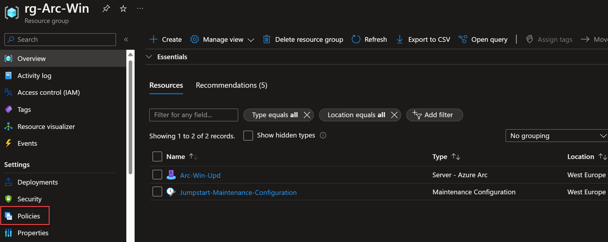

## Onboard Azure Arc-enabled servers to Update Management Center

The following Jumpstart scenario will guide you on how to onboard Azure Arc-enabled servers to [Update Management Center](https://learn.microsoft.com/azure/update-center/overview).

Update management center  is a unified service to help manage and govern updates for all your machines. You can monitor Windows and Linux update compliance across your deployments in Azure, on-premises, and on the other cloud platforms from a single dashboard. Using Update management center, you can make updates in real-time or schedule them within a defined maintenance window.

> **NOTE: This scenario assumes you already deployed VMs or servers that are running on-premises or other clouds and you have connected them to Azure Arc. If you haven't, this repository offers you a way to do so in an automated fashion:**

- **[GCP Ubuntu instance](https://azurearcjumpstart.io/azure_arc_jumpstart/azure_arc_servers/gcp/gcp_terraform_ubuntu/)**
- **[GCP Windows instance](https://azurearcjumpstart.io/azure_arc_jumpstart/azure_arc_servers/gcp/gcp_terraform_windows/)**
- **[AWS Ubuntu EC2 instance](https://azurearcjumpstart.io/azure_arc_jumpstart/azure_arc_servers/aws/aws_terraform_ubuntu/)**
- **[AWS Amazon Linux 2 EC2 instance](https://azurearcjumpstart.io/azure_arc_jumpstart/azure_arc_servers/aws/aws_terraform_al2/)**
- **[Azure Ubuntu VM](https://azurearcjumpstart.io/azure_arc_jumpstart/azure_arc_servers/azure/azure_arm_template_linux/)**
- **[Azure Windows VM](https://azurearcjumpstart.io/azure_arc_jumpstart/azure_arc_servers/azure/azure_arm_template_win/)**
- **[VMware vSphere Ubuntu VM](https://azurearcjumpstart.io/azure_arc_jumpstart/azure_arc_servers/vmware/vmware_terraform_ubuntu/)**
- **[VMware vSphere Windows Server VM](https://azurearcjumpstart.io/azure_arc_jumpstart/azure_arc_servers/vmware/vmware_terraform_winsrv/)**
- **[Vagrant Ubuntu box](https://azurearcjumpstart.io/azure_arc_jumpstart/azure_arc_servers/vagrant/local_vagrant_ubuntu/)**
- **[Vagrant Windows box](https://azurearcjumpstart.io/azure_arc_jumpstart/azure_arc_servers/vagrant/local_vagrant_windows/)**

Please review the [Update Management Center supported OS documentation](https://learn.microsoft.com/azure/update-center/support-matrix?tabs=azurevm%2Cazurearc-os#supported-operating-systems) and ensure that the VMs you will use for this exercise are supported.

## Prerequisites

- As mentioned, this scenario starts at the point where you already deployed and connected VMs or servers to Azure Arc. In the screenshots below, you can see a Windows and a Linux server that have been connected with Azure Arc and are visible as resources in Azure.

    

- [Install or update Azure CLI](https://docs.microsoft.com/cli/azure/install-azure-cli?view=azure-cli-latest). Azure CLI should be running version 2.14 or later. Use ```az --version``` to check your current installed version.

- To complete this scenario, the user or service principal running the automation need these minimum RBAC permissions: *Resource Policy Contributor* and *Microsoft.Resources/deployments/** on the resource group where you have your Azure Arc-enabled servers.

## Deployment Options and Automation Flow

This Jumpstart scenario provides multiple paths for deploying and configuring resources. Deployment options include:

- Azure portal
- ARM template via Azure CLI

The steps below will help you get familiar with the automation and deployment flow.

1. User provides the ARM template parameter values, either via the portal or editing the parameters file. These parameter values are being used throughout the deployment.

2. User deploys the ARM template at the resource group level.

3. User is verifying the successful template deployment.

## Deployment Option 1: Azure portal

- Click the <a href="https://portal.azure.com/#create/Microsoft.Template/uri/https%3A%2F%2Fraw.githubusercontent.com%2Fmicrosoft%2Fazure_arc%2Fmain%2Fazure_arc_servers_jumpstart%2Fazuremonitoragent%2Fama-windows-template.json" target="_blank"></a> button and enter values for the the ARM template parameters.

  

  

- To match your configuration you will need to provide:

  - The **subscription**, **resource group**, **Computer name** and **location** where you registered the Azure Arc-enabled server:

    

  - The **Log Analytics workspace name** that will be created.

## Deployment Option 2: ARM template with Azure CLI

As mentioned, this deployment will leverage ARM templates.

- Clone the Azure Arc Jumpstart repository

    ```shell
    git clone https://github.com/microsoft/azure_arc.git
    ```

- Edit the [*parameters file*](https://github.com/microsoft/azure_arc/blob/main/azure_arc_servers_jumpstart/updatemanagementcenter/update-management-center.parameters.json) providing the values that match your configuration as described above.

    

  > **NOTE: For the *maintenanceTimeZone* parameter, the list of timezones can be obtained by executing [System.TimeZoneInfo]::GetSystemTimeZones() in PowerShell. Example: Pacific Standard Time, Romance Standard Time, Middle East Standard Time.**

- Deploy the [*ARM template*](https://github.com/microsoft/azure_arc/blob/main/azure_arc_servers_jumpstart/updatemanagementcenter/update-management-center-template.json) by running the following command, specifying the resource group where you have your Azure Arc-enabled servers:

    ```shell
    az deployment group create --resource-group <Name of the Azure resource group> \
    --template-file <The update-management-center-template.json template file location> \
    --parameters <The update-management-center.parameters.json template file location>
    ```

- Once the template has completed its run, you should see an output as follows:

    

## Update Assessment

In the resource group that you specified as a parameter, there will be a new policy assignment, *(jumpstart) Configure periodic checking for missing system updates on azure Arc-enabled servers*. This policy, once it's remediated, enables Periodic Assessment. Periodic Assessment is a setting on your machine that enables you to see the latest updates available for your machines and removes the hassle of performing assessment manually every time you need to check the update status. Once you enable this setting, update management center fetches updates on your machine once every 24 hours.

- Go to your **resource group** and click on **Policies**:

    

- You will see the *(jumpstart) Configure periodic checking for missing system updates on azure Arc-enabled servers* policy assigned. Then, click on **Remediation**:

    

- Right click on the policy *(jumpstart) Configure periodic checking for missing system updates on azure Arc-enabled servers* policy assigned. Then, click on **Remediate**:

    

- You will see your Azure Arc-enabled server as a resource to be remediated. Click on the **Remediate** button:

    

- You can see the status of the **Remediation task** and the number of resources remediated:

    

mostrar extensions instaladas. if you click on extensions...

mostrar updates de la maquina encontradas

mostrar el history

## Update Deployment

On the other hand, a new **Maintenance Configuration** resource is created, which allows you to schedule recurring update deployments on your Azure Arc-enabled servers.

- Go to your **resource group** and click on the new **Maintenance Configuration** resource:

    

- Review the following **Maintenance Configuration** settings: **Machines**, which include the Azure Arc-enabled server; **Schedule** of the maintenance configuration resource (it will start one day after you deploy this scenario); and **Updates** settings:

    

    

    

MOSTRAR VISTA GENERAL UPDATE MANAGEMENT CENTER

## Clean up environment

Complete the following steps to clean up your environment:

- [Remove Data Collection Rule Association](https://docs.microsoft.com/powershell/module/az.monitor/remove-azdatacollectionruleassociation?view=azps-8.1.0)
- [Remove Data Collection Rule](https://docs.microsoft.com/powershell/module/az.monitor/remove-azdatacollectionrule?view=azps-8.1.0)
- [Uninstall Azure Monitor Agent (AMA)](https://docs.microsoft.com/azure/azure-monitor/agents/azure-monitor-agent-manage?tabs=ARMAgentPowerShell%2CPowerShellWindows%2CPowerShellWindowsArc%2CCLIWindows%2CCLIWindowsArc#uninstall-on-azure-arc-enabled-servers)
- [Delete the Log Analytics workspace](https://docs.microsoft.com/en-us/azure/azure-monitor/logs/delete-workspace#powershell)
