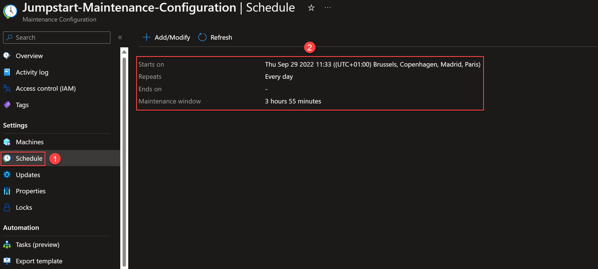
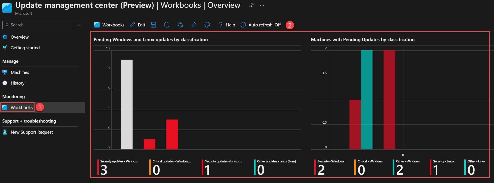

## Onboard Azure Arc-enabled servers to Update Management Center

The following Jumpstart scenario will guide you on how to onboard Azure Arc-enabled servers to [Update Management Center](https://learn.microsoft.com/azure/update-center/overview).

> **NOTE: Currently, Update Management Center is in public preview.**

Update Management Center is a unified service to help manage and govern updates for all your machines. You can monitor Windows and Linux update compliance across your deployments in Azure, on-premises, and on the other cloud platforms from a single dashboard. Using Update Management Center, you can make updates in real-time or schedule them within a defined maintenance window.

> **NOTE: This scenario assumes you already deployed VMs or servers that are running on-premises or other clouds and you have connected them to Azure Arc. If you haven't, this repository offers you a way to do so in an automated fashion:**

- **[GCP Ubuntu instance](https://azurearcjumpstart.io/azure_arc_jumpstart/azure_arc_servers/gcp/gcp_terraform_ubuntu/)**
- **[GCP Windows instance](https://azurearcjumpstart.io/azure_arc_jumpstart/azure_arc_servers/gcp/gcp_terraform_windows/)**
- **[AWS Ubuntu EC2 instance](https://azurearcjumpstart.io/azure_arc_jumpstart/azure_arc_servers/aws/aws_terraform_ubuntu/)**
- **[AWS Amazon Linux 2 EC2 instance](https://azurearcjumpstart.io/azure_arc_jumpstart/azure_arc_servers/aws/aws_terraform_al2/)**
- **[Azure Ubuntu VM](https://azurearcjumpstart.io/azure_arc_jumpstart/azure_arc_servers/azure/azure_arm_template_linux/)**
- **[Azure Windows VM](https://azurearcjumpstart.io/azure_arc_jumpstart/azure_arc_servers/azure/azure_arm_template_win/)**
- **[VMware vSphere Ubuntu VM](https://azurearcjumpstart.io/azure_arc_jumpstart/azure_arc_servers/vmware/vmware_terraform_ubuntu/)**
- **[VMware vSphere Windows Server VM](https://azurearcjumpstart.io/azure_arc_jumpstart/azure_arc_servers/vmware/vmware_terraform_winsrv/)**
- **[Vagrant Ubuntu box](https://azurearcjumpstart.io/azure_arc_jumpstart/azure_arc_servers/vagrant/local_vagrant_ubuntu/)**
- **[Vagrant Windows box](https://azurearcjumpstart.io/azure_arc_jumpstart/azure_arc_servers/vagrant/local_vagrant_windows/)**

Please review the [Update Management Center supported OS documentation](https://learn.microsoft.com/azure/update-center/support-matrix?tabs=azurevm%2Cazurearc-os#supported-operating-systems) and ensure that the VMs you will use for this exercise are supported.

## Prerequisites

- As mentioned, this scenario starts at the point where you already deployed and connected VMs or servers to Azure Arc. In the screenshot below, you can see a Windows and a Linux server that have been connected with Azure Arc and are visible as resources in Azure:

    

- [Install or update Azure CLI](https://docs.microsoft.com/cli/azure/install-azure-cli?view=azure-cli-latest). Azure CLI should be running version 2.49.0 or later. Use ```az --version``` to check your current installed version.

- To complete this scenario, the user or service principal running the automation need these minimum Role-based access control (RBAC) permissions: _Resource Policy Contributor_ and _Microsoft.Resources/deployments/_ on the resource group where you have your Azure Arc-enabled servers.

## Deployment Options and Automation Flow

This Jumpstart scenario provides multiple paths for deploying and configuring resources. Deployment options include:

- Azure portal
- ARM template via Azure CLI

The steps below will help you get familiar with the automation and deployment flow:

1. User provides the ARM template parameter values, either via the portal or editing the parameters file. These parameter values are being used throughout the deployment.

2. User deploys the ARM template at the resource group level.

3. User is verifying the successful template deployment.

## Deployment Option 1: Azure portal

- Click the <a href="https://portal.azure.com/#create/Microsoft.Template/uri/https%3A%2F%2Fraw.githubusercontent.com%2Fmicrosoft%2Fazure_arc%2Fmain%2Fazure_arc_servers_jumpstart%2FupdateManagementCenter%2Fupdate-management-center-template.json" target="_blank"></a> button and enter values for just the ARM template parameters highlighted below. For more information about these parameters, see their description provided in the [parameters file](https://github.com/microsoft/azure_arc/blob/main/azure_arc_servers_jumpstart/updateManagementCenter/update-management-center.parameters.json).

  

## Deployment Option 2: ARM template with Azure CLI

As mentioned, this deployment will leverage ARM templates.

- Clone the Azure Arc Jumpstart repository

    ```shell
    git clone https://github.com/microsoft/azure_arc.git
    ```

- Edit the [parameters file](https://github.com/microsoft/azure_arc/blob/main/azure_arc_servers_jumpstart/updateManagementCenter/update-management-center.parameters.json) providing the values that match your configuration as described below:

    

  > **NOTE: For the _maintenanceTimeZone_ parameter, the list of time zones can be obtained by executing _[System.TimeZoneInfo]::GetSystemTimeZones()_ in PowerShell. Example: Pacific Standard Time, Romance Standard Time, Middle East Standard Time.**

- Deploy the [ARM template](https://github.com/microsoft/azure_arc/blob/main/azure_arc_servers_jumpstart/updateManagementCenter/update-management-center-template.json) by running the following command, specifying the resource group where you have your Azure Arc-enabled servers:

    ```shell
    az deployment group create --resource-group <Name of the Azure resource group> \
    --template-file <The update-management-center-template.json template file location> \
    --parameters <The update-management-center.parameters.json template file location>
    ```

- Once the template has completed its run, you should see an output as follows:

    

## Update Assessment

In the resource group that you specified as a parameter, there will be a new policy assignment named "_(jumpstart) Configure periodic checking for missing system updates on azure Arc-enabled servers_". This policy, once it's remediated, enables Periodic Assessment.

Periodic Assessment is a setting on your machine that enables you to see the latest updates available for your machines and removes the hassle of performing assessment manually every time you need to check the update status. Once you enable this setting, Update Management Center fetches updates on your machine once every 24 hours.

- Go to your **resource group** and click on **Policies**:

    

- You will see the _(jumpstart) Configure periodic checking for missing system updates on azure Arc-enabled servers_ policy assigned. Then, click on **Remediation**:

    

- Right click on the policy _(jumpstart) Configure periodic checking for missing system updates on azure Arc-enabled servers_ policy assigned. Then, click on **Remediate**:

    

- You will see your Azure Arc-enabled server as a resource to be remediated. Click on the **Remediate** button:

    

- You can see the status of the **Remediation task** and the number of resources remediated:

    

  > **NOTE: You will need to wait some time until the first update assessment is run.**

- On the update assessment task is run, go back to your **Azure Arc-enabled server** and click on **Extensions**, you will see that a new extension has been installed. Update Management Center relies on this Azure extension designed to provide all the functionality required to interact with the operating system to manage the assessment and application of updates.

    

- Click on **Updates**. Under **Recommended updates**, you will see which are the missing updates on this machine:

    

- If you click on the **History** tab, you will see the details related to the updates assessment and operations:

    

## Update Deployment

As part of this scenario, a new **Maintenance Configuration** resource is created. It allows you to schedule recurring updates deployments on your Azure Arc-enabled servers.

- Go to your **resource group** and click on the new **Maintenance Configuration** resource:

    

- Review the following **Maintenance Configuration** settings: **Machines**, which includes the Azure Arc-enabled server; **Schedule** of the maintenance configuration resource (it will start one day after you deploy this scenario), and **Updates** settings:

    

    

    

- Once the **Schedule** triggers the **Maintenance Configuration**, you will be able to see the results. Go back to your **Azure Arc-enabled server**, click on **Updates**, and then on **History**:

    

    

## Update Management Center

From the **Update Management Center**, you can oversee the update compliance for your entire fleet of machines in Azure, on-premises, and other cloud environments.
You can also instantly deploy critical updates to help secure your machines.

- On the top bar search, type **Update Management Center** and click on it:

    

- The **Overview** blade shows you the current updates status of your hybrid environment:

    

- If you click on **Machines**, you will get more details per each individual machine:

    

- Moreover, **History** shows you all the updates activities on your hybrid environment:

    

- Lastly, under the **Workbooks** section, there is a built-in workbook that provides an unified view for your current updates status:

    

## Clean up environment

Complete the following steps to clean up your environment:

- [Delete the Azure Policy Assignment](https://learn.microsoft.com/cli/azure/policy/assignment?view=azure-cli-latest#az-policy-assignment-delete)

  - First, get the Policy assignment name from its Assignment ID:
  
    

  - Run the following command:

    ```shell
    az policy assignment delete \
    --name <Policy Assignment ID> \
    --scope <Resource Group ID>
    ```

- [Delete the maintenance configuration](https://learn.microsoft.com/azure/virtual-machines/maintenance-configurations-cli#delete-a-maintenance-configuration)

  - Run the following command:
  
    ```shell
    az maintenance configuration delete \
    --subscription <Subscription ID> \
    -g <Name of the Azure resource group> \
    --resource-name <Name of the maintenance configuration resource>
    ```

- [Remove the extensions on Azure Arc-enabled server](https://learn.microsoft.com/azure/azure-arc/servers/manage-vm-extensions-cli#remove-extensions)

  - For **Windows** machines, run the following two commands:
  
    ```shell
    az connectedmachine extension delete \
    --machine-name <Name of the Azure Arc-enabled server> \
    --name "WindowsPatchExtension" \
    -g <Name of the Azure resource group>
    ```

    ```shell
    az connectedmachine extension delete \
    --machine-name <Name of the Azure Arc-enabled server> \
    --name "WindowsOsUpdateExtension" \
    -g <Name of the Azure resource group>
    ```

  - For **Linux** machines, run the following two commands:
  
    ```shell
    az connectedmachine extension delete \
    --machine-name <Name of the Azure Arc-enabled server> \
    --name "LinuxPatchExtension" \
    -g <Name of the Azure resource group>
    ```

    ```shell
    az connectedmachine extension delete \
    --machine-name <Name of the Azure Arc-enabled server> \
    --name "LinuxOsUpdateExtension" \
    -g <Name of the Azure resource group>
    ```