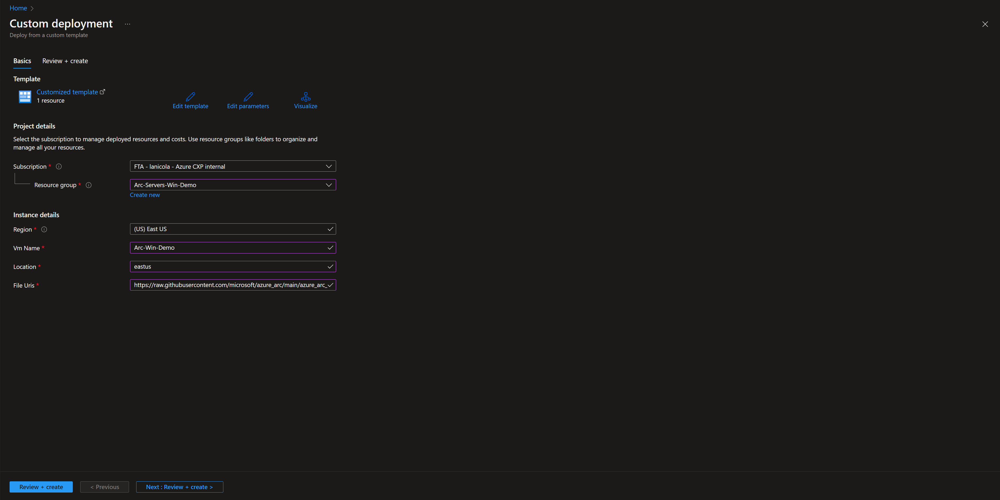
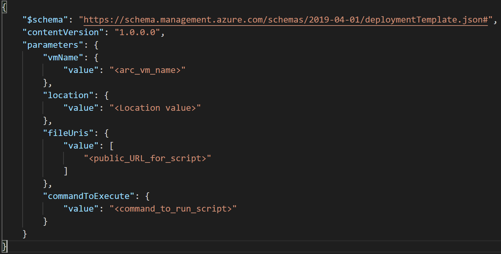

## Deploying Custom Script Extension to Azure Arc Linux and Windows VMs using Extension Management

The following README will guide you on how to execute custom scripts on Azure Arc enabled servers by using Virtual Machine extensions. Virtual machine extensions are small applications that provide post-deployment configuration and automation tasks such as software installation, anti-virus protection, or a mechanism to run a custom script.

You can use the Azure portal, Azure CLI, an ARM template, PowerShell or Linux Shell script, or Azure policies to manage the extension deployment to Azure Arc enabled servers. In this guide, we will use an ARM template to deploy the custom script extension. This extension downloads and executes scripts on virtual machines and it is useful for post deployment configuration, software installation, or any other configuration or management tasks.

> **Note: This guide assumes you already deployed VMs or servers that are running on-premises or other clouds and you have connected them to Azure Arc.**

**If you haven't, this repository offers you a way to do so in an automated fashion:**

* **[GCP Ubuntu VM](https://github.com/microsoft/azure_arc/blob/main/docs/azure_arc_jumpstart/azure_arc_servers/gcp/gcp_terraform_ubuntu/_index.md) / [GCP Windows VM](https://github.com/microsoft/azure_arc/blob/main/docs/azure_arc_jumpstart/azure_arc_servers/gcp/gcp_terraform_windows/_index.md)**
* **[AWS Ubuntu VM](https://github.com/microsoft/azure_arc/blob/main/docs/azure_arc_jumpstart/azure_arc_servers/aws/aws_terraform_ubuntu/_index.md)**
* **[VMware Ubuntu VM](https://github.com/microsoft/azure_arc/blob/main/docs/azure_arc_jumpstart/azure_arc_servers/vmware/vmware_terraform_ubuntu/_index.md) / [VMware Windows Server VM](https://github.com/microsoft/azure_arc/blob/main/docs/azure_arc_jumpstart/azure_arc_servers/vmware/vmware_terraform_winsrv/_index.md)**
* **[Local Ubuntu VM](https://github.com/microsoft/azure_arc/blob/main/docs/azure_arc_jumpstart/azure_arc_servers/vagrant/local_vagrant_ubuntu/_index.md) / [Local Windows VM](https://github.com/microsoft/azure_arc/blob/main/docs/azure_arc_jumpstart/azure_arc_servers/vagrant/local_vagrant_windows/_index.md)**

## Prerequisites

* Clone this repo

    ```console
    git clone https://github.com/microsoft/azure_arc.git
    ```

* As mentioned, this guide starts at the point where you already deployed and connected VMs or servers to Azure Arc. In the screenshots below you can see a GCP server has been connected with Azure Arc and is visible as a resource in Azure.

    

    

* [Install or update Azure CLI](https://docs.microsoft.com/en-us/cli/azure/install-azure-cli?view=azure-cli-latest). Azure CLI should be running version 2.7** or later. Use ```az --version``` to check your current installed version.

* Create Azure Service Principal (SP)

    To connect a VM or bare-metal server to Azure Arc, Azure service srincipal assigned with the "contributor" role is required. To create it, login to your Azure account run the below command (this can also be done in [Azure cloud shell](https://shell.azure.com/)).

    ```console
    az login
    az ad sp create-for-rbac -n "<Unique SP Name>" --role contributor
    ```

    For example:

    ```console
    az ad sp create-for-rbac -n "http://AzureArcServers" --role contributor
    ```

    Output should look like this:

    ```json
    {
    "appId": "XXXXXXXXXXXXXXXXXXXXXXXXXXXX",
    "displayName": "AzureArcServers",
    "name": "http://AzureArcServers",
    "password": "XXXXXXXXXXXXXXXXXXXXXXXXXXXX",
    "tenant": "XXXXXXXXXXXXXXXXXXXXXXXXXXXX"
    }
    ```

    > **Note**: It is optional but highly recommended to scope the SP to a specific [Azure subscription and resource group](https://docs.microsoft.com/en-us/cli/azure/ad/sp?view=azure-cli-latest).

* In order to demonstrate the custom script extension, we will use the below Linux and Windows scripts.
  * [*Linux*](https://github.com/microsoft/azure_arc/blob/main/azure_arc_servers_jumpstart/scripts/custom_script_linux.sh): The script will modify the message of the day (MOTD) on the operating system.
  * [*Windows*](https://github.com/microsoft/azure_arc/blob/main/azure_arc_servers_jumpstart/scripts/custom_script_windows.ps1): The script will install Windows Terminal, Microsoft Edge, 7zip and Visual Studio Code [Chocolaty](https://chocolatey.org/) packages on the VM.

## Azure Arc enabled Servers Custom Script Extension Deployment

* Edit the extensions parameters file for [*Windows*](https://github.com/microsoft/azure_arc/blob/main/azure_arc_servers_jumpstart/extensions/arm/customscript-templatewindows.parameters.json) or for [*Linux*](https://github.com/microsoft/azure_arc/blob/main/azure_arc_servers_jumpstart/extensions/arm/customscript-templatelinux.parameters.json)

   

* To match your environment configuration, you will need to provide the following information:

  * The VM name as it is registered in Azure Arc.

    

  * The location of the resource group where you registered the Azure Arc enabled server.

    

  * A public Uri for the script that you would like to run on the servers, in this case use the URL for the script in raw format.
    * For Windows: [Public Uri](https://raw.githubusercontent.com/microsoft/azure_arc/main/azure_arc_servers_jumpstart/scripts/custom_script_windows.ps1)
    * For Linux: [Public Uri](https://raw.githubusercontent.com/microsoft/azure_arc/main/azure_arc_servers_jumpstart/scripts/custom_script_linux.sh)

  * To run either script, use the below commands:

    * Windows:

         ```powershell
         powershell -ExecutionPolicy Unrestricted -File custom_script_windows.ps1
         ```

    * Linux:

         ```bash
         ./custom_script_linux.sh
         ```

* To deploy the ARM template for Linux or Windows, navigate to the [deployment folder](https://github.com/microsoft/azure_arc/tree/main/azure_arc_servers_jumpstart/extensions/arm) and run the below command with the templates that match your operating system:

    ```bash
    az deployment group create --resource-group <Name of the Azure resource group> \
    --template-file <The *customscript-template.json* template file location for Linux or Windows> \
    --parameters <The *customscript-template.parameters.json* template file location>
    ```

* Once the template deployment has completed it's run, you should see an output as follows:

    

* To verify a successful deployment on the Azure Arc enabled server, in the Azure Portal, by clicking on "Extensions" settings. You should see the Custom Script extension installed.

    

* Another way to verify successful custom script execution is by connecting to the VMs and verifying that the operating system has been configured.

  * For the Linux VM, use SSH to connect the VM and check out the message of the day which was customized by the script:

    

  * For the Windows VM, use RDP to connect the VM and verify that the additional software has been installed: Microsoft Edge, 7zip and Visual Studio Code.

    

## Clean up environment

Complete the following steps to clean up your environment.

Remove the virtual machines from each environment by following the teardown instructions from each guide.

* **[GCP Ubuntu VM](https://github.com/microsoft/azure_arc/blob/main/docs/azure_arc_jumpstart/azure_arc_servers/gcp/gcp_terraform_ubuntu/_index.md) / [GCP Windows VM](https://github.com/microsoft/azure_arc/blob/main/docs/azure_arc_jumpstart/azure_arc_servers/gcp/gcp_terraform_windows/_index.md)**
* **[AWS Ubuntu VM](https://github.com/microsoft/azure_arc/blob/main/docs/azure_arc_jumpstart/azure_arc_servers/aws/aws_terraform_ubuntu/_index.md)**
* **[VMware Ubuntu VM](https://github.com/microsoft/azure_arc/blob/main/docs/azure_arc_jumpstart/azure_arc_servers/vmware/vmware_terraform_ubuntu/_index.md) / [VMware Windows Server VM](https://github.com/microsoft/azure_arc/blob/main/docs/azure_arc_jumpstart/azure_arc_servers/vmware/vmware_terraform_winsrv/_index.md)**
* **[Local Ubuntu VM](https://github.com/microsoft/azure_arc/blob/main/docs/azure_arc_jumpstart/azure_arc_servers/vagrant/local_vagrant_ubuntu/_index.md) / [Local Windows VM](https://github.com/microsoft/azure_arc/blob/main/docs/azure_arc_jumpstart/azure_arc_servers/vagrant/local_vagrant_windows/_index.md)**
