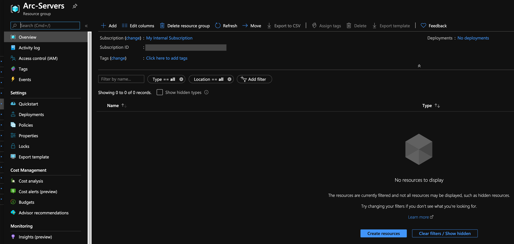
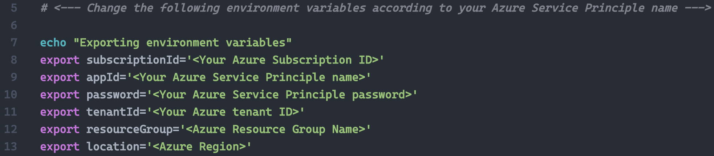
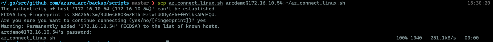
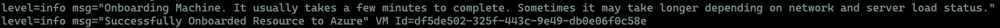
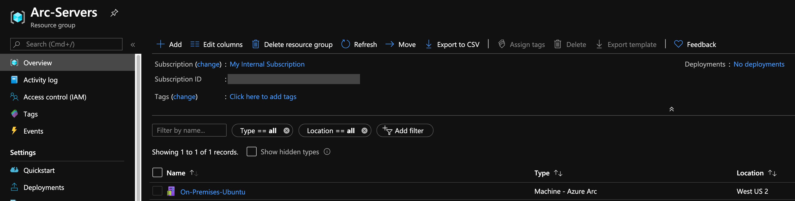
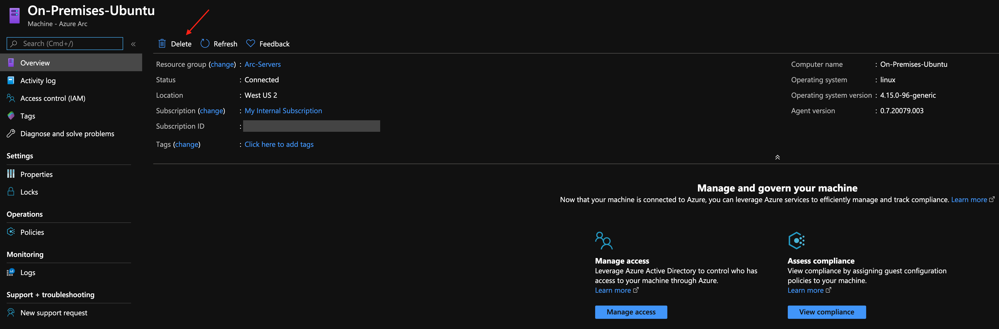
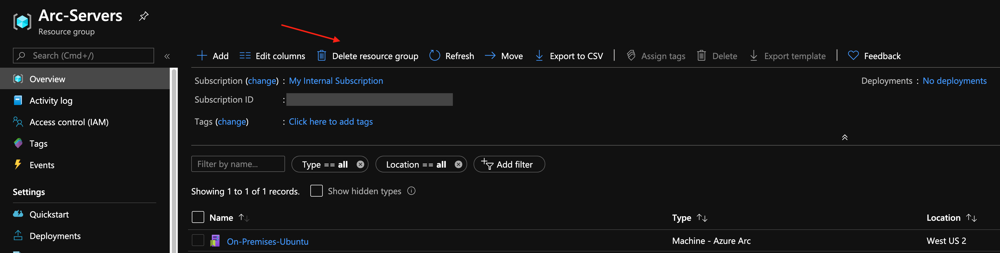

## Connect an existing Linux server to Azure Arc

The following README will guide you on how to connect an Linux server to Azure Arc using a simple shell script.

## Prerequisites

* [Install or update Azure CLI to version 2.15.0 and above](https://docs.microsoft.com/en-us/cli/azure/install-azure-cli?view=azure-cli-latest). Use the below command to check your current installed version.

  ```shell
  az --version
  ```

* Enable subscription with the resource provider for Azure Arc-enabled Servers. Registration is an asynchronous process, and registration may take approximately 10 minutes.

  ```shell
  az provider register --namespace Microsoft.HybridCompute
  ```

You can monitor the registration process with the following commands:

  ```shell
  az provider show -n Microsoft.HybridCompute -o table
  ```

* Create Azure service principal (SP)

    To connect a server to Azure Arc, an Azure service principal assigned with the "Contributor" role is required. To create it, login to your Azure account run the below command (this can also be done in [Azure Cloud Shell](https://shell.azure.com/)).

    ```shell
    az login
    az ad sp create-for-rbac -n "<Unique SP Name>" --role contributor
    ```

    For example:

    ```shell
    az ad sp create-for-rbac -n "http://AzureArcServers" --role contributor
    ```

    Output should look like this:

    ```json
    {
    "appId": "XXXXXXXXXXXXXXXXXXXXXXXXXXXX",
    "displayName": "AzureArcServers",
    "name": "http://AzureArcServers",
    "password": "XXXXXXXXXXXXXXXXXXXXXXXXXXXX",
    "tenant": "XXXXXXXXXXXXXXXXXXXXXXXXXXXX"
    }
    ```

    > **Note: The Jumpstart scenarios are designed with as much ease of use in-mind and adhering to security-related best practices whenever possible. It is optional but highly recommended to scope the service principal to a specific [Azure subscription and resource group](https://docs.microsoft.com/en-us/cli/azure/ad/sp?view=azure-cli-latest) as well considering using a [less privileged service principal account](https://docs.microsoft.com/en-us/azure/role-based-access-control/best-practices)**

* Create a new Azure resource group where you want your server(s) to show up.

    

* Download the [az_connect_linux](https://github.com/microsoft/azure_arc/blob/main/azure_arc_servers_jumpstart/scripts/az_connect_linux.sh) shell script.

* Change the environment variables according to your environment.

    

* Copy the script to the designated server using your preferred tool of choice (or copy/paste the script to a new file inside the server). Below example shows copy the script from MacOS to the server using SCP.

    

## Deployment

Run the script using the ```. ./az_connect_linux.sh``` command.

> **Note: The extra dot is due to the script has an *export* function and needs to have the vars exported in the same shell session as the rest of the commands.**

Upon completion, you will have your Linux server, connected as a new Azure Arc resource inside your resource group.






## Delete the deployment

The most straightforward way is to delete the server via the Azure Portal, just select server and delete it.



If you want to nuke the entire environment, just delete the Azure resource group.


