# Azure Arc-enabled servers LevelUp Training

## Goals

The purpose of this workshop is to train Microsoft employees who are working in the filed with the Azure Arc-enabled server concepts, features, value proposition, and do hands on training to help customers deploy Azure Arc-enabled servers.

After completion of this workshop, you will be able to:

- Understand pre-requisites to onboard Windows and Linux servers to Azure Arc
- Onboard Windows and Linux servers running using different onboarding methods
- Secure your Azure Arc-enabled servers using Microsoft Defender for servers
- Monitor your Azure Arc-enabled servers using Azure Monitor
- Configure your Azure Arc-enabled servers using Azure Automanage machine configuration
- Monitor changes to your Azure Arc-enabled servers using Change tracking and inventory
- Keep your Azure Arc-enabled servers patched using Update Management Center
- Sentinel (TBD)
- Run automation runbooks on your Azure Arc-enabled servers using Hybrid runbook workers
- SSH into your Azure Arc-enabled servers using SSH access
- Manage your Azure Arc-enabled servers using Admin Center (Preview)
- Query and inventory your Azure Arc-enabled servers using Azure resource graph
- Enforce governance across your Azure Arc-enabled servers using Azure Policy

| LevelUp Module | Duration | Facilitator |
|---------------|---------------|---------------|
|**1. Onboard Windows and Linux servers running using different onboarding methods** | x minutes | Owner |
|**2. Monitor your Azure Arc-enabled servers using Azure Monitor** | x minutes | Owner |
|**3. Secure your Azure Arc-enabled servers using Microsoft Defender for servers** | x minutes | Owner |
|**4. Configure your Azure Arc-enabled servers using Azure Automanage machine configuration** | x minutes | Owner |
|**5. Monitor changes to your Azure Arc-enabled servers using Change tracking and inventory** | x minutes | Owner |
|**6. Keep your Azure Arc-enabled servers patched using Update Management Center** | x minutes | Owner |
|**7. Sentinel (TBD)** | x minutes | Owner |
|**8. Run automation runbooks on your Azure Arc-enabled servers using Hybrid runbook workers** | x minutes | Owner |
|**9. SSH into your Azure Arc-enabled servers using SSH access** | x minutes | Owner |
|**10. Manage your Azure Arc-enabled servers using Admin Center (Preview)** | x minutes | Owner |
|**11. Query and inventory your Azure Arc-enabled servers using Azure resource graph** | x minutes | Owner |
|**12. Enforce governance across your Azure Arc-enabled servers using Azure Policy** | x minutes | Owner |
|**13. Extended Security Updates for your Windows Server 2012 workloads enabled by Azure Arc (TBD)** | x minutes | Owner |
|**14. Run command (TBD)** | x minutes | Owner |

## LevelUp Lab Environment

ArcBox LevelUp edition is a special “flavor” of ArcBox that is intended for users who want to experience Azure Arc-enabled servers' capabilities in a sandbox environment. Screenshot below shows layout of the lab environment.

  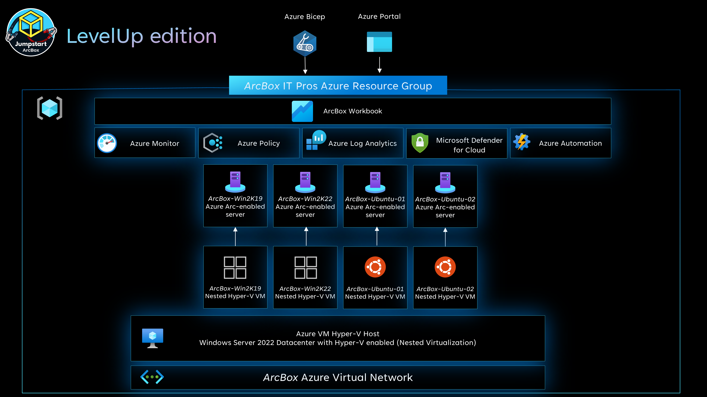

### Prerequisites

- [Install or update Azure CLI to version 2.51.0 and above](https://docs.microsoft.com/cli/azure/install-azure-cli?view=azure-cli-latest). Use the below command to check your current installed version.

  ```shell
  az --version
  ```

    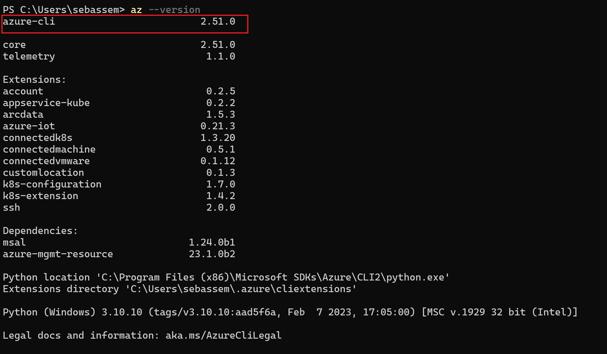

- Login to AZ CLI using the ```az login``` command.

```shell
az login
```

- Ensure that you have selected the correct subscription you want to deploy ArcBox to by using the ```az account list --query "[?isDefault]"``` command. If you need to adjust the active subscription used by Az CLI, follow [this guidance](https://docs.microsoft.com/cli/azure/manage-azure-subscriptions-azure-cli#change-the-active-subscription).

- ArcBox must be deployed to one of the following regions. **Deploying ArcBox outside of these regions may result in unexpected results or deployment errors.**

  - East US
  - East US 2
  - Central US
  - West US 2
  - North Europe
  - West Europe
  - France Central
  - UK South
  - Australia East
  - Japan East
  - Korea Central
  - Southeast Asia

- **ArcBox requires 16 DSv4-series vCPUs** when deploying with default parameters such as VM series/size. Ensure you have sufficient vCPU quota available in your Azure subscription and the region where you plan to deploy ArcBox. You can use the below Az CLI command to check your vCPU utilization.

  ```shell
  az vm list-usage --location <your location> --output table
  ```

  

- Register necessary Azure resource providers by running the following commands.

  ```shell
  az provider register --namespace Microsoft.HybridCompute --wait
  az provider register --namespace Microsoft.GuestConfiguration --wait
  az provider register --namespace Microsoft.AzureArcData --wait
  az provider register --namespace Microsoft.OperationsManagement --wait
  az provider register --namespace Microsoft.SecurityInsights --wait
  ```

- Create Azure service principal (SP). To deploy ArcBox, an Azure service principal assigned with the _Owner_ Role-based access control (RBAC) role is required. You can use Azure Cloud Shell (or other Bash shell), or PowerShell to create the service principal.

  - (Option 1) Create service principal using [Azure Cloud Shell](https://shell.azure.com/) or Bash shell with Azure CLI:

    ```shell
    subscriptionId="<Your Subscription Id>"
    servicePrincipalName="<Unique Service principal name>"

    az account set -s $subscriptionId
    az ad sp create-for-rbac -n $servicePrincipalName --role "Owner" --scopes /subscriptions/$subscriptionId
    ```

    For example:

    ```shell
    subscriptionId="98471a83-9151-489e-uub1-463447bed604"
    servicePrincipalName="JumpstartArcBoxSPN"

    az account set -s $subscriptionId
    az ad sp create-for-rbac -n $servicePrincipalName --role "Owner" --scopes /subscriptions/$subscriptionId
    ```

    Output should look similar to this:

    ```json
    {
    "appId": "XXXXXXXXXXXXXXXXXXXXXXXXXXXX",
    "displayName": "JumpstartArcBoxSPN",
    "password": "XXXXXXXXXXXXXXXXXXXXXXXXXXXX",
    "tenant": "XXXXXXXXXXXXXXXXXXXXXXXXXXXX"
    }
    ```

  - (Option 2) Create service principal using PowerShell. If necessary, follow [this documentation](https://learn.microsoft.com/powershell/azure/install-az-ps?view=azps-8.3.0) to install Azure PowerShell modules.

    ```PowerShell
    $account = Connect-AzAccount
    $subscriptionId = "<Your Subscription Id>"
    $servicePrincipalName = "<Unique Service principal name>"

    Set-AzContext -SubscriptionId $subscriptionId
    $spn = New-AzADServicePrincipal -DisplayName $servicePrincipalName -Role "Owner" -Scope "/subscriptions/$subscriptionId"
    echo "SPN App id: $($spn.AppId)"
    echo "SPN secret: $($spn.PasswordCredentials.SecretText)"
    ```

    For example:

    ```PowerShell
    $account = Connect-AzAccount
    $subscriptionId = "98471a83-9151-489e-uub1-463447bed604"
    $servicePrincipalName = "JumpstartArcBoxSPN"

    Set-AzContext -SubscriptionId $subscriptionId
    $spn = New-AzADServicePrincipal -DisplayName $servicePrincipalName -Role "Owner" -Scope "/subscriptions/$subscriptionId"
    echo "SPN App id: $($spn.AppId)"
    echo "SPN secret: $($spn.PasswordCredentials.SecretText)"
    ```

    Output should look similar to this:

    

    > **NOTE: If you create multiple subsequent role assignments on the same service principal, your client secret (password) will be destroyed and recreated each time. Therefore, make sure you grab the correct password.**

    > **NOTE: The Jumpstart scenarios are designed with as much ease of use in-mind and adhering to security-related best practices whenever possible. It is optional but highly recommended to scope the service principal to a specific [Azure subscription and resource group](https://docs.microsoft.com/cli/azure/ad/sp?view=azure-cli-latest) as well considering using a [less privileged service principal account](https://docs.microsoft.com/azure/role-based-access-control/best-practices)**

### Deployment

#### Deployment Option 1: Azure portal

- Click the <a href="https://portal.azure.com/#create/Microsoft.Template/uri/https%3A%2F%2Fraw.githubusercontent.com%2Fsebassem%2Fazure_arc%2Farc_servers_level_up%2Fazure_jumpstart_arcbox_servers_levelup%2FARM%2Fazuredeploy.json" target="_blank"></a> button and enter values for the the ARM template parameters.

  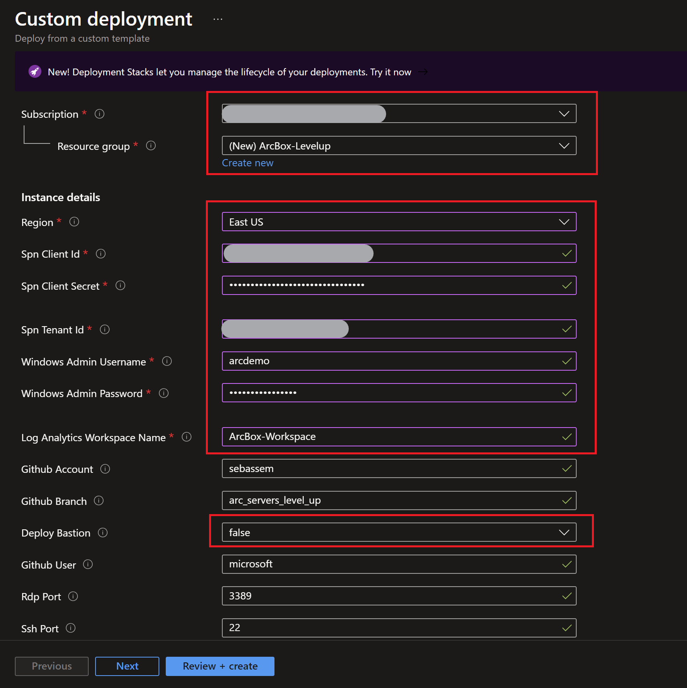

  

  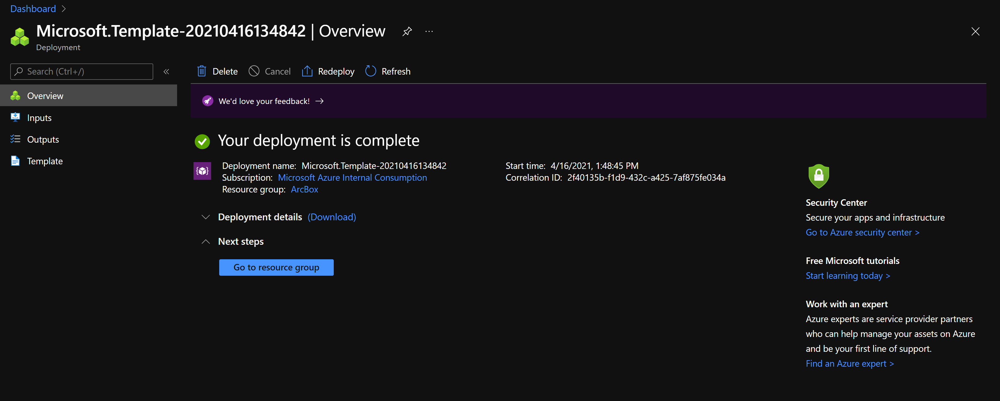

    > **NOTE: The deployment takes around 20 minutes to complete.**

    > **NOTE: If you see any failure in the deployment, please check the [troubleshooting guide](https://azurearcjumpstart.io/azure_jumpstart_arcbox/itpro/#basic-troubleshooting).**

### Deployment Option 2: Bicep deployment via Azure CLI

- Clone the Azure Arc Jumpstart repository

  ```shell
  $folderPath = <Specify a folder path to clone the repo>

  Set-Location -Path $folderPath
  git clone -b arc_servers_level_up https://github.com/microsoft/azure_arc.git
  Set-Location -Path "azure_arc\azure_jumpstart_arcbox_servers_levelup\bicep"
  ```

- Upgrade to latest Bicep version

  ```shell
  az bicep upgrade
  ```

- Edit the [main.parameters.json](https://github.com/sebassem/azure_arc/blob/arc_servers_level_up/azure_jumpstart_arcbox_servers_levelup/bicep/main.parameters.json) template parameters file and supply some values for your environment.
  - _`spnClientId`_ - Your Azure service principal id
  - _`spnClientSecret`_ - Your Azure service principal secret
  - _`spnTenantId`_ - Your Azure tenant id
  - _`windowsAdminUsername`_ - Client Windows VM Administrator name
  - _`windowsAdminPassword`_ - Client Windows VM Password. Password must have 3 of the following: 1 lower case character, 1 upper case character, 1 number, and 1 special character. The value must be between 12 and 123 characters long.
  - _`logAnalyticsWorkspaceName`_ - Unique name for the ArcBox Log Analytics workspace

  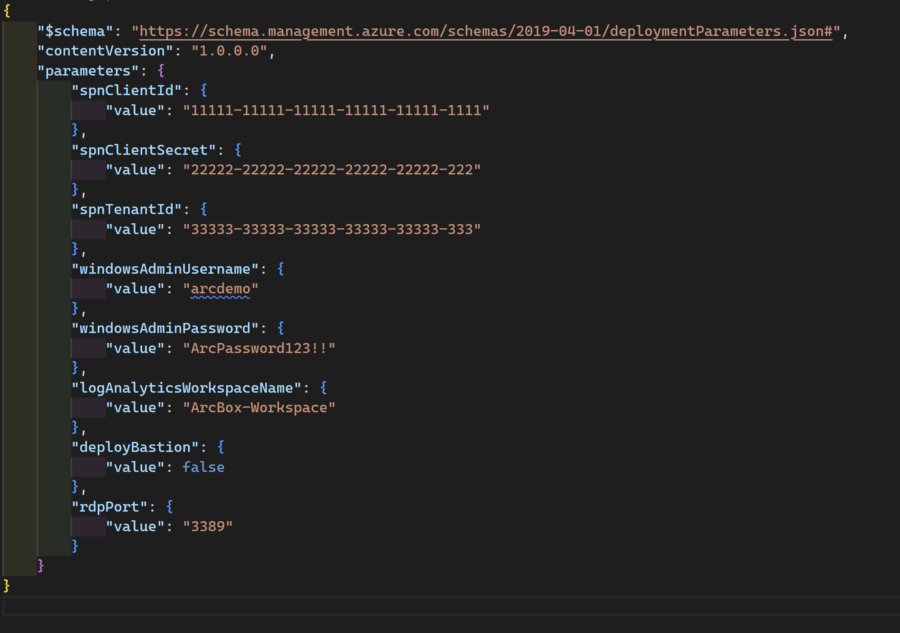

- Now you will deploy the Bicep file. Navigate to the local cloned [deployment folder](https://github.com/microsoft/azure_arc/tree/main/azure_jumpstart_arcbox/bicep) and run the below command:

  ```shell
  az group create --name "<resource-group-name>" --location "<preferred-location>"
  az deployment group create -g "<resource-group-name>" -f "main.bicep" -p "main.parameters.json"
  ```

    > **NOTE: If you see any failure in the deployment, please check the [troubleshooting guide](https://azurearcjumpstart.io/azure_jumpstart_arcbox/itpro/#basic-troubleshooting).**

    > **NOTE: The deployment takes around 20 minutes to complete.**

### Connecting to the ArcBox Client virtual machine

Various options are available to connect to _ArcBox-Client_ VM, depending on the parameters you supplied during deployment.

- [RDP](https://azurearcjumpstart.io/azure_jumpstart_arcbox/ITPro/#connecting-directly-with-rdp) - available after configuring access to port 3389 on the _ArcBox-NSG_, or by enabling [Just-in-Time access (JIT)](https://azurearcjumpstart.io/azure_jumpstart_arcbox/ITPro/#connect-using-just-in-time-accessjit).
- [Azure Bastion](https://azurearcjumpstart.io/azure_jumpstart_arcbox/ITPro/#connect-using-azure-bastion) - available if ```true``` was the value of your _`deployBastion`_ parameter during deployment.

#### Connecting directly with RDP

By design, ArcBox does not open port 3389 on the network security group. Therefore, you must create an NSG rule to allow inbound 3389.

- Open the _ArcBox-NSG_ resource in Azure portal and click "Add" to add a new rule.

  

  

- Specify the IP address that you will be connecting from and select RDP as the service with "Allow" set as the action. You can retrieve your public IP address by accessing [https://icanhazip.com](https://icanhazip.com) or [https://whatismyip.com](https://whatismyip.com).

  

  

  

#### Connect using Azure Bastion

- If you have chosen to deploy Azure Bastion in your deployment, use it to connect to the VM.

  

  > **NOTE: When using Azure Bastion, the desktop background image is not visible. Therefore some screenshots in this guide may not exactly match your experience if you are connecting to _ArcBox-Client_ with Azure Bastion.**

#### Connect using just-in-time access (JIT)

If you already have [Microsoft Defender for Cloud](https://docs.microsoft.com/azure/defender-for-cloud/just-in-time-access-usage?tabs=jit-config-asc%2Cjit-request-asc) enabled on your subscription and would like to use JIT to access the Client VM, use the following steps:

- In the Client VM configuration pane, enable just-in-time. This will enable the default settings.

  

  

  

#### The Logon scripts

- Once you log into the _ArcBox-Client_ VM, multiple automated scripts will open and start running. These scripts usually take 10-20 minutes to finish, and once completed, the script windows will close automatically. At this point, the deployment is complete.

  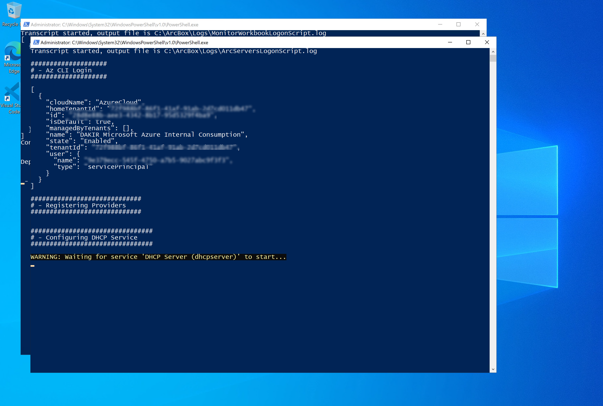

- Deployment is complete! Let's begin exploring the features of Azure Arc-enabled servers with the Level-up modules.

  

  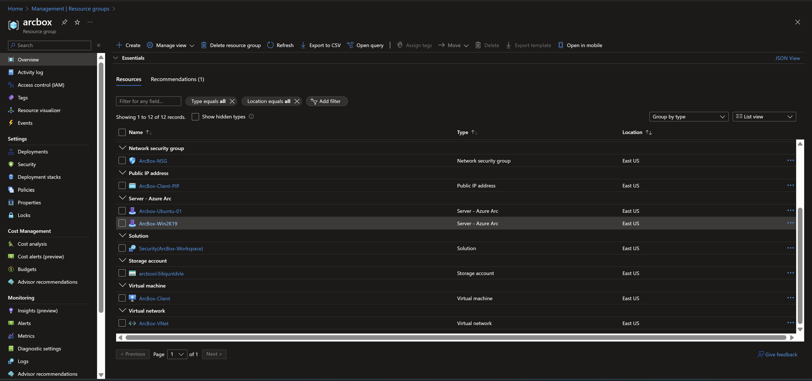

## Modules

### Module 1: On-boarding to Azure Arc-enabled servers

#### Module overview

#### Task 1

#### Task 2

### Module 2: Monitor your Azure Arc-enabled servers using Azure Monitor

#### Module overview

#### Task 1

#### Task 2

### Module 3: Secure your Azure Arc-enabled servers using Microsoft Defender for servers

#### Module overview

In this module, you will learn how to enable and leverage Microsoft Defender for Servers to secure your Azure Arc-enabled servers using capabilities like Defender for Endpoint, vulnerability assessment and threat detection via alerts.

#### Task 1: Pre-requisites

> **NOTE: In the previous module, you should have already deployed the Azure Monitor agent (AMA) to you Arc-enabled servers. If you have not deployed it, follow the following steps in module 2 to deploy it otherwise skip to task 2**

#### Task 2: Enable the Defender for Servers plan

- From the Azure home page, search for defender and select Microsoft Defender for Cloud.

    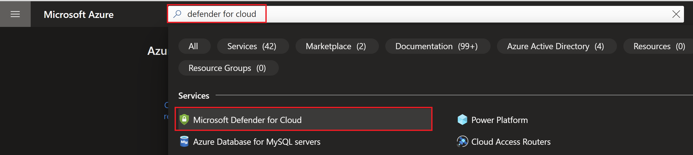

- If you already have Defender plans setup at your subscription level, you may find that Defender is already turned on for your Arc-enabled servers. However, if Defender is not enabled, select _Environment settings_ from the Management section on the left blade.

    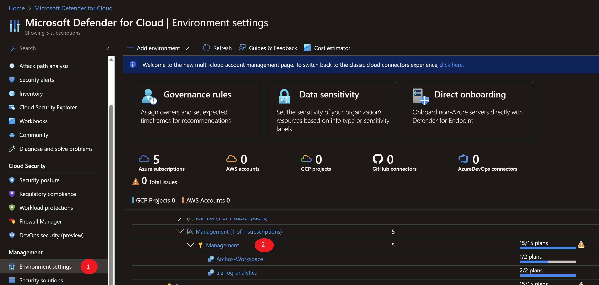

- Expand the Tenant Root Group, and then select your subscription.

- Enable the plan for servers, you can select either _Plan 1_ or _Plan 2_ for this exercise

    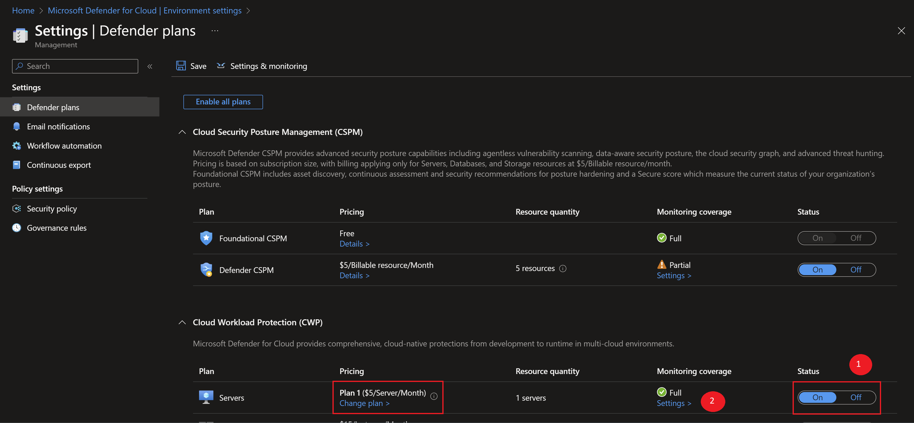

- Click on the settings option in the _Monitoring coverage_ and enable the following capabilities:
  - Vulnerability assessment for machines
  - Endpoint protection

    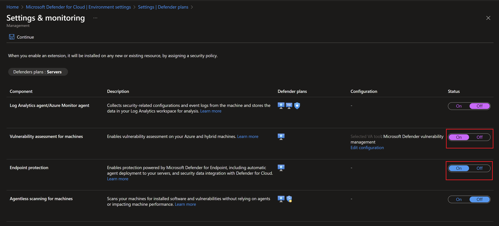

- Click Save.

    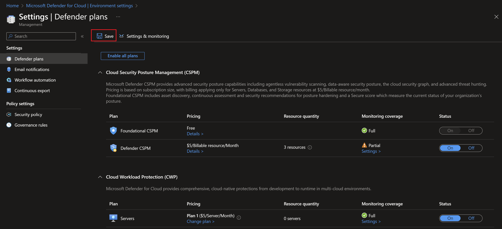

#### Task 3: Detect threats on your servers using alerts

- To simulate a malicious activity on the _Win2k22_ servers, rdp into the _ArcBox-Client_ VM
- Go to Start and type _PowerShell ISE_.
- Right-select and select Run as administrator.

    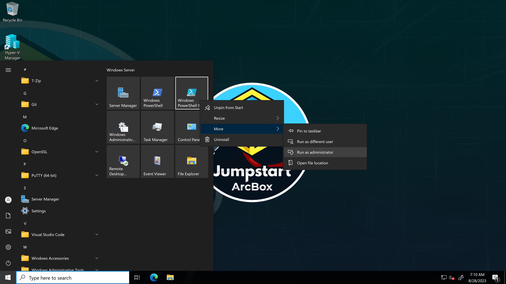

- Run the following command:

```shell
$remoteScriptFile = "$agentScript\testDefenderForServers.ps1"
$Win2k22vmName = "ArcBox-Win2K22"
$nestedWindowsUsername = "Administrator"
$nestedWindowsPassword = "ArcDemo123!!"
$secWindowsPassword = ConvertTo-SecureString $nestedWindowsPassword -AsPlainText -Force
$winCreds = New-Object System.Management.Automation.PSCredential ($nestedWindowsUsername, $secWindowsPassword)
$cmdExePath = "C:\Windows\System32\cmd.exe"
$cmdArguments = "/C `"$remoteScriptFile`""

Invoke-Command -VMName $Win2k22vmName -ScriptBlock { Start-Process -FilePath $Using:cmdExePath -ArgumentList $Using:cmdArguments } -Credential $winCreds
```

  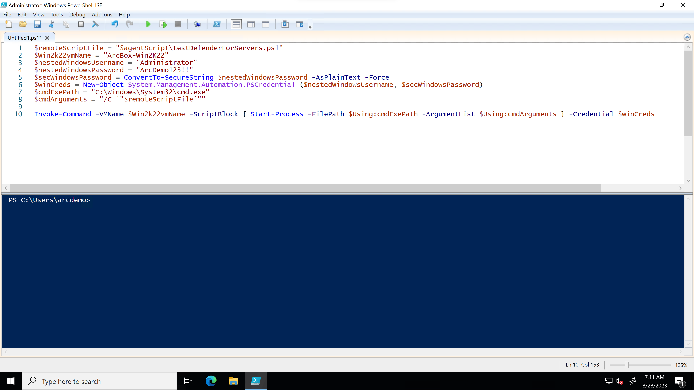

- Navigate to the Security tab of the _Win2k19_ Arc-enabled server in the portal

    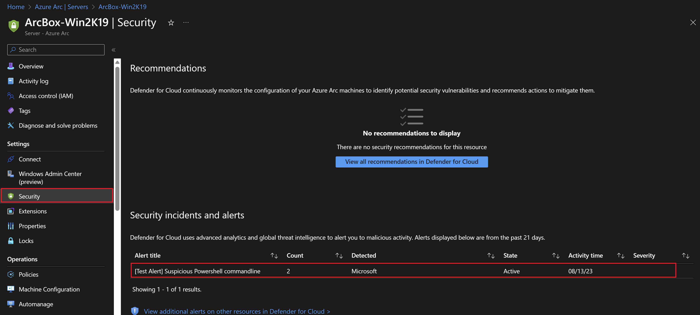

  > **NOTE: You should already see an alert for the Win2k19 Arc-enabled server**

- You can also see the alerts from the _Defender for Cloud_ portal, in the _Security alerts_ pane.

    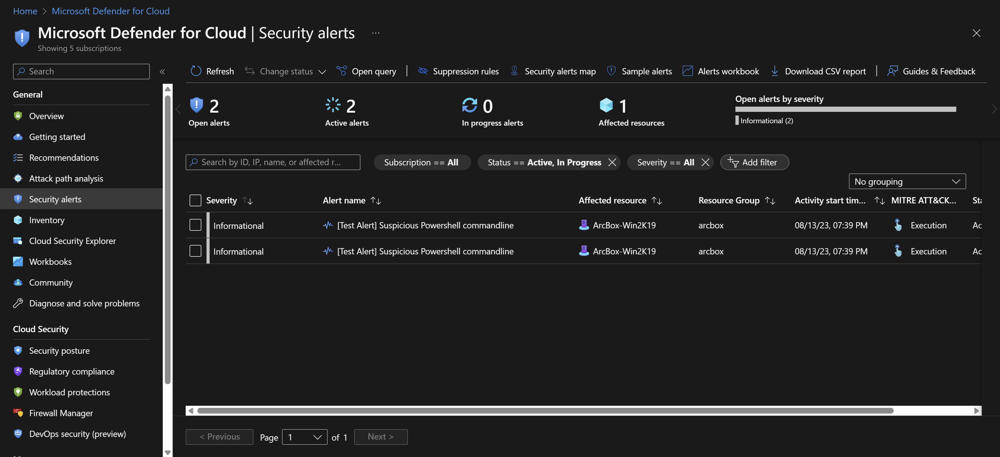

  > **NOTE: If you don't see the alerts, make sure to select the Information severity in the filters**

    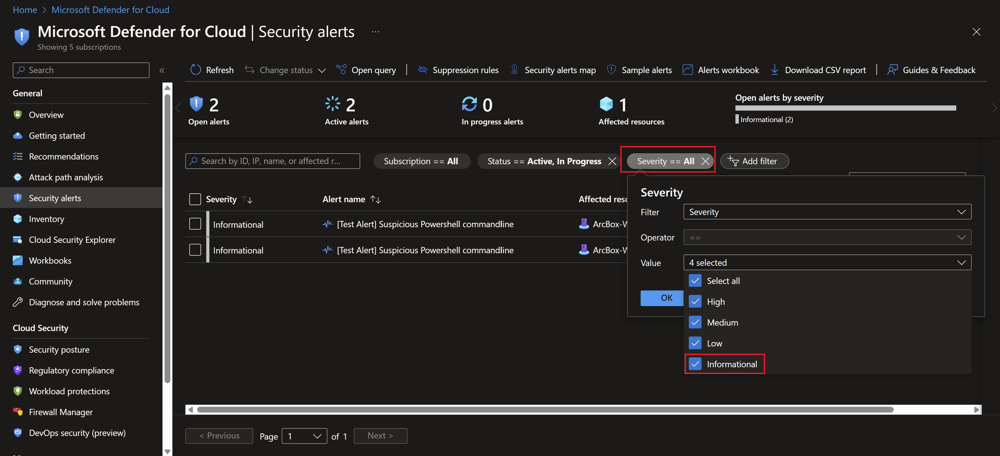

### Module 4: Configure your Azure Arc-enabled servers using Azure Automanage machine configuration

#### Module overview

In this module, you will learn to create and assign a custom Automanage Machine Configuration to an Azure Arc-enabled Windows and Linux servers to create a local user and control installed roles and features.

#### Task 1 : Create Automanage Machine Configuration custom configurations for Windows

We will be using the ArcBox Client virtual machine for the configuration authoring.

- RDP into the _ArcBox-Client_ VM

- Open Visual Studio Code from the desktop shortcut.

- Create C:\ArcBox\MachineConfiguration.ps1, then paste and run the following commands to complete the steps for this task:

> **NOTE: To run each additional code snippet you paste in VSCode, highlight the code you need to run and press F8**

  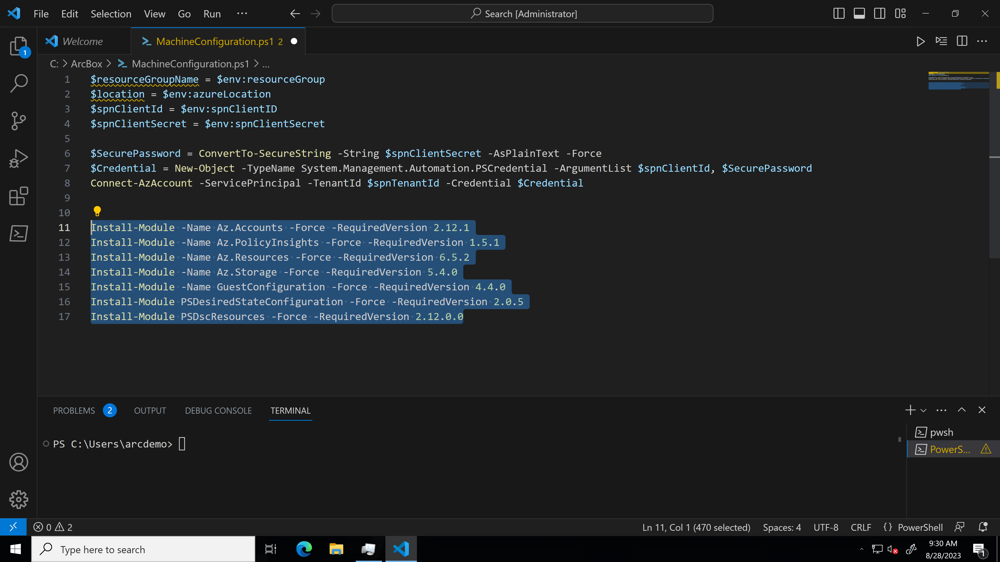

##### Custom configuration for Windows

- Initialize variables.

```PowerShell
$resourceGroupName = $env:resourceGroup
$location = $env:azureLocation
$spnClientId = $env:spnClientID
$spnClientSecret = $env:spnClientSecret

$SecurePassword = ConvertTo-SecureString -String $spnClientSecret -AsPlainText -Force
$Credential = New-Object -TypeName System.Management.Automation.PSCredential -ArgumentList $spnClientId, $SecurePassword
Connect-AzAccount -ServicePrincipal -TenantId $spnTenantId -Credential $Credential
```

- Install the needed PowerShell modules.

```PowerShell
Install-Module -Name Az.Accounts -Force -RequiredVersion 2.12.1
Install-Module -Name Az.PolicyInsights -Force -RequiredVersion 1.5.1
Install-Module -Name Az.Resources -Force -RequiredVersion 6.5.2
Install-Module -Name Az.Storage -Force -RequiredVersion 5.4.0
Install-Module -Name GuestConfiguration -Force -RequiredVersion 4.4.0
Install-Module PSDesiredStateConfiguration -Force -RequiredVersion 2.0.5
Install-Module PSDscResources -Force -RequiredVersion 2.12.0.0
```

The Azure PowerShell modules are used for:

- Publishing the package to Azure storage
- Creating a policy definition
- Publishing the policy
- Connecting to the Azure Arc-enabled servers

The GuestConfiguration module automates the process of creating custom content including:

- Creating a machine configuration content artifact (.zip)
- Validating the package meets requirements
- Installing the machine configuration agent locally for testing
- Validating the package can be used to audit settings in a machine
- Validating the package can be used to configure settings in a machine

Desired State Configuration version 3 is removing the dependency on MOF.
Initially, there are only support for DSC Resources written as PowerShell classes.
Due to using MOF-based DSC resources for the Windows demo-configuration, we are using version 2.0.5.

- Create a storage account to store the machine configurations

```PowerShell
$storageaccountsuffix = -join ((97..122) | Get-Random -Count 5 | % {[char]$_})
New-AzStorageAccount -ResourceGroupName $resourceGroupName -Name "machineconfigstg$storageaccountsuffix" -SkuName 'Standard_LRS' -Location $Location -OutVariable storageaccount | New-AzStorageContainer -Name machineconfiguration -Permission Blob
```

- Create the custom configuration

```PowerShell
Import-Module PSDesiredStateConfiguration -RequiredVersion 2.0.5

Configuration AzureArcLevelUp_Windows
{
    param (
        [Parameter(Mandatory)]
        [System.Management.Automation.PSCredential]
        [System.Management.Automation.Credential()]
        $PasswordCredential
    )

    Import-DscResource -ModuleName 'PSDscResources' -ModuleVersion 2.12.0.0

    Node localhost
    {
        MsiPackage PS7
        {
            ProductId = '{323AD147-6FC4-40CB-A810-2AADF26D868A}'
            Path = 'https://github.com/PowerShell/PowerShell/releases/download/v7.3.2/PowerShell-7.3.2-win-x64.msi'
            Ensure = 'Present'
        }
        User ArcBoxUser
        {
            UserName = 'arcboxuser1'
            FullName = 'ArcBox User 1'
            Password = $PasswordCredential
            Ensure = 'Present'
        }
        WindowsFeature SMB1 {
            Name = 'FS-SMB1'
            Ensure = 'Absent'
        }
    }
}

Write-Host "Creating credentials for arcbox user 1"
$nestedWindowsUsername = "arcboxuser1"
$nestedWindowsPassword = "ArcDemo123!!"  # In real-world scenarios this could be retrieved from an Azure Key Vault

# Create Windows credential object
$secWindowsPassword = ConvertTo-SecureString $nestedWindowsPassword -AsPlainText -Force
$winCreds = New-Object System.Management.Automation.PSCredential ($nestedWindowsUsername, $secWindowsPassword)

$ConfigurationData = @{
    AllNodes = @(
        @{
            NodeName = 'localhost'
            PSDscAllowPlainTextPassword = $true
        }
    )
}

$OutputPath = "$HOME/arc_automanage_machine_configuration_custom_windows"
New-Item $OutputPath -Force -ItemType Directory

AzureArcLevelUp_Windows -PasswordCredential $winCreds -ConfigurationData $ConfigurationData -OutputPath $OutputPath
```

- Create a package that will audit and apply the configuration (Set)

```PowerShell
New-GuestConfigurationPackage `
-Name 'AzureArcLevelUp_Windows' `
-Configuration "$OutputPath/localhost.mof" `
-Type AuditAndSet `
-Path $OutputPath `
-Force
```

- Test applying the configuration to the local machine

```PowerShell
Start-GuestConfigurationPackageRemediation -Path "$OutputPath/AzureArcLevelUp_Windows.zip"
```

- Upload the configuration package to the Azure Storage Account.

```PowerShell
$StorageAccount = Get-AzStorageAccount -Name "machineconfigstg$storageaccountsuffix" -ResourceGroupName $ResourceGroupName

$StorageAccountKey = Get-AzStorageAccountKey -Name $storageaccount.StorageAccountName -ResourceGroupName $storageaccount.ResourceGroupName
$Context = New-AzStorageContext -StorageAccountName $storageaccount.StorageAccountName -StorageAccountKey $StorageAccountKey[0].Value

Set-AzStorageBlobContent -Container "machineconfiguration" -File  "$OutputPath/AzureArcLevelUp_Windows.zip" -Blob "AzureArcLevelUp_Windows.zip" -Context $Context -Force

$contenturi = New-AzStorageBlobSASToken -Context $Context -FullUri -Container machineconfiguration -Blob "AzureArcLevelUp_Windows.zip" -Permission r
```

- Create an Azure Policy definition.

```PowerShell
$PolicyId = (New-Guid).Guid

New-GuestConfigurationPolicy `
  -PolicyId $PolicyId `
  -ContentUri $ContentUri `
  -DisplayName '(AzureArcJumpstart) [Windows] Custom configuration' `
  -Description 'Azure Arc Jumpstart Windows demo configuration' `
  -Path  $OutputPath `
  -Platform 'Windows' `
  -PolicyVersion 1.0.0 `
  -Mode ApplyAndAutoCorrect `
  -Verbose -OutVariable Policy

  $PolicyParameterObject = @{'IncludeArcMachines'='true'}

  New-AzPolicyDefinition -Name '(AzureArcJumpstart) [Windows] Custom configuration' -Policy $Policy.Path -OutVariable PolicyDefinition
```

- Assign the Azure Policy definition to the target resource group.

```PowerShell
$ResourceGroup = Get-AzResourceGroup -Name $ResourceGroupName

New-AzPolicyAssignment -Name '(AzureArcJumpstart) [Windows] Custom configuration' -PolicyDefinition $PolicyDefinition[0] -Scope $ResourceGroup.ResourceId -PolicyParameterObject $PolicyParameterObject -IdentityType SystemAssigned -Location $Location -DisplayName '(AzureArcJumpstart) [Windows] Custom configuration' -OutVariable PolicyAssignment
```

- In order for the newly assigned policy to remediate existing resources, the policy must be assigned a managed identity and a policy remediation must be performed.

```PowerShell
$PolicyAssignment = Get-AzPolicyAssignment -PolicyDefinitionId $PolicyDefinition.PolicyDefinitionId | Where-Object Name -eq '(AzureArcJumpstart) [Windows] Custom configuration'

$roleDefinitionIds =  $PolicyDefinition.Properties.policyRule.then.details.roleDefinitionIds

# Wait for eventual consistency
Start-Sleep 20

if ($roleDefinitionIds.Count -gt 0)
 {
     $roleDefinitionIds | ForEach-Object {
         $roleDefId = $_.Split("/") | Select-Object -Last 1
         New-AzRoleAssignment -Scope $resourceGroup.ResourceId -ObjectId $PolicyAssignment.Identity.PrincipalId -RoleDefinitionId $roleDefId
     }
 }

 $job = Start-AzPolicyRemediation -AsJob -Name ($PolicyAssignment.PolicyAssignmentId -split '/')[-1] -PolicyAssignmentId $PolicyAssignment.PolicyAssignmentId -ResourceGroupName $ResourceGroup.ResourceGroupName -ResourceDiscoveryMode ReEvaluateCompliance
```

- To check policy compliance, in the Azure Portal, navigate to *Policy* -> *Compliance*

- Set the scope to the resource group your instance of ArcBox is deployed to

- Filter for *(AzureArcJumpstart) [Windows] Custom configuration*

    

> **NOTE: It may take 15-20 minutes for the policy remediation to be completed.**

- To get a Machine Configuration status for a specific machine, navigate to *Azure Arc* -> *Machines*

- Click on ArcBox-Win2K22 -> Machine Configuration

- If the status for *ArcBox-Win2K22/AzureArcLevelUp_Windows* is not *Compliant*, wait a few more minutes and click *Refresh*

    

- Click on *ArcBox-Win2K22/AzureArcLevelUp_Windows* to get a per-resource view of the compliance state in the assigned configuration

    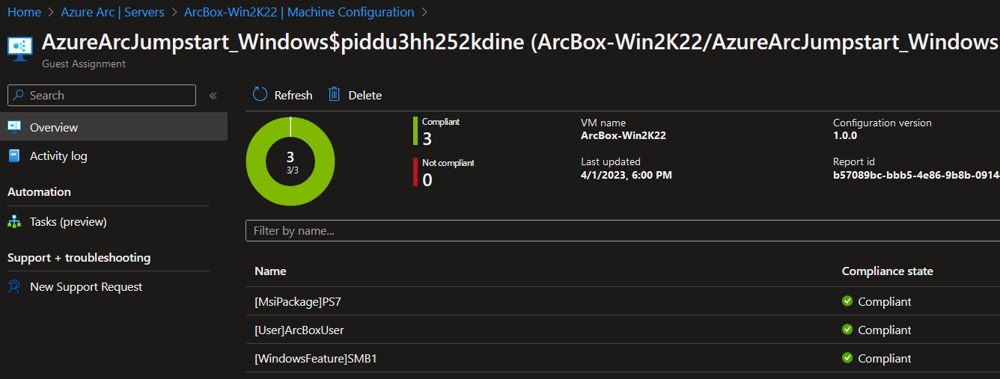

##### Verify that the operating system level settings are in place

- To verify that the operating system level settings are in place, run the following commands:

```powershell
 Invoke-Command -VMName $Win2k19vmName -ScriptBlock { Get-LocalUser -Name arcboxuser1 } -Credential $winCreds

 Invoke-Command -VMName $Win2k19vmName -ScriptBlock {  Get-WindowsFeature -Name FS-SMB1 | select  DisplayName,Installed,InstallState} -Credential $winCreds
```

  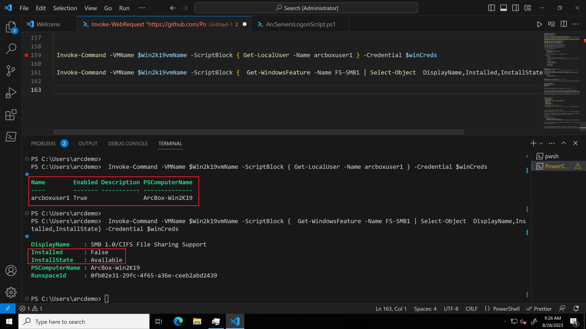

#### Task 2

### Module 5: Monitor changes to your Azure Arc-enabled servers using Change tracking and inventory

#### Module overview

#### Task 1

#### Task 2

### Module 6: Keep your Azure Arc-enabled servers patched using Update Management Center

#### Module overview

#### Task 1

#### Task 2

### Module 7: Run scripts on your Azure Arc-enabled servers using Custom script extensions

#### Module overview

#### Task 1

#### Task 2

### Module 8: Run automation runbooks on your Azure Arc-enabled servers using Hybrid runbook workers

#### Module overview

#### Task 1

#### Task 2

### Module 9: SSH into your Azure Arc-enabled servers using SSH access

#### Module overview

#### Task 1

#### Task 2

### Module 10: Manage your Azure Arc-enabled servers using Admin Center (Preview)

#### Module overview

#### Task 1

#### Task 2

### Module 11: Query and inventory your Azure Arc-enabled servers using Azure resource graph

#### Module overview
In this module, you will learn how to use the Azure Resource queries both in the Azure Graph Explorer and Powershell to demonstrate inventory management of your Azure Arc connected servers. Note that the results you get by running the graph queries in this module might be different from the sample screenshots as your environment might be different e.g. as a result of working with the other modules. 

#### Task 1: Apply resource tags to Azure Arc-enabled servers

In this first step, you will assign Azure resource tags to some of your Azure Arc-enabled servers. This gives you the ability to easily organize and manage server inventory.

- Enter "Machines - Azure Arc" in the top search bar in the Azure portal and select it from the displayed services.

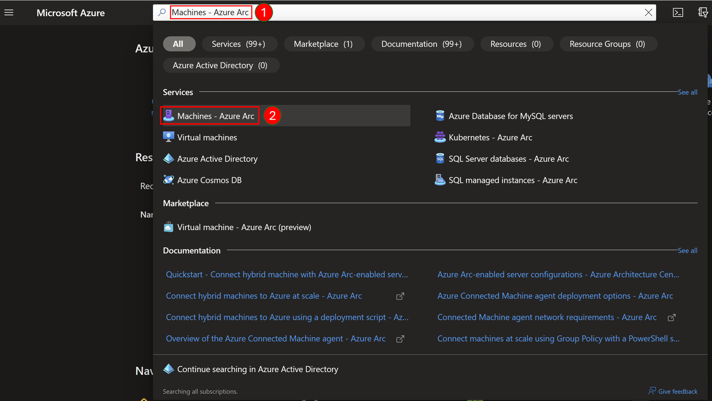

- Click on any of your Azure Arc-enabled servers.

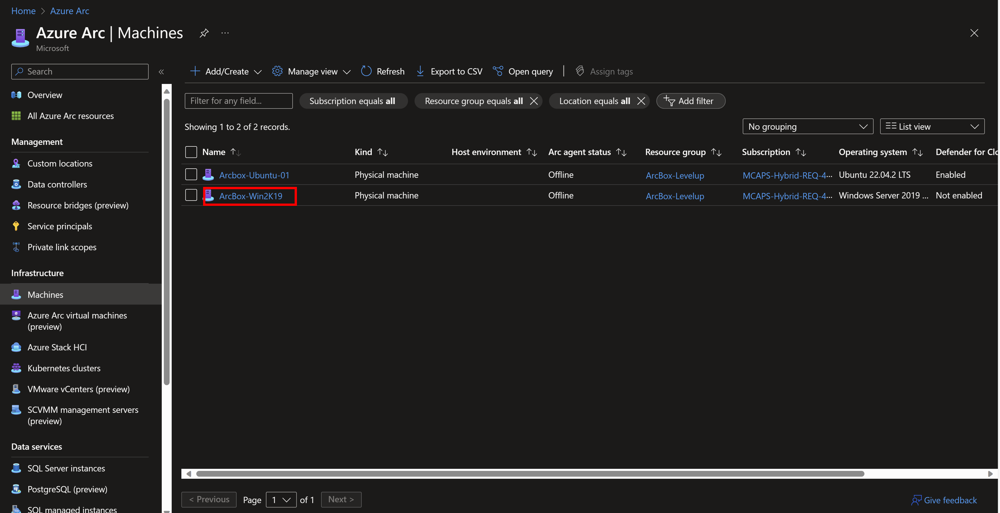

- Click on "Tags". Add a new tag with Name="Scenario” and Value="azure_arc_servers_inventory”. Click Apply when ready.

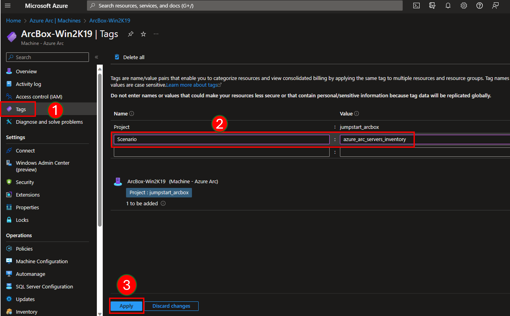

- Repeat the same process in other Azure Arc-enabled servers if you wish. This new tag will be used later when working with Resource Graph Explorer queries.

#### Task 2: The Azure Resource Graph Explorer

- Now we will explore our hybrid server inventory using a number of Azure Graph Queries. Enter "Resource Graph Explorer" in the top search bar in the Azure portal and select it.

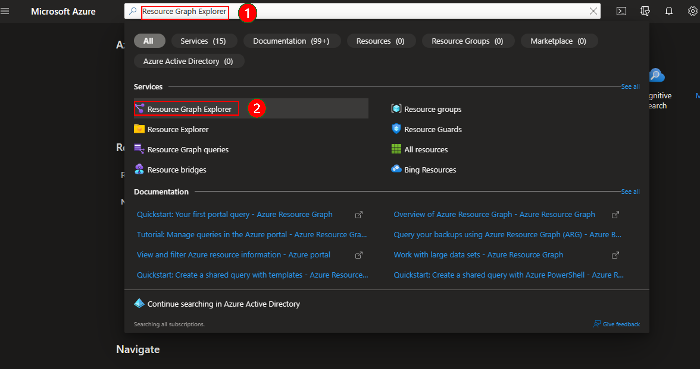

- The scope of the Resource Graph Explorer can be set as seen below

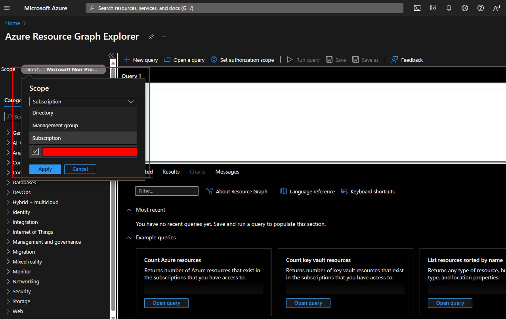

#### Task 3: Run a query to show all Azure Arc-enabled servers in your subscription

- In the query window, enter and run the following query and examine the results which should show your Arc-enabled servers. Note the use of the KQL equals operator (=~) which is case insensitive [KQL =~ (equals) operator](https://learn.microsoft.com/en-us/azure/data-explorer/kusto/query/equals-operator).

Resources \
| where type =~ 'Microsoft.HybridCompute/machines'

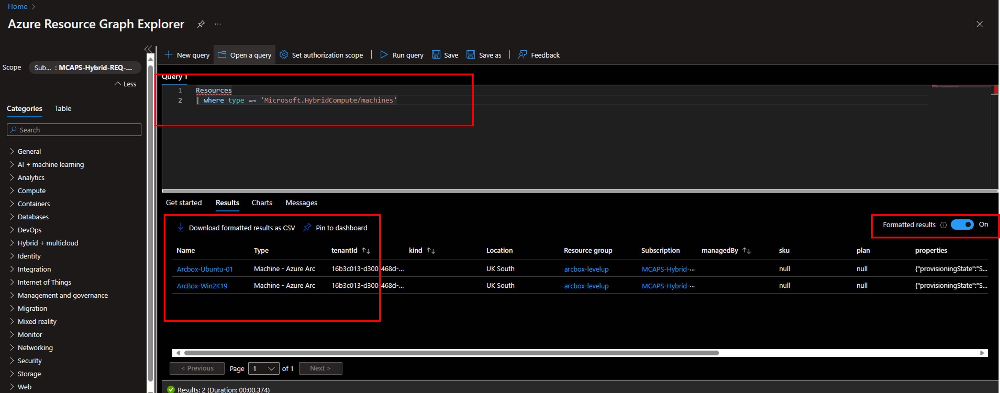

- Scroll to the right on the results pane and click "See Details" to see all the Azure Arc-enabled server metadata. Note for example the list of detected properties, we will be using these in the next task.

- You can also run the same query using PowerShell (e.g. using Azure Cloud Shell) providing that you have added the required module "Az.ResourceGraph" as explained in [Run your first Resource Graph query using Azure PowerShell](https://learn.microsoft.com/en-us/azure/governance/resource-graph/first-query-powershell#add-the-resource-graph-module).
To install the PowerShell module, run the following command 

```powershell
Install-Module -Name Az.ResourceGrpah
```
Then run the query in PowerShell

```powershell
 Search-AzGraph -Query "Resources | where type =~ 'Microsoft.HybridCompute/machines'"
```

#### Task 4: Query your server inventory using the available metadata.

- Use PowerShell and the Resource Graph Explorer to summarize the server count by "logical cores" which is one of the detected propeties referred to in the previous task. Remember to only use the query string, which is enclosed in double quotes, in the portal.

```powershell
Search-AzGraph -Query  “Resources
| where type =~ 'Microsoft.HybridCompute/machines'
| extend logicalCores = tostring(properties.detectedProperties.logicalCoreCount)
| summarize serversCount = count() by logicalCores”
```
- The Graph Explorer allows you to get a graphical view of your results by selecting the "charts" option.

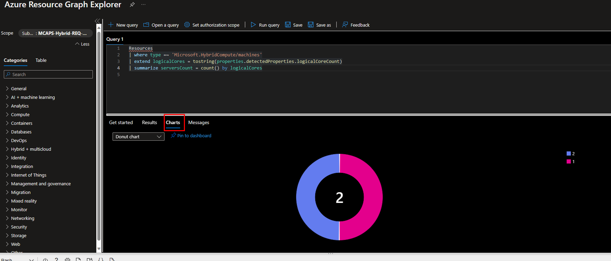

#### Task 5: Use the resource tags in your Graph Query.

- Let’s now build a query that uses the tag we assigned earlier to some of our Azure Arc-enabled servers. Use the following query that includes a check for resources that have a value for the Scenario tag. Feel free to use the portal of PowerShell. Check that the results match the servers that you set tags for earlier.

```powershell
Search-AzGraph -Query  “Resources
| where type =~ 'Microsoft.HybridCompute/machines' and isnotempty(tags['Scenario'])
| extend Scenario = tags['Scenario']
| project name, tags"
```
#### Task 6: List the extensions installed on the Azure Arc-enabled servers.

- Run the following advanced query which allows you to see what extensions are installed on the Arc-enabled servers. Notice that running the query in PowerShell requires us to escape the $ character as explained in [Escape Characters](https://learn.microsoft.com/en-us/azure/governance/resource-graph/concepts/query-language#escape-characters)

```powershell
Search-AzGraph -Query “Resources
| where type == 'microsoft.hybridcompute/machines'
| project id, JoinID = toupper(id), ComputerName = tostring(properties.osProfile.computerName), OSName = tostring(properties.osName)
| join kind=leftouter(
    Resources
    | where type == 'microsoft.hybridcompute/machines/extensions'
    | project MachineId = toupper(substring(id, 0, indexof(id, '/extensions'))), ExtensionName = name
) on `$left.JoinID == `$right.MachineId
| summarize Extensions = make_list(ExtensionName) by id, ComputerName, OSName
| order by tolower(OSName) desc”
```
- If you have used the portal to run the query then you should see something like the following 

- 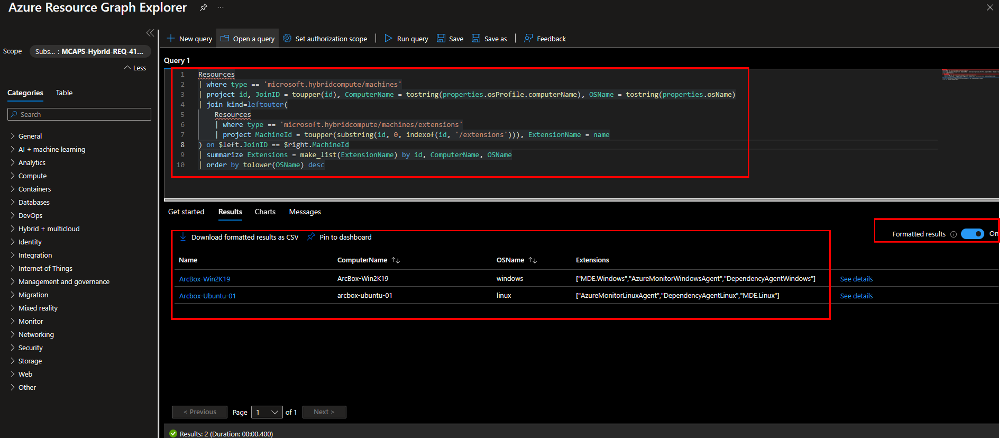

#### Task 7: Query other properties

- Azure Arc provides additional properties on the Azure Arc-enabled server resource that we can query with Resource Graph Explorer. In the following example, we list some of these key properties, like the Azure Arc Agent version installed on your Azure Arc-enabled servers

```powershell
Search-AzGraph -Query  “Resources
| where type =~ 'Microsoft.HybridCompute/machines'
| extend arcAgentVersion = tostring(properties.['agentVersion']), osName = tostring(properties.['osName']), osVersion = tostring(properties.['osVersion']), osSku = tostring(properties.['osSku']),
lastStatusChange = tostring(properties.['lastStatusChange'])
| project name, arcAgentVersion, osName, osVersion, osSku, lastStatusChange"
```

- Running the same query in the portal should reslut in something like the following

- 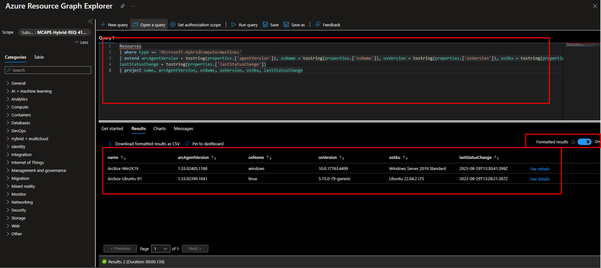


### Module 12: Enforce governance across your Azure Arc-enabled servers using Azure Policy

#### Module overview

#### Task 1

#### Task 2