## Deploy an Ubuntu OCI Virtual Machine and connect it to Azure Arc using a Terraform plan

The following README will guide you on how to use the provided [Terraform](https://www.terraform.io/) plan to deploy an OCI instance virtual machine and connect it as an Azure Arc enabled server resource. 

## Prerequisites

* Clone the Azure Arc Jumpstart repository

    ```shell
    git clone https://github.com/microsoft/azure_arc.git
    ```
    
* [Install or update Azure CLI to version 2.7.0 and above](https://docs.microsoft.com/en-us/cli/azure/install-azure-cli?view=azure-cli-latest). Use the below command to check your current installed version.

  ```shell
  az --version
  ```

* [Generate an SSH Key](https://help.github.com/articles/generating-a-new-ssh-key-and-adding-it-to-the-ssh-agent/) (or use an existing ssh key) 

* [Create a free OCI account](https://signup.oraclecloud.com/?language=en&sourceType=:ow:o:p:feb:0916FreePageFAQ&intcmp=:ow:o:p:feb:0916FreePageFAQ)

* [Install Terraform >=0.12](https://learn.hashicorp.com/terraform/getting-started/install.html) 
  
* Create Azure Service Principal (SP)

  To connect the OCI Virtual Machine instance to Azure Arc an Azure Service Principal assigned with the  
  "Contributor" role is required. To create it, login to your Azure account run the below command (this can also be done in [Azure Cloud Shell](https://shell.azure.com/)). 

    ```shell
    az login
    az ad sp create-for-rbac -n "<Unique SP Name>" --role contributor
    ```

    For example:

    ```shell
    az ad sp create-for-rbac -n "http://AzureArcOCI" --role contributor
    ```

    Output should look like this:

    ```json
    {
    "appId": "XXXXXXXXXXXXXXXXXXXXXXXXXXXX",
    "displayName": "AzureArcOCI",
    "name": "http://AzureArcOCI",
    "password": "XXXXXXXXXXXXXXXXXXXXXXXXXXXX",
    "tenant": "XXXXXXXXXXXXXXXXXXXXXXXXXXXX"
    }
    ```

    > **Note: It is optional but highly recommended to scope the SP to a specific [Azure subscription and resource group](https://docs.microsoft.com/en-us/cli/azure/ad/sp?view=azure-cli-latest)**
    
 ## Obtain Oracle Cloud Infrastructure IDs (OCIDs)
 
 In order for Terraform to create resources in OCI, you wil need to obtain the following OCID's:
* User OCID
* Compartment OCID
* Tenanacy OCID

 User Compartment OCID
 * Login to the [OCI cloud console](https://www.oracle.com/cloud/sign-in.html) and select your profile. Open your user OCID, and click on show to reveal. Copy User OCID to clipboard and paste to your editor of choice.
 
      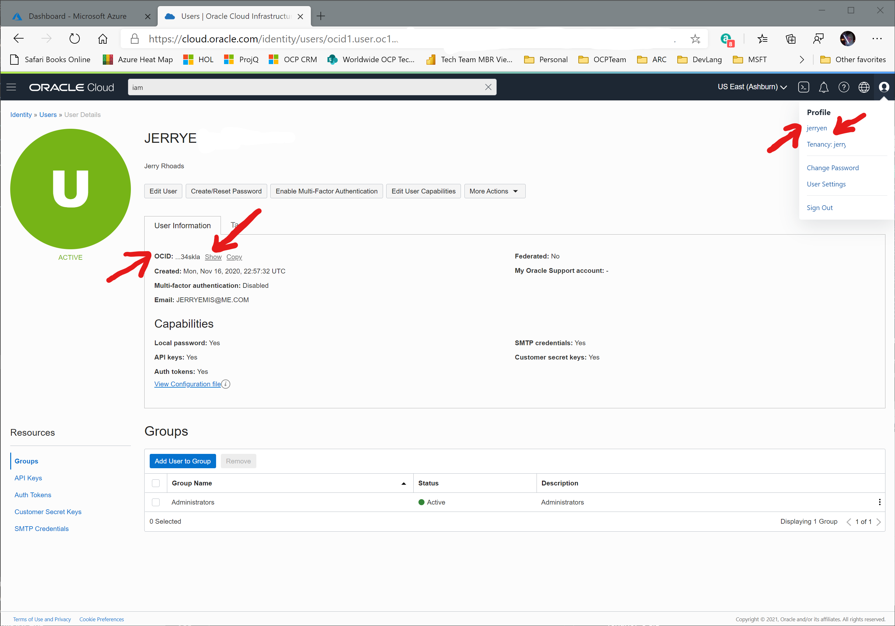
    
 * After obtaining User OCID, navigate to [Compartments](https://cloud.oracle.com/identity/compartments). Click on the Tenancy name and find the OCID, then click on show. Copy the Compartment OCID to clipboard and paste it to the editor of choice..   
 
    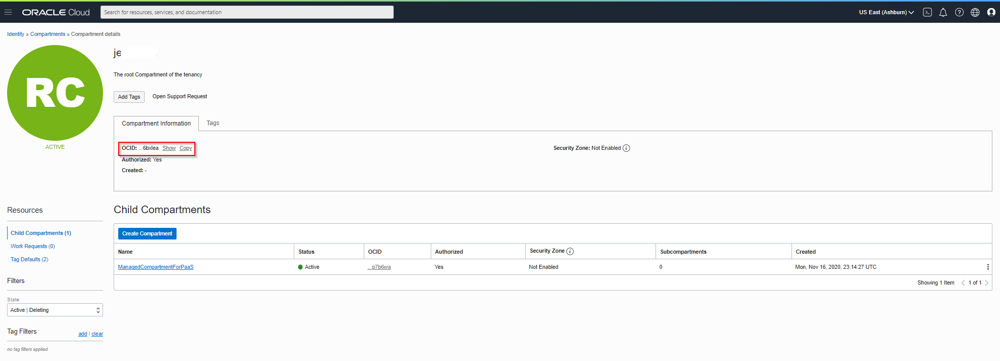
    
 Tenancy OCID
* After finding the user OCID, go to [OCI Tenancy](https://cloud.oracle.com/tenancy), navigate to the OCID for Tenancy and click on show. Copy the Tenancy OCID to clipboard and paste it to the editor of choice.
  
   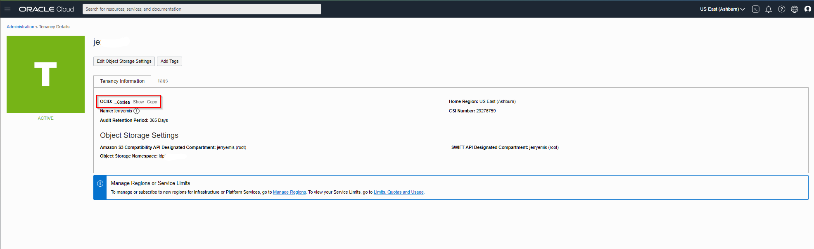
  
 Create the API SSL Key
 
 * You will need an SSL key pair to enable Terraform to connect to the OCI API under your identity. Start by generating a key.

    ```shell
    $openssl genrsa -out oci_api_key.pem 2048
    ```
* Set file access to owner only read and write

  ```shell
   $chmod go-rwx oci_api_key.pem
  ```
* Generate the public half of the key pair
 
   ```shell
    $openssl rsa -pubout -in oci_api_key.pem -out oci_api_key_public.pem
  ```

* Copy the contents of the public key to the clipboard using gvim, pbcopy, xclip or a similar tool (you'll need to paste the value into the Console later).
 
   ```shell
     $cat oci_api_key_public.pem | gvim &
  ```

* The public key needs to be added to your user account in the OCI console. Open the [account page](https://cloud.oracle.com/identity/users/) for your user, navigate to "API Keys" and select the "Add Public Key" button. Copy and paste the contents of the oci_api_key_public.pem file in the box of the "Add Public Key" dialog as shown below.

  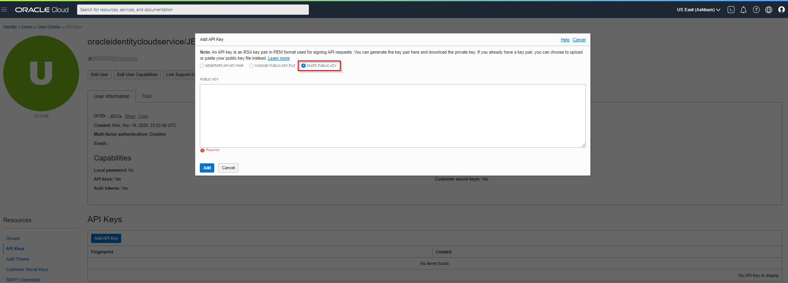

 ## Configure Terraform

Before executing the Terraform plan, you must export the environment variables which will be used by the plan. These variables are based on your Azure subscription and tenant, the Azure service principal, and the OCIDs and keys you just created.

* Retrieve your Azure subscription ID and tenant ID using the ```az account list``` command.

* The Terraform plan creates resources in both Microsoft Azure and OCI. It then executes a script on an OCI Virtual Machine instance to install the Azure Arc connected machine agent and all necessary artifacts. This script requires certain information about your OCI and Azure environments. Edit [*scripts/vars.sh*](https://github.com/microsoft/azure_arc/blob/main/azure_arc_servers_jumpstart/oci/ubuntu/terraform/scripts/vars.sh) and update each of the variables with the appropriate values.

    * TF_VAR_tenancy_ocid=Oracle tenanacy OCID
    * TF_VAR_user_ocid=Oracle user OCID
    * TF_VAR_fingerprint=Oracle API Key FingerPrint
    * TF_VAR_private_key_path=oci_api_key.pem
    * TF_VAR_ssh_public_key=$(cat my_oci_key.pub) 
    * TF_VAR_region=us-ashburn-1
    * TF_VAR_compartment_ocid=Oracle compartment OCID
    * TF_VAR_subscription_id=Your Azure subscription ID
    * TF_VAR_client_id=Your Azure service principal app id
    * TF_VAR_client_secret=Your Azure service principal password
    * TF_VAR_tenant_id=Your Azure tenant ID

* From CLI, navigate to the "*azure_arc_servers_jumpstart/oci/ubuntu/terraform*"  directory of the cloned repo.    
  
* Export the environment variables you edited by running [*scripts/vars.sh*](https://github.com/microsoft/azure_arc/blob/main/azure_arc_servers_jumpstart/oci/ubuntu/terraform/scripts/vars.sh) with the source command as shown below. Terraform requires these to be set for the plan to execute properly. Note that this script will also be automatically executed remotely on the OCI Virtual Machine instance as part of the Terraform deployment. 
* 
    ```shell
    source ./scripts/vars.sh
    ```

* Run the ```terraform init``` command which will download Terraform's AzureRM and OCI providers.

    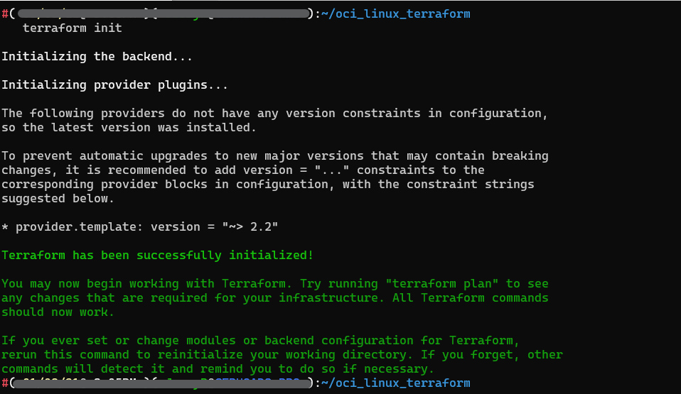

# Deployment

* Run the ```terraform apply --auto-approve``` command and wait for the plan to finish. Upon completion, you will have an OCI virtual machine instance deployed and connected as a new Azure Arc enabled server inside a new Resource Group.

* Open the Azure portal and navigate to the resource group "Arc-OCI-Demo". The virtual machine created on OCI will be visible as a resource.

    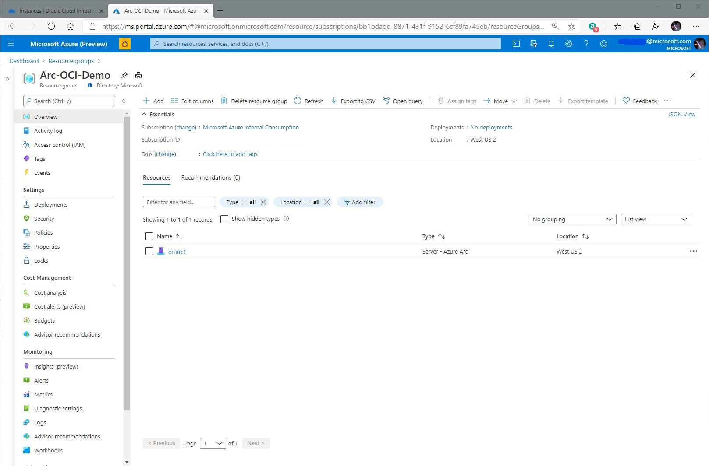

    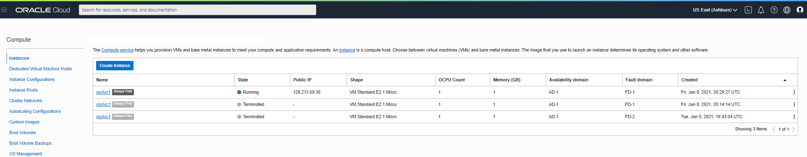

## Semi-Automated Deployment (Optional)

As you may have noticed, the last step of the automation is to register the VM as a new Azure Arc enabled server resource.

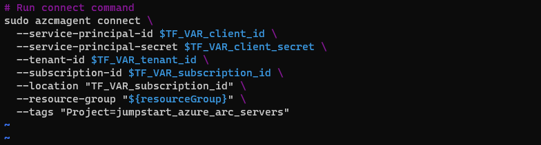

If you want to demo/control the actual registration process, do the following:

* In the [*install_arc_agent.sh.tmpl*](https://github.com/microsoft/azure_arc/blob/main/azure_arc_servers_jumpstart/oci/ubuntu/terraform/scripts/install_arc_agent.sh.tmpl) script template, comment out the "Run connect command" section and save the file.

     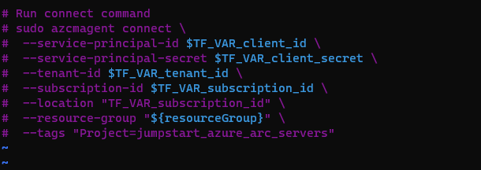

* Get the public IP of the OCI instance by running ```terraform output```

    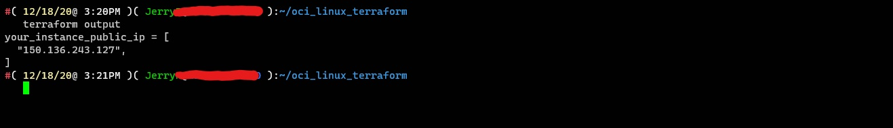

* SSH the VM using the ```ssh -i my_oci_key ubuntu@x.x.x.x``` where x.x.x.x is the host ip.

    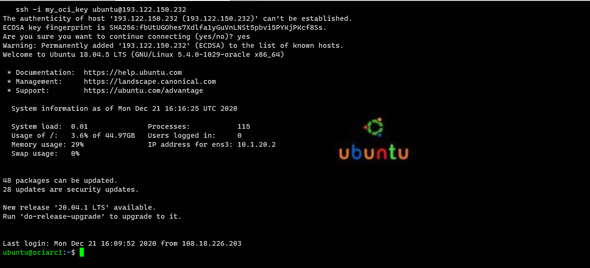

* Export all the environment variables in [*vars.sh*](https://github.com/microsoft/azure_arc/blob/main/azure_arc_servers_jumpstart/oci/ubuntu/terraform/scripts/vars.sh)

    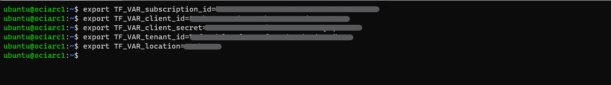

* Run the following command

    ```shell
    sudo azcmagent connect --service-principal-id $TF_VAR_client_id --service-principal-secret $TF_VAR_client_secret --resource-group "Arc-OCI-Demo" --tenant-id $TF_VAR_tenant_id --location "westus2" --subscription-id $TF_VAR_subscription_id --tags "Project=jumpstart_azure_arc_servers"
    ```

    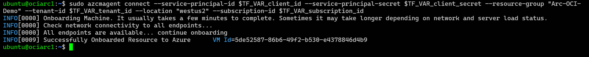

* When complete, your VM will be registered with Azure Arc and visible in the resource group inside Azure Portal.

## Delete the deployment

* To delete all the resources you created as part of this demo use the ```terraform destroy --auto-approve``` command as shown below.

  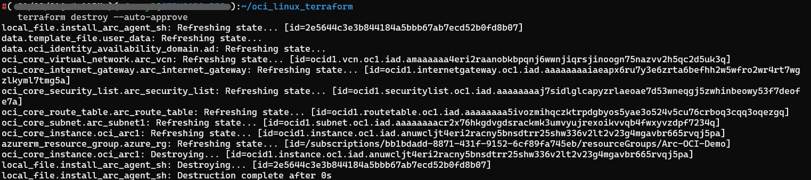

* Alternatively, you can delete the OCI Virtual Machine instance directly by terminating it from the [OCI Console](https://cloud.oracle.com/compute/instances). Note that it will take a few minutes for the instance to actually be removed.

  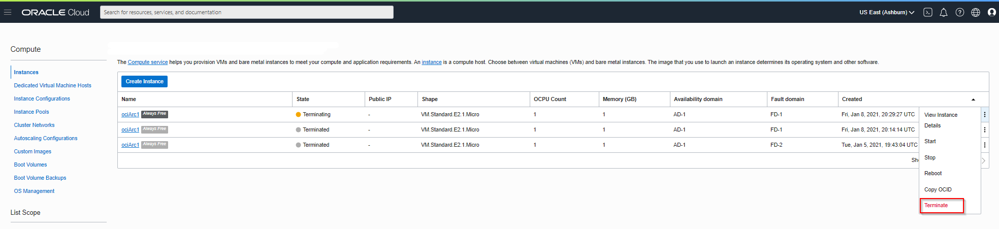

* If you delete the instance manually, then you should also delete *./scripts/install_arc_agent.sh* which is created by the Terraform plan.
