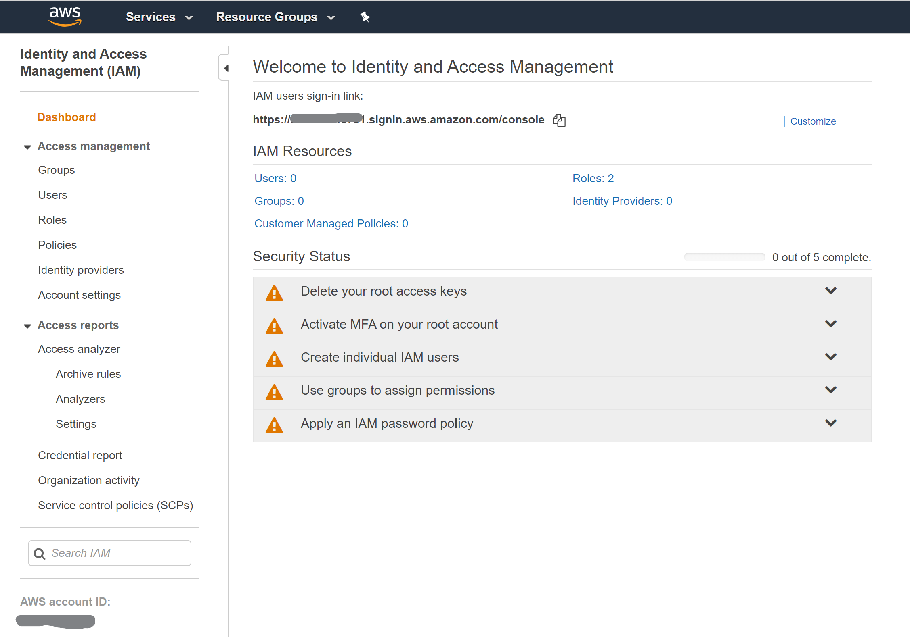
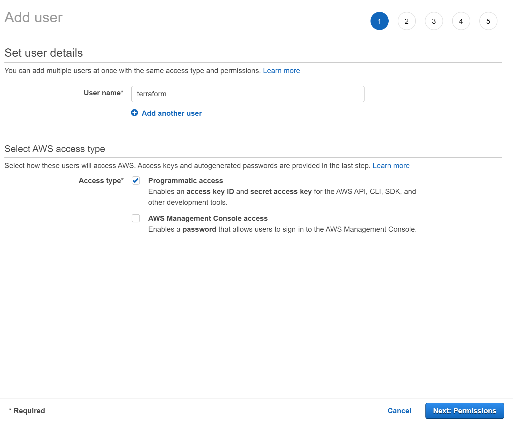
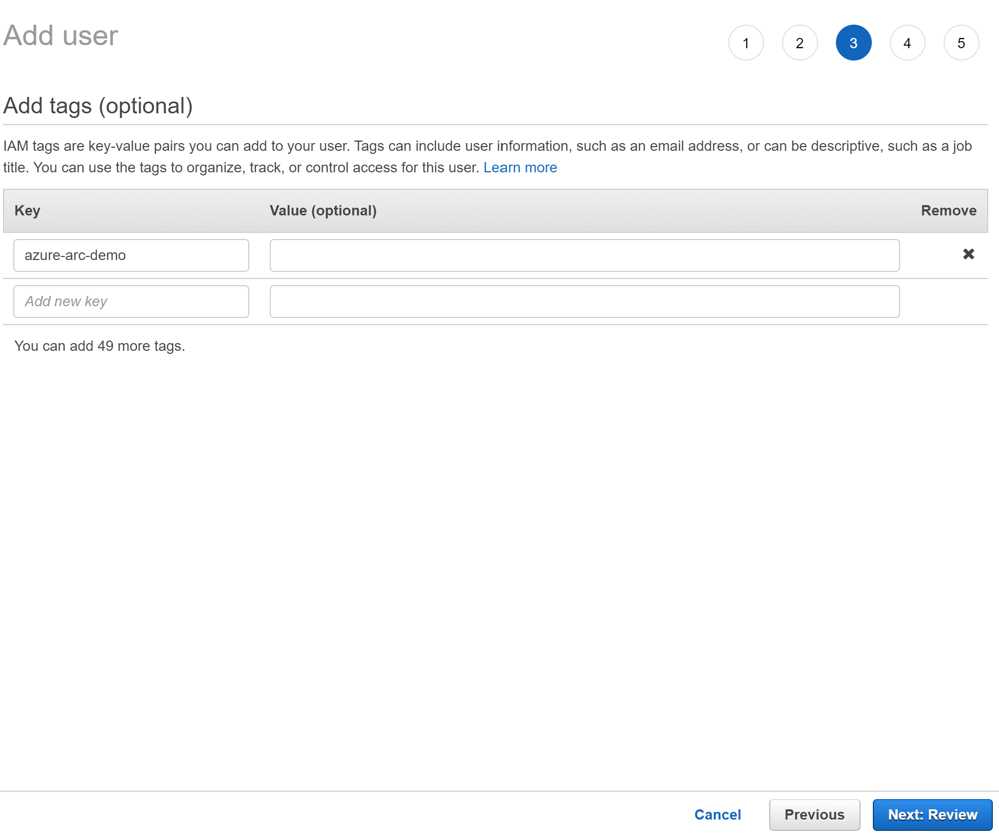

## Dynamic scaled onboarding of AWS EC2 instances to Azure Arc using Ansible

The following README will guide you on how to automatically perform scaled onboarding of AWS EC2 instances to Azure Arc by using [Ansible](https://www.ansible.com/).

This guide assumes that you have a basic understanding of Ansible. A basic Ansible playbook and configuration is provided that uses the [amazon.aws.aws_ec2](https://docs.ansible.com/ansible/latest/collections/amazon/aws/aws_ec2_inventory.html) plugin for dynamic loading of EC2 server inventory.

This guide can be used even if you do not already have an existing Ansible test environment and includes a Terraform plan that will create a sample AWS EC2 server inventory comprised of four (4) Windows Server 2019 servers and four (4) Ubuntu servers along with a basic CentOS 7 Ansible control server with a simple configuration.

***Warning***: *The provided Ansible sample workbook uses WinRM with password authentication and HTTP to configure Windows-based servers. This is not advisable for production environments. If you are planning to use Ansible with Windows hosts in a production environment then you should use [WinRM over HTTPS](https://docs.microsoft.com/en-us/troubleshoot/windows-client/system-management-components/configure-winrm-for-https) with a certificate.*

## Prerequisites

* Clone the Azure Arc Jumpstart repository

    ```shell
    git clone https://github.com/microsoft/azure_arc.git
    ```

* [Install or update Azure CLI to version 2.15.0 and above](https://docs.microsoft.com/en-us/cli/azure/install-azure-cli?view=azure-cli-latest). Use the below command to check your current installed version.

  ```shell
  az --version
  ```

* [Generate SSH Key](https://help.github.com/articles/generating-a-new-ssh-key-and-adding-it-to-the-ssh-agent/) (or use existing ssh key)

* [Create free AWS account](https://aws.amazon.com/premiumsupport/knowledge-center/create-and-activate-aws-account/)

* [Install Terraform >=0.13](https://learn.hashicorp.com/terraform/getting-started/install.html)

* Create Azure service principal (SP)

    To connect the AWS virtual machine to Azure Arc, an Azure service principal assigned with the "Contributor" role is required. To create it, login to your Azure account run the below command (this can also be done in [Azure Cloud Shell](https://shell.azure.com/)).

    ```shell
    az login
    subscriptionId=$(az account show --query id --output tsv)
    az ad sp create-for-rbac -n "<Unique SP Name>" --role "Contributor" --scopes /subscriptions/$subscriptionId
    ```

    For example:

    ```shell
    az login
    subscriptionId=$(az account show --query id --output tsv)
    az ad sp create-for-rbac -n "JumpstartArc" --role "Contributor" --scopes /subscriptions/$subscriptionId
    ```

    Output should look like this:

    ```json
    {
    "appId": "XXXXXXXXXXXXXXXXXXXXXXXXXXXX",
    "displayName": "JumpstartArc",
    "password": "XXXXXXXXXXXXXXXXXXXXXXXXXXXX",
    "tenant": "XXXXXXXXXXXXXXXXXXXXXXXXXXXX"
    }
    ```

    > **NOTE: If you create multiple subsequent role assignments on the same service principal, your client secret (password) will be destroyed and recreated each time. Therefore, make sure you grab the correct password**.

    > **NOTE: The Jumpstart scenarios are designed with as much ease of use in-mind and adhering to security-related best practices whenever possible. It is optional but highly recommended to scope the service principal to a specific [Azure subscription and resource group](https://docs.microsoft.com/cli/azure/ad/sp?view=azure-cli-latest) as well considering using a [less privileged service principal account](https://docs.microsoft.com/azure/role-based-access-control/best-practices)**

* Azure Arc-enabled servers depends on the following Azure resource providers in your subscription in order to use this service. Registration is an asynchronous process, and registration may take approximately 10 minutes.

  * Microsoft.HybridCompute
  * Microsoft.GuestConfiguration

      ```shell
      az provider register --namespace 'Microsoft.HybridCompute'
      az provider register --namespace 'Microsoft.GuestConfiguration'
      ```

      You can monitor the registration process with the following commands:

      ```shell
      az provider show --namespace 'Microsoft.HybridCompute'
      az provider show --namespace 'Microsoft.GuestConfiguration'
      ```

## Create an AWS identity

In order for Terraform to create resources in AWS, we will need to create a new AWS IAM role with appropriate permissions and configure Terraform to use it.

* Login to the [AWS management console](https://console.aws.amazon.com)

* After logging in, click the "Services" dropdown in the top left. Under "Security, Identity, and Compliance" select "IAM" to access the [Identity and Access Management page](https://console.aws.amazon.com/iam/home)

    

    

* Click on "Users" from the left menu and then click on "Add user" to create a new IAM user.

    

* On the "Add User" screen, name the user "terraform" and select the "Programmatic Access" checkbox then click "Next"

    

* On the next "Set Permissions" screen, select "Attach existing policies directly" and then check the box next to AmazonEC2FullAccess as seen in the screenshot then click "Next"

    

* On the tags screen, assign a tag with a key of "azure-arc-demo" and click "Next" to proceed to the Review screen.

    

* Double check that everything looks correct and click "Create user" when ready.

    

* After the user is created, you will see the user's Access key ID and Secret access key. Copy these values down before clicking the Close button. In the screen below, you can see an example of what this should look like. Once you have these keys, you will be able to use them with Terraform to create AWS resources.

    

## Option 1- Creating a sample AWS server inventory and Ansible control server using Terraform and onboarding the servers to Azure Arc

**Note: If you already have an existing AWS server inventory and Ansible server, skip below to Option 2.**

### Configure Terraform

Before executing the Terraform plan, you must export the environment variables which will be used by the plan. These variables are based on your Azure subscription and tenant, the Azure service principal, and the AWS IAM user and keys you just created.

* Retrieve your Azure subscription ID and tenant ID using the ```az account list``` command.

* The Terraform plan creates resources in both Microsoft Azure and AWS. It then executes a script on an AWS EC2 virtual machine to install Ansible and all necessary artifacts. This Terraform plan requires certain information about your AWS and Azure environments which it accesses using environment variables. Edit [*scripts/vars.sh*](https://github.com/microsoft/azure_arc/blob/main/azure_arc_servers_jumpstart/aws/scaled_deployment/ansible/terraform/scripts/vars.sh) and update each of the variables with the appropriate values.

  * TF_VAR_subscription_id=Your Azure subscription ID
  * TF_VAR_client_id=Your Azure service principal app id
  * TF_VAR_client_secret=Your Azure service principal password
  * TF_VAR_tenant_id=Your Azure tenant ID
  * AWS_ACCESS_KEY_ID=AWS access key
  * AWS_SECRET_ACCESS_KEY=AWS secret key

* From your shell, navigate to the *azure_arc_servers_jumpstart/aws/scaled_deployment/ansible/terraform*) directory of the cloned repo.

* Export the environment variables you edited by running [*scripts/vars.sh*](https://github.com/microsoft/azure_arc/blob/main/azure_arc_servers_jumpstart/aws/scaled_deployment/ansible/terraform/scripts/vars.sh) with the source command as shown below. Terraform requires these to be set for the plan to execute properly.

    ```shell
    source ./scripts/vars.sh
    ```

* Make sure your SSH keys are available in *~/.ssh* and named *id_rsa.pub* and *id_rsa*. If you followed the ssh-keygen guide above to create your key then this should already be setup correctly. If not, you may need to modify [*aws_infra.tf*](https://github.com/microsoft/azure_arc/blob/main/azure_arc_servers_jumpstart/aws/scaled_deployment/ansible/terraform/aws_infra.tf) to use a key with a different path.

* Run the ```terraform init``` command which will download the required Terraform providers.

    

### Deploy server infrastructure

* From the *azure_arc_servers_jumpstart/aws/scaled_deployment/ansible/terraform* directory, run ```terraform apply --auto-approve``` and wait for the plan to finish. Upon successful completion, you will have four (4) Windows Server 2019 servers, four (4) Ubuntu servers, and one (1) CentOS 7 Ansible control server.

* Open the AWS console and verify you can see the created servers.

    

### Run the Ansible playbook to onboard the AWS EC2 instances as Azure Arc-enabled servers

* When the Terraform plan completes, it will display the public IP of the Ansible control server in an output variable named *ansible_ip*. SSH into the Ansible server by running the ```ssh centos@XX.XX.XX.XX``` where XX.XX.XX.XX is substituted for your Ansible server's IP address.

    

* Change directory to the *ansible* directory by running ```cd ansible```. This folder contains the sample Ansible configuration and the playbook we will use to onboard the servers to Azure Arc.

    

* The aws_ec2 Ansible plugin requires AWS credentials to dynamically read your AWS server inventory. We will export these as environment variables. Run the commands below, replacing the values for AWS_ACCESS_KEY_ID and AWS_SECRET_ACCESS_KEY with AWS credentials you created earlier.

    ```shell
    export AWS_ACCESS_KEY_ID="XXXXXXXXXXXXXXXXX"
    export AWS_SECRET_ACCESS_KEY="XXXXXXXXXXXXXXX"
    ```

* Replace the placeholder values for Azure tenant ID and subscription id in the [group_vars/all.yml](https://github.com/microsoft/azure_arc/blob/main/azure_arc_servers_jumpstart/aws/scaled_deployment/ansible/terraform/ansible_config/group_vars/all.yml) with the appropriate values for your environment.

    

* Run the Ansible playbook by executing the following command, substituting your Azure service principal id and service principal secret.

    ```shell
    ansible-playbook arc_agent.yml -i ansible_plugins/inventory_uswest2_aws_ec2.yml --extra-vars '{"service_principal_id": "XXXXXXX-XXXXX-XXXXXXX", "service_principal_secret": "XXXXXXXXXXXXXXXXXXXXXXXX"}'
    ```

    If the playbook run is successful, you should see output similar to the below screenshot.

    

* Open Azure Portal and navigate to the Arc-AWS-Demo resource group. You should see the Azure Arc-enabled servers listed.

    

### Clean up environment by deleting resources

To delete all the resources you created as part of this demo use the ```terraform destroy --auto-approve``` command as shown below.


## Option 2 - Onboarding an existing AWS server inventory to Azure Arc using your own Ansible control server

> **Note: If you do not have an existing AWS server inventory and Ansible server, navigate back to Option 1**

### Review provided Ansible configuration and playbook

Navigate to the *ansible_config* directory and review the provided configuration. The provided configuration contains a basic *ansible.cfg* file. This file enables the [amazon.aws.aws_ec2](https://docs.ansible.com/ansible/latest/collections/amazon/aws/aws_ec2_inventory.html) Ansible plugin which dynamically loads your server inventory by using an AWS IAM role. Ensure that the IAM role you are using has sufficient privileges to access the inventory you wish to onboard.


The file [inventory_uswest2_aws_ec2.yml](https://github.com/microsoft/azure_arc/blob/main/azure_arc_servers_jumpstart/aws/scaled_deployment/ansible/terraform/ansible_config/ansible_plugins/inventory_uswest2_aws_ec2.yml) configures the aws_ec2 plugin to pull inventory from uswest-2 region and group assets by applied tags. Adjust this file as needed to support onboarding your server inventory (e.g., change region, or change groups or filters).

The files in ***./ansible_config/group_vars*** should be adjusted to provide the credentials you wish to use to onboard various ansible host groups.

When you have adjusted the provided config to support your environment, run the Ansible playbook by executing the following command, substituting your Azure service principal id and service principal secret.

```shell
ansible-playbook arc_agent.yml -i ansible_plugins/inventory_uswest2_aws_ec2.yml --extra-vars '{"service_principal_id": "XXXXXXX-XXXXX-XXXXXXX", "service_principal_secret": "XXXXXXXXXXXXXXXXXXXXXXXX"}'
```

If the playbook run is successful, you should see output similar to the below screenshot.


Open Azure Portal and navigate to the Arc-Aws-Demo resource group. You should see the Azure Arc-enabled servers listed.


