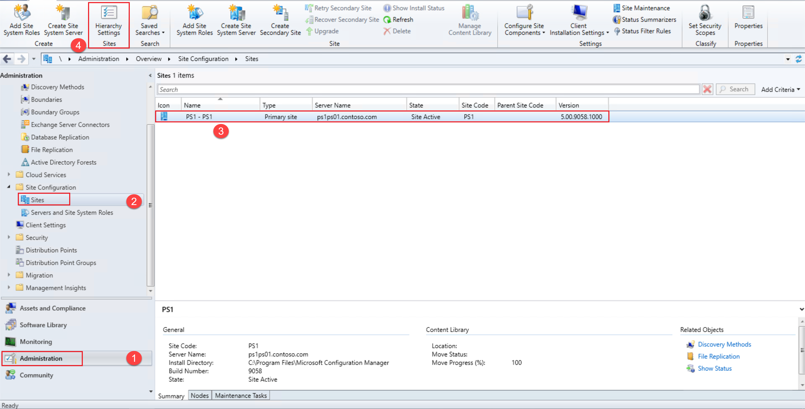
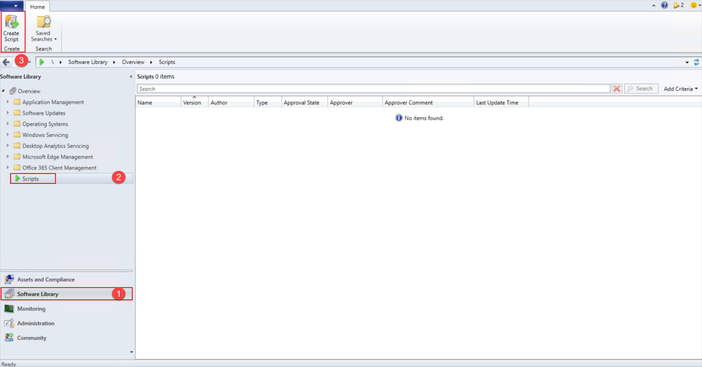

## Connect an existing Windows server to Azure Arc using Configuration Manager with PowerShell

The following README will guide you on how to connect a Windows machine to Azure Arc with a PowerShell script using Configuration Manager.

This guide assumes that you already have an installation of [Microsoft Configuration Manager](https://docs.microsoft.com/en-us/mem/configmgr/core/understand/introduction), at least one active Windows server client, and a basic understanding of the product.

## Prerequisites

- Make sure you have met all the Configuration Manager [prerequisites](https://docs.microsoft.com/mem/configmgr/apps/deploy-use/create-deploy-scripts#prerequisites) in order to use the "Run Script" feature.

- [Install or update Azure CLI to version 2.25.0 and above](https://docs.microsoft.com/en-us/cli/azure/install-azure-cli?view=azure-cli-latest). Use the below command to check your current installed version.

  ```shell
  az --version
  ```

- Create Azure service principal (SP)

    To connect a server to Azure Arc, an Azure service principal assigned with the "Contributor" role is required. To create it, login to your Azure account run the below command (this can also be done in [Azure Cloud Shell](https://shell.azure.com/)).

    ```shell
    az login
    subscriptionId=$(az account show --query id --output tsv)
    az ad sp create-for-rbac -n "<Unique SP Name>" --role "Contributor" --scopes /subscriptions/$subscriptionId
    ```

    For example:

    ```shell
    az login
    subscriptionId=$(az account show --query id --output tsv)
    az ad sp create-for-rbac -n "JumpstartArc" --role "Contributor" --scopes /subscriptions/$subscriptionId
    ```

    Output should look like this:

    ```json
    {
    "appId": "XXXXXXXXXXXXXXXXXXXXXXXXXXXX",
    "displayName": "JumpstartArc",
    "password": "XXXXXXXXXXXXXXXXXXXXXXXXXXXX",
    "tenant": "XXXXXXXXXXXXXXXXXXXXXXXXXXXX"
    }
    ```

    > **NOTE: If you create multiple subsequent role assignments on the same service principal, your client secret (password) will be destroyed and recreated each time. Therefore, make sure you grab the correct password**.

    > **NOTE: The Jumpstart scenarios are designed with as much ease of use in-mind and adhering to security-related best practices whenever possible. It is optional but highly recommended to scope the service principal to a specific [Azure subscription and resource group](https://docs.microsoft.com/cli/azure/ad/sp?view=azure-cli-latest) as well considering using a [less privileged service principal account](https://docs.microsoft.com/azure/role-based-access-control/best-practices)**

- Azure Arc-enabled servers depends on the following Azure resource providers in your subscription in order to use this service. Registration is an asynchronous process, and registration may take approximately 10 minutes.

  - Microsoft.HybridCompute
  - Microsoft.GuestConfiguration

      ```shell
      az provider register --namespace 'Microsoft.HybridCompute'
      az provider register --namespace 'Microsoft.GuestConfiguration'
      ```

      You can monitor the registration process with the following commands:

      ```shell
      az provider show --namespace 'Microsoft.HybridCompute'
      az provider show --namespace 'Microsoft.GuestConfiguration'
      ```

- Create a new Azure resource group where you want your machine(s) to show up.

    

- Download the [_az_connect_win_](https://github.com/microsoft/azure_arc/blob/main/azure_arc_servers_jumpstart/scripts/az_connect_win.ps1) PowerShell script.

- Change the environment variables according to your environment and save the script.

    

## Setting the PowerShell execution policy in Configuration Manager

In order for Configuration Manager to run the PowerShell script in this scenario, we will need to set the PowerShell execution policy and allow the script authors to approve their own scripts.

   > **Note: The Jumpstart scenarios are designed with as much ease of use in-mind and adhering to security-related best practices whenever possible. It is recommended to follow the security recommendations in your organization when it comes to PowerShell scripts execution policy and approvals**

- Login to the Configuration Manager console.

- After logging in, go to the “Administration” workspace. Under “Site Configuration”, select “Client Settings” and open the properties of the "Default Client Settings".

   > **Note: You might have different client settings, choose the appropriate one that is deployed to the servers you are onboarding to Azure Arc**

    

- Click the “Computer Agent” settings, change the “PowerShell execution policy” to “Bypass”.

    

## Configuration of the PowerShell script approval settings in Configuration Manager

- Go to the “Administration” workspace. Under “Site Configuration”, select “Sites” and select the Configuration Manager site. Click on “Hierarchy Settings”.

    

- In the “General” tab, uncheck the “Script authors require additional script approver” option.

    

## Deployment

- Go to the “Software Library” workspace. Click on “Create Script”.

    

- Provide a name to the script. Paste the content of the [_az_connect_win_](https://github.com/microsoft/azure_arc/blob/main/azure_arc_servers_jumpstart/scripts/az_connect_win.ps1) PowerShell script you downloaded earlier. Click “Next” and “Close”.

    

- Select the script and click “Approve/Deny”. Proceed to approve the script and close.

    

    

- Go to the “Assets and Compliance” workspace. Expand on “Device Collections” and select the collection that contains the server(s) you want to onboard. Right-click the collection and click on “Run Script”.

    

- Select the script you created and click “Next”. Wait for the script to finish execution.

    

    

    

- Click on the “Run Details” tab. Double click on “Script Output” to see the output of the script.

    

    

- Upon completion, you will have your Windows server, connected as a new Azure Arc-enabled server resource inside your resource group.

    

    

## Delete the deployment

The most straightforward way is to delete the server via the Azure Portal, just select server and delete it.


If you want to delete the entire environment, just delete the Azure resource group.


