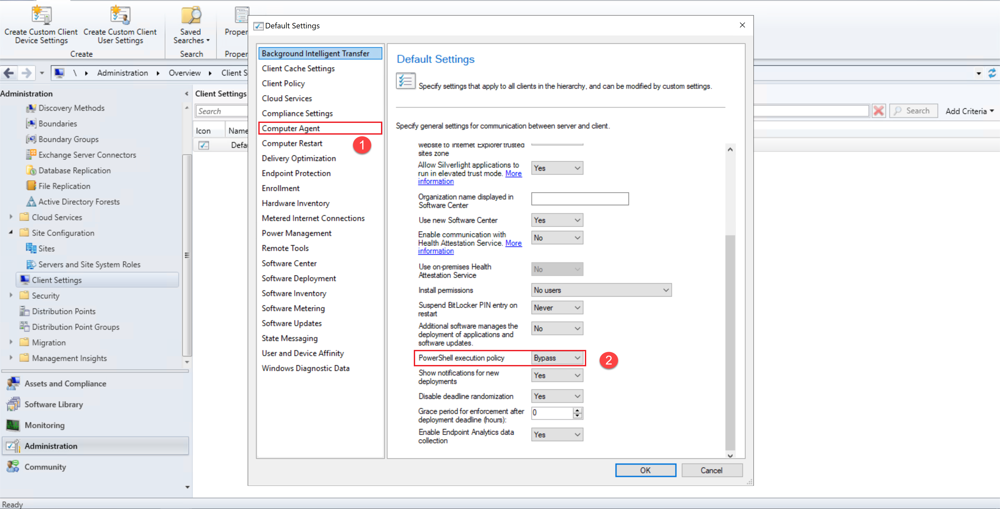

## Connect an existing Windows server to Azure Arc using Configuration Manager with PowerShell

The following README will guide you on how to connect an Windows machine to Azure Arc with a PowerShell script using Configuration Manager.

This guide assumes that you already have an installation of Microsoft Configuration Manager, at least one Windows server client connecting to it and a basic understanding of the product.
## Prerequisites

* Make sure you have all the Configuration Manager [pre-requisites](https://docs.microsoft.com/mem/configmgr/apps/deploy-use/create-deploy-scripts#prerequisites) in place to use the "Run Script" feature.
* [Install or update Azure CLI to version 2.25.0 and above](https://docs.microsoft.com/en-us/cli/azure/install-azure-cli?view=azure-cli-latest). Use the below command to check your current installed version.

  ```shell
  az --version
  ```

* Enable subscription with the resource provider for Azure Arc-enabled Servers. Registration is an asynchronous process, and registration may take approximately 10 minutes.

  ```shell
  az provider register --namespace Microsoft.HybridCompute
  ```

  You can monitor the registration process with the following commands:

    ```shell
    az provider show -n Microsoft.HybridCompute -o table
    ```

* Create Azure service principal (SP)

    To connect a server to Azure Arc, an Azure service principal assigned with the "Contributor" role is required. To create it, login to your Azure account run the below command (this can also be done in [Azure Cloud Shell](https://shell.azure.com/)).

    ```shell
    az login
    az ad sp create-for-rbac -n "<Unique SP Name>" --role contributor
    ```

    For example:

    ```shell
    az ad sp create-for-rbac -n "http://AzureArcServers" --role contributor
    ```

    Output should look like this:

    ```json
    {
    "appId": "XXXXXXXXXXXXXXXXXXXXXXXXXXXX",
    "displayName": "AzureArcServers",
    "name": "http://AzureArcServers",
    "password": "XXXXXXXXXXXXXXXXXXXXXXXXXXXX",
    "tenant": "XXXXXXXXXXXXXXXXXXXXXXXXXXXX"
    }
    ```

    > **Note: The Jumpstart scenarios are designed with as much ease of use in-mind and adhering to security-related best practices whenever possible. It is optional but highly recommended to scope the service principal to a specific [Azure subscription and resource group](https://docs.microsoft.com/en-us/cli/azure/ad/sp?view=azure-cli-latest) as well considering using a [less privileged service principal account](https://docs.microsoft.com/en-us/azure/role-based-access-control/best-practices)**

* Create a new Azure resource group where you want your machine(s) to show up.

    

* Download the [az_connect_win](https://github.com/microsoft/azure_arc/blob/main/azure_arc_servers_jumpstart/scripts/az_connect_win.ps1) PowerShell script.

* Change the environment variables according to your environment and save the script.

    

## Setting the PowerShell execution policy in Configuration Manager

In order for Configuration Manager to run the PowerShell script in this scenario, we will need to set the PowerShell execution policy and allow the script authors to approve their own scripts.

   > **Note: The Jumpstart scenarios are designed with as much ease of use in-mind and adhering to security-related best practices whenever possible. It is recommended to follow the security recommendations in your organization when it comes to PowerShell scripts execution policy and approvals**

* Login to the Configuration Manager console.

* After logging in, click the “Administration” dropdown . Under “Site Configuration”, select “Client Settings” and open the properties of the "Default Client Settings".

   > **Note: You might have different client settings, choose the appropriate one that is deployed to the servers you are onboarding to Azure Arc**

    

* Click the “Computer Agent” settings, change the “PowerShell execution policy” to “Bypass”.

    

## Configuration of the PowerShell script approval settings in Configuration Manager

* 

## Deployment