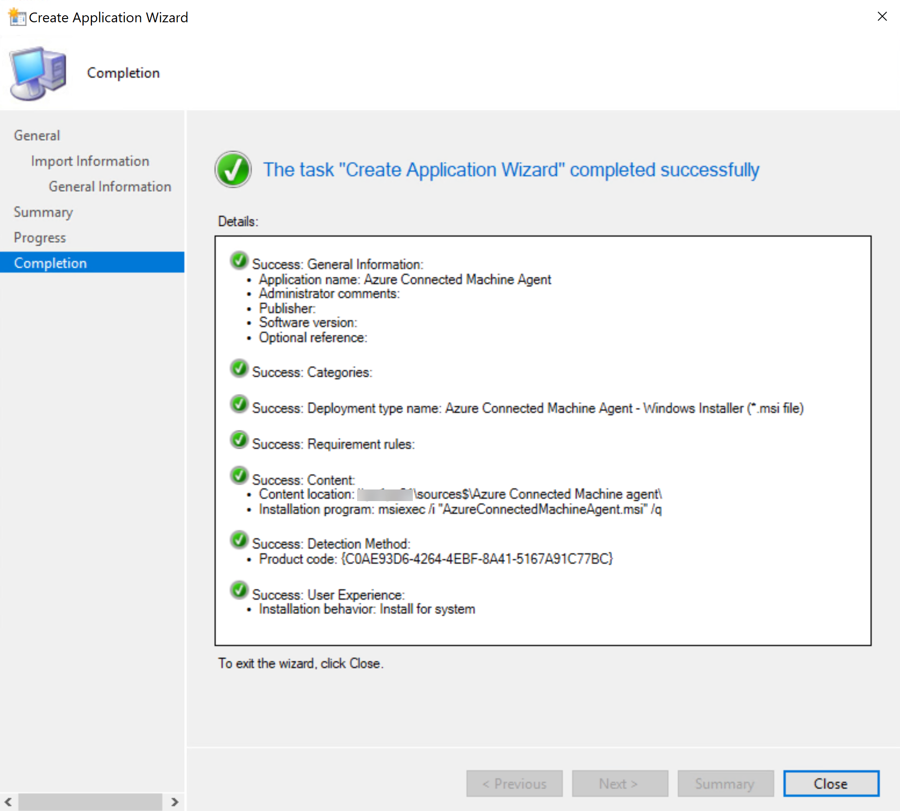
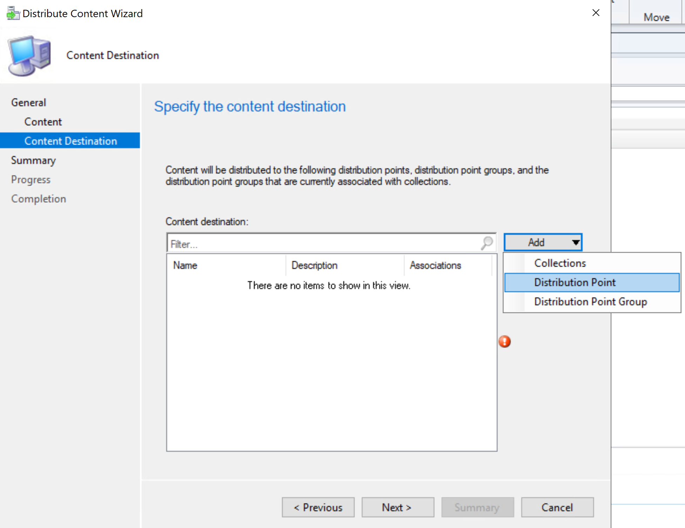
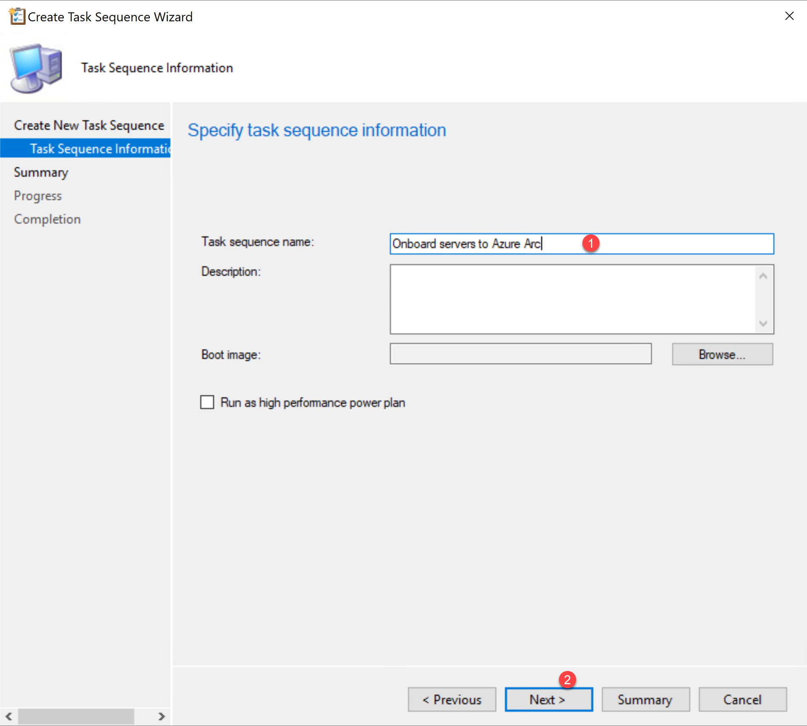

## Connect an existing Windows server to Azure Arc using Configuration Manager with a Task Sequence

The following README will guide you on how to connect a Windows machine to Azure Arc with a Task Sequence using Configuration Manager.

This guide assumes that you already have an installation of [Microsoft Configuration Manager](https://docs.microsoft.com/en-us/mem/configmgr/core/understand/introduction) and a basic understanding of the product, at least one active Windows server client, an active distribution point.

## Prerequisites

- [Install or update Azure CLI to version 2.25.0 and above](https://docs.microsoft.com/en-us/cli/azure/install-azure-cli?view=azure-cli-latest). Use the below command to check your current installed version.

  ```shell
  az --version
  ```

- Enable subscription with the resource provider for Azure Arc-enabled Servers. Registration is an asynchronous process, and registration may take approximately 10 minutes.

  ```shell
  az provider register --namespace Microsoft.HybridCompute
  ```

You can monitor the registration process with the following commands:

```shell
az provider show -n Microsoft.HybridCompute -o table
```

- Create Azure service principal (SP)

    To connect a server to Azure Arc, an Azure service principal assigned with the "Contributor" role is required. To create it, login to your Azure account run the below command (this can also be done in [Azure Cloud Shell](https://shell.azure.com/)).

    ```shell
    az login
    az ad sp create-for-rbac -n "<Unique SP Name>" --role contributor
    ```

    For example:

    ```shell
    az ad sp create-for-rbac -n "http://AzureArcServers" --role contributor
    ```

    Output should look like this:

    ```json
    {
    "appId": "XXXXXXXXXXXXXXXXXXXXXXXXXXXX",
    "displayName": "AzureArcServers",
    "name": "http://AzureArcServers",
    "password": "XXXXXXXXXXXXXXXXXXXXXXXXXXXX",
    "tenant": "XXXXXXXXXXXXXXXXXXXXXXXXXXXX"
    }
    ```

    > **Note: The Jumpstart scenarios are designed with as much ease of use in-mind and adhering to security-related best practices whenever possible. It is optional but highly recommended to scope the service principal to a specific [Azure subscription and resource group](https://docs.microsoft.com/en-us/cli/azure/ad/sp?view=azure-cli-latest) as well considering using a [less privileged service principal account](https://docs.microsoft.com/en-us/azure/role-based-access-control/best-practices)**

- Create a new Azure resource group where you want your machine(s) to show up.

    

- Download the [_az_connect_win_ConfigMgr_](https://github.com/microsoft/azure_arc/blob/main/azure_arc_servers_jumpstart/scripts/az_connect_win_ConfigMgr.ps1) PowerShell script.

- Change the environment variables according to your environment and save the script.

    

## Creating an msi application to deploy the Azure Connected Machine agent within the Task Sequence

- Download the Azure Connected Machine agent package for Windows from the [Microsoft Download Center](https://aka.ms/AzureConnectedMachineAgent) and copy it to the Configuration Manager server.

- Login to the Configuration Manager console.

- After logging in, go to the “Software Library” workspace. Under “Application Management”, click  “Applications” and click "Create Application".

    

- Browse to the location of the downloaded Azure Connected Machine agent MSI package and click “Next”.

    

- Add any relevant information about this application. Keep the defaults for the installation program and install behavior and click “Next” to finalize the application.

    

    

- Select the newly created application and click on “Distribute Content”.

    

- Keep the defaults and click “Next”.

    

- Make sure to have the Azure Connected Machine agent application selected click “Next”.

    

- Click “Add”, select “Distribution Point” and select one or more distribution points where you would like to distribute the application.

    

    

- Click “Next” to finalize the wizard and initiate the content distribution.

    

## Creating a custom Task Sequence for the Azure Connected Machine agent deployment

In order for Configuration Manager to onboard servers in this scenario, we will need to create a custom Task Sequence that has two steps; first to deploy the Azure Connected Machine agent as an application and second to run the “azcmagent connect” command to onboard to Azure Arc.

- Go to the “Software Library” workspace. Under “Operating Systems”, select “Task Sequences”, click "Create Task Sequence" and select “Create a new custom task sequence”.

    

- Give the Task Sequence and name, leave all the defaults and click “Next” to finalize the wizard.

    

- Select the newly created Task Sequence and Click “Edit” to open the Task Sequence editor.

    

- Click “Add” to add a new Task Sequence step, select “Software” and click on “Install Application”.

    

- Give the step a name, and click the “edit” button to select the Azure Connected Machine agent application.

    

    

- Click “Add” to add a new Task Sequence step, select “General” and click on “Run PowerShell Script”.

    

- Give the step a name, “Select the PowerShell execution policy” to be Bypass, select the option to “Enter a PowerShell script” and click “Add Script”.

    

-  Paste the content of the [_az_connect_win_ConfigMgr_](https://github.com/microsoft/azure_arc/blob/main/azure_arc_servers_jumpstart/scripts/az_connect_win_ConfigMgr.ps1) PowerShell script you downloaded earlier and click “Ok”.

    

- Click “Ok” to finalize the task sequence.

    

## Deployment

- Go to the “Assets and Compliance” workspace. Expand on “Device Collections” and select the collection that contains the server(s) you want to onboard. Click “Deploy” and click “Task Sequence”.

    

- Click on “Browse” and select the Task Sequence created.

    

- Choose the deployment to be available (the deployment can be required or available based on your scenario). 

    

- Keep the defaults and finalize the Task Sequence deployment wizard.

- Connect to the server to be onboarded and open “Software Center”. After the server's machine policy has been refreshed, you should see the Task Sequence deployment in the Applications available in Software Center.

    

- Click on the Task Sequence deployment and click “Install”.

    

- The progress of the Task Sequence will be displayed showing the two steps we created.

    

    

    

- Upon completion, you will have your Windows server, connected as a new Azure Arc-enabled server resource inside your resource group.

    

    

## Delete the deployment

The most straightforward way is to delete the server via the Azure Portal, just select server and delete it.


If you want to delete the entire environment, just delete the Azure resource group.


