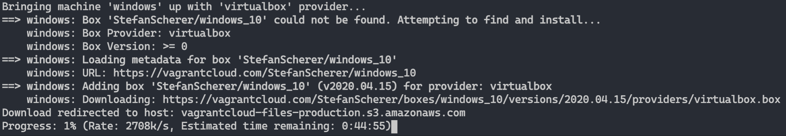
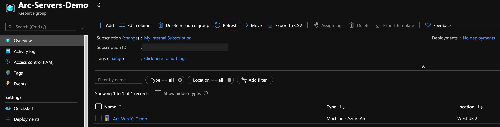
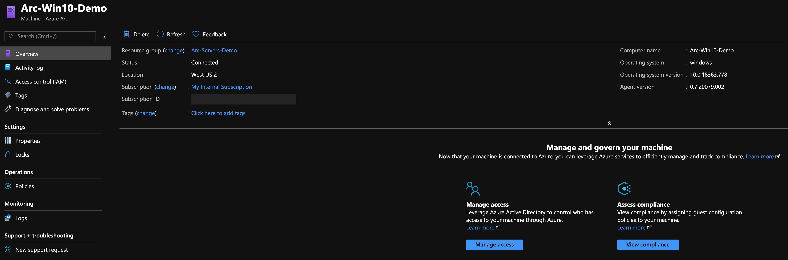
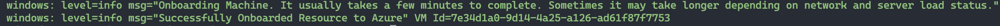
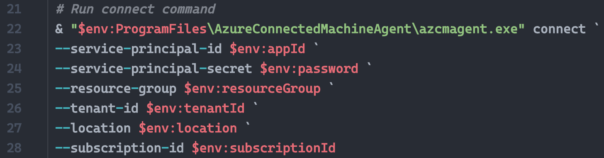
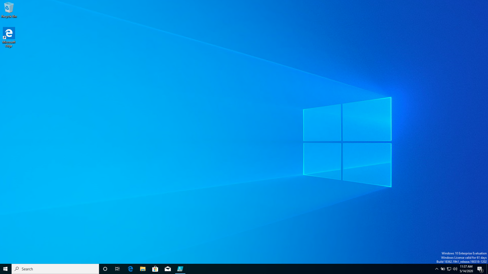
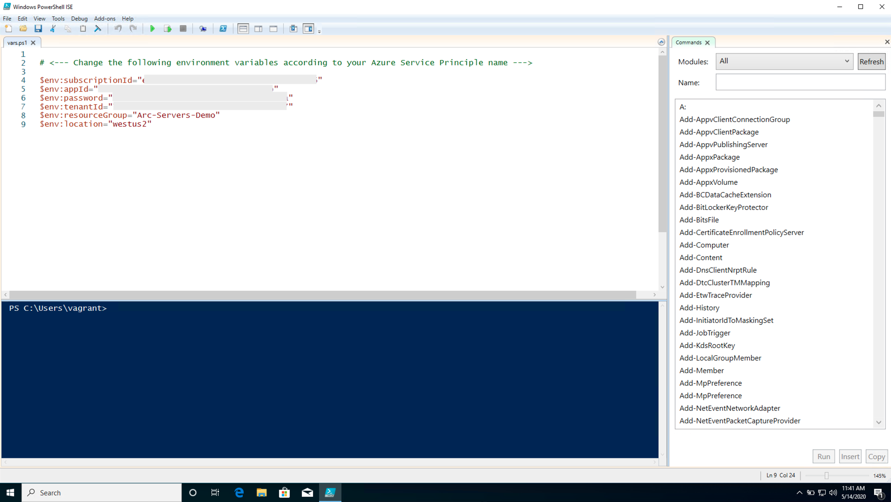
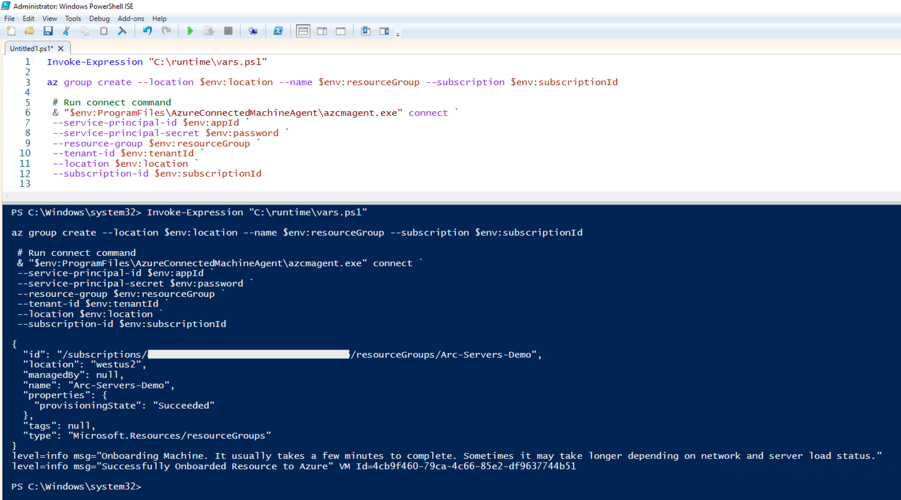
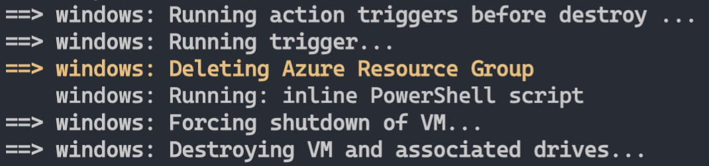

## Deploy a local Windows server hosted with Vagrant and connect it to Azure Arc

The following README will guide you on how to deploy a local **Windows 10** virtual machine using [Vagrant](https://www.vagrantup.com/) and connect it as an Azure Arc-enabled server resource.

## Prerequisites

* Clone the Azure Arc Jumpstart repository

    ```shell
    git clone https://github.com/microsoft/azure_arc.git
    ```

* [Install or update Azure CLI to version 2.15.0 and above](https://docs.microsoft.com/en-us/cli/azure/install-azure-cli?view=azure-cli-latest). Use the below command to check your current installed version.

  ```shell
  az --version
  ```

* Vagrant relies on an underlying hypervisor. For the purpose of this guide, we will be using "Oracle VM VirtualBox".

  * Install [VirtualBox](https://www.virtualbox.org/wiki/Downloads).

    * If you are an OSX user, simply run ```brew cask install virtualbox```
    * If you are a Windows user, you can use the [Chocolatey package](https://chocolatey.org/packages/virtualbox)
    * If you are a Linux user, all package installation methods can be found [here](https://www.virtualbox.org/wiki/Linux_Downloads)

  * Install [Vagrant](https://www.vagrantup.com/docs/installation/)

    * If you are an OSX user, simply run ```brew cask install vagrant```
    * If you are a Windows user, you can use the [Chocolatey package](https://chocolatey.org/packages/vagrant)
    * If you are a Linux user, look [here](https://www.vagrantup.com/downloads.html)

* Create Azure service principal (SP)

    To connect the Vagrant virtual machine to Azure Arc, an Azure service principal assigned with the "Contributor" role is required. To create it, login to your Azure account run the below command (this can also be done in [Azure Cloud Shell](https://shell.azure.com/)).

    ```shell
    az login
    az ad sp create-for-rbac -n "<Unique SP Name>" --role contributor
    ```

    For example:

    ```shell
    az ad sp create-for-rbac -n "http://AzureArcServers" --role contributor
    ```

    Output should look like this:

    ```json
    {
    "appId": "XXXXXXXXXXXXXXXXXXXXXXXXXXXX",
    "displayName": "AzureArcServers",
    "name": "http://AzureArcServers",
    "password": "XXXXXXXXXXXXXXXXXXXXXXXXXXXX",
    "tenant": "XXXXXXXXXXXXXXXXXXXXXXXXXXXX"
    }
    ```

    > **Note: The Jumpstart scenarios are designed with as much ease of use in-mind and adhering to security-related best practices whenever possible. It is optional but highly recommended to scope the service principal to a specific [Azure subscription and resource group](https://docs.microsoft.com/en-us/cli/azure/ad/sp?view=azure-cli-latest) as well considering using a [less privileged service principal account](https://docs.microsoft.com/en-us/azure/role-based-access-control/best-practices)**

* Azure Arc-enabled servers depends on the following Azure resource providers in your subscription in order to use this service. Registration is an asynchronous process, and registration may take approximately 10 minutes.

  * Microsoft.HybridCompute
  * Microsoft.GuestConfiguration

      ```shell
      az provider register --namespace 'Microsoft.HybridCompute'
      az provider register --namespace 'Microsoft.GuestConfiguration'
      ```

      You can monitor the registration process with the following commands:

      ```shell
      az provider show --namespace 'Microsoft.HybridCompute'
      az provider show --namespace 'Microsoft.GuestConfiguration'
      ```

* The Vagrantfile executes a script on the VM OS to install all the needed artifacts as well to inject environment variables. Edit the [*scripts/vars.ps1*](https://github.com/microsoft/azure_arc/blob/main/azure_arc_servers_jumpstart/local/vagrant/windows/scripts/vars.ps1) PowerShell script to match the Azure service principal you've just created.

  * subscriptionId=Your Azure subscription ID
  * appId=Your Azure service principal name
  * password=Your Azure service principal password
  * tenantId=Your Azure tenant ID
  * resourceGroup=Azure resource group name
  * location=Azure region

## Deployment

Like any Vagrant deployment, a [*Vagrantfile*](https://github.com/microsoft/azure_arc/blob/main/azure_arc_servers_jumpstart/local/vagrant/windows/Vagrantfile) and a [Vagrant Box](https://www.vagrantup.com/docs/boxes.html) is needed. At a high-level, the deployment will:

1. Download the Windows 10 image file [Vagrant Box](https://app.vagrantup.com/StefanScherer/boxes/windows_10)
2. Execute the Arc installation script

After editing the ***scripts/vars.ps1*** script to match your environment, from the *Vagrantfile* folder, run ```vagrant up```. As this is the first time you are creating the VM, the first run will be **much slower** than the ones to follow. This is because the deployment is downloading the Windows 10 box for the first time.



Once the download is complete, the actual provisioning will start. As you can see in the screenshot below, the process takes can take somewhere between 7 to 10 minutes.


Upon completion, you will have a local Windows 10 VM deployed, connected as a new Azure Arc-enabled server inside a new resource group.





## Semi-Automated Deployment (Optional)

As you may noticed, the last step of the run is to register the VM as a new Azure Arc-enabled server resource.



In a case you want to demo/control the actual registration process, to the following:

* In the [*install_arc_agent*](https://github.com/microsoft/azure_arc/blob/main/azure_arc_servers_jumpstart/local/vagrant/windows/scripts/install_arc_agent.ps1) PowerShell script, comment out the "Run connect command" section and save the file. You can also comment out or change the creation of the resource group.

    

    

* RDP the VM using the ```vagrant rdp``` command. Use *vagrant/vagrant* as the username/password.

    

* Open PowerShell ISE **as Administrator** and edit the *C:\runtime\vars.ps1* with your environment variables.

    

* Paste the ```Invoke-Expression "C:\runtime\vars.ps1"``` commmand, the ```az group create --location $env:location --name $env:resourceGroup --subscription $env:subscriptionId``` command and the same *azcmagent connect* command you've just commented and execute the script.

    

## Delete the deployment

To delete the entire deployment, run the ```vagrant destroy -f``` command. The Vagrantfile includes a *before: destroy* Vagrant trigger which will run the command to delete the Azure resource group before destroying the actual VM. That way, you will be starting fresh next time.


