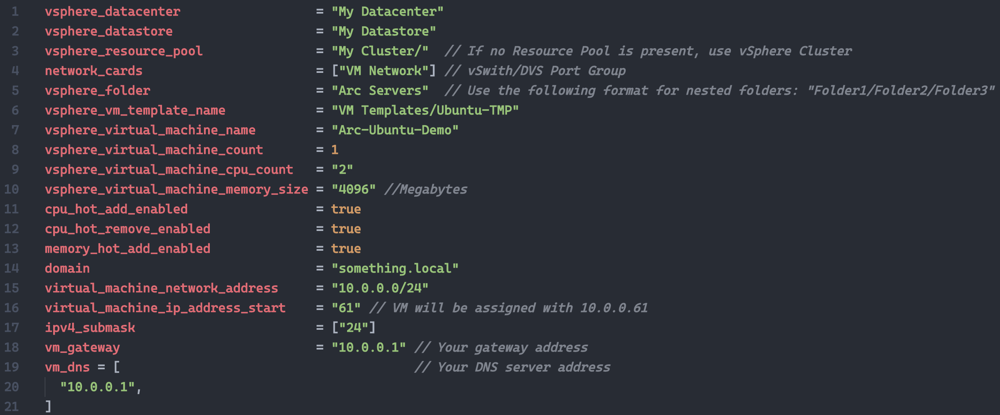
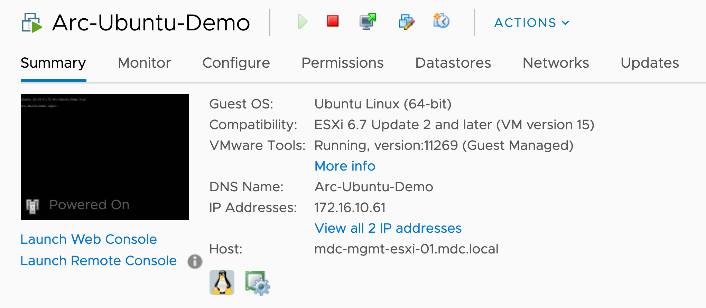
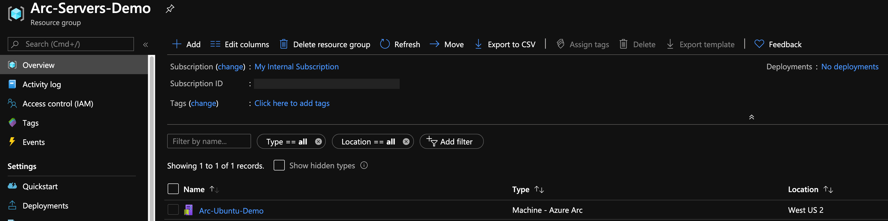
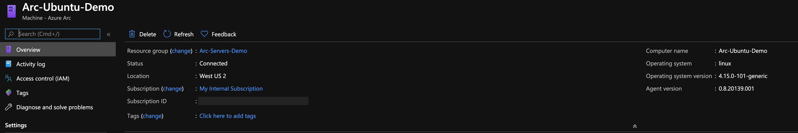
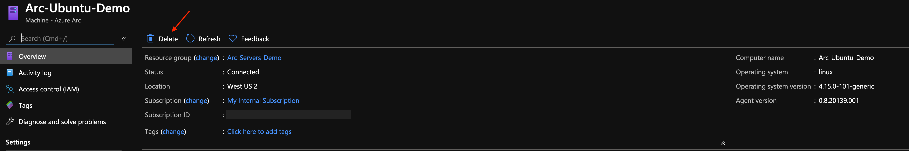

## Deploy a VMware Ubuntu VM and connect it to Azure Arc using Terraform

The following README will guide you on how to use the provided [Terraform](https://www.terraform.io/) plan to deploy an Ubuntu Server, VMware vSphere virtual machine and connect it as an Azure Arc-enabled server resource.

## Prerequisites

* Clone the Azure Arc Jumpstart repository

    ```shell
    git clone https://github.com/microsoft/azure_arc.git
    ```

* [Install or update Azure CLI to version 2.15.0 and above](https://docs.microsoft.com/en-us/cli/azure/install-azure-cli?view=azure-cli-latest). Use the below command to check your current installed version.

  ```shell
  az --version
  ```

* [Install Terraform >=0.12](https://learn.hashicorp.com/terraform/getting-started/install.html)

* A VMware vCenter Server user with [permissions to deploy](https://docs.vmware.com/en/VMware-vSphere/7.0/com.vmware.vsphere.vm_admin.doc/GUID-4D0F8E63-2961-4B71-B365-BBFA24673FDB.html) a Virtual Machine from a Template in the vSphere Web Client.

* Create Azure service principal (SP)

    To connect the VMware vSphere virtual machine to Azure Arc, an Azure service principal assigned with the "Contributor" role is required. To create it, login to your Azure account run the below command (this can also be done in [Azure Cloud Shell](https://shell.azure.com/)).

    ```shell
    az login
    az ad sp create-for-rbac -n "<Unique SP Name>" --role contributor
    ```

    For example:

    ```shell
    az ad sp create-for-rbac -n "http://AzureArcServers" --role contributor
    ```

    Output should look like this:

    ```json
    {
    "appId": "XXXXXXXXXXXXXXXXXXXXXXXXXXXX",
    "displayName": "AzureArcServers",
    "name": "http://AzureArcServers",
    "password": "XXXXXXXXXXXXXXXXXXXXXXXXXXXX",
    "tenant": "XXXXXXXXXXXXXXXXXXXXXXXXXXXX"
    }
    ```

    > **Note: The Jumpstart scenarios are designed with as much ease of use in-mind and adhering to security-related best practices whenever possible. It is optional but highly recommended to scope the service principal to a specific [Azure subscription and resource group](https://docs.microsoft.com/en-us/cli/azure/ad/sp?view=azure-cli-latest) as well considering using a [less privileged service principal account](https://docs.microsoft.com/en-us/azure/role-based-access-control/best-practices)**

* Azure Arc-enabled servers depends on the following Azure resource providers in your subscription in order to use this service. Registration is an asynchronous process, and registration may take approximately 10 minutes.

  * Microsoft.HybridCompute
  * Microsoft.GuestConfiguration

      ```shell
      az provider register --namespace 'Microsoft.HybridCompute'
      az provider register --namespace 'Microsoft.GuestConfiguration'
      ```

      You can monitor the registration process with the following commands:

      ```shell
      az provider show --namespace 'Microsoft.HybridCompute'
      az provider show --namespace 'Microsoft.GuestConfiguration'
      ```

### Preparing an Ubuntu Server VMware vSphere VM Template

Before using the below guide to deploy an Ubuntu Server VM and connect it to Azure Arc, a VMware vSphere Template is required. [The following README](https://azurearcjumpstart.io/azure_arc_jumpstart/azure_arc_servers/vmware/vmware_terraform_ubuntu/vmware_ubuntu_template/) will instruct you how to easily create such a template using VMware vSphere 6.5 and above.

> **Note: If you already have an Ubuntu Server VM template it is still recommended to use the guide as a reference.**

## Deployment

Before executing the Terraform plan, you must set the environment variables which will be used by the plan. These variables are based on the Azure service principal you've just created, your Azure subscription and tenant, and your VMware vSphere credentials.

* Retrieve your Azure subscription ID and tenant ID using the ```az account list``` command.

* The Terraform plan creates resources in both Microsoft Azure and VMware vSphere. It then executes a script on the virtual machine to install the Azure Arc agent and all necessary artifacts. This script requires certain information about your VMware vSphere and Azure environments. Edit [*scripts/vars.sh*](https://github.com/microsoft/azure_arc/blob/main/azure_arc_servers_jumpstart/vmware/ubuntu/terraform/scripts/vars.sh) and update each of the variables with the appropriate values.

  * TF_VAR_subscription_id=Your Azure subscription ID
  * TF_VAR_client_id=Your Azure service principal name
  * TF_VAR_client_secret=Your Azure service principal password
  * TF_VAR_tenant_id=Your Azure tenant ID
  * TF_VAR_resourceGroup=Azure resource group name
  * TF_VAR_location=Azure Region
  * TF_VAR_vsphere_user=vCenter Admin Username
  * TF_VAR_vsphere_password=vCenter Admin Password
  * TF_VAR_vsphere_server=vCenter server FQDN/IP
  * TF_VAR_admin_user=OS Admin Username
  * TF_VAR_admin_password=OS Admin Password

* From CLI, navigate to the *azure_arc_servers_jumpstart/vmware/ubuntu/terraform* directory of the cloned repo.

* Export the environment variables you edited by running [*scripts/vars.sh*](https://github.com/microsoft/azure_arc/blob/main/azure_arc_servers_jumpstart/vmware/ubuntu/terraform/scripts/vars.sh) with the source command as shown below. Terraform requires these to be set for the plan to execute properly. Note that this script will also be automatically executed remotely on the virtual machine as part of the Terraform deployment.

    ```source ./scripts/vars.sh```

* In addition to the *TF_VAR* environment variables you've just exported, edit the Terraform variables in the [*terraform.tfvars*](https://github.com/microsoft/azure_arc/blob/main/azure_arc_servers_jumpstart/vmware/ubuntu/terraform/terraform.tfvars) to match your VMware vSphere environment.

    

* Run the ```terraform init``` command which will download the Terraform AzureRM, Local and vSphere providers.

    

* Run the ```terraform apply --auto-approve``` command and wait for the plan to finish.

* Once the Terraform deployment is completed, a new Ubuntu Server VM will be up & running and will be projected as an Azure Arc-enabled server resource in a newly created Azure resource group.

    

    

    

    

## Delete the deployment

* The most straightforward way is to delete the Azure Arc resource via the Azure Portal, just select the resource and delete it. In addition, delete the VMware vSphere VM.

    

    If you delete the instance manually, then you should also delete *install_arc_agent.sh* which is created by the Terraform plan.

* If you want to nuke the entire environment use the ```terraform destroy --auto-approve``` command as shown below.

    
