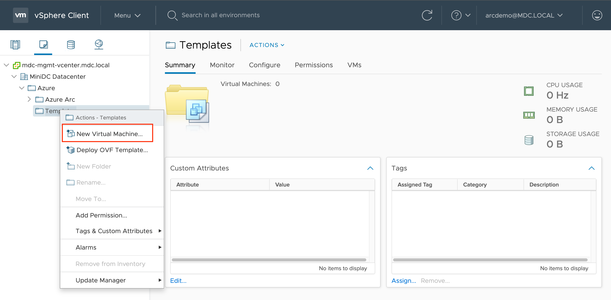
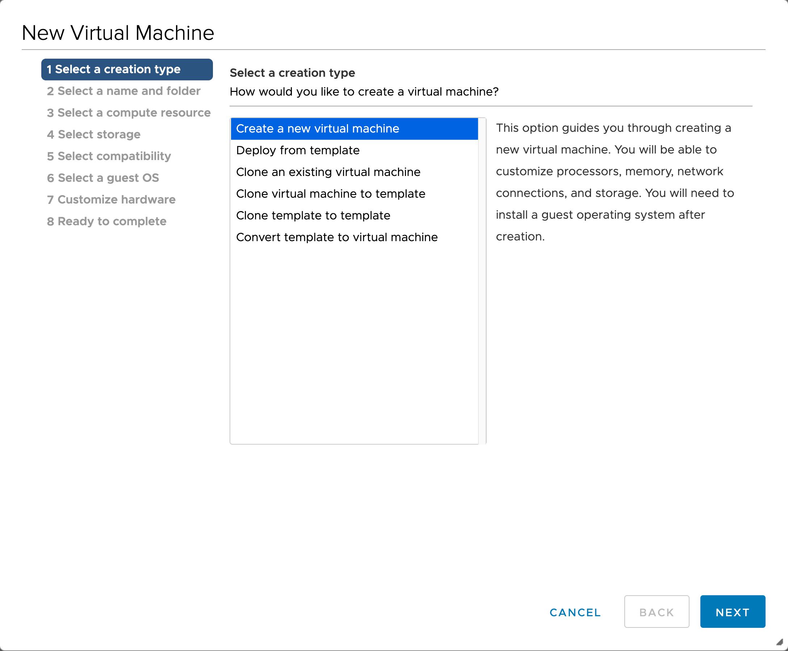
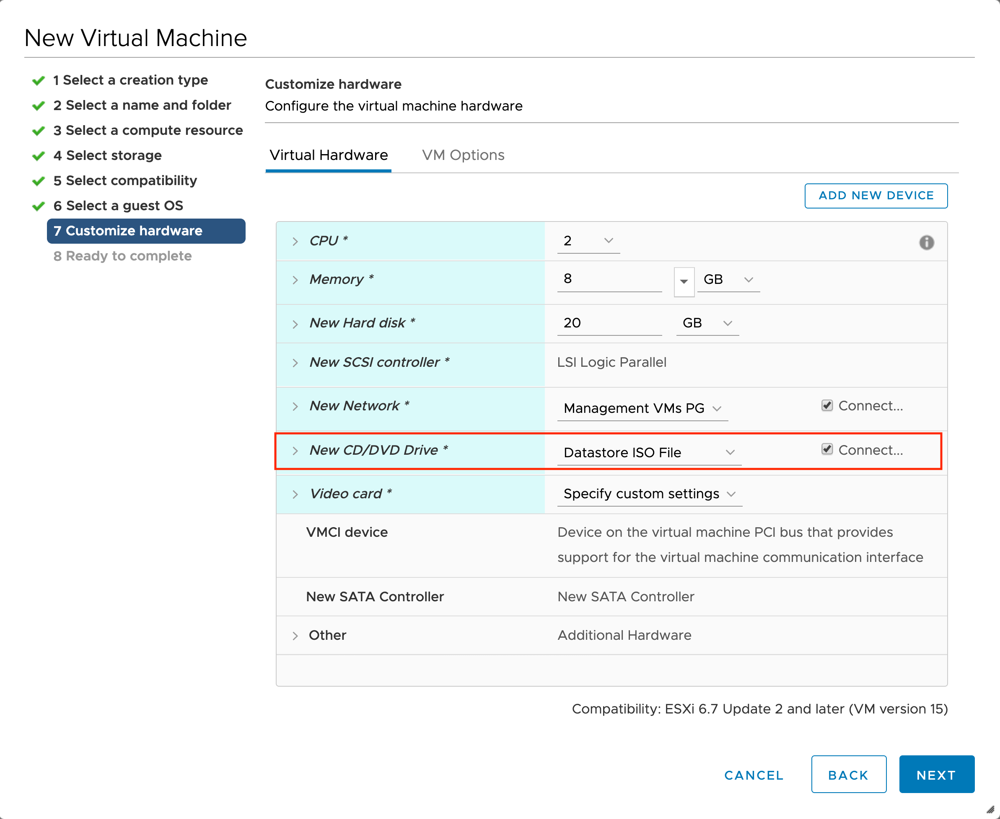

## Create a VMware vSphere template for Ubuntu Server 18.04

The following README will guide you on how to create an Ubuntu Server 18.04 VMware vSphere virtual machine template.

## Prerequisites

> **Note: This guide assumes that you have some VMware vSphere familiarity. It is also does not designed to go over either VMware and/or Ubuntu best-practices.**

- [Download the latest Ubuntu Server 18.04 ISO file](https://releases.ubuntu.com/18.04/)

- VMware vSphere 6.5 and above

- Although it can be used locally, for faster deployment, it is recommended to upload the file to a vSphere datastore or to vCenter Content Library.

## Creating Ubuntu 18.04 VM Template

### Deploying & Installing Ubuntu

- Deploy new virtual machine

    

    

    

    

    

    

- Make sure to select _Ubuntu Linux (64-bit)_ as the Guest OS.

    

- Point to the Ubuntu Server ISO file location.

    

    

- Power-on the VM and start the Ubuntu installation. No specific instructions here but:

  - (Optional) Consider using static IP
  - Install OpenSSH server

    

    

    

    

    

    

    

    

    

    

    

    

    

    

    

    

    

    

    

    

    

### Post-installation

Before converting the VM to a template, few actions are needed.

- It's better to have your OS packages up-to-date

    ```shell
    sudo apt-get update
    sudo apt-get upgrade -y
    ```

- Prevent cloudconfig from preserving the original hostname and reset the hostname

    ```shell
    sudo sed -i 's/preserve_hostname: false/preserve_hostname: true/g' /etc/cloud/cloud.cfg
    sudo truncate -s0 /etc/hostname
    sudo hostnamectl set-hostname localhost
    ```

- Remove the current network configuration

    ```shell
    sudo rm /etc/netplan/50-cloud-init.yaml
    ```

- Clean shell history and shutdown the VM

    ```shell
    cat /dev/null > ~/.bash_history && history -c
    sudo shutdown now
    ```

### Convert to Template

Reduce the VM CPU count & memory resources to the minimum and convert the VM to template, switch the CD/DVD drive to client device as well disconnect it and convert the VM to template.


