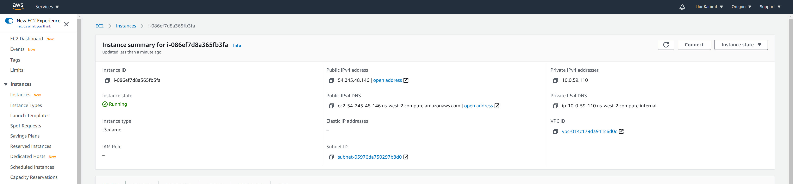
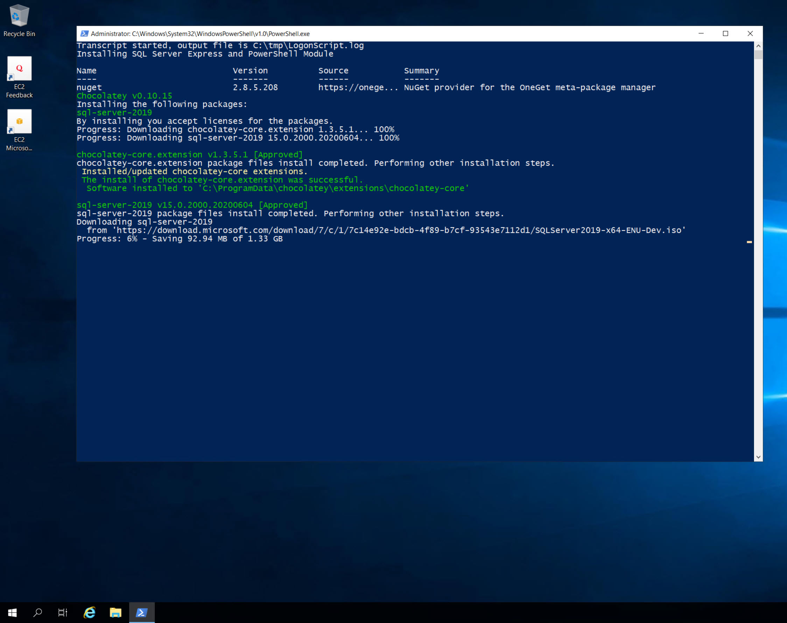
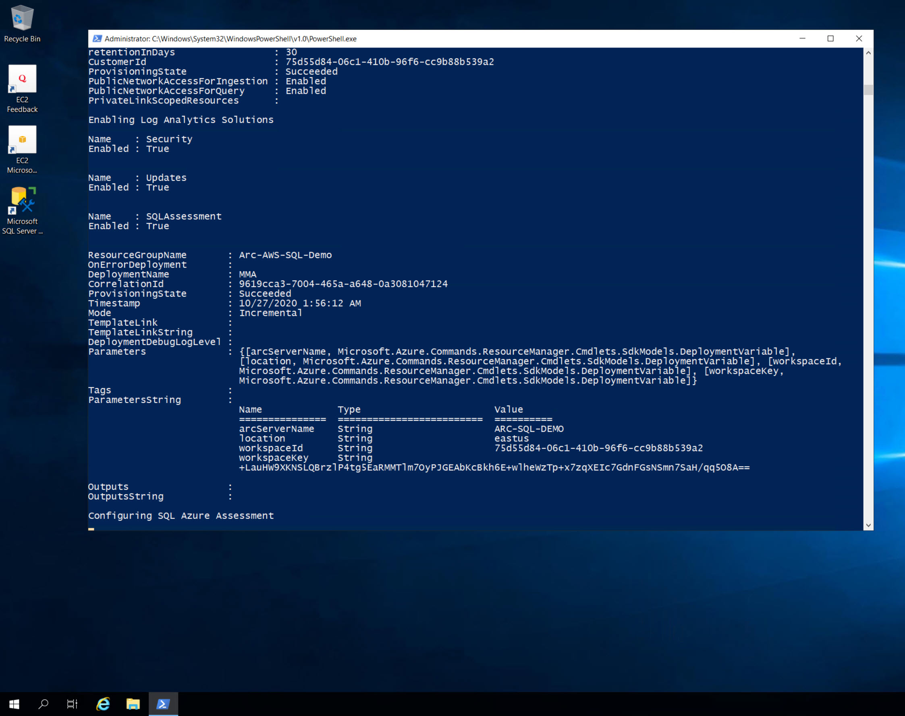

## Deploy an AWS EC2 instance with Windows Server & Microsoft SQL Server and connect it to Azure Arc using Terraform

The following README will guide you on how to use the provided [Terraform](https://www.terraform.io/) plan to deploy a Windows Server installed with Microsoft SQL Server 2019 (Developer edition) in a Amazon Web Services (AWS) EC2 instance and connect it as an Azure Arc-enabled SQL server resource.

By the end of the guide, you will have an AWS EC2 instance installed with Windows Server 2019 with SQL Server 2019, projected as an Azure Arc-enabled SQL server and a running SQL assessment with data injected to Azure Log Analytics workspace.

## Prerequisites

* Clone the Azure Arc Jumpstart repository

    ```shell
    git clone https://github.com/microsoft/azure_arc.git
    ```

* [Install or update Azure CLI to version 2.25.0 and above](https://docs.microsoft.com/en-us/cli/azure/install-azure-cli?view=azure-cli-latest). Use the below command to check your current installed version.

    ```shell
    az --version
    ```

* [Create a free Amazon Web Services account](https://aws.amazon.com/free/) if you don't already have one.

* [Install Terraform >=0.12](https://learn.hashicorp.com/terraform/getting-started/install.html)

* Create Azure service principal  (SP)

    To connect the EC2 instance to Azure Arc, an Azure service principal  assigned with the "Contributor" role is required. To create it, login to your Azure account run the below command (this can also be done in [Azure Cloud Shell](https://shell.azure.com/)).

    ```shell
    az login
    subscriptionId=$(az account show --query id --output tsv)
    az ad sp create-for-rbac -n "<Unique SP Name>" --role "Contributor" --scopes /subscriptions/$subscriptionId
    ```

    For example:

    ```shell
    az login
    subscriptionId=$(az account show --query id --output tsv)
    az ad sp create-for-rbac -n "JumpstartArc" --role "Contributor" --scopes /subscriptions/$subscriptionId
    ```

    Output should look like this:

    ```json
    {
    "appId": "XXXXXXXXXXXXXXXXXXXXXXXXXXXX",
    "displayName": "JumpstartArc",
    "password": "XXXXXXXXXXXXXXXXXXXXXXXXXXXX",
    "tenant": "XXXXXXXXXXXXXXXXXXXXXXXXXXXX"
    }
    ```

    > **NOTE: If you create multiple subsequent role assignments on the same service principal, your client secret (password) will be destroyed and recreated each time. Therefore, make sure you grab the correct password**.

    > **NOTE: The Jumpstart scenarios are designed with as much ease of use in-mind and adhering to security-related best practices whenever possible. It is optional but highly recommended to scope the service principal to a specific [Azure subscription and resource group](https://docs.microsoft.com/cli/azure/ad/sp?view=azure-cli-latest) as well considering using a [less privileged service principal account](https://docs.microsoft.com/azure/role-based-access-control/best-practices)**

* Enable subscription for the *Microsoft.AzureArcData* resource provider for Azure Arc-enabled SQL Server. Registration is an asynchronous process, and registration may take approximately 10 minutes.

  ```shell
  az provider register --namespace Microsoft.AzureArcData
  ```

  You can monitor the registration process with the following commands:

  ```shell
  az provider show -n Microsoft.AzureArcData -o table
  ```

## Create a new AWS IAM Role & Key

Create AWS User IAM Key. An access key grants programmatic access to your resources which we will be using later on in this guide.

* Navigate to the [IAM Access page](https://console.aws.amazon.com/iam/home#/home).

    

* Select the **Users** from the side menu.

    

* Select the **User** you want to create the access key for.

    

* Select **Security credentials** of the **User** selected.

    

* Under **Access Keys** select **Create Access Keys**.

    

* In the popup window it will show you the ***Access key ID*** and ***Secret access key***. Save both of these values to configure the **Terraform plan** variables later.

    

## Automation Flow

For you to get familiar with the automation and deployment flow, below is an explanation.

1. User is exporting the Terraform environment variables (1-time export) which are being used throughout the deployment.

2. User is executing the Terraform plan which will deploy the EC2 instance as well as:

    1. Create an Administrator Windows user account, enabling WinRM on the VM and change the Windows Computer Name.

    2. Generate and execute the [*sql.ps1*](https://github.com/microsoft/azure_arc/blob/main/azure_arc_sqlsrv_jumpstart/aws/winsrv/terraform/scripts/sql.ps1.tmpl) script. This script will:

        1. Install Azure CLI, Azure PowerShell module and SQL Server Management Studio (SSMS) [Chocolaty packages](https://chocolatey.org/).

        2. Create a runtime logon script (*LogonScript.ps1*) which will run upon the user first logon to Windows. Runtime script will:

            * Install SQL Server Developer Edition
            * Enable SQL TCP protocol on the default instance
            * Create SQL Server Management Studio Desktop shortcut
            * Restore [*AdventureWorksLT2019*](https://docs.microsoft.com/en-us/sql/samples/adventureworks-install-configure?view=sql-server-ver15&tabs=ssms) Sample Database
            * Onboard both the server and SQL to Azure Arc
            * Deploy Azure Log Analytics and a workspace
            * Install the [Microsoft Monitoring Agent (MMA) agent](https://docs.microsoft.com/en-us/services-hub/health/mma-setup)
            * Enable Log Analytics Solutions
            * Deploy MMA Azure Extension ARM Template from within the VM
            * Configure SQL Azure Assessment

        3. Disable and prevent Windows Server Manager from running on startup

3. Once Terraform plan deployment has completed and upon the user initial RDP login to Windows, *LogonScript.ps1* script will run automatically and execute all the above.

## Deployment

Before executing the Terraform plan, you must set the environment variables which will be used by the plan. These variables are based on the Azure service principal  you've just created, your Azure subscription and tenant, and your AWS account.

* Retrieve your Azure subscription ID and tenant ID using the `az account list` command.

* The Terraform plan creates resources in both Microsoft Azure and AWS. It then executes a script on the virtual machine to install all the necessary artifacts.

    Both the script and the Terraform plan itself requires certain information about your AWS and Azure environments. Edit variables according to your environment and export it using the below commands

    ```shell
    export TF_VAR_subId='Your Azure subscription ID'
    export TF_VAR_servicePrincipalAppId='Your Azure service principal  App ID'
    export TF_VAR_servicePrincipalSecret='Your Azure service principal  App Password'
    export TF_VAR_servicePrincipalTenantId='Your Azure tenant ID'
    export TF_VAR_location='Azure region'
    export TF_VAR_resourceGroup='Azure resource group name'
    export TF_VAR_AWS_ACCESS_KEY_ID='Your AWS Access Key ID'
    export TF_VAR_AWS_SECRET_ACCESS_KEY='Your AWS Secret Key'
    export TF_VAR_key_name='Your AWS Key Pair name'
    export TF_VAR_aws_region='AWS region'
    export TF_VAR_aws_availabilityzone='AWS Availability Zone region'
    export TF_VAR_instance_type='EC2 instance type'
    export TF_VAR_hostname='EC2 instance Windows Computer Name'
    export TF_VAR_admin_user='Guest OS Admin Username'
    export TF_VAR_admin_password='Guest OS Admin Password'
    ```

    

    > **Note: If you are running in a PowerShell environment, to set the Terraform environment variables, use the _Set-Item -Path env:_ prefix (see example below)**

    ```powershell
    Set-Item -Path env:TF_VAR_AWS_ACCESS_KEY_ID
    ```

* From the folder within your cloned repo where the Terraform binaries are, the below commands to download the needed TF providers and to run the plan.

    ```shell
    terraform init
    terraform apply --auto-approve
    ```

    Once the Terraform plan deployment has completed, a new Windows Server VM will be up & running as well as an empty Azure resource group will be created.

    

    

    

* Download the RDP file and log in to the VM (**using the data from the *TF_VAR_admin_user* and *TF_VAR_admin_password* environment variables**) which will initiate the *LogonScript* run. Let the script to run it's course and which will also close the PowerShell session when completed.

    

    

    > **Note: The script runtime will take ~10-15min to complete**

    

    

    

    

    

    

    

    

    

* Open Microsoft SQL Server Management Studio (a Windows shortcut will be created for you) and validate the *AdventureWorksLT2019* sample database is deployed as well.

    

    

* In the Azure Portal, notice you now have an Azure Arc-enabled server resource (with the MMA agent installed via an Extension), Azure Arc-enabled SQL server resource and Azure Log Analytics deployed.

    

    

    

    

## Azure SQL Assessment

Now that you have both the server and SQL projected as Azure Arc resources, the last step is complete the initiation of the SQL Assessment run.

* On the SQL Azure Arc resource, click on "Environment Health" followed by clicking the "Download configuration script".

    Since the *LogonScript* run in the deployment step took care of deploying and installing the required binaries, you can safely and delete the downloaded *AddSqlAssessment.ps1* file.

    Clicking the "Download configuration script" will simply send a REST API call to the Azure portal which will make "Step3" available and will result with a grayed-out "View SQL Assessment Results" button.

    

    

    

* After few minutes you will notice how the "View SQL Assessment Results" button is available for you to click on. At this point, the SQL assessment data and logs are getting injected to Azure Log Analytics.

    Initially, the amount of data will be limited as it take a while for the assessment to complete a full cycle but after few hours you should be able to see much more data coming in.  

    

    

## Cleanup

To delete the environment, use the *`terraform destroy --auto-approve`* command which will delete the AWS and the Azure resources.


