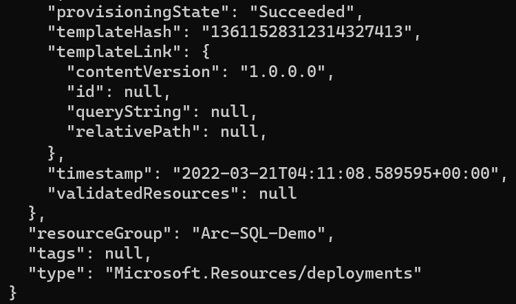
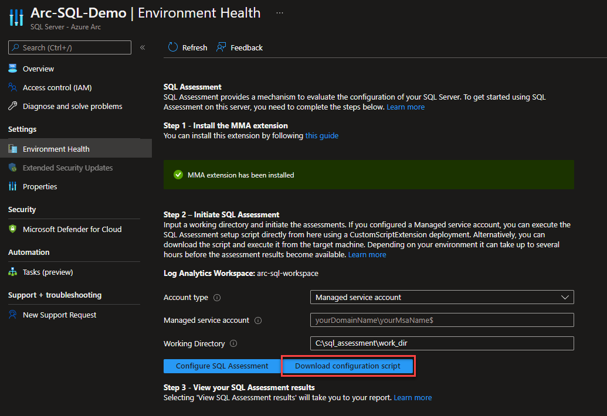

<!-- ---
type: docs
title: "SQL Server on Windows Server Virtual Machine"
linkTitle: "SQL Server on Windows Server Virtual Machine"
weight: 1
--- -->

## Deploy an Azure Virtual Machine with Windows Server & Microsoft SQL Server and connect it to Azure Arc using ARM Template

The following Jumpstart scenario will guide you on how to use the provided [Azure ARM Template](https://docs.microsoft.com/azure/azure-resource-manager/templates/overview) to deploy an Azure VM installed with Windows Server and Microsoft SQL Server 2019 (Developer edition) and connect it as an Azure Arc-enabled SQL server resource.

Azure VMs are leveraging the [Azure Instance Metadata Service (IMDS)](https://docs.microsoft.com/azure/virtual-machines/windows/instance-metadata-service) by default. By projecting an Azure VM as an Azure Arc-enabled server, a "conflict" is created which will not allow for the Azure Arc server resources to be represented as one when the IMDS is being used and instead, the Azure Arc server will still "act" as a native Azure VM.

However, **for demo purposes only**, the below guide will allow you to use and onboard Azure VMs to Azure Arc and by doing so, you will be able to simulate a server which is deployed outside of Azure (i.e "on-premises" or in other cloud platforms)

> **NOTE: It is not expected for an Azure VM to be projected as an Azure Arc-enabled server. The below scenario is unsupported and should ONLY be used for demo and testing purposes.**

By the end of the guide, you will have an Azure VM installed with Windows Server 2019 with SQL Server 2019, projected as an Azure Arc-enabled SQL Server and a running SQL assessment with data injected to Azure Log Analytics workspace.

## Prerequisites

- Clone the Azure Arc Jumpstart repository

    ```shell
    git clone https://github.com/microsoft/azure_arc.git
    ```

- [Install or update Azure CLI to version 2.49.0 and above](https://docs.microsoft.com/cli/azure/install-azure-cli?view=azure-cli-latest). Use the below command to check your current installed version.

    ```shell
    az --version
    ```

- In case you don't already have one, you can [Create a free Azure account](https://azure.microsoft.com/free/).

- Login to AZ CLI using the ```az login``` command.

- Ensure that you have selected the correct subscription you want to deploy ArcBox to by using the ```az account list --query "[?isDefault]"``` command. If you need to adjust the active subscription used by Az CLI, follow [this guidance](https://docs.microsoft.com/cli/azure/manage-azure-subscriptions-azure-cli#change-the-active-subscription).

- Create Azure service principal (SP)

    To be able to complete the scenario and its related automation, Azure service principal assigned with the “Owner” role is required. To create it, login to your Azure account run the below command (this can also be done in [Azure Cloud Shell](https://shell.azure.com/)).

    ```shell
    az login
    subscriptionId=$(az account show --query id --output tsv)
    az ad sp create-for-rbac -n "<Unique SP Name>" --role "Owner" --scopes /subscriptions/$subscriptionId
    ```

    For example:

    ```shell
    az login
    subscriptionId=$(az account show --query id --output tsv)
    az ad sp create-for-rbac -n "JumpstartArc" --role "Owner" --scopes /subscriptions/$subscriptionId
    ```

    Output should look like this:

    ```json
    {
    "appId": "XXXXXXXXXXXXXXXXXXXXXXXXXXXX",
    "displayName": "JumpstartArc",
    "password": "XXXXXXXXXXXXXXXXXXXXXXXXXXXX",
    "tenant": "XXXXXXXXXXXXXXXXXXXXXXXXXXXX"
    }
    ```

    > **NOTE: If you create multiple subsequent role assignments on the same service principal, your client secret (password) will be destroyed and recreated each time. Therefore, make sure you grab the correct password**.
    > **NOTE: The Jumpstart scenarios are designed with as much ease of use in-mind and adhering to security-related best practices whenever possible. It is optional but highly recommended to scope the service principal to a specific [Azure subscription and resource group](https://docs.microsoft.com/cli/azure/ad/sp?view=azure-cli-latest) as well considering using a [less privileged service principal account](https://docs.microsoft.com/azure/role-based-access-control/best-practices)**

- Enable subscription for the _Microsoft.AzureArcData_ and _Microsoft.HybridCompute_ resource providers for Azure Arc-enabled SQL Server. Registration is an asynchronous process, and registration may take approximately 10 minutes.

  ```shell
  az provider register --namespace Microsoft.AzureArcData
  az provider register --namespace Microsoft.HybridCompute
  az provider register --namespace Microsoft.OperationsManagement
  ```

  You can monitor the registration process with the following commands:

  ```shell
  az provider show -n Microsoft.AzureArcData -o table
  az provider show -n Microsoft.HybridCompute -o table
  az provider show -n Microsoft.OperationsManagement -o table
  ```

## Automation Flow

The automation for this scenario includes 3 PowerShell scripts executed in the following order:

1. [_Bootstrap.ps1_](https://github.com/microsoft/azure_arc/blob/main/azure_arc_sqlsrv_jumpstart/azure/windows/vanilla/arm_template/scripts/Bootstrap.ps1) - Executed at ARM Template deployment time as a CustomScriptExtension. This script has the following functionalities:

    1. Download and install pre-requisite utilities via [Chocolatey](https://chocolatey.org/).
    2. Download the [_LogonScript.ps1_](https://github.com/microsoft/azure_arc/blob/main/azure_arc_sqlsrv_jumpstart/azure/windows/vanilla/arm_template/scripts/LogonScript.ps1) and [_installArcAgentSQL.ps1_](https://github.com/microsoft/azure_arc/blob/main/azure_arc_sqlsrv_jumpstart/azure/windows/vanilla/arm_template/scripts/installArcAgentSQL.ps1) scripts.  

2. [_LogonScript.ps1_](https://github.com/microsoft/azure_arc/blob/main/azure_arc_sqlsrv_jumpstart/azure/windows/vanilla/arm_template/scripts/LogonScript.ps1) - Executed upon initial login to the SQL virtual machine. This script has the following functionalities:

    1. Install and configure SQL Server on the VM
    2. Restore AdventureWorksLT2019 Database
    3. Allow Azure VM to be onboarded to Azure Arc
    4. Execute the _installArcAgentSQL_ script

3. [_installArcAgentSQL.ps1_](https://github.com/microsoft/azure_arc/blob/main/azure_arc_sqlsrv_jumpstart/azure/windows/vanilla/arm_template/scripts/installArcAgentSQL.ps1) - This is the main script and will be executed by the _LogonScript_ script at VM runtime. This script has the following functionalities:

    1. Project SQL Server as an Azure Arc-enabled SQL server resource
    2. Install Log Analytics agent using an extension on Azure Arc-enabled server
    3. Create SQL Assessment and inject data to Azure Log Analytics workspace

To get familiar with the automation and deployment flow read the following explanation.

1. User edits the ARM template parameters file (1-time edit). These parameters values are used throughout the deployment.

2. The ARM template includes an Azure VM Custom Script Extension which will deploy the [_Bootstrap.ps1_](https://github.com/microsoft/azure_arc/blob/main/azure_arc_sqlsrv_jumpstart/azure/windows/vanilla/arm_template/scripts/Bootstrap.ps1) PowerShell Script. The script will:

    1. Download the _LogonScript.ps1_ and _installArcAgentSQL_ PowerShell scripts

    2. Set local OS environment variables

## Deployment

As mentioned, this deployment will use an ARM Template. You will deploy a single template that creates all the Azure resources in a single resource group as well as onboarding the created VM to Azure Arc.

- Before deploying the ARM template, login to Azure using AZ CLI with the ```az login``` command.

- The deployment uses the ARM template parameters file. Before initiating the deployment, edit the [_azuredeploy.parameters.json_](https://github.com/microsoft/azure_arc/blob/main/azure_arc_sqlsrv_jumpstart/azure/windows/vanilla/arm_template/azuredeploy.parameters.json) file located in your local cloned repository folder. An example parameters file is located [here](https://github.com/microsoft/azure_arc/blob/main/azure_arc_sqlsrv_jumpstart/azure/windows/vanilla/arm_template/azuredeploy.parameters.example.json).

- Create a Resource Group which will contain the target for the ARM Template deployment using the following command:

    ```shell
    az group create --name <Name of the Azure resource group> --location <Azure Region> --tags "Project=jumpstart_azure_arc_sql"
    ```

    For example:

    ```shell
    az group create --name Arc-SQL-Demo --location "East US" --tags "Project=jumpstart_azure_arc_sql"
    ```

- To deploy the ARM template, navigate to the local cloned [deployment folder](https://github.com/microsoft/azure_arc/tree/main/azure_arc_sqlsrv_jumpstart/azure/windows/vanilla/arm_template) and run the following command:

    ```shell
    az deployment group create \
    --resource-group <Name of the Azure resource group> \
    --name <The name of this deployment> \
    --template-uri https://raw.githubusercontent.com/microsoft/azure_arc/main/azure_arc_sqlsrv_jumpstart/azure/windows/vanilla/arm_template/azuredeploy.json \
    --parameters <The _azuredeploy.parameters.json_ parameters file location>
    ```

    > **NOTE: Make sure that you are using the same Azure resource group name as the one you created in the previous step.**

    For example:

    ```shell
    az deployment group create \
    --resource-group Arc-SQL-Demo \
    --name arcsqlsrvdemo \
    --template-uri https://raw.githubusercontent.com/microsoft/azure_arc/main/azure_arc_sqlsrv_jumpstart/azure/windows/vanilla/arm_template/azuredeploy.json \
    --parameters azuredeploy.parameters.json
    ```

- Once Azure resources have been provisioned you will be able to see them in Azure portal.

    

    

## Windows Login & Post Deployment

Various options are available to connect to _Arc-SQL-Demo_ VM, depending on the parameters you supplied during deployment.

- [RDP](https://azurearcjumpstart.io/azure_arc_jumpstart/azure_arc_sqlsrv/azure/azure_arm_template_winsrv/#connecting-directly-with-rdp) - available after configuring access to port 3389 on the _Arc-App-Client-NSG_, or by enabling [Just-in-Time access (JIT)](https://azurearcjumpstart.io/azure_arc_jumpstart/azure_arc_sqlsrv/azure/azure_arm_template_winsrv/#connect-using-just-in-time-access-jit).
- [Azure Bastion](https://azurearcjumpstart.io/azure_arc_jumpstart/azure_arc_sqlsrv/azure/azure_arm_template_winsrv/#connect-using-azure-bastion) - available if ```true``` was the value of your _`deployBastion`_ parameter during deployment.

### Connecting directly with RDP

By design, port 3389 is not allowed on the network security group. Therefore, you must create an NSG rule to allow inbound 3389.

- Open the _Arc-SQL-Demo-NSG_ resource in Azure portal and click "Add" to add a new rule.

  

  

- Specify the IP address that you will be connecting from and select RDP as the service with "Allow" set as the action. You can retrieve your public IP address by accessing [https://icanhazip.com](https://icanhazip.com) or [https://whatismyip.com](https://whatismyip.com).

  

  

  

### Connect using Azure Bastion

- If you have chosen to deploy Azure Bastion in your deployment, use it to connect to the VM.

  

  > **NOTE: When using Azure Bastion, the desktop background image is not visible. Therefore some screenshots in this guide may not exactly match your experience if you are connecting to _Arc-SQL-Demo_ with Azure Bastion.**

### Connect using just-in-time access (JIT)

If you already have [Microsoft Defender for Cloud](https://docs.microsoft.com/azure/defender-for-cloud/just-in-time-access-usage?tabs=jit-config-asc%2Cjit-request-asc) enabled on your subscription and would like to use JIT to access the Client VM, use the following steps:

- In the Client VM configuration pane, enable just-in-time. This will enable the default settings.

  

  

### Post Deployment

- At first login a logon script will get executed. This script was created as part of the automated deployment process.

    Let the script to run its course and **do not close** the PowerShell session, this will be done for you once completed.

    > **NOTE: The script run time is approximately 30min long**

    

- After a successful run you can see in the Azure portal that there is now a new Azure Arc-enabled server (with the Microsoft Monitoring agent installed via an extension), Azure Arc-enabled SQL resources and Azure Log Analytics added to the resource group.

    

    

    

- Open Microsoft SQL Server Management Studio (a Windows shortcut will be created for you) and validate the _AdventureWorksLT2019_ sample database is deployed.

    

    

## Azure SQL Assessment

Now that you have both the server and SQL projected as Azure Arc resources the last step is to complete the initiation of the SQL Assessment run.

- On the SQL Azure Arc resource click on "Environment Health", then click "Download configuration script".

    Since the _installArcAgentSQL_ run in the deployment step took care of deploying and installing the required binaries you can safely ignore and delete the downloaded _AddSqlAssessment.ps1_ file.

    Clicking the "Download configuration script" will simply send a REST API call to the Azure portal which will make "Step3" available and will result with a grayed-out "View SQL Assessment Results" button.

    

    

    

    

    It might take a bit of time, but after approximately 45-60 minutes you will notice how the "View SQL Assessment Results" becomes available for you to click on. At this point the SQL assessment data and logs are getting injected to Azure Log Analytics.

    Initially the amount of data will be limited as it take a while for the assessment to complete a full cycle but after few hours you should be able to see much more data coming in.  

    

    

## Cleanup

To delete the entire deployment simply delete the resource group from the Azure portal.


