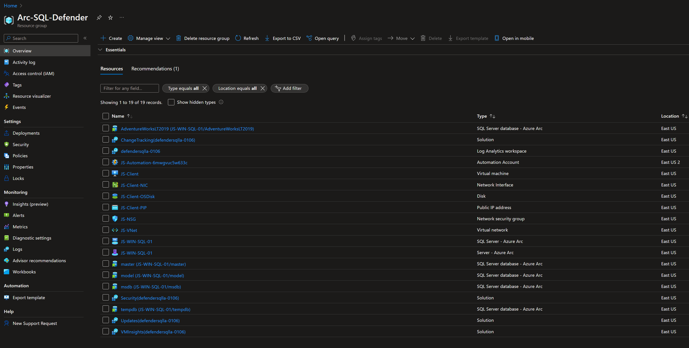
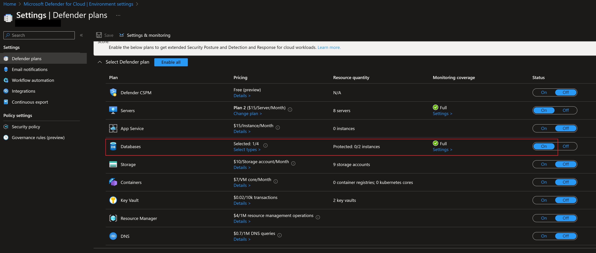

## Integrate Microsoft Defender for SQL servers with Azure Arc-enabled SQL Server (on Windows) using Hyper-V nested virtualization and ARM templates

The following Jumpstart scenario will walk you through how to use the provided [Azure ARM Template](https://docs.microsoft.com/azure/azure-resource-manager/templates/overview) to deploy an Azure VM installed with Windows Server, setup Hyper-V to support nested virtualization, and create guest VM with SQL Server 2019 on Hyper-V to demonstrate Defender for Cloud for SQL servers on machines and generate alerts for SQL attacks.

By the end of the guide, you will have an Azure VM **JS-Client** installed with Windows Server 2019 with Hyper-V and nested Windows Server VM **JS-Win-SQL-01** pre-configured with SQL Server 2019, projected as an Azure Arc-enabled SQL Server, then enabled SQL assessment and Microsoft Defender for SQL servers on machines.

## Prerequisites

- Clone the Azure Arc Jumpstart repository

    ```shell
    git clone https://github.com/microsoft/azure_arc.git
    ```

- [Install or update Azure CLI to version 2.42.0 and above](https://docs.microsoft.com/cli/azure/install-azure-cli?view=azure-cli-latest). Use the below command to check your current installed version.

    ```shell
    az --version
    ```

- In case you don't already have one, you can [Create a free Azure account](https://azure.microsoft.com/free/). By default free subscriptions have limitation on number of VM cores used for VM deployment. This scenarios requires 16 vCores to deploy an Azure VM SKU D16sv4 and setup guest VM SQL Server 2019.

- Login to AZ CLI using the ```az login``` command.

- Ensure that you have selected the correct subscription you want to deploy Jumpstart scenario ARM template by using the ```az account list --query "[?isDefault]"``` command. If you need to adjust the active subscription used by Az CLI, follow [this guidance](https://docs.microsoft.com/cli/azure/manage-azure-subscriptions-azure-cli#change-the-active-subscription).

- Create Azure service principal (SP)

    To be able to complete the scenario and its related automation, Azure service principal assigned with the “Owner” role is required. To create it, login to your Azure account by running the below commands (this can also be done in [Azure Cloud Shell](https://shell.azure.com/)).

    ```shell
    az login
    subscriptionId=$(az account show --query id --output tsv)
    az ad sp create-for-rbac -n "<Unique SP Name>" --role "Owner" --scopes /subscriptions/$subscriptionId
    ```

    For example:

    ```shell
    az login
    subscriptionId=$(az account show --query id --output tsv)
    az ad sp create-for-rbac -n "JumpstartArc" --role "Owner" --scopes /subscriptions/$subscriptionId
    ```

    Output should look like this:

    ```json
    {
    "appId": "XXXXXXXXXXXXXXXXXXXXXXXXXXXX",
    "displayName": "JumpstartArc",
    "password": "XXXXXXXXXXXXXXXXXXXXXXXXXXXX",
    "tenant": "XXXXXXXXXXXXXXXXXXXXXXXXXXXX"
    }
    ```

    > **NOTE: If you create multiple subsequent role assignments on the same service principal, your client secret (password) will be destroyed and recreated each time. Therefore, make sure you grab the correct password**.
    > **NOTE: The Jumpstart scenarios are designed with as much ease of use in-mind and adhering to security-related best practices whenever possible. It is optional but highly recommended to scope the service principal to a specific [Azure subscription and resource group](https://docs.microsoft.com/cli/azure/ad/sp?view=azure-cli-latest) as well considering using a [less privileged service principal account](https://docs.microsoft.com/azure/role-based-access-control/best-practices)**

- As part of the scenario deployment following resource providers are registered in your subscription to support Azure Arc-enabled SQL Server.

  - _Microsoft.AzureArcData_
  - _Microsoft.HybridCompute_
  - _Microsoft.OperationsManagement_
  - _Microsoft.HybridConnectivity_
  - _Microsoft.GuestConfiguration_
  
## Automation Flow

The automation for this scenario includes different PowerShell scripts executed in the following order:

1. [_Bootstrap.ps1_](https://github.com/microsoft/azure_arc/blob/main/azure_arc_sqlsrv_jumpstart/azure/windows/defender_sql/arm_template/scripts/Bootstrap.ps1) - Executed at ARM Template deployment time as a CustomScriptExtension. This script has the following functionalities:

    1. Download and install pre-requisite utilities via [Chocolatey](https://chocolatey.org/).
    2. Download the [_ArcServersLogonScript.ps1_](https://github.com/microsoft/azure_arc/blob/main/azure_arc_sqlsrv_jumpstart/azure/windows/defender_sql/arm_template/scripts/ArcServersLogonScript.ps1), [_installArcAgentSQLSP.ps1_](https://github.com/microsoft/azure_arc/blob/main/azure_arc_sqlsrv_jumpstart/azure/windows/defender_sql/arm_template/scripts/installArcAgentSQLSP.ps1), and [_testDefenderForSQL.ps1_](https://github.com/microsoft/azure_arc/blob/main/azure_arc_sqlsrv_jumpstart/azure/windows/defender_sql/arm_template/scripts/testDefenderForSQL.ps1) scripts.

2. [_ArcServersLogonScript.ps1_](https://github.com/microsoft/azure_arc/blob/main/azure_arc_sqlsrv_jumpstart/azure/windows/defender_sql/arm_template/scripts/ArcServersLogonScript.ps1) - Executed upon initial login to the **JS-Client** Azure virtual machine. This script has the following functionalities:

    1. Install Windows Hyper-V server and configure networking.
    2. Create a guest Windows Server VM with SQL Server pre-installed.
    3. Restore _AdventureWorksLT2019_ Database.
    4. Execute the _ArcServersLogonScript.ps1_ script.
    5. Enable Defender for SQL Servers on Machine at the subscription level and setup the default Log Analytics workspace.
    6. Execute the _testDefenderForSQL.ps1_ script to simulate SQL attacks.

3. [_installArcAgentSQLSP.ps1_](https://github.com/microsoft/azure_arc/blob/main/azure_arc_sqlsrv_jumpstart/azure/windows/defender_sql/arm_template/scripts/installArcAgentSQLSP.ps1) - This is the main script and will be executed by the _ArcServersLogonScript.ps1_ script at VM runtime. This script has the following functionalities:

    1. Project SQL Server as an Azure Arc-enabled SQL server resource
    2. Install the Log Analytics agent using an extension on the Azure Arc-enabled server
    3. Create SQL Assessment and inject data to Azure Log Analytics workspace

To get familiar with the automation and deployment flow read the following explanation.

1. User edits the ARM template parameters file (1-time edit). These parameters values are used throughout the deployment.

2. The ARM template includes an Azure VM Custom Script Extension which will deploy the [_Bootstrap.ps1_](https://github.com/microsoft/azure_arc/blob/main/azure_arc_sqlsrv_jumpstart/azure/windows/defender_sql/arm_template/scripts/Bootstrap.ps1) PowerShell Script. The script will:

    1. Download the _ArcServersLogonScript.ps1_, _installArcAgentSQLSP.ps1_, and _testDefenderForSQL.ps1_ PowerShell scripts

    2. Set local OS environment variables

## Deployment Option 1: Azure portal

- Click the <a href="https://portal.azure.com/#create/Microsoft.Template/uri/https%3A%2F%2Fraw.githubusercontent.com%2Fmicrosoft%2Fazure_arc%2Fmain%2Fazure_arc_sqlsrv_jumpstart%2Fazure%2Fwindows%2Fdefender_sql%2Farm_template%2Fazuredeploy.json" target="_blank"></a> button and enter values for the the ARM template parameters.

  

  

  

  

## Deployment Option 2: ARM template with Azure CLI

As mentioned, this deployment will use an ARM Template. You will deploy a single template that creates all the Azure resources in a single resource group as well as onboarding the nested Hyper-V guest SQL Server VM to Azure Arc.

- Before deploying the ARM template, login to Azure using AZ CLI with the ```az login``` command.

- The deployment uses the ARM template parameters file. Before initiating the deployment, edit the [_azuredeploy.parameters.json_](https://github.com/microsoft/azure_arc/blob/main/azure_arc_sqlsrv_jumpstart/azure/windows/defender_sql/arm_template/azuredeploy.parameters.json) file located in your local cloned repository folder. An example parameters file is located [here](https://github.com/microsoft/azure_arc/blob/main/azure_arc_sqlsrv_jumpstart/azure/windows/defender_sql/arm_template/azuredeploy.parameters.example.json).

- Create a Resource Group which will contain the target for the ARM Template deployment using the following command:

    ```shell
    az group create --name <Name of the Azure resource group> --location <Azure Region> --tags "Project=jumpstart_azure_arc_sql_defender"
    ```

    For example:

    ```shell
    az group create --name Arc-SQL-Defender --location "East US" --tags "Project=jumpstart_azure_arc_sql_defender"
    ```

- To deploy the ARM template, navigate to the local cloned [deployment folder](https://github.com/microsoft/azure_arc/tree/main/azure_arc_sqlsrv_jumpstart/azure/windows/defender_sql/arm_template) and run the following command:

    ```shell
    az deployment group create \
    --resource-group <Name of the Azure resource group> \
    --name <The name of this deployment> \
    --template-uri https://raw.githubusercontent.com/microsoft/azure_arc/main/azure_arc_sqlsrv_jumpstart/azure/windows/defender_sql/arm_template/azuredeploy.json \
    --parameters <The *azuredeploy.parameters.json* parameters file location>
    ```

    > **NOTE: Make sure that you are using the same Azure resource group name as the one you created in the previous step.**

    For example:

    ```shell
    az deployment group create \
    --resource-group Arc-SQL-Defender \
    --name arcsqldefender \
    --template-uri https://raw.githubusercontent.com/microsoft/azure_arc/main/azure_arc_sqlsrv_jumpstart/azure/windows/defender_sql/arm_template/azuredeploy.json \
    --parameters azuredeploy.parameters.json
    ```

- Once Azure resources have been provisioned you will be able to see them in Azure portal.

  

  

  

## Windows Login & Post Deployment

There are two options available to connect to _JS-Client_ VM, depending on the parameters you supplied during deployment.

- [RDP](https://azurearcjumpstart.io/azure_arc_jumpstart/azure_arc_sqlsrv/azure/azure_arm_template_sqlsrv_winsrv_defender/#connecting-directly-with-rdp) - available after configuring access to port 3389 on the _JS-NSG_, or by enabling [Just-in-Time access (JIT)](https://azurearcjumpstart.io/azure_arc_jumpstart/azure_arc_sqlsrv/azure/azure_arm_template_sqlsrv_winsrv_defender/#connect-using-just-in-time-access-jit).
- [Azure Bastion](https://azurearcjumpstart.io/azure_arc_jumpstart/azure_arc_sqlsrv/azure/azure_arm_template_sqlsrv_winsrv_defender/#connect-using-azure-bastion) - available if ```true``` was the value of your _`deployBastion`_ parameter during deployment.

### Connecting directly with RDP

By design, port 3389 is not allowed to access from the public internet. You must create an NSG rule to allow inbound 3389.

- Open the _JS-NSG_ resource in the Azure portal, go to Inbound security rules, and click "Add" to add your client IP to allow RDP access to the VM.

  

  

- Specify the IP address that you will be connecting from and select RDP as the service with "Allow" set as the action. You can retrieve your public IP address by accessing [https://icanhazip.com](https://icanhazip.com) or [https://whatismyip.com](https://whatismyip.com).

  

  

  

### Connect using Azure Bastion

- If you have chosen to deploy Azure Bastion in your deployment, use it to connect to the VM.

  

  > **NOTE: When using Azure Bastion, the desktop background image is not visible. Therefore some screenshots in this guide may not exactly match your experience if you are connecting to _JS-Client_ with Azure Bastion.**

### Connect using just-in-time access (JIT)

If you already have [Microsoft Defender for Cloud](https://docs.microsoft.com/azure/defender-for-cloud/just-in-time-access-usage?tabs=jit-config-asc%2Cjit-request-asc) enabled on your subscription and would like to use JIT to access the Client VM, use the following steps:

- In the Client VM configuration pane, enable just-in-time. This will enable the default settings.

  

  

### Post Deployment

- At first login a logon script will get executed. This script was created as part of the automated deployment process.

    Let the script to run its course and **do not close** the PowerShell session, this will be done for you once completed.

    > **NOTE: The script run time is approximately 30min long**

  

  

- After a successful run you can see in the Azure portal that there is now a new Azure Arc-enabled server (with the Microsoft Monitoring agent installed via an extension), Azure Arc-enabled SQL resources and Azure Log Analytics added to the resource group.

  

  

  

  

- Open Hyper-V to login to nested SQL server VM

  

  

- Open Microsoft SQL Server Management Studio (a Windows shortcut will be created for you) and validate the _AdventureWorksLT2019_ sample database is deployed.

  

  

## Microsoft Defender for Cloud - SQL servers on machines

This section guides you through different settings for enabling Microsoft Defender for Cloud - SQL servers on machines. Most of these settings are already enabled during the logon script execution when login to _JS-Client_ Azure VM. Even though these are pre-configured there might be delays in showing them in the Azure portal.

- Following are the settings of Microsoft Defender for Cloud - SQL servers on machines configured using automation scripts and can be reviewed in Azure portal.

  

  

- The below screenshots show Arc-enabled SQL Server Defender for Cloud enablement and protection status. Defender for Cloud for SQL Server is enabled at the subscription level, but the protection status is still showing as not enabled.
Please note it may take some time to show this status in the Azure portal, but still able to detect SQL threats generated by the test scripts.

  

- The below screenshot shows the SQL threat detected by Defender for Cloud.

  

- The below screenshot shows the test script used to generate SQL threats, detect, and alert using Defender for Cloud for SQL servers.

  

- Please note once in a while these test execution may fails randomly. If you don't find these alerts, login to nested SQL VM in Hyper-V and execute test script manually as show below. Following are the credentials to login to nested SQL Server VM.

  ```text
  Username: Administrator
  Password: ArcDemo123!!
  ```

  

- The below screenshot shows an email alert sent by Defender for Cloud when a SQL threat is detected. By default, this email is sent to the registered contact email at the subscription level.
  

## Cleanup

To delete the entire deployment simply delete the resource group from the Azure portal.


