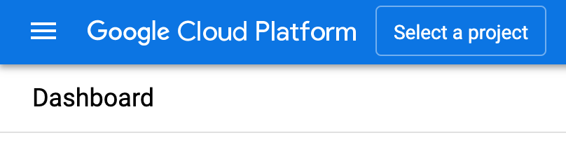
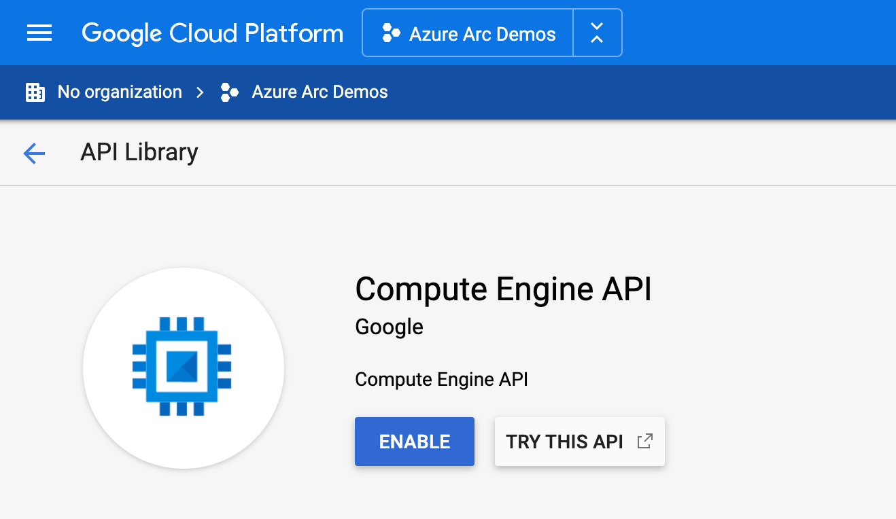
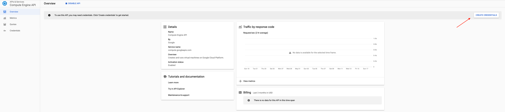
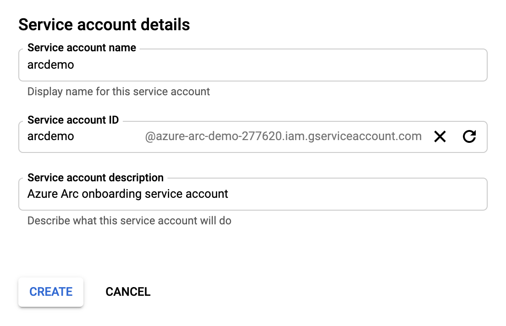
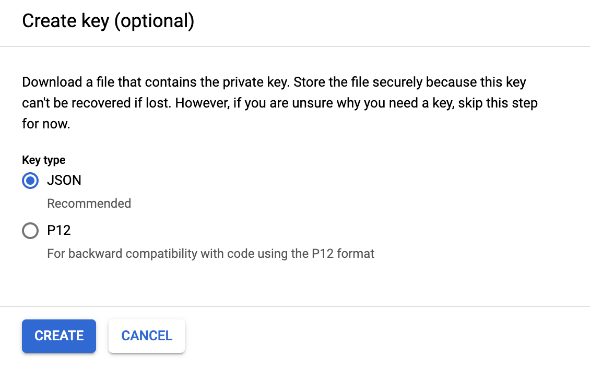
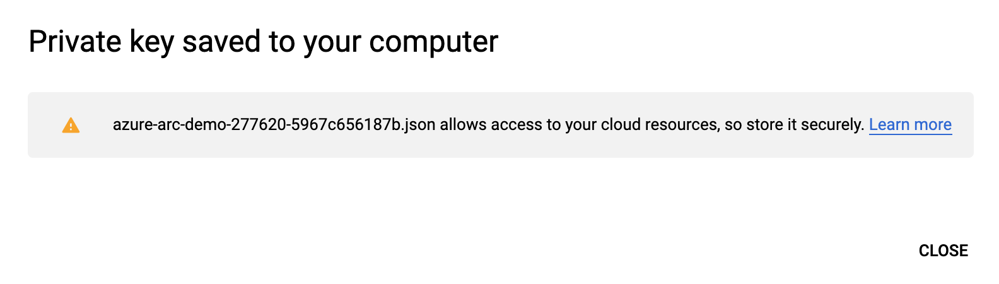

## Deploy a GCP instance with Windows Server & Microsoft SQL Server and connect it to Azure Arc using Terraform

The following README will guide you on how to use the provided [Terraform](https://www.terraform.io/) plan to deploy a Windows Server installed with Microsoft SQL Server 2019 (Developer edition) in a Google Cloud Platform (GCP) virtual machine and connect it as an Azure Arc enabled SQL server resource.

By the end of the guide, you will have a GCP VM instance installed with Windows Server 2019 with SQL Server 2019, projected as an Azure Arc enabled SQL Server and a running SQL assessment with data injected to Azure Log Analytics workspace.

## Prerequisites

* Clone the Azure Arc Jumpstart repository

    ```shell
    git clone https://github.com/microsoft/azure_arc.git
    ```

* [Install or update Azure CLI to version 2.15.0 and above](https://docs.microsoft.com/en-us/cli/azure/install-azure-cli?view=azure-cli-latest). Use the below command to check your current installed version.

  ```shell
  az --version
  ```

* Google Cloud account with billing enabled - [Create a free trial account](https://cloud.google.com/free). To create Windows Server virtual machines, you must upgraded your account to enable billing. Click Billing from the menu and then select Upgrade in the lower right.

    

    

    

    ***Disclaimer*** - **To prevent unexpected charges, please follow the "Delete the deployment" section at the end of this README**

* [Install Terraform >=0.12](https://learn.hashicorp.com/terraform/getting-started/install.html)

* Create Azure service principal (SP)

    To connect the GCP virtual machine to Azure Arc, an Azure service principal assigned with the "Contributor" role is required. To create it, login to your Azure account run the below command (this can also be done in [Azure Cloud Shell](https://shell.azure.com/)).

    ```shell
    az login
    az ad sp create-for-rbac -n "<Unique SP Name>" --role contributor
    ```

    For example:

    ```shell
    az ad sp create-for-rbac -n "http://AzureArcServers" --role contributor
    ```

    Output should look like this:

    ```json
    {
    "appId": "XXXXXXXXXXXXXXXXXXXXXXXXXXXX",
    "displayName": "AzureArcServers",
    "name": "http://AzureArcServers",
    "password": "XXXXXXXXXXXXXXXXXXXXXXXXXXXX",
    "tenant": "XXXXXXXXXXXXXXXXXXXXXXXXXXXX"
    }
    ```

    > **Note: The Jumpstart scenarios are designed with as much ease of use in-mind and adhering to security-related best practices whenever possible. It is optional but highly recommended to scope the service principal to a specific [Azure subscription and resource group](https://docs.microsoft.com/en-us/cli/azure/ad/sp?view=azure-cli-latest) as well considering using a [less privileged service principal account](https://docs.microsoft.com/en-us/azure/role-based-access-control/best-practices)**

* Enable subscription for the *Microsoft.AzureArcData* resource provider for Azure Arc enabled SQL Server. Registration is an asynchronous process, and registration may take approximately 10 minutes.

  ```shell
  az provider register --namespace Microsoft.AzureArcData
  ```

  You can monitor the registration process with the following commands:

  ```shell
  az provider show -n Microsoft.AzureArcData -o table
  ```

## Create a new GCP Project, IAM Role & Service Account

In order to deploy resources in GCP, we will create a new GCP Project as well as a service account to allow Terraform to authenticate against GCP APIs and run the plan to deploy resources.

* Browse to <https://console.cloud.google.com/> and login with your Google Cloud account. Once logged in, [create a new project](https://cloud.google.com/resource-manager/docs/creating-managing-projects) named "Azure Arc Demo". After creating it, be sure to copy down the project id as it is usually different then the project name.

  

  

  

* Enable the Compute Engine API for the project, create a project Owner service account credentials and download the private key JSON file and copy the file to the directory where Terraform files are located. Change the JSON file name (for example *account.json*). The Terraform plan will be using the credentials stored in this file to authenticate against your GCP project.

  

  

  

  

  

  

  

  

  

  

  

  

  

## Automation Flow

For you to get familiar with the automation and deployment flow, below is an explanation.

1. User is exporting the Terraform environment variables (1-time export) which are being used throughout the deployment.

2. User is executing the Terraform plan which will deploy the VM as well as:

    1. Create an Administrator Windows user account and enabling WinRM on the VM

    2. Generate and execute the [*sql.ps1*](https://github.com/microsoft/azure_arc/blob/main/azure_arc_sqlsrv_jumpstart/gcp/winsrv/terraform/scripts/sql.ps1.tmpl) script. This script will:

        1. Install Azure CLI, Azure PowerShell module and SQL Server Management Studio (SSMS) [Chocolaty packages](https://chocolatey.org/).

        2. Create a runtime logon script (*LogonScript.ps1*) which will run upon the user first logon to Windows. Runtime script will:
            * Install SQL Server Developer Edition
            * Enable SQL TCP protocol on the default instance
            * Create SQL Server Management Studio Desktop shortcut
            * Restore [*AdventureWorksLT2019*](https://docs.microsoft.com/en-us/sql/samples/adventureworks-install-configure?view=sql-server-ver15&tabs=ssms) Sample Database
            * Onboard both the server and SQL to Azure Arc
            * Deploy Azure Log Analytics and a workspace
            * Install the [Microsoft Monitoring Agent (MMA) agent](https://docs.microsoft.com/en-us/services-hub/health/mma-setup)
            * Enable Log Analytics Solutions
            * Deploy MMA Azure Extension ARM Template from within the VM
            * Configure SQL Azure Assessment

        3. Disable and prevent Windows Server Manager from running on startup

3. Once Terraform plan deployment has completed and upon the user initial RDP login to Windows, *LogonScript.ps1* script will run automatically and execute all the above.

## Deployment

Before executing the Terraform plan, you must set the environment variables which will be used by the plan. These variables are based on the Azure service principal you've just created, your Azure subscription and tenant, and your GCP project.

* Retrieve your Azure subscription ID and tenant ID using the `az account list` command.

* The Terraform plan creates resources in both Microsoft Azure and GCP. It then executes a script on the virtual machine to install all the necessary artifacts.

  Both the script and the Terraform plan itself requires certain information about your GCP and Azure environments. Edit variables according to your environment and export it using the below commands

  ```shell
  export TF_VAR_subId='Your Azure subscription ID'
  export TF_VAR_servicePrincipalAppId='Your Azure service principal App ID'
  export TF_VAR_servicePrincipalSecret='Your Azure service principal App Password'
  export TF_VAR_servicePrincipalTenantId='Your Azure tenant ID'
  export TF_VAR_location='Azure Region'
  export TF_VAR_resourceGroup='Azure resource group name'
  export TF_VAR_gcp_project_id='GCP Project ID'
  export TF_VAR_gcp_credentials_filename='GCP Project credentials filename'
  export TF_VAR_gcp_region='GCP region where resource will be created'
  export TF_VAR_gcp_zone='GCP zone where resource will be created'
  export TF_VAR_gcp_instance_name='GCP VM instance name'
  export TF_VAR_gcp_instance_machine_type='GCP VM instance type'
  export TF_VAR_admin_user='Guest OS Admin Username' # Note: do not set this to "Administrator" 
  export TF_VAR_admin_password='Guest OS Admin Password'
  ```

    > **Note: If you are running in a PowerShell environment, to set the Terraform environment variables, use the _Set-Item -Path env:_ prefix (see example below)**

    ```powershell
    Set-Item -Path env:TF_VAR_gcp_project_id
    ```

    > **Note: Do not set the TF_VAR_admin_user variable to "Administrator". GCP Windows images have the administrator account [disabled by default](https://cloud.google.com/compute/docs/images/os-details#windows_server). Therefore, you must use a different username for your TF_VAR_admin_user (e.g., "arcdemo")**

  

* From the folder within your cloned repo where the Terraform binaries are, the below commands to download the needed TF providers and to run the plan.

    ```shell
    terraform init
    terraform apply --auto-approve
    ```

  Once the Terraform plan deployment has completed, a new Windows Server VM will be up & running as well as an empty Azure resource group will be created.

  

  

  

* Download the RDP file and log in to the VM (**using data from the *TF_VAR_admin_user* and *TF_VAR_admin_password* environment variables**) which will initiate the *LogonScript* run. Let the script to run it's course and which will also close the PowerShell session when completed.

  

  > **Note: The script runtime will take ~10-15min to complete**

  

  

  

  

  

  

  

  

  

* Open Microsoft SQL Server Management Studio (a Windows shortcut will be created for you) and validate the *AdventureWorksLT2019* sample database is deployed as well.

  

  

* In the Azure Portal, notice you now have an Azure Arc enabled server resource (with the MMA agent installed via an Extension), Azure Arc enabled SQL resource and Azure Log Analytics deployed.

  

  

  

  

## Azure SQL Assessment

Now that you have both the server and SQL projected as Azure Arc resources, the last step is complete the initiation of the SQL Assessment run.

* On the SQL Azure Arc resource, click on "Environment Health" followed by clicking the "Download configuration script".

  Since the *LogonScript* run in the deployment step took care of deploying and installing the required binaries, you can safely and delete the downloaded *AddSqlAssessment.ps1* file.

  Clicking the "Download configuration script" will simply send a REST API call to the Azure portal which will make "Step3" available and will result with a grayed-out "View SQL Assessment Results" button.

  

  

  

* After few minutes you will notice how the "View SQL Assessment Results" button is available for you to click on. At this point, the SQL assessment data and logs are getting injected to Azure Log Analytics.

  Initially, the amount of data will be limited as it take a while for the assessment to complete a full cycle but after few hours you should be able to see much more data coming in.  

  

  

## Cleanup

To delete the environment, use the *`terraform destroy --auto-approve`* command which will delete the GCP and the Azure resources.


