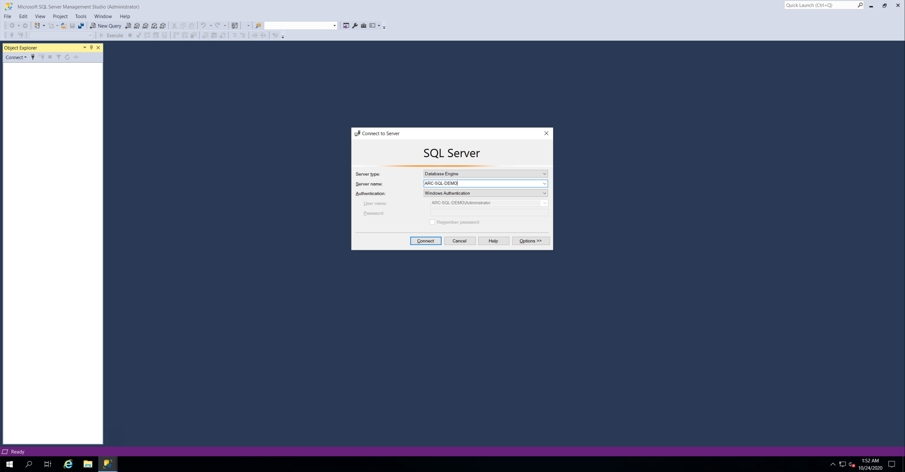
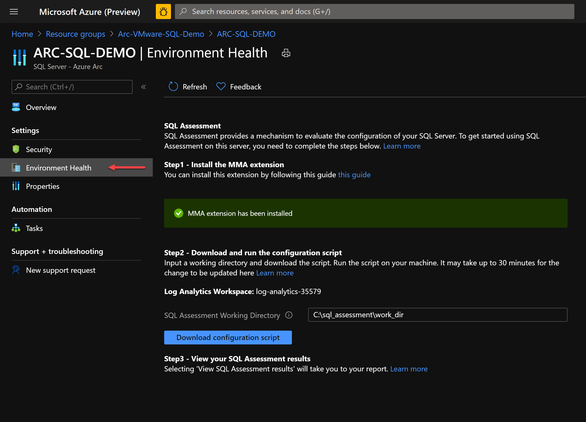
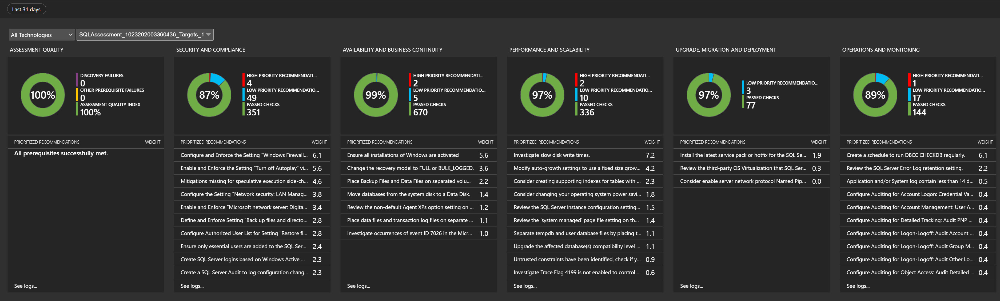

## Deploy a VMware vSphere-based Windows Server with SQL and connect it to Azure Arc using Terraform

The following README will guide you on how to use the provided [Terraform](https://www.terraform.io/) plan to deploy a Windows Server installed with Microsoft SQL Server 2019 (Developer edition) in a VMware vSphere virtual machine and connect it as an Azure Arc enabled SQL server resource.

By the end of the guide, you will have a VMware vSphere VM installed with Windows Server 2019 with SQL Server 2019, projected as an Azure Arc enabled SQL Server and a running SQL assessment with data injected to Azure Log Analytics workspace.

## Prerequisites

* Clone the Azure Arc Jumpstart repository

    ```shell
    git clone https://github.com/microsoft/azure_arc.git
    ```

* [Install or update Azure CLI to version 2.15.0 and above](https://docs.microsoft.com/en-us/cli/azure/install-azure-cli?view=azure-cli-latest). Use the below command to check your current installed version.

  ```shell
  az --version
  ```

* [Install Terraform >=0.12](https://learn.hashicorp.com/terraform/getting-started/install.html)

* A VMware vCenter Server user with [permissions to deploy](https://docs.vmware.com/en/VMware-vSphere/7.0/com.vmware.vsphere.vm_admin.doc/GUID-4D0F8E63-2961-4B71-B365-BBFA24673FDB.html) a Virtual Machine from a Template in the vSphere Web Client.

* Create Azure service principal (SP)

    To connect the VMware vSphere virtual machine to Azure Arc, an Azure service principal assigned with the "Contributor" role is required. To create it, login to your Azure account run the below command (this can also be done in [Azure Cloud Shell](https://shell.azure.com/)).

    ```shell
    az login
    az ad sp create-for-rbac -n "<Unique SP Name>" --role contributor
    ```

    For example:

    ```shell
    az ad sp create-for-rbac -n "http://AzureArcServers" --role contributor
    ```

    Output should look like this:

    ```json
    {
    "appId": "XXXXXXXXXXXXXXXXXXXXXXXXXXXX",
    "displayName": "AzureArcServers",
    "name": "http://AzureArcServers",
    "password": "XXXXXXXXXXXXXXXXXXXXXXXXXXXX",
    "tenant": "XXXXXXXXXXXXXXXXXXXXXXXXXXXX"
    }
    ```

    > **Note: The Jumpstart scenarios are designed with as much ease of use in-mind and adhering to security-related best practices whenever possible. It is optional but highly recommended to scope the service principal to a specific [Azure subscription and resource group](https://docs.microsoft.com/en-us/cli/azure/ad/sp?view=azure-cli-latest) as well considering using a [less privileged service principal account](https://docs.microsoft.com/en-us/azure/role-based-access-control/best-practices)**

* Enable subscription for the *Microsoft.AzureArcData* resource provider for Azure Arc enabled SQL Server. Registration is an asynchronous process, and registration may take approximately 10 minutes.

  ```shell
  az provider register --namespace Microsoft.AzureArcData
  ```

  You can monitor the registration process with the following commands:

  ```shell
  az provider show -n Microsoft.AzureArcData -o table
  ```

### Preparing a Window Server VMware vSphere VM Template

Before using the below guide to deploy a Windows Server VM and connect it to Azure Arc, a VMware vSphere Template is required. [The following README](https://azurearcjumpstart.io/azure_arc_jumpstart/azure_arc_servers/vmware/vmware_terraform_winsrv/) will instruct you how to easily create such a template using VMware vSphere 6.5 and above.

**The Terraform plan uses the *remote-exec* provisioner which uses the WinRM protocol to copy and execute the required Azure Arc script. To allow WinRM connectivity to the VM, run the [*allow_winrm*](https://github.com/microsoft/azure_arc/blob/main/azure_arc_sqlsrv_jumpstart/vmware/winsrv/terraform/scripts/allow_winrm.ps1) PowerShell script on your VM before converting it to template.**

> **Note: If you already have a Windows Server VM template it is still recommended to use the guide as a reference.**

## Automation Flow

For you to get familiar with the automation and deployment flow, below is an explanation.

1. User is exporting the Terraform environment variables (1-time export) which are being used throughout the deployment.

2. User is executing the Terraform plan which will deploy the VM as well as generate and execute the [*sql.ps1*](https://github.com/microsoft/azure_arc/blob/main/azure_arc_sqlsrv_jumpstart/vmware/winsrv/terraform/scripts/sql.ps1.tmpl) script. This script will:

    1. Install Azure CLI, Azure PowerShell module and SQL Server Management Studio (SSMS) [Chocolaty packages](https://chocolatey.org/).

    2. Create a runtime logon script (*LogonScript.ps1*) which will run upon the user first logon to Windows. Runtime script will:
        * Install SQL Server Developer Edition
        * Enable SQL TCP protocol on the default instance
        * Create SQL Server Management Studio Desktop shortcut
        * Restore [*AdventureWorksLT2019*](https://docs.microsoft.com/en-us/sql/samples/adventureworks-install-configure?view=sql-server-ver15&tabs=ssms) Sample Database
        * Onboard both the server and SQL to Azure Arc
        * Deploy Azure Log Analytics and a workspace
        * Install the [Microsoft Monitoring Agent (MMA) agent](https://docs.microsoft.com/en-us/services-hub/health/mma-setup)
        * Enable Log Analytics Solutions
        * Deploy MMA Azure Extension ARM Template from within the VM
        * Configure SQL Azure Assessment

    3. Disable Windows Firewall

    4. Disable and prevent Windows Server Manager from running on startup

3. Once Terraform plan deployment has completed and upon the user initial RDP login to Windows, *LogonScript.ps1* script will run automatically and execute all the above.

## Deployment

Before executing the Terraform plan, you must set the environment variables which will be used by the plan. These variables are based on the Azure service principal you've just created, your Azure subscription and tenant, and your VMware vSphere environment.

* Retrieve your Azure subscription ID and tenant ID using the `az account list` command.

* The Terraform plan creates resources in both Microsoft Azure and VMware vSphere. It then executes a script on the virtual machine to install all the necessary artifacts.

* Both the script and the Terraform plan itself requires certain information about your VMware vSphere and Azure environments. Edit variables according to your environment and export it using the below commands

    ```shell
    export TF_VAR_subId='Your Azure subscription ID'
    export TF_VAR_servicePrincipalAppId='Your Azure service principal App ID'
    export TF_VAR_servicePrincipalSecret='Your Azure service principal App Password'
    export TF_VAR_servicePrincipalTenantId='Your Azure tenant ID'
    export TF_VAR_location='Azure Region'
    export TF_VAR_resourceGroup='Azure resource group name'
    export TF_VAR_vsphere_datacenter='VMware vSphere Datacenter Name'
    export TF_VAR_vsphere_datastore='VMware vSphere Datastore Name'
    export TF_VAR_vsphere_resource_pool='VMware vSphere Cluster or Resource Pool Name'
    export TF_VAR_network_cards='VMware vSphere Network Name'
    export TF_VAR_vsphere_folder='VMware vSphere Folder Name'
    export TF_VAR_vsphere_vm_template_name='VMware vSphere VM Template Name'
    export TF_VAR_vsphere_virtual_machine_name='VMware vSphere VM Name'
    export TF_VAR_vsphere_virtual_machine_cpu_count='VMware vSphere VM CPU Count'
    export TF_VAR_vsphere_virtual_machine_memory_size='VMware vSphere VM Memory Size in Megabytes'
    export TF_VAR_domain='Domain'
    export TF_VAR_vsphere_user='VMware vSphere vCenter Admin Username'
    export TF_VAR_vsphere_password='VMware vSphere vCenter Admin Password'
    export TF_VAR_vsphere_server='VMware vSphere vCenter server FQDN/IP'
    export TF_VAR_admin_user='Guest OS Admin Username'
    export TF_VAR_admin_password='Guest OS Admin Password'
    ```

    > **Note: If you are running in a PowerShell environment, to set the Terraform environment variables, use the _Set-Item -Path env:_ prefix (see example below)**

    ```powershell
    Set-Item -Path env:TF_VAR_servicePrincipalAppId
    ```

    > **Note: Use the Terraform plan [*variables.tf*](https://github.com/microsoft/azure_arc/blob/main/azure_arc_sqlsrv_jumpstart/vmware/winsrv/terraform/variables.tf) file for more details around VMware vSphere vars structure if needed**

    

* From the folder within your cloned repo where the Terraform binaries are, the below commands to download the needed TF providers and to run the plan.

    ```shell
    terraform init
    terraform apply --auto-approve
    ```

    Once the Terraform plan deployment has completed, a new Windows Server VM will be up & running as well as an empty Azure resource group will be created.

    

    

    

* Log in to the VM (**using data from the *TF_VAR_admin_user* and *TF_VAR_admin_password* environment variables**) which will initiate the *LogonScript* run. Let the script to run it's course and which will also close the PowerShell session when completed.

    > **Note: The script runtime will take ~10-15min to complete**

    

    

    

    

    

    

    

    

    

* Open Microsoft SQL Server Management Studio (a Windows shortcut will be created for you) and validate the *AdventureWorksLT2019* sample database is deployed as well.

    

    

* In the Azure Portal, notice you now have an Azure Arc enabled Server resource (with the MMA agent installed via an Extension), Azure Arc enabled SQL resource and Azure Log Analytics deployed.

    

    

    

    

## Azure SQL Assessment

Now that you have both the server and SQL projected as Azure Arc resources, the last step is complete the initiation of the SQL Assessment run.

* On the SQL Azure Arc resource, click on "Environment Health" followed by clicking the "Download configuration script".

    Since the *LogonScript* run in the deployment step took care of deploying and installing the required binaries, you can safely and delete the downloaded *AddSqlAssessment.ps1* file.

    Clicking the "Download configuration script" will simply send a REST API call to the Azure portal which will make "Step3" available and will result with a grayed-out "View SQL Assessment Results" button.

    

    

    

* After few minutes you will notice how the "View SQL Assessment Results" button is available for you to click on. At this point, the SQL assessment data and logs are getting injected to Azure Log Analytics.

    Initially, the amount of data will be limited as it take a while for the assessment to complete a full cycle but after few hours you should be able to see much more data coming in.  

    

    

    

## Cleanup

To delete the environment, use the *`terraform destroy --auto-approve`* command which will delete the VMware vSphere VM and the Azure resource group along with it's resources.


