## Deploy Azure Video Indexer Arc extension on Kubernetes

The following Jumpstart scenario will guide you on how to deploy a "Ready to Go" environment so you can start using [Azure Video Indexer enabled by Arc](https://azure.microsoft.com/products/ai-video-indexer) deployed on [Azure Kubernetes Service (AKS)](https://docs.microsoft.com/azure/aks/intro-kubernetes) cluster.

[Azure Video Indexer](https://learn.microsoft.com/azure/azure-video-indexer/video-indexer-overview) enabled by Arc is aimed at running Video and Audio Analysis on Edge Devices in a connected fashion, only control plane data is passed to the cloud, **while data plane data is stored only on the edge device**.
The solution is designed to run on [Azure Stack Edge Profile](https://azure.microsoft.com/products/azure-stack/edge/), a heavy edge device, and supports multiple video formats, including MP4, WAV, Quicktime and additional common formats. During the public preview, the solution supports the following Azure languages: English (US), Spanish, German, French, Italian, Chinese (Simplified) and Arabic in all basic audio-related models.

> **NOTE: This guide assumes you already deployed a Kubernetes cluster and connected it to Azure Arc. If you haven't, this repository offers you a way to do so in an automated fashion for various [Kubernetes distributions](https://azurearcjumpstart.io/azure_arc_jumpstart/azure_arc_k8s/).**

By the end of this scenario, you will have successfully deployed a fully functional Azure Video Indexer extension on your edge device, including a web portal and web APIs, allowing you to perform advanced operations such as video uploading, insight extraction and retrival within your Video Indexer edge environment.

>**NOTE: Currently, Azure Video Indexer enabled by Arc is in preview.**

## Prerequisites

- Azure subscription with permissions to create Azure resources

- Clone the Azure Arc Jumpstart repository

    ```shell
    git clone https://github.com/microsoft/azure_arc.git
    ```

- As mentioned, this scenario starts at the point where you already have a connected Kubernetes cluster to Azure Arc.

    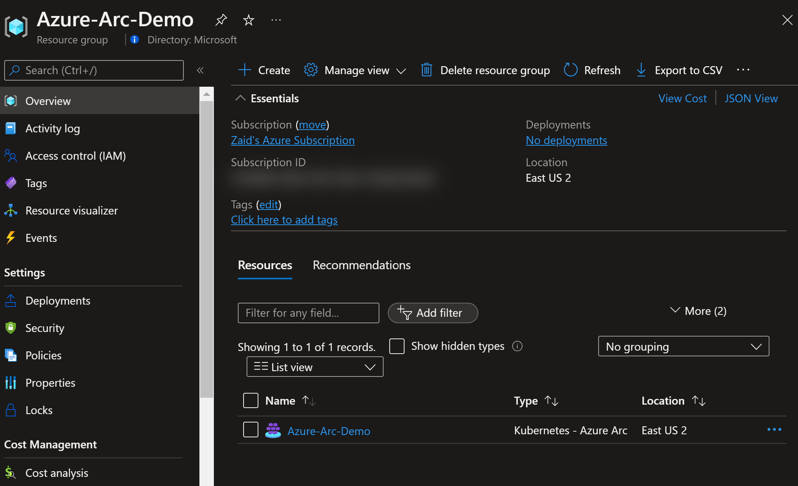

    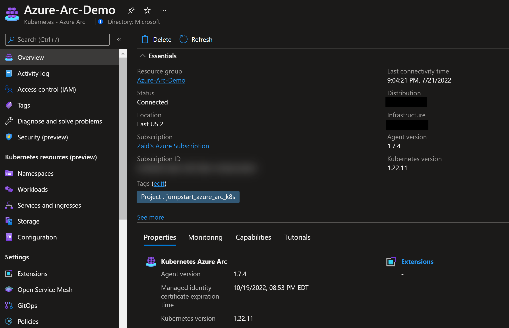

- [Install or update Azure CLI to version 2.49.0 and above](https://docs.microsoft.com/cli/azure/install-azure-cli?view=azure-cli-latest). Use the below command to check your current installed version.

  ```shell
  az --version
  ```

- Azure Video Indexer Account. The quickest way is using the Azure Portal using this tutorial [Create Video Indexer account](https://learn.microsoft.com/azure/azure-video-indexer/create-account-portal#use-the-azure-portal-to-create-an-azure-video-indexer-account).

>**NOTE: In order to succesfully deploy the VI Extension it is mandatory that we approve your Azure subscription id in advance. Therefore you must first sign up using [this form](https://aka.ms/vi-register)**.

### Minumum Hardware Requirements

The following is the minimum and recommended requirements if the extension contains single Languge support.

> **NOTE: If you install multiple Speech and Translation containers with several languages, ensure to increase the hardware requirements accordingly**.

| Component | Minimum Requirements | Recommended Requirements |
| --- | --- | --- |
| VM Count | 1 | 2 |
| CPU (Per Cluster)| 16 cores | 32 cores |
| RAM (Per Cluster)| 32 GB | 64 GB |
| Storage | 30 GB | 50 GB |

> **NOTE: We recommend creating a dedicate node-pool / auto-scaling groups to host the VI Solution.  
 At least 2-node cluster is recommended for high availability and scalability. The Recommended Settings refer to cluster wide settings, so for example, if you have 2 nodes, each node should have 16 cores and 32 GB of RAM**.

### Minimum Software Requirements

| Component |  Minimum Requirements |
| --- | --- |
| Operating System | Ubuntu 20.04 LTS or any Linux Compatible OS |
| Kubernetes | 1.25 |
| Azure CLI | 2.49.0 |

## Automation Flow

For you to get familiar with the automation and deployment flow, below is an explanation.

- User has deployed the Kubernetes cluster and connected it as an Azure Arc-enabled Kubernetes cluster.

- User is editing the environment variables in the below Shell script file (1-time edit) which then be used throughout the configuration.

- User is running the shell script. The script will use the extension management feature of Azure Arc to deploy the Video Indexer Cluster extension.

- User is verifying the cluster and ensuring the Video Indexer Cluster extension is deployed.

- Once the deployment is ready you can either use the [Web Portal](https://azurearcjumpstart.io/azure_arc_jumpstart/azure_arc_video_indexer/toturial/webapp/) or the [Web API](https://azurearcjumpstart.io/azure_arc_jumpstart/azure_arc_video_indexer/toturial/webapi) to upload and index your video content using Video Indexer enabled by Arc environment.

## Deployment

### Step 1 - Setup and configure the environment

To create a new Cluster extension instance, we will use the _k8s-extension create_ command while passing in values for the mandatory parameters. This scenario provides you with the automation to deploy the Video Indexer Cluster extension on your Azure Arc-enabled Kubernetes cluster.

- In order to keep your local environment clean and untouched, we will use [Azure Cloud Shell](https://docs.microsoft.com/azure/cloud-shell/overview) (located in the top-right corner of the Azure portal) to run the *az_k8sconfig_aks* shell script against the AKS connected cluster. **Make sure Cloud Shell is configured to use Bash.**

- Download [*vi-deployment-script.sh*](https://github.com/microsoft/azure_arc/blob/main/azure_arc_video_indexer_jumpstart/vi-deployment-script.sh) using below command

    ```shell
    curl -L https://github.com/microsoft/azure_arc/blob/main/azure_arc_video_indexer_jumpstart/vi-deployment-script.sh -o ~/vi-deployment-script.sh

- In the screenshot below, notice how currently there are no extensions installed yet in your Arc-enabled Kubernetes cluster.

    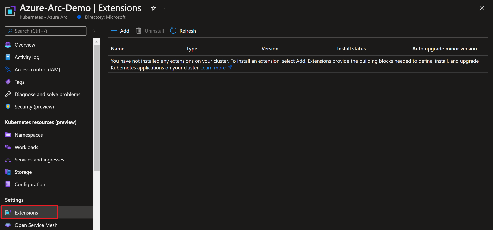

- Create Azure service principal (SP)

    To be able to complete the scenario and its related automation, Azure service principal assigned with the “Contributor” role is required. To create it, login to your Azure account run the below command (this can also be done in [Azure Cloud Shell](https://shell.azure.com/)).

    ```shell
    az login
    subscriptionId=$(az account show --query id --output tsv)
    az ad sp create-for-rbac -n "<Unique SP Name>" --role "Contributor" --scopes /subscriptions/$subscriptionId
    ```

    For example:

    ```shell
    az login
    subscriptionId=$(az account show --query id --output tsv)
    az ad sp create-for-rbac -n "JumpstartArcK8s" --role "Contributor" --scopes /subscriptions/$subscriptionId
    ```

    Output should look like this:

    ```json
    {
    "appId": "XXXXXXXXXXXXXXXXXXXXXXXXXXXX",
    "displayName": "JumpstartArcK8s",
    "password": "XXXXXXXXXXXXXXXXXXXXXXXXXXXX",
    "tenant": "XXXXXXXXXXXXXXXXXXXXXXXXXXXX"
    }
    ```

    > **NOTE: If you create multiple subsequent role assignments on the same service principal, your client secret (password) will be destroyed and recreated each time. Therefore, make sure you grab the correct password**.

    > **NOTE: The Jumpstart scenarios are designed with as much ease of use in-mind and adhering to security-related best practices whenever possible. It is optional but highly recommended to scope the service principal to a specific [Azure subscription and resource group](https://docs.microsoft.com/cli/azure/ad/sp?view=azure-cli-latest) as well considering using a [less privileged service principal account](https://docs.microsoft.com/azure/role-based-access-control/best-practices)**

- Edit the environment variables in the [vi-deployment-script.sh](https://github.com/microsoft/azure_arc/blob/main/azure_arc_video_indexer_jumpstart/vi-deployment-script.sh) file to match your parameters and run it using the _`./vi-deployment-script.sh`_ command.

- The deployment is using the following parameters that you will need to edit in the [*vi-deployment-script.sh*](https://github.com/microsoft/azure_arc/blob/main/azure_arc_video_indexer_jumpstart/vi-deployment-script.sh) file. 

    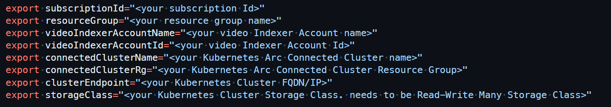

  - _`subscriptionId`_ - Your Subscription Id
  - _`resourceGroup`_ - The Resource Group of the Video Indexer Account
  - _`videoIndexerAccountName`_ - Your Video Indexer Account name
  - _`videoIndexerAccountId`_ - Your Video Indexer Account Id
  - _`connectedClusterName`_ - Your Connected k8s Arc Cluster name
  - _`connectedClusterRg`_ - Your Connected k8s Arc Cluster Resource Group
  - _`clusterEndpoint`_ - The FQDN or IP Address of the K8s. This will later be used as the web endpoint for the video indexer web api interaction.
  - _`storageClass`_ - The kubernetes Clsuter Storage class. it needs to be ReadWriteMany Storage class.

### Step 2 - Run the deployment script

- One of the prerequisites to installing a Video Indexer Arc extension are speech and translator resources.
The installation script already contains the neccessary code to create the resources and retreive the cognitive service credentials.

- Inspect the file under the function **create_cognitive_resources**.

- Once the resources are created, their credentials  are automatically injected into the _k8s-extension create_ command. 

- Type  _`./vi_deployment.sh`_ into your shell ( including the leading .) and hit enter to run the script.

   The script will:

  - Login to your Azure subscription using the SPN credentials
  - Add or Update your local _k8s-extension_ Azure CLI extension
  - Create Azure Cognitive Services resources, if they don't exist
  - Fetch the crecentials for the Cognitive Services resources and store them in the script variables
  - Create the Video Indexer Arc Extension

>**NOTE:
> The resources are created once per each subscription, and used by all the extenions under that subscription**.

The following parameters will be used as input to the extension creation command:

| Parameter | Default | Description |
|-----------|---------|-------------|
| release-namespace | default | The kubernetes namespace which the extension will be installed into |
| cluster-name | | The kubernetes azure arc instance name |
| resource-group | | The kubernetes azure arc resource group name |
| version | 1.0.24-preview | Video Indexer Extension version |
| speech.endpointUri |  | Speech Service Url Endpoint |
| speech.secret |  | Speech Instance secret |
| translate.endpointUri |  | Translation Service Url Endpoint  |
| translate.secret |  | Translation Service secret |
| videoIndexer.accountId |  | Video Indexer Account Id |
| frontend.endpointUri |  | Video Indexer DNS Name to be used as the Portal endpoint |

```shell
az k8s-extension create --name videoindexer \
    --extension-type Microsoft.videoindexer \
    --scope cluster \
    --release-namespace ${namespace} \
    --cluster-name ${connectedClusterName} \
    --resource-group ${connectedClusterRg} \
    --cluster-type connectedClusters \
    --release-train preview  \
    --version ${version} \
    --auto-upgrade-minor-version false \
    --config-protected-settings "speech.endpointUri=${speechUri}" \
    --config-protected-settings "speech.secret=${speechSecret}" \
    --config-protected-settings "translate.endpointUri=${translateUri}" \
    --config-protected-settings "translate.secret=${translateSecret}" \
    --config "videoIndexer.accountId=${viAccountId}" \
    --config "frontend.endpointUri=${dnsName}" 
```

- During the Deployment, the Video Indexer Resource provider will provision for you the Cognitive Services resource and will store the credentials in the script variables.

    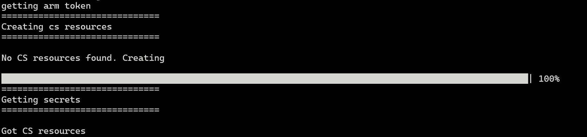

- In case the Cognitive resource are already present and available for the video indexer acocunt, the script will skip its creation and present with a conflict message ( that could be ignored). this is part of the installation process and should not raise concern.
    
    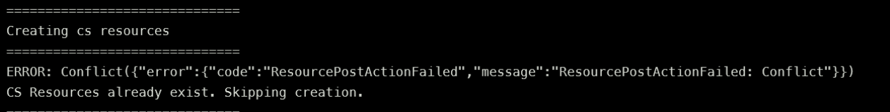


- The script usually takes 10-20 minutes to complete. once it is completed you can see the logs verifying the extension creation.
    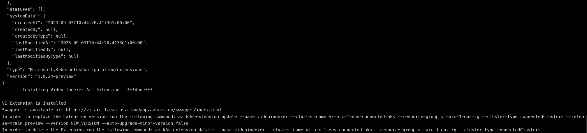

- During the installation of Pods into your cluster you may see several pods that are in pending state, or that are being restarted.Allow the screen to run to its full completion before you start troubleshooting.

    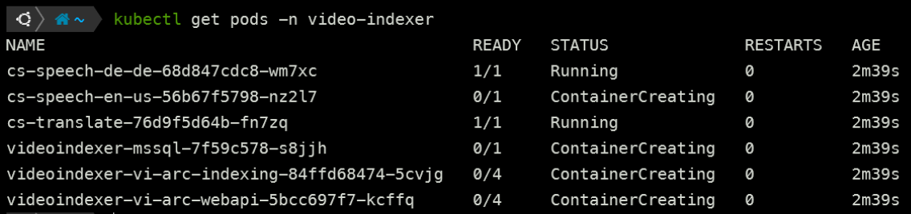

### Step 3 - Optional Configuration Parameters

There are some additional optional parameters that can be used in order to have a fine grain control on the extension creation

| Parameter | Default | Description |
|-----------|---------|-------------|
| AI.nodeSelector | - | The node Selector label on which the AI Pods (speech and translate)  will be assigned to |
| speech.resource.requests.cpu | 1 | The requested number of cores for the speech pod |
| speech.resource.requests.mem | 2Gi | The requested memory capactiy for the speech pod |
| speech.resource.limits.cpu | 2 | The limits number of cores for the speech pod. must be > speech.resource.requests.cpu  |
| speech.resource.limits.mem | 3Gi | The limits memory capactiy for the speech pod. must be > speech.resource.requests.mem  |
| translate.resource.requests.cpu | 1 | The requested number of cores for the translate pod |
| translate.resource.requests.mem | 16Gi | The requested memory capactiy for the translate pod |
| translateeech.resource.limits.cpu | -- | The limits number of cores for the translate pod. must be > translate.resource.requests.cpu  |
| translate.resource.limits.mem | -- | The limits memory capactiy for the translate pod. must be > translate.resource.requests.mem  |
| videoIndexer.webapi.resources.requests.cpu | 0.5 | The request number of cores for the web api pod  |
| videoIndexer.webapi.resources.requests.mem | 4Gi | The request memory capactiy for the web api pod  |
| videoIndexer.webapi.resources.limits.cpu | 1 | The limits number of cores for the web api pod  |
| videoIndexer.webapi.resources.limits.mem | 6Gi | The limits memory capactiy for the web api pod  |
| videoIndexer.webapi.resources.limits.mem | 6Gi | The limits memory capactiy for the web api pod  |
| storage.storageClass | "" | The storage class to be used |
| storage.useExternalPvc | false | determines whether an external PVC is used. if true, the VideoIndexer PVC will not be installed |

Example of a modified deploy script :

```shell
    az k8s-extension create --name videoindexer \
        --extension-type Microsoft.videoindexer \
        --config AI.nodeSelector."kubernetes\\.io/os"=ubuntu \
        --config "speech.resource.requests.cpu=500m" \
        --config "speech.resource.requests.mem=2Gi" \
        --config "speech.resource.limits.cpu=1" \
        --config "speech.resource.limits.mem=4Gi" \
        --config "videoIndexer.webapi.resources.requests.mem=4Gi"\
        --config "videoIndexer.webapi.resources.limits.mem=8Gi"\
        --config "videoIndexer.webapi.resources.limits.cpu=1"\
        --config "storage.storageClass=azurefile-csi" 
```

In the above example the script was modifed to use a specific node selector, and to modify the resource requests and limits for the speech and web api pods. 
in addition the storage class was changed to azurefile-csi which on Azure Cloud is a ReadWriteMany storage class.
Those customization should be done according to the cluster resources and the expected load, and according to specific infrastructure capabilities.

### Step 4 - Verify Deployment

- Once the script will complete it’s run, you can see that the Video Indexer Cluster extension is now enabled in the extension tab section of the Azure Arc-enabled Kubernetes cluster resource in Azure.

    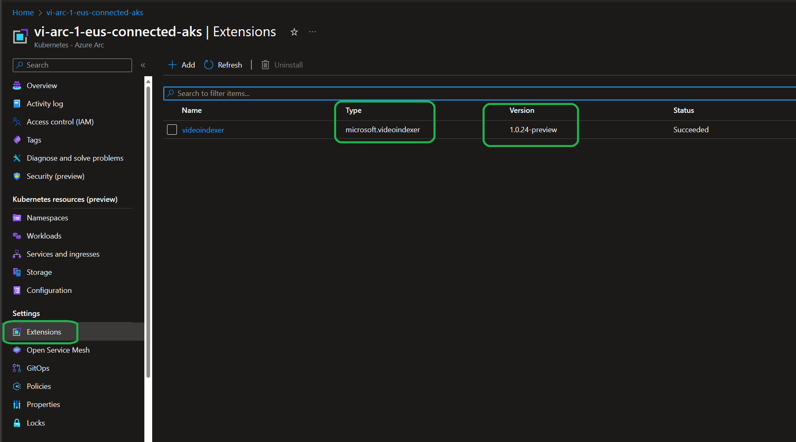

- You can verify the Kubernetes resources deployed by running a few _kubectl_ commands.

    ```shell
    kubectl get pods -n video-indexer
    ```

    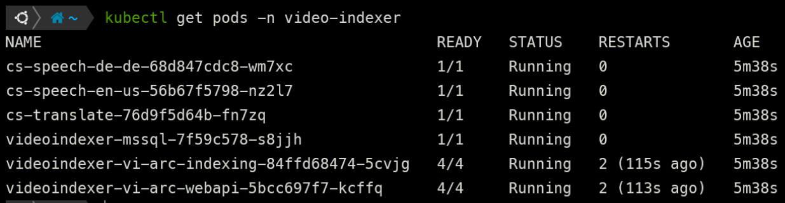


## Updating the extension

To update an existing Cluster extension instance, we will use the _k8s-extension update_ command while passing in values for the modified parameters.

```shell
    az k8s-extension update --name videoindexer \
        --cluster-name ${connectedClusterName} \
        --resource-group ${connectedClusterRg} \
        --cluster-type connectedClusters \
        --release-train ${releaseTrain}  \
        --version ${version} \
        --config "speech.resource.requests.cpu=500m"
```

> **NOTE: You must specify the cluster name and resurce group name in order to update the extension**.

## Using Azure Video Indexer Arc Extension

Once the deployment is ready you can either use the [Web Portal](https://azurearcjumpstart.io/azure_arc_jumpstart/azure_arc_video_indexer/toturial/webapp/) or the [Web API](https://azurearcjumpstart.io/azure_arc_jumpstart/azure_arc_video_indexer/toturial/webapi) to upload and index your video content using Video Indexer enabled by Arc environment.
## Cleanup

To delete the Video Indexer Arc Enabled Extension and it's respective Kubernetes resources, edit the environment variables to match the Azure Arc Kubernetes cluster and Resources in the [vi-extension-cleanup]- The deployment is using the following parameters that you will need to edit in the [*vi-extension-cleanup.sh*](https://github.com/microsoft/azure_arc/blob/main/azure_arc_video_indexer_jumpstart/vi-extension-cleanup.sh) file, upload it to Cloud Shell and run it using the _`. ./vi-extension-cleanup.sh`_ command.

- once the script will run and authenticate the service principal credentials, it will ask your consent to delete the extension and perform the delete operation.

    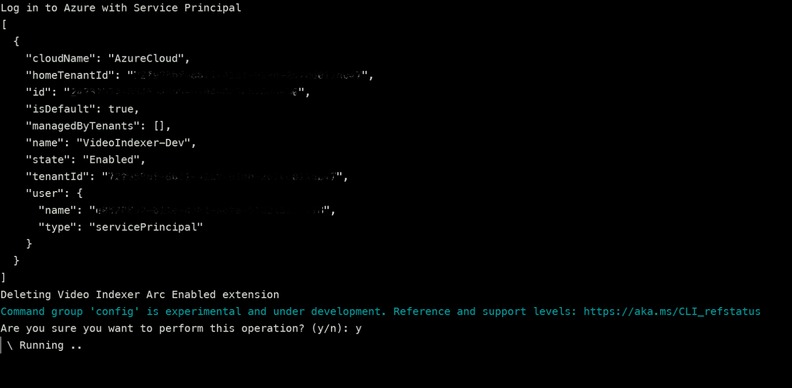
