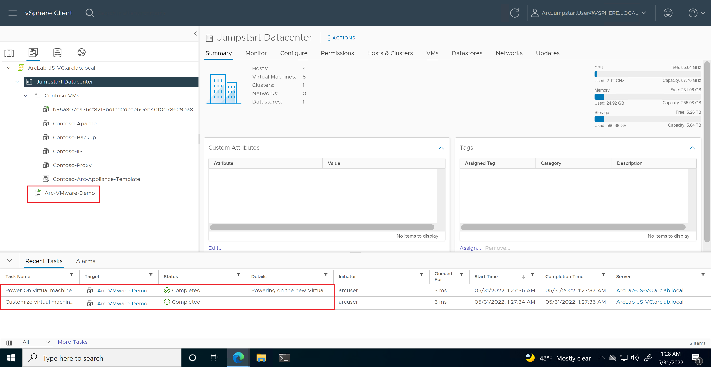

## Create a Windows VMware VM to an Azure Arc-enabled vSphere cluster using ARM templates

The following Jumpstart scenario will guide you on how to use the provided ARM template to deploy a Windows VM in your Azure Arc-enabled vSphere cluster using custom locations.

> **NOTE:  This Jumpstart scenario assumes you already have a working VMware vSphere environment and is not covering VMware-specific best practices and design recommendations.**

> **NOTE: Azure Arc-enabled VMware vSphere is currently in Preview and as a result, versions captured in the scenario's various screenshots are subject to change.**

## Prerequisites

- Clone the Azure Arc Jumpstart repository

    ```shell
    git clone https://github.com/microsoft/azure_arc.git
    ```

- [Install or update Azure CLI to version 2.49.0 and above](https://docs.microsoft.com/cli/azure/install-azure-cli?view=azure-cli-latest). Use the below command to check your current installed version.

  ```shell
  az --version
  ```

- Create Azure service principal (SP).

    To be able to complete the scenario and its related automation, Azure service principal assigned with the “Contributor” role is required. To create it, login to your Azure account run the below command (this can also be done in [Azure Cloud Shell](https://shell.azure.com/)).

    ```shell
    az login
    subscriptionId=$(az account show --query id --output tsv)
    az ad sp create-for-rbac -n "<Unique SP Name>" --role "Contributor" --scopes /subscriptions/$subscriptionId
    ```

    For example:

    ```shell
    az login
    subscriptionId=$(az account show --query id --output tsv)
    az ad sp create-for-rbac -n "JumpstartArc" --role "Contributor" --scopes /subscriptions/$subscriptionId
    ```

    Output should look like this:

    ```json
    {
    "appId": "XXXXXXXXXXXXXXXXXXXXXXXXXXXX",
    "displayName": "JumpstartArc",
    "password": "XXXXXXXXXXXXXXXXXXXXXXXXXXXX",
    "tenant": "XXXXXXXXXXXXXXXXXXXXXXXXXXXX"
    }
    ```

    > **NOTE: It is optional but highly recommended to scope the SP to a specific [Azure subscription and resource group](https://docs.microsoft.com/cli/azure/ad/sp?view=azure-cli-latest)**

## Automation Flow

For you to get familiar with the automation and deployment flow, below is an explanation.

1. User is editing the ARM template parameters file (1-time edit). These parameter values are being used throughout the deployment.

2. User deploys the ARM template at the resource group level.

3. User verifies the deployment of the Windows virtual machine in the vSphere cluster.

## Create the Virtual Machine

As mentioned, this deployment will leverage an ARM template. You will deploy a single ARM template at resource group scope.

- Before deploying the ARM template, login to Azure using AZ CLI with the ```az login``` command.

- The deployment will use an ARM template parameters file to customize your environment. Before initiating the deployment, edit the [_azuredeploy.parameters.json_](https://github.com/microsoft/azure_arc/blob/main/azure_arc_vsphere_jumpstart/vmware_arm_template_win/azuredeploy.parameters.json) file located in your local cloned repository folder. Example parameters files are located [here](https://github.com/microsoft/azure_arc/blob/main/azure_arc_vsphere_jumpstart/vmware_arm_template_win/azuredeploy.example.parameters.json). Fill out the parameters according to your environment:

  - _`virtualMachineName`_ - the name of the Windows virtual machine that will be created
  - _`customLocationName`_ - the name of your Azure Arc custom location
  - _`vCenterName`_ - the name of your vCenter
  - _`networkName`_ - the vSphere network (port group) you will use to deploy your VM
  - _`nicType`_ - the network type to associate to the VM
  - _`templateName`_ - your Windows VM template name
  - _`clusterName`_ - the vSphere cluster to host the VM
  - _`adminUserName`_ - the admin username for the created Windows VM
  - _`adminUserPassword`_ - the admin user password for the created Windows VM
  
- To deploy the ARM template, navigate to the local cloned [deployment folder](https://github.com/microsoft/azure_arc/blob/main/azure_arc_vsphere_jumpstart/vmware_arm_template_win/) and run the below command.

    ```shell
    az deployment group create \
    --location <Azure Region Location> \
    --resource-group <Resource Group Name> \
    --name <Deployment Name> \
    --template-file <The *azuredeploy.json* template file location> \
    --parameters <The *azuredeploy.parameters.json* parameters file location>
    ```

- Once Azure resources has been provisioned, you will be able to see it in Azure portal and in your vCenter.

    

    

    

    

- The VM is also onboarded to Azure Arc.

    

## Clean up

Complete the following steps to clean up your environment:

- To delete the just the Windows VM. Navigate to the VM in the Azure portal and click "Delete". This will initiate the deletion in your connected vCenter.

    

    

- If you want to delete the entire Azure resources, simply delete the deployment resource group from the Azure portal.

    
