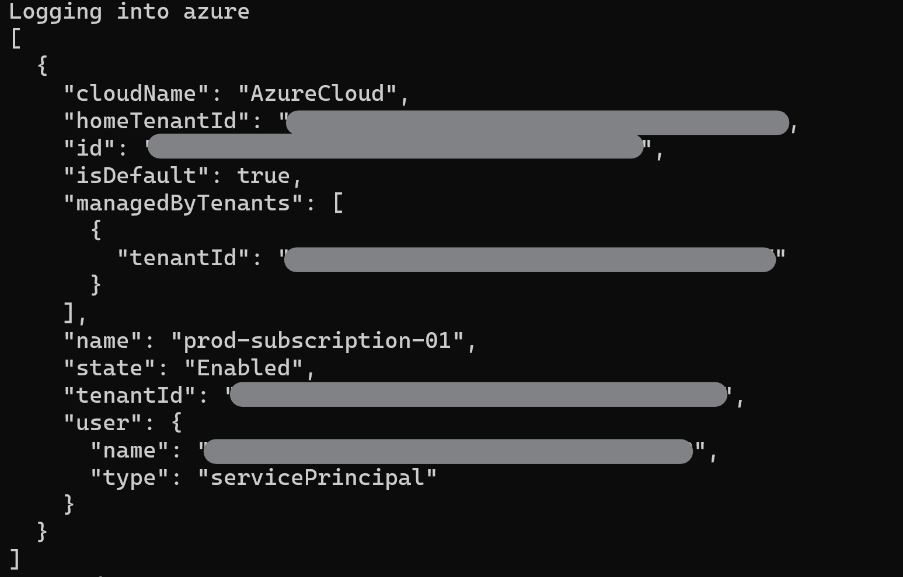
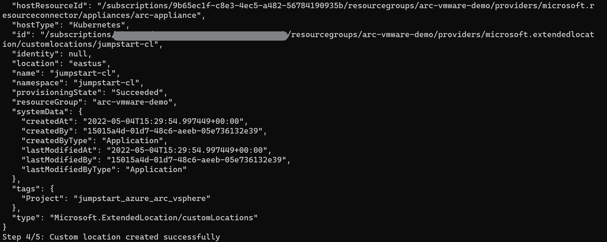
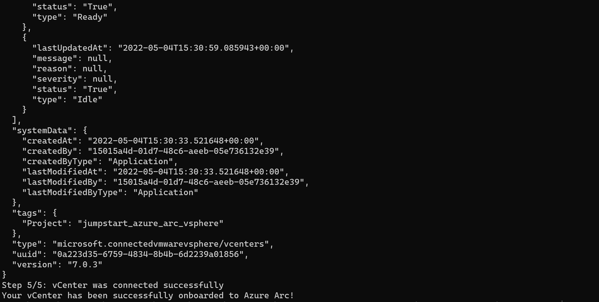
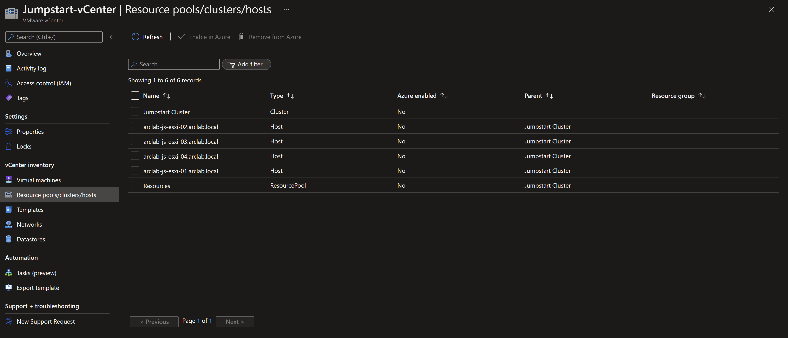
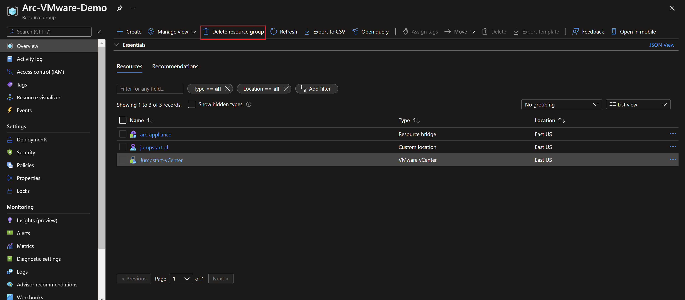

## Connect VMware vCenter Server to Azure Arc using PowerShell

The following README will guide you on how to use the provided PowerShell script to deploy the [Azure Arc resource bridge](https://docs.microsoft.com/azure/azure-arc/resource-bridge/overview) in your vSphere environment to connect your vCenter Server to Azure Arc.

> **NOTE:  This Jumpstart scenario assumes you already have a working VMware vSphere environment and is not covering VMware-specific best practices and design recommendations.**

> **NOTE: Azure Arc-enabled VMware vSphere is currently in Preview and as a result, versions captured in the scenario's various screenshots are subject to change.**

## Prerequisites

- Clone the Azure Arc Jumpstart repository

    ```shell
    git clone https://github.com/microsoft/azure_arc.git
    ```

- Create Azure service principal (SP)

    To be able to complete the scenario and its related automation, an Azure service principal assigned with the “Contributor” role is required. To create it, login to your Azure account using PowerShell and run the below command.

    ```powershell
    Connect-AzAccount
    $sp = New-AzADServicePrincipal -DisplayName "<Unique SP Name>" -Role 'Contributor'
    ```

    For example:

    ```powershell
    $sp = New-AzADServicePrincipal -DisplayName "AzureArcvSphere" -Role 'Contributor'
    ```

    This command will create a variable with a secure string as shown below:

    ```shell
    Secret                : System.Security.SecureString
    ServicePrincipalNames : {XXXXXXXXXXXXXXXXXXXXXXXXXXXX, http://AzureArcvSphere}
    ApplicationId         : XXXXXXXXXXXXXXXXXXXXXXXXXXXX
    ObjectType            : ServicePrincipal
    DisplayName           : AzureArcvSphere
    Id                    : XXXXXXXXXXXXXXXXXXXXXXXXXXXX
    Type                  :
    ```

    To expose the generated password use the below code to export the secret:

    ```powershell
    $BSTR = [System.Runtime.InteropServices.Marshal]::SecureStringToBSTR($sp.Secret)
    $UnsecureSecret = [System.Runtime.InteropServices.Marshal]::PtrToStringAuto($BSTR)
    ```

    Copy and save the Service Principal ApplicationId and Secret as you will need it for later in the automation.

    > **NOTE: It is optional but highly recommended to scope the SP to a specific [Azure subscription and resource group](https://docs.microsoft.com/powershell/module/az.resources/new-azadserviceprincipal?view=azps-5.4.0)**

- Get the ConnectedVMwarevSphere resource provider Id.

  ```shell
  az ad sp show --id 'ac9dc5fe-b644-4832-9d03-d9f1ab70c5f7' --query '{name:displayName,objectId:id}'
  ```
  
    

### vCenter Prerequisites

- VMware vSphere vCenter Server 7 or 8.

- A virtual network that can provide internet access, directly or through a proxy. It must also be possible for VMs on this network to communicate with the vCenter server on a TCP port (usually 443).

- At least three free static IP addresses on the above network. If you have a DHCP server on the network, the IP addresses must be outside the DHCP range.

- A vSphere resource pool or a cluster with a minimum capacity of 16 GB of RAM and 4 vCPUs.

- A vSphere datastore with a minimum of 100 GB of free disk space.

- A vSphere account [assigned](https://docs.vmware.com/en/VMware-vSphere/6.7/com.vmware.vsphere.security.doc/GUID-18071E9A-EED1-4968-8D51-E0B4F526FDA3.html) with the following [permissions](https://docs.microsoft.com/azure/azure-arc/vmware-vsphere/quick-start-connect-vcenter-to-arc-using-script#vsphere-account):
  - Read all inventory.
  - Deploy and update VMs to all the resource pools (or clusters), networks, and VM templates that you want to use with Azure Arc.

As mentioned, this scenario starts at the point where you already have an up and running VMware vSphere environment managed by vCenter. The automation will be run from a PowerShell window on a computer (which can be your local computer) that has network connectivity to vCenter.

  > **NOTE: the script will automatically uninstall any pre-existing Azure CLI versions in the workstation and will deploy the latest 64-bit version, as it is a requirement to deploy the Azure Arc resource bridge**

## Automation Flow

For you to get familiar with the automation and deployment flow, below is an explanation.

- User is editing the onboarding PowerShell script to match the environment (1-time edit).

- User will run the script from their local workstation or alternatively, a workstation with the required vCenter access.

- User will verify the correct onboarding.

## Connect VMware vCenter Server to Azure Arc

- Change the environment variables according to your environment:
  - _`location`_ - the Azure region you want to deploy to
  - _`subscriptionId`_ - your Azure subscription ID
  - _`resourceGroupName`_ - the name of the Azure resource group you will create your resources in
  - _`applianceName`_ - a name for the Azure Arc resource bridge appliance, as it will be shown in Azure.
  - _`customLocationName`_ - the name of your Azure Arc custom location
  - _`vcenterName`_ -  The name of your vCenter
  - _`vcenterFqdn`_ - your vCenter fully qualified name
  - _`vcenterUsername`_ - username to authenticate to vCenter
  - _`vcenterPassword`_ - password to authenticate to vCenter
  - _`spnClientId`_ - your service principal App ID
  - _`spnClientSecret`_ - your service principal secret
  - _`spnTenantId`_ - your Azure AD tenant ID
  - _`vmTemplate`_ - the Arc appliance template name
  - _`datacenter`_ - The vSphere datacenter where the appliance will be deployed. Make sure to include the full path, for example: '/Jumpstart - Datacenter'
  - _`datastore`_ - The vSphere datastore name where the appliance will be deployed. For example: 'NFS'
  - _`folder`_ - the vSphere folder where the template and appliance will be deployed. Make sure to include the full path, for example: '/Jumpstart - Datacenter/VMs'
  - _`dnsServer`_ - IP of the DNS server to be used for the appliance
  - _`gateway`_ - Gateway IP address to be used for the appliance
  - _`ipAddressPrefix`_ - Network IP address range in CIDR notation to be used by the appliance
  - _`k8sNodeIpPoolStart`_ - Starting IP address from the subnet to be used by the appliance for the node pool
  - _`k8sNodeIpPoolEnd`_ - End IP address from the subnet to be used by the appliance for the node pool
  - _`segment`_ - Name of the virtual network or segment to which the appliance VM must be connected. Use the same name as it is displayed in your vCenter, for example: 'Jumpstart VM segment - (VLAN 111)'
  - _`resourcePool`_ - The name of the vSphere resource pool to be used by the appliance. Make sure to include the full path, for example: '/Jumpstart - Datacenter/host/Jumpstart Cluster/Resources'
  - _`controlPlaneEndpoint`_ - IP address of the Kubernetes cluster control plane
  
  

- Once you have provided all of the required environment variables, open a PowerShell window (as an Administrator) and run the script with the command:

  ```powershell
  .\vCenter_onboarding.ps1
  ```

  
  
  

  

  

- While the script is running, from vCenter you should be able to see a running task:

  
  
  
  
  
  
  

  

  

  

  

  

  

- From the Azure portal, in the resource group, you should see three new resources, including the VMware vCenter.

  

  

- You should also be able to get a list of VMs, resource pools, templates, networks and data stores that are managed by the vCenter.

  
  
  
  
  
  
  
  
  

## Clean up environment

Complete the following steps to clean up your environment:

- If you want to delete the entire Azure resources, simply delete the deployment resource group from the Azure portal.

    

- From the vSphere client, power Off the appliance and remove from disk.

    

    

- From the vSphere client, remove the appliance template from disk.

    
