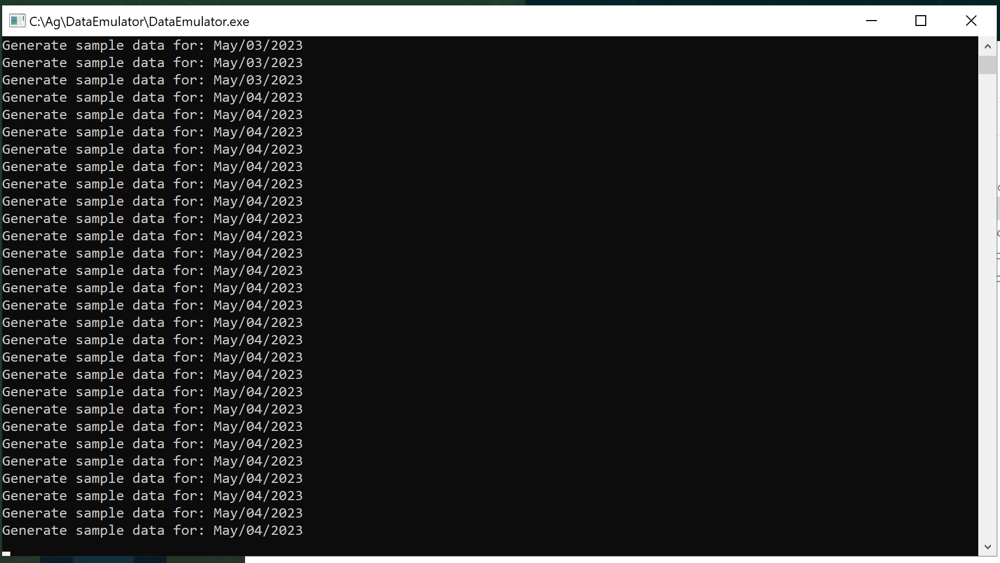
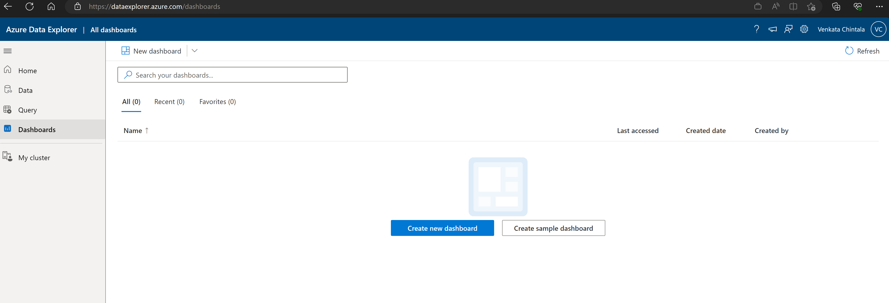
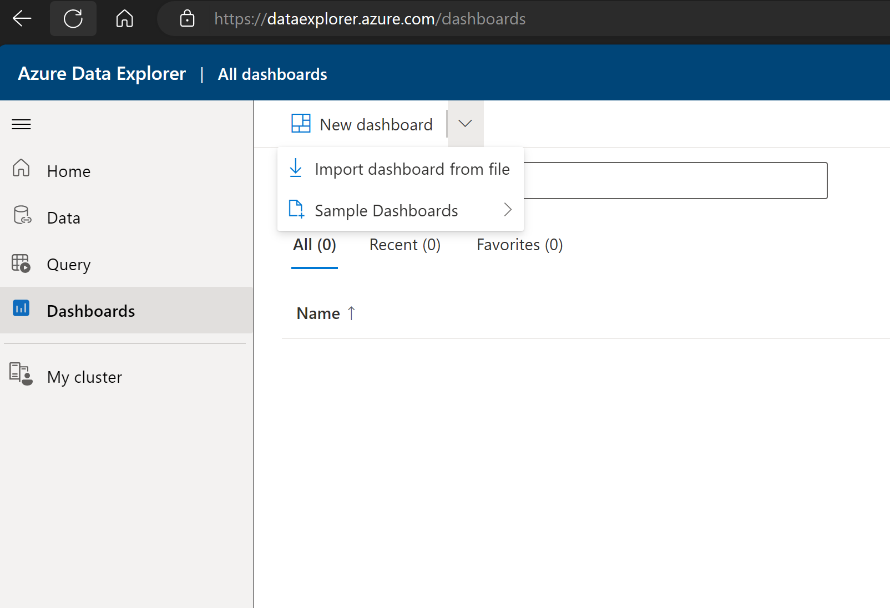
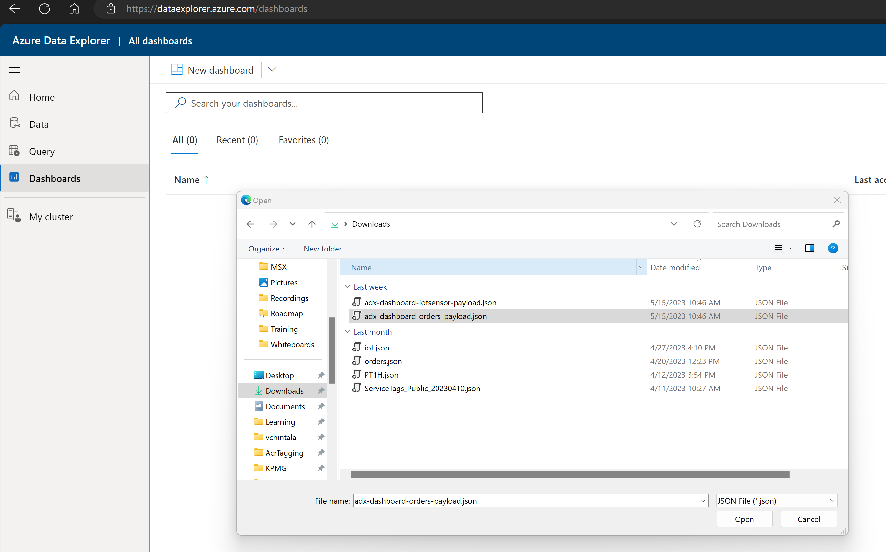
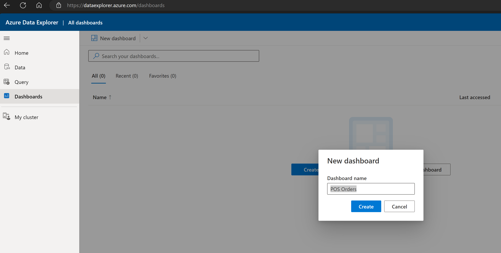
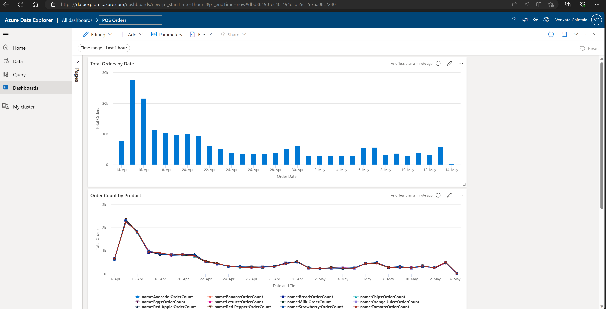

# Azure Data Explorer Dashboard Reports

Jumpstart Agora project supports dashboard reports for Point of Sale (POS) application and environment sensor analytics and monitoring. These reports are created in Azure Data Explorer (ADX) to allow users to import and view dashboards reports. These reports are generated based on live data received from POS application and environment sensors into ADX using data integration from Azure Cosmos DB database.

## Generate sample data using data emulator

By default there is no data available in Cosmos DB database after the deployment is complete. There are two ways you can generate Orders data. One method is using POS application and place orders. Another option is by using data emulator tool available on the Agora client VM. Use instructions below to generate sample data using the data emulator tool.

- Login to Agora client VM __Ag-VM-Client__ and locate Data Emulator icon on the desktop. Alternatively navigate to __C:\Ag\DataEmulator__ folder and locate __DataEmulator.exe__ file.

- Double click on the data emulator desktop icon or __DataEmulator.exe__ file to generate sample data. Confirm by entering Yes or Y to start generating data, entering No or N will exit the tool. This tool generates data for the last 30 days. Say No or N to prevent regenerating sample data if it is already generated earlier. You can still say Yes or Y to generate additional sample data. Please note, there might be duplicate key errors and might fail to generate data in subsequent attempts.

## Import Dashboards

In order to view dashboard reports you need to import these dashboards into ADX. You should have completed deployment of Jumptstart Agora in your environment and logon script is completed after you first login to Agora client VM __Ag-VM-Client__. Follow the step below to import dashboards once all the pre-requisites are completed.

- Login to Agora client VM, open Windows Explorer and navigate to folder __C:\Ag\adx_dashboards__ folder. This folder contains two dashboard JSON files (***adx-dashboard-iotsensor-payload.json*** and ***adx-dashboard-orders-payload.json***) with Azure Data Explorer URI updated when the logon script is completed.

- Copy these files on your computer in a temporary folder to import into Azure Data Explorer dashboards. Alternatively you can login to Azure Data Explorer directly on the Agora client VM. You Azure AD tenant may have conditional access policies enabled and might prevent login to Azure Data Explorer from Agora client VM.

- On your computer or Agora client VM open Edge browser and login to Azure Data Explorer by using URL [https://dataexplorer.azure.com/](https://dataexplorer.azure.com/). Use the same user account that you deployed Jumpstart Agora in your subscription.

- Once you login to Azure Data Explorer dashboards portal, click on Dashboards in the left navigation and review existing reports.

  

- Click import dashboard file to select previously copied file from Agora client VM or __C:\Ag\adx_dashboards__ folder on the Agora client VM.

  

- Choose file to import.

  

- Confirm dashboard report name.

  

- Save dashboard report in Azure Data Explorer.

  

- Repeat above steps for IoT sensor dashboard report.
