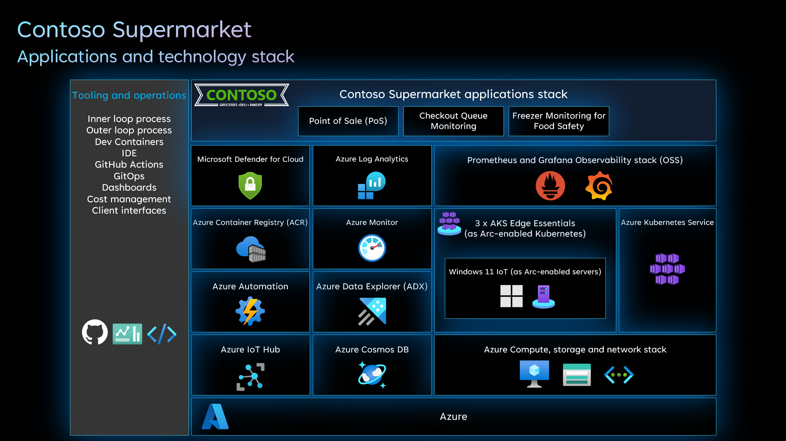

# Contoso Supermarket overview

Contoso Supermarket is a leading global retailer at the forefront of the digital revolution. With a strong presence in multiple countries, Contoso Supermarket is dedicated to providing exceptional customer experiences while embracing the latest technologies. Their cloud to edge strategy, combined with a commitment to digital transformation, has positioned them as an industry leader.

Contoso Supermarket's cloud to edge strategy enables them to leverage the power of both cloud computing and edge computing technologies. By harnessing the scalability, flexibility, and cost-effectiveness of the cloud, they optimize their operations, streamline processes, and enhance customer interactions. Simultaneously, their edge computing capabilities ensure real-time responsiveness and reduced latency, enabling them to deliver superior services at the edge of their network.

To achieve their digital transformation goals, Contoso Supermarket integrates cutting-edge technologies into their business operations. The Internet of Things (IoT) plays a vital role in their operations, enabling them to connect and manage a vast network of smart devices and sensors throughout their supply chain and physical stores. This connectivity enhances inventory management, enables predictive maintenance, and facilitates personalized customer experiences.

Additionally, Contoso Supermarket harnesses the power of Artificial Intelligence (AI) to gain actionable insights from their vast data streams. Through AI algorithms and machine learning models, they can analyze customer behavior, optimize inventory, and personalize marketing campaigns, leading to increased customer satisfaction and higher profitability.

A key component of Contoso Supermarket's digital transformation is their utilization of hybrid cloud technology using Azure Arc. Azure Arc enables them to seamlessly manage and deploy their applications across on-premises infrastructure, private cloud, and public cloud environments. This hybrid cloud approach allows them to leverage the benefits of both cloud and on-premises solutions, ensuring scalability, security, and compliance while maximizing operational efficiency.

Contoso Supermarket's commitment to digital transformation, along with their cloud to edge strategy, positions them as a forward-thinking and customer-centric retailer. By leveraging technologies like IoT, AI, and hybrid cloud with Azure Arc, they continue to innovate, enhance operational excellence, and deliver exceptional experiences to their customers worldwide.

## Architecture and technology stack

To support their digital transformation aspirations, Contoso Supermarket stores has a robust technology stack, services, and processes. To demonstrate the various use cases mentioned below, a set of reference applications is included:

- Point of Sale (PoS) - Streamlining sales transactions and customer interactions through a user-friendly and efficient point-of-sale system, simplifying the purchasing process and enhancing overall customer satisfaction.
- Checkout Queue Monitoring - Enhancing customer experience by monitoring and managing checkout queues in real-time to minimize waiting times and improve operational efficiency.
- Freezer Monitoring for Food Safety - Ensuring food safety by monitoring and maintaining optimal conditions in freezers to prevent spoilage and maintain product quality.

## Getting started

To get started with the "Contoso Supermarket" Jumpstart Agora scenario, we provided you with a dedicated guide for each step of the way. The guides are designed to be as simple as possible but also keep the detailed-oriented spirit of the Jumpstart.

| **Guide**                                                              | **Contoso Supermarket service or platform**    | **Technology stack**                                                                          |
|------------------------------------------------------------------------|------------------------------------------------|-----------------------------------------------------------------------------------------------|
| [Contoso Supermarket deployment](./deployment/_index.md)               | Not applicable                                 | Not applicable                                                                                |
| Data pipeline and reporting across cloud to edge - Store orders        | Point of Sale (PoS)                            | Cosmos DB, Azure Data Explorer, OSS PostgreSQL, AKS Edge Essentials                           |
| Data pipeline and reporting across cloud to edge - Sensor telemetry    | Freezer Monitoring for Food Safety             | IoT Hub, Azure Data Explorer, Mosquitto MQTT Broker, Prometheus, Grafana, AKS Edge Essentials |
| Basic GitOps flow                                                      | Point of Sale (PoS), Checkout Queue Monitoring | AKS, AKS Edge Essentials, Azure Arc, Flux                                                     |
| Developer experience and CI/CD                                         | Point of Sale (PoS)                            | AKS, AKS Edge Essentials, Azure Arc, Flux, GitHub Actions, Azure Container Registry           |
| Infrastructure observability for Kubernetes and Arc-enabled Kubernetes | Infrastructure                                 | AKS, AKS Edge Essentials, Prometheus, Grafana                                                 |
| Infrastructure observability for Arc-enabled servers                   | Infrastructure                                 | Azure Arc-enabled servers, Azure Monitor                                                      |
| Infrastructure security with Microsoft Defender for Servers            | Infrastructure                                 | Azure Arc-enabled servers, Microsoft Defender for Cloud                                       |
| Troubleshooting                                                        | Not applicable                                 | Not applicable                                                                                |
| Agora cleanup                                                          | Not applicable                                 | Not applicable                                                                                |
| FAQ and pricing                                                        | Not applicable                                 | Not applicable                                                                                |
