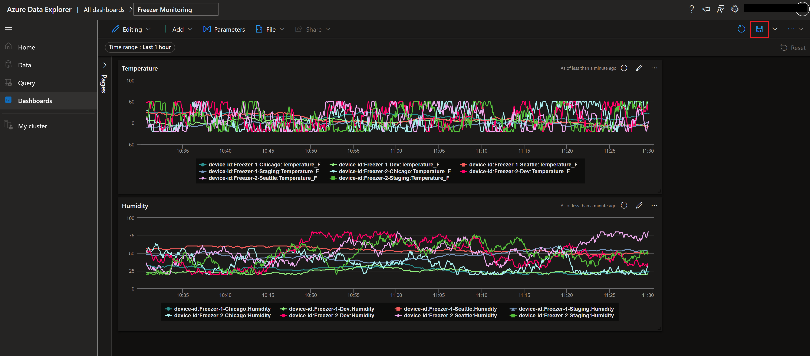
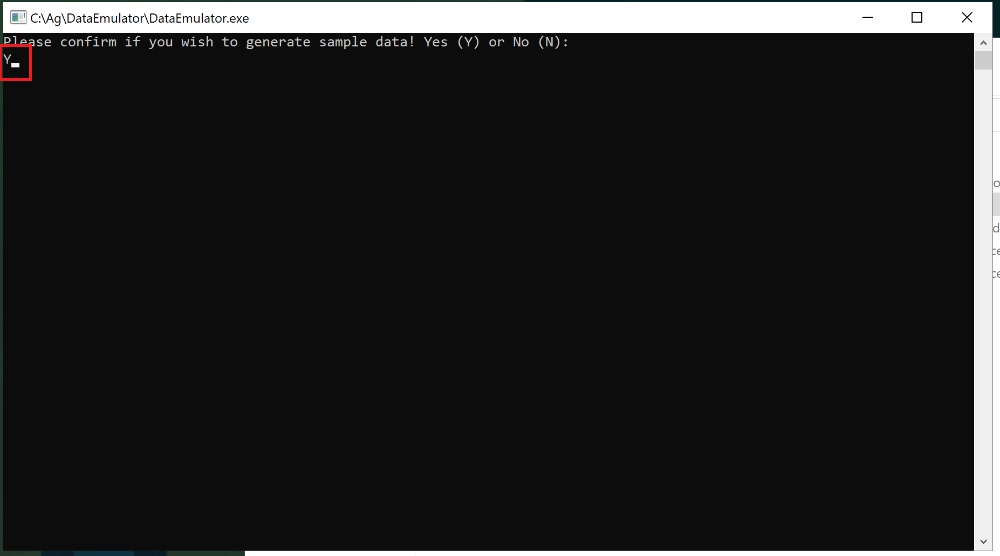
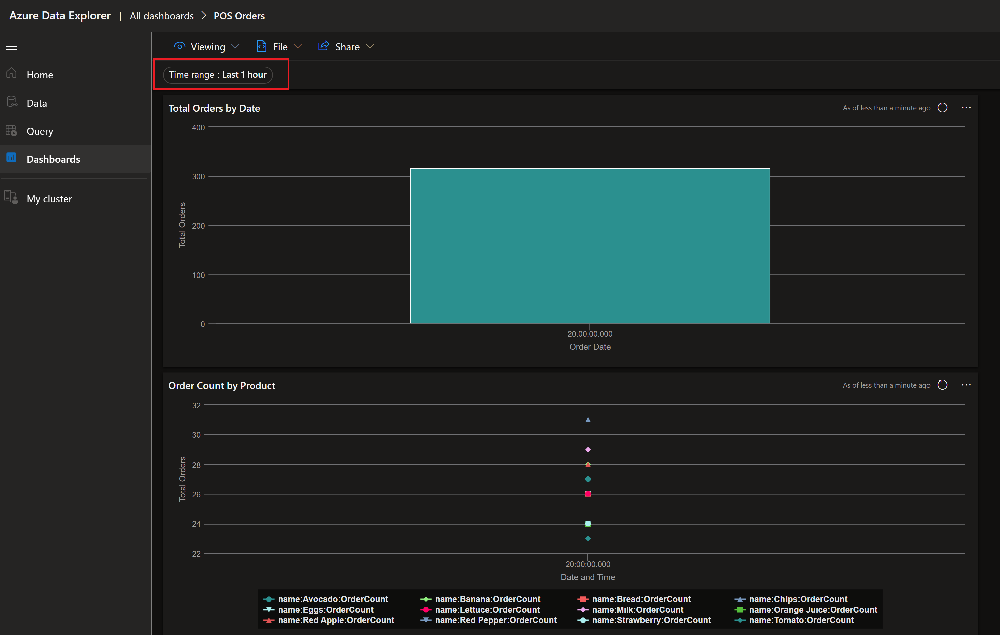
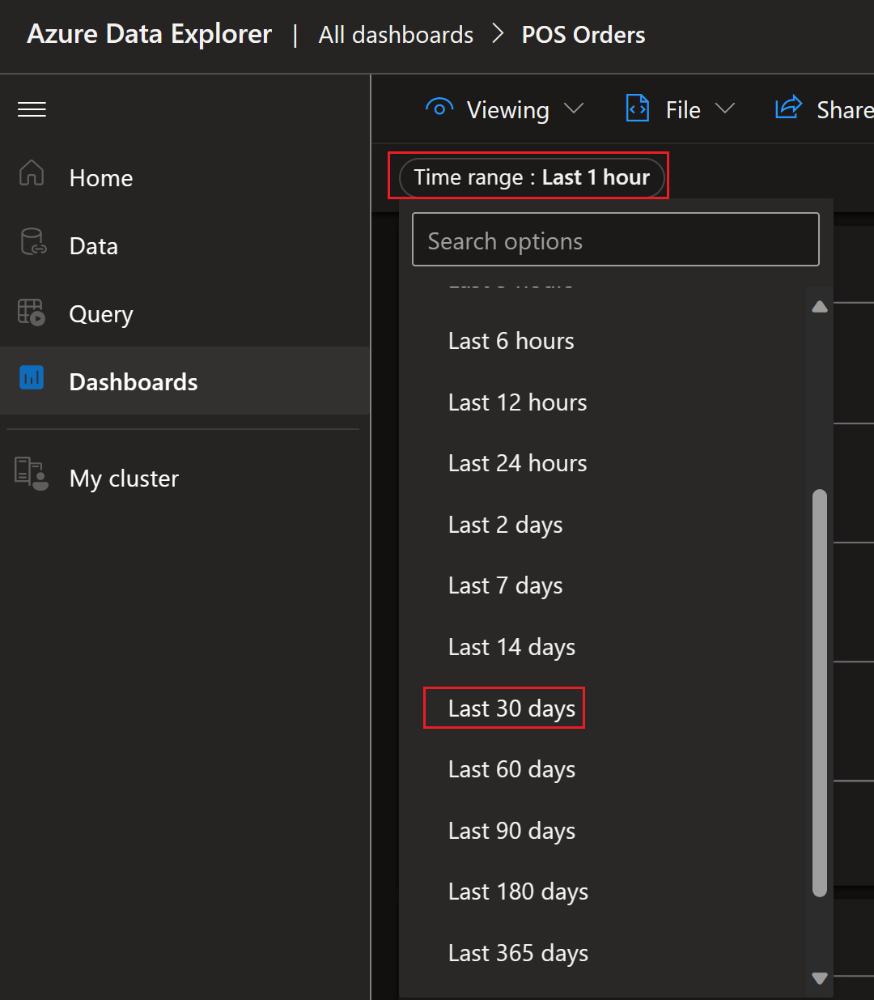
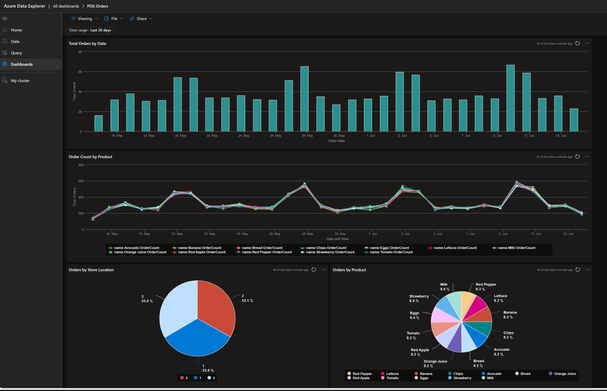
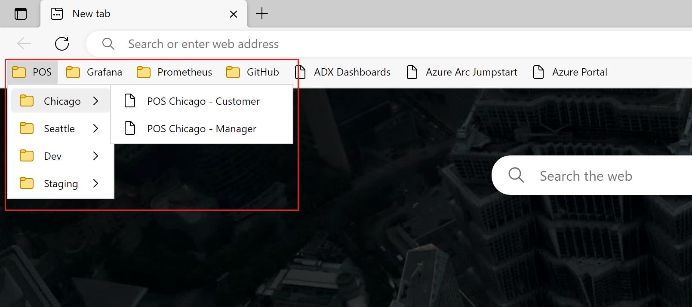
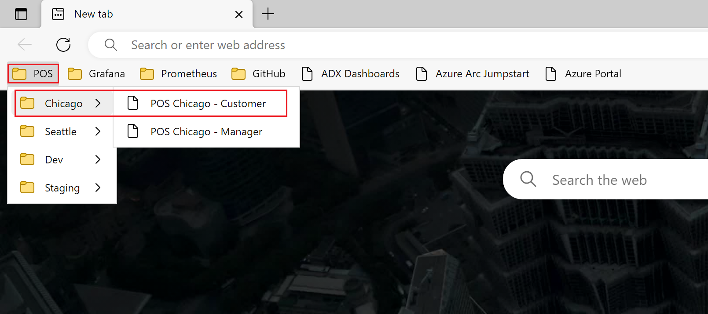
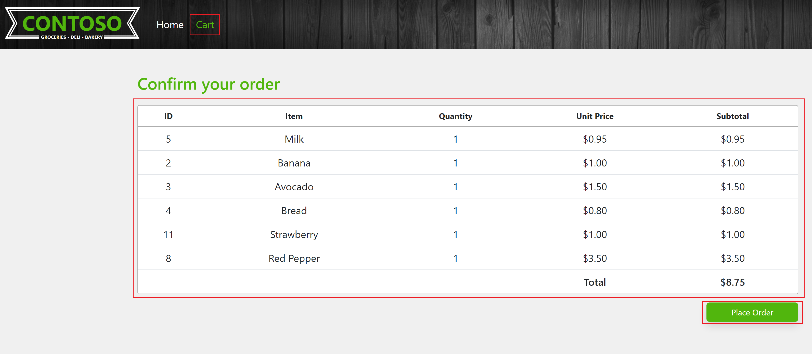

# Azure Data Explorer Dashboard Reports

Jumpstart Agora project supports dashboard reports for Point of Sale (POS) application and environment sensor analytics and monitoring. These reports are created in Azure Data Explorer (ADX) to allow users to import and view dashboards reports. These reports are generated based on live data received from POS application and environment sensors into ADX using data integration from Azure Cosmos DB database.

## Import Dashboards

In order to view dashboard reports you need to import these dashboards into ADX. You should have completed deployment of Jumptstart Agora in your environment and logon script is completed after you first login to Agora client VM __Ag-VM-Client__. Follow the step below to import dashboards once all the pre-requisites are completed.

- Login to Agora client VM, open Windows Explorer and navigate to folder __C:\Ag\adx_dashboards__ folder. This folder contains two dashboard JSON files (***adx-dashboard-iotsensor-payload.json*** and ***adx-dashboard-orders-payload.json***) with Azure Data Explorer URI updated when the logon script is completed.

  

- Copy these files on your computer in a temporary folder to import into Azure Data Explorer dashboards. Alternatively you can login to Azure Data Explorer directly on the Agora client VM. You Azure AD tenant may have conditional access policies enabled and might prevent login to Azure Data Explorer from Agora client VM.

- On your computer or Agora client VM open Edge browser and login to Azure Data Explorer by using URL [https://dataexplorer.azure.com/](https://dataexplorer.azure.com/). Use the same user account that you deployed Jumpstart Agora in your subscription.

- Once you login to Azure Data Explorer dashboards portal, click on Dashboards in the left navigation and review existing reports.

  

- Click import dashboard file to select previously copied file from Agora client VM or __C:\Ag\adx_dashboards__ folder on the Agora client VM.

  

- Choose _adx-dashboard-orders-payload.json_ file to import.

  

- Confirm dashboard report name, accept the suggested name or chose your own name and click Create.

  

- By default there is no data available to display report after deployment. Click Save to save dashboard report in Azure Data Explorer.

  

- Repeat above steps to import Freezer Monitoring dashboard report using _adx-dashboard-iotsensor-payload.json_ template file.

  

- Freezer monitoring IoT sensors continuously send data to Azure Data Explorer after the deployment is completed and will see data in the Freezer Monitoring dashboard report.

## Generate sample data using data emulator

By default there is no data available in Cosmos DB database after the deployment is complete. There are two ways you can generate Orders data. One method is using POS application and place orders. Another option is by using data emulator tool available on the Agora client VM. Use instructions below to generate sample data using the data emulator tool.

- Login to Agora client VM __Ag-VM-Client__ and locate Data Emulator icon on the desktop.

  

- Alternatively navigate to __C:\Ag\DataEmulator__ folder and locate __DataEmulator.exe__ file.

  

- Double click on the data emulator desktop icon or __DataEmulator.exe__ file to generate sample data. Confirm by entering Yes or Y to start generating data, entering No or N will exit the tool. This tool generates data for the last 30 days. Say No or N to prevent regenerating sample data if it is already generated earlier. You can still say Yes or Y to generate additional sample data. Please note, there might be duplicate key errors and might fail to generate data in subsequent attempts.

  

  

- From Azure Data Explorer open POS Orders report to see newly simulated orders data. Allow some time to propagate data into Azure Data Explorer using integrated data pipeline.

  

- By default report displays last one hour data. To change report period, chose time range as last 30 days from the report to refresh and display for the selected time range.

  

  

## Generate orders from Contoso supermarket

- On the Agora client VM __Ag-VM-Client__, open Edge browser, in the favorites bar review bookmarks created for POS applications for different stores and environments.

  

- From the bookmarks expand POS -> Chicago and select POS Chicago - Customer application.

  

- Randomly add few items to the cart.

  

- Place order.

  

- Place multiple orders by adding random items to the cart.

- Go to Azure Data Explorer dashboard and open POS Orders report and chose time range for last 30 minutes. Some times it takes time to flow orders to Azure Data Explore wait for few minutes and refresh report to see data.

  

- From Edge browser bookmarks, open POS application for other stores and repeat the order processing and see POS Orders dashboard for multiple stores and environments.

  
