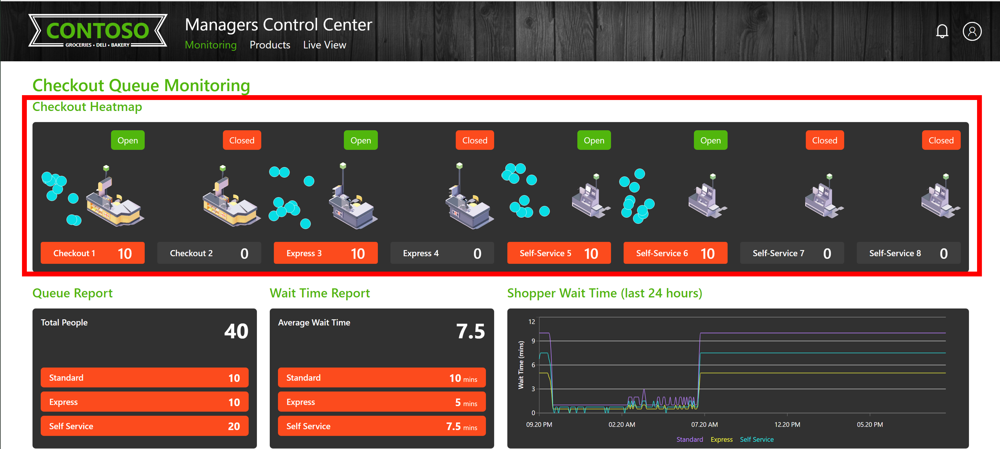
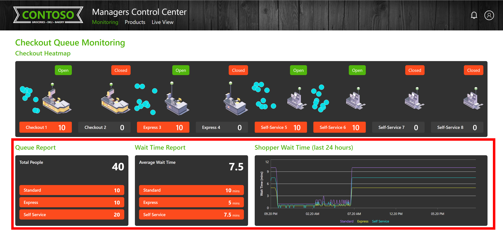
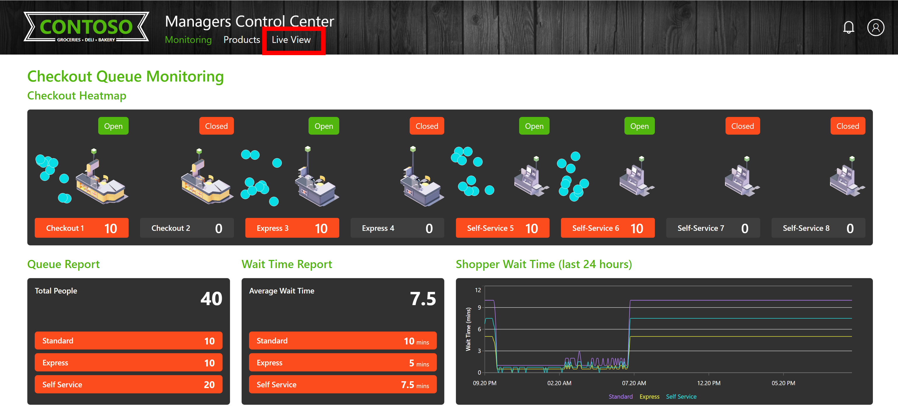
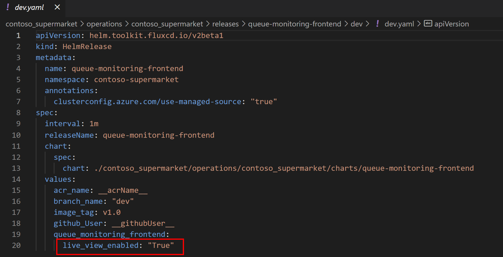

# Running AI at the Edge

## Overview

Contoso prides itself on being technology innovators. In the current market, Contoso's leadership recognizes that maintaining their position as leaders in the retail space requires innovation in every aspect of their operations.

To this end, Contoso has developed an AI mechanism that empowers them to enhance the customer experience in their stores. The objective is to accurately detect the number of people waiting at different checkout lanes and enable proactive actions based on this data.

## Store Manager Experience

To achieve this goal, Contoso leverages their existing CCTV cameras by seamlessly integrating them into the Store Manager interface. This integration enables Store Managers to take immediate action, such as opening or closing lanes, based on the real-time data provided by the cameras. All data processing occurs locally using an edge device, ensuring compliance with corporate policies and safeguarding data privacy.

The "Managers Control Center" serves as the central hub of this experience. From this interface, Store Managers can easily monitor the number of people in each lane. The home page consists of two main areas

- Heatmap. Using the heatmap, the Store Manager can open or close checkout lanes to distribute the traffic of the store, using the Toggles above each lane.
  
    

- Reporting. Contoso is interested in improving their store experience by measuring 2 key metrics: Total people in the store, and Shopper Wait Time. This metrics are shown in the Store Manager Control Center as shown below

    

## Configuration

These metrics are generated by combining an AI engine that captures inferences from the CCTV cameras with an application running the business logic. To provide visibility into the process of capturing these inferences, the Contoso Dev team has included an option to view the live video feed from one of their cameras. Contoso has decided to have the "Live View" option enabled by default in the Dev and Staging environments.

 If Store Managers wish to use this feature, they can simply set the "live_view_enabled" parameter to True on the correspoding manifest file.

 

## Next Steps

Use the following guides to explore different use cases of Contoso Supermarket in Jumpstart Agora.

- [PoS](https://placeholder)
- [Freezer Monitor](https://placeholder)
- [CI/CD](https://placeholder)
- [Basic GitOps](https://placeholder)
- [Analytics](https://analytics)
- [Troubleshooting](https://troubleshooting)
