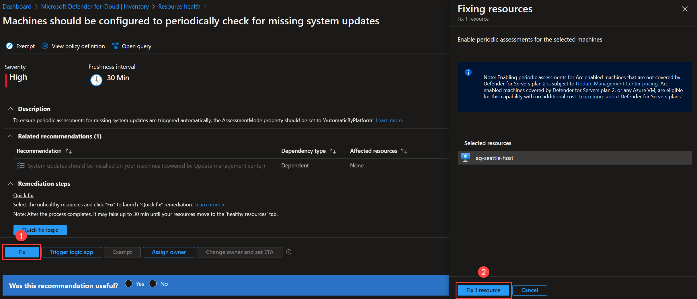
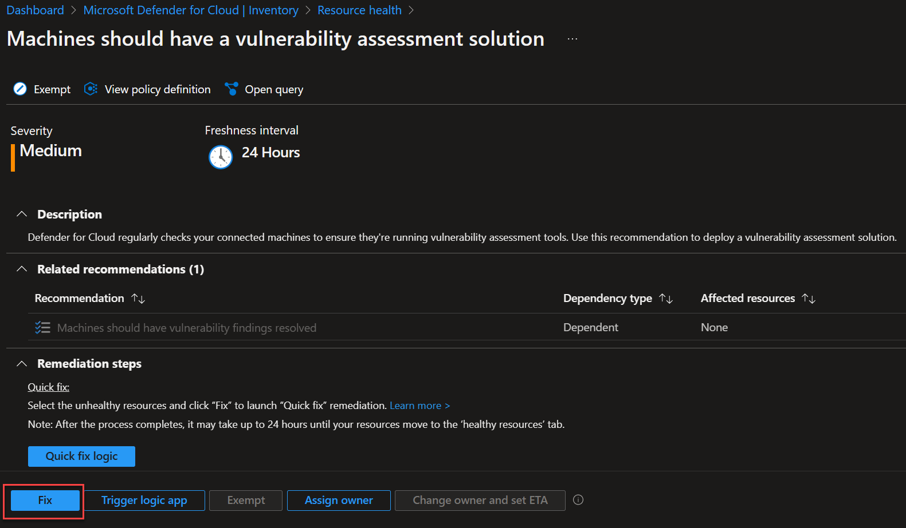
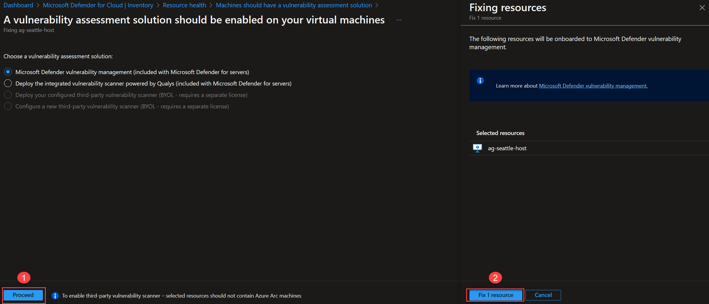

# Infrastructure security with Microsoft Defender for Servers

Microsoft Defender for Cloud provides unified security management and threat protection across your hybrid and multi-cloud workloads. To get all of the Microsoft Defender for Servers protections, you will need to enable the Microsoft Defender for Servers plan at subscription level.

CONTOSO SUPERMARKET STORY

## Onboarding

Follow these steps to enable the plan in the case it is not already enabled:

- Login to AZ CLI using the ```az login``` command.

- Ensure that you have selected the correct subscription you want to deploy ArcBox to by using the ```az account list --query "[?isDefault]"``` command. If you need to adjust the active subscription used by Az CLI, follow [this guidance](https://docs.microsoft.com/cli/azure/manage-azure-subscriptions-azure-cli#change-the-active-subscription).

- Run the following command to check whether Microsoft Defender for Servers is already enabled in your subscription or not:

    ```shell
    az security pricing show -n VirtualMachines
    ```

    

    > **NOTE: Proceed with the next step if the value you have got for _pricingTier_ is equals to _Free_. If the value was _Standard_, Microsoft Defender for Servers is already enabled and no additional action is required.**

- Run the following command to enable Microsoft Defender for Servers in your subscription:

    ```shell
    az security pricing create -n VirtualMachines --tier 'standard'
    ```

    

    > **NOTE: Remember to follow the steps provided in the Cleanup section to disable Microsoft Defender for Servers.**

## Azure Arc-enabled servers and Microsoft Defender for Servers Integration

Now that you have successfully enabled Microsoft Defender for Servers, you will get recommendations to help you protect your resources, including your Azure Arc-enabled servers.

Microsoft Defender for Servers will collect data from your Arc-enabled servers to monitor for security vulnerabilities and threats. The data collection will allow greater visibility into missing updates, non-secure OS settings, endpoint protection status, health and threat protection.

>**NOTE: it may take upto 30 minutes for your Azure Arc-enabled server to be shown in Microsoft Defender for Cloud Dashboard**

- Navigate to Microsoft Defender for Cloud. In the "Inventory" section under "VM and Servers", Defender will provide you with an overview of all the discovered security recommendations for your **Azure Arc-enabled servers**.

    

- Select one of the Azure Arc-enabled servers. Microsoft Defender for Cloud will provide security recommendations:

    

- Select one of the recommendations. Each recommendation will include:
  - A short description of what is being recommended.
  - Related recommendations.
  - The remediation steps to carry out in order to implement the recommendation. For specific recommendations, you may also get a **_Quick Fix_** that enables you to quickly remediate a recommendation on multiple resources.

    

- For this Azure Arc-enabled server the recommendation _Machines should have a vulnerability assessment solution_ provides a **_Quick Fix_**. It is using an ARM template to deploy an extension to enable a vulnerability assessment solution on the Azure Arc machine.

    

- You can trigger the remediation by clicking on the **_Fix_** button:  

    

- Leave the default vulnerability assessment solution selected and click first on **_Proceed_**, then click on **_Fix 1 resource_**.

    

- After you apply the recommendation it will be now marked as healthy. Note that It can take several minutes after remediation completes to see the resources in the 'healthy resources' tab

    

## Cleanup

> **NOTE: Proceed with the next steps if Microsoft Defender for Servers in your subscription was set to _Free_.**

- Login to AZ CLI using the ```az login``` command.

- Ensure that you have selected the correct subscription you want to deploy ArcBox to by using the ```az account list --query "[?isDefault]"``` command. If you need to adjust the active subscription used by Az CLI, follow [this guidance](https://docs.microsoft.com/cli/azure/manage-azure-subscriptions-azure-cli#change-the-active-subscription).

- Run the following command to disable Microsoft Defender for Servers in your subscription:

    ```shell
    az security pricing create -n VirtualMachines --tier 'free'
    ```

    
