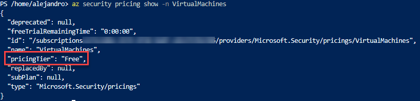
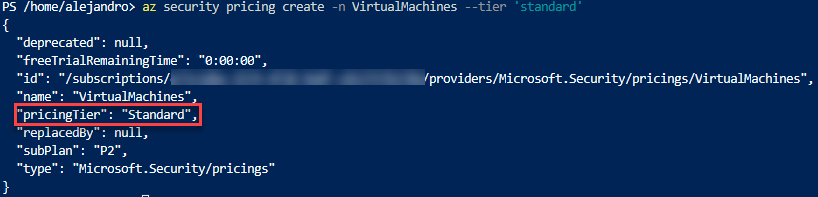

# Infrastructure security with Microsoft Defender for Servers

## Overview

Contoso Supermarket are aware that as they navigate the complex landscape of edge computing, it is essential to protect their servers against threats while maintaining a comprehensive view of their security posture. Microsoft Defender for Servers emerges as a vital component, playing a pivotal role in protecting servers from threats and providing unparalleled visibility into their security landscape.

[Microsoft Defender for Servers](https://learn.microsoft.com/azure/defender-for-cloud/plan-defender-for-servers) ensures that Contoso's Azure Arc-enabled servers remain resilient against a wide range of cyber threats. With advanced threat protection, machine learning algorithms, and real-time security intelligence, Microsoft Defender for Servers proactively detects and neutralizes potential risks.

On the other hand, maintaining visibility into the security posture of Azure Arc-enabled servers is crucial for Contoso. Microsoft Defender for Servers offers comprehensive insights into the servers' security status, providing a centralized view of threats, vulnerabilities, and security events. By analyzing telemetry data, logs, and behavioral patterns, Contoso Supermarket gains a deep understanding of their security landscape, enabling proactive risk mitigation.

## Enable Microsoft Defender for Servers

To protect workloads with Microsoft Defender for Servers, you will need to enable its "Servers" plan at the Azure subscription level. Follow these steps, if it is not already enabled:

- Login to AZ CLI using the ```az login``` command.

- Ensure that you have selected the correct subscription by using the ```az account list --query "[?isDefault]"``` command. If you need to adjust the active subscription used by Az CLI, follow [this guidance](https://docs.microsoft.com/cli/azure/manage-azure-subscriptions-azure-cli#change-the-active-subscription).

    

- Run the following command to check whether Microsoft Defender for Servers is already enabled in your subscription or not:

    ```shell
    az security pricing show -n VirtualMachines
    ```

    

    > **NOTE: Proceed with the next step if the value you have got for _pricingTier_ is equal to _Free_. If the value was _Standard_, Microsoft Defender for Servers is already enabled and no additional action is required.**

- Run the following command to enable Microsoft Defender for Servers in your subscription:

    ```shell
    az security pricing create -n VirtualMachines --tier 'standard'
    ```

    

    > **NOTE: Remember to follow the steps provided in the Cleanup section at the end of this guide to disable Microsoft Defender for Servers, otherwise you may incur additional charges on your subscription.**

## Azure Arc-enabled servers and Microsoft Defender for Servers Integration

Now that you have successfully enabled Microsoft Defender for Servers, you will start getting recommendations to help you protect your resources, including your Azure Arc-enabled servers.

Microsoft Defender for Servers will collect data from your Arc-enabled servers to monitor for security vulnerabilities and threats. The data collection will allow greater visibility into missing updates, non-secure OS settings, endpoint protection status, health, and threat protection.

- Navigate to Microsoft Defender for Cloud. In the **Inventory** section under **VM and Servers**, Defender will provide you with an overview of all the discovered security recommendations for your **Azure Arc-enabled servers**.

    

    > **NOTE: it may take up to 30 minutes for your Azure Arc-enabled server to be shown in Microsoft Defender for Cloud Dashboard**

- Select one of the Azure Arc-enabled servers. Microsoft Defender for Cloud will show the security recommendations:

    

- Select one of the recommendations. Each recommendation will include:
  - A short description of what is being recommended.
  - Related recommendations.
  - The remediation steps to carry out in order to implement the recommendation. For specific recommendations, you may also get a **_Quick Fix_** that enables you to quickly remediate a recommendation on multiple resources.

    

- For this Azure Arc-enabled server the recommendation _Machines should be configured to periodically check for missing system updates_ provides a **_Quick Fix_**. It is using an ARM template to enable a periodic update assessment on the Azure Arc-enabled server.

    

- You can trigger the remediation by clicking on the **_Fix_** button:  

    

- After you apply the recommendation, it will be now marked as healthy. Note that it can take several minutes after remediation completes to see the resources in the 'healthy resources' tab

    

## Cleanup

> **NOTE: Proceed with the next steps if Microsoft Defender for Servers in your subscription was set to _Free_.**

- Login to AZ CLI using the ```az login``` command.

- Ensure that you have selected the correct subscription by using the ```az account list --query "[?isDefault]"``` command. If you need to adjust the active subscription used by Az CLI, follow [this guidance](https://docs.microsoft.com/cli/azure/manage-azure-subscriptions-azure-cli#change-the-active-subscription).

    

- Run the following command to disable Microsoft Defender for Servers in your subscription:

    ```shell
    az security pricing create -n VirtualMachines --tier 'free'
    ```

    
