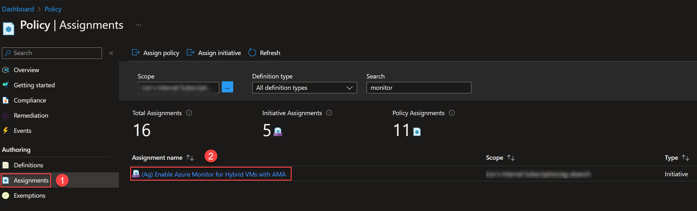
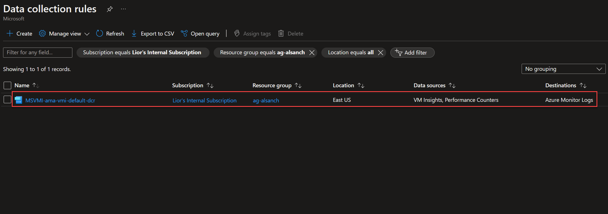
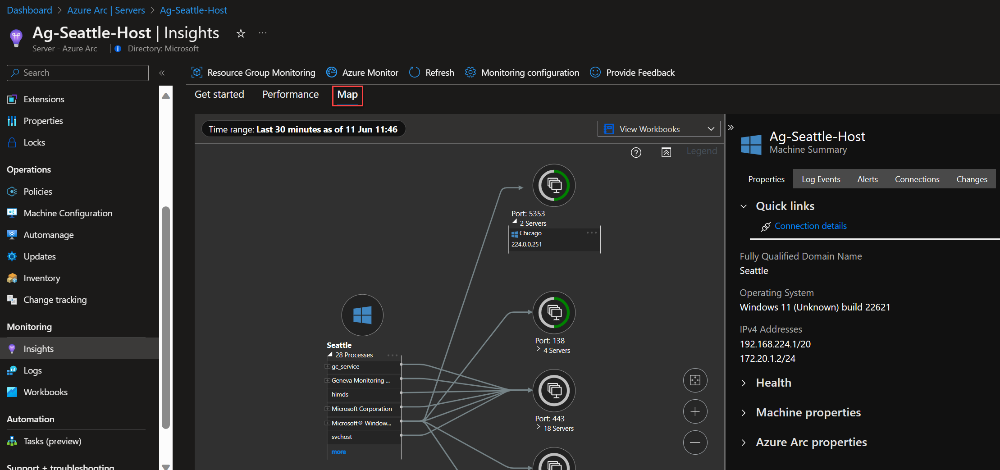

# Infrastructure observability for Azure Arc-enabled servers using Azure Monitor

## Overview

Infrastructure observability is key for Contoso Supermarket to understand the performance and the health of their Azure Arc-enabled servers. This is where [Azure Monitor](https://learn.microsoft.com/azure/cloud-adoption-framework/scenarios/hybrid/arc-enabled-servers/eslz-management-and-monitoring-arc-server) steps in, playing a crucial role in providing visibility into every aspect of their Azure Arc-enabled servers ecosystem.

Azure Monitor empowers Contoso with the ability to monitor and collect telemetry data from their Azure Arc-enabled servers. It acts as a central hub, delivering near real-time insights into server performance, health, and resource utilization. Azure Monitor provides a holistic view of the entire infrastructure, ensuring proactive identification and resolution of potential issues.

## Enable and configure Azure Monitor

Azure Monitor can collect data directly from your hybrid machines into a Log Analytics workspace for detailed analysis and correlation. It requires installing the Azure Monitor Agent (AMA) and Dependency agent VM extension in your Azure Arc-enabled servers, enabling VM insights to collect data from your machines.

As part of the automated deployment, an Azure Policy monitoring initiative and a Data Collection Rule (DCR) are deployed. They allow collecting monitoring data from your Azure Arc-enabled servers.

Follow these steps to verify that these required Azure Monitor artifacts have been successfully deployed:

- In the top bar of the Azure portal, search for **policy** and click on **Policy**:

    

- Click on **Assignments**. You will see the Azure Policy initiative "_(Ag) Enable Azure Monitor for Hybrid VMs with AMA_". This initiative enables Azure Monitor for the hybrid virtual machines with AMA. It takes a Log Analytics workspace as a parameter and asks for an option to enable Processes and Dependencies.

    

- The Azure Policy initiative mentioned above deploys a Data Collection Rule (DCR), which is in charge of collecting monitoring data from the Azure Arc-enabled servers. In the top bar, search for **Data collection rules**:

    

- You will find the DCR that has been created to collect insights from the Azure Arc-enabled servers:

    

- Click on the DCR. You will see the data sources collected ant the Azure Arc-enabled servers associated to this DCR:

    

    

## Azure Arc-enabled servers and Azure Monitor VMInsights Integration

Now that we have checked that the required monitoring artifacts have been successfully enabled, it's time to leverage VMInsights. It monitors the performance and health of your Azure Arc-enabled servers by collecting data on their running processes and dependencies on other resources.

- Search for **Azure Arc**, go to **Servers** and click in one of your **Azure Arc-enabled servers**:

    

- Click on **Insights** and then on **Performance**. You will find a set of performance charts that target several key performance indicators to help you determine how well your Azure Arc-enabled server is performing. The charts show resource utilization over a period of time:

    

- After you have explored all the available performance charts, click on **Map**. You will see the processes running in your Azure Arc-enabled servers, their connections and dependencies:

    
