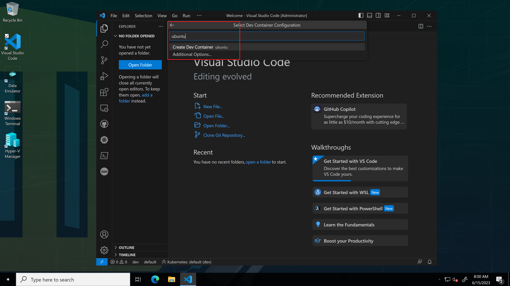
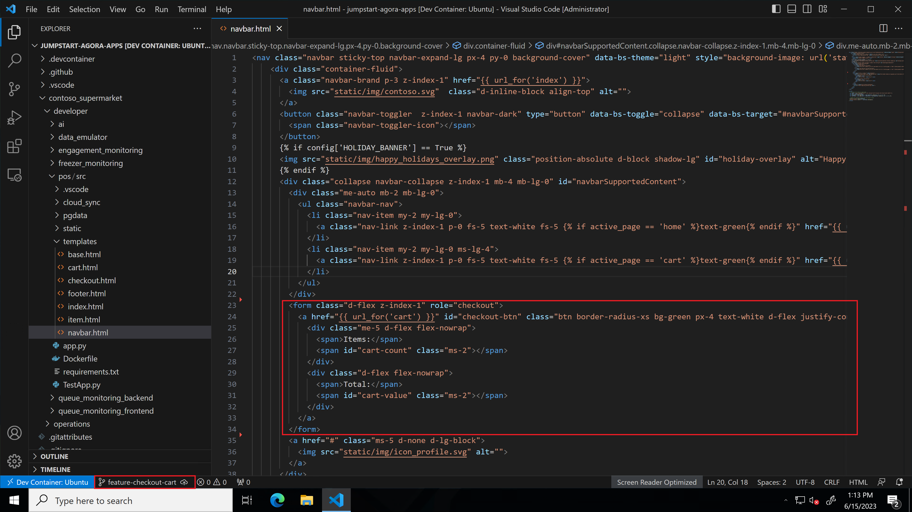

# Streamlining the Software Delivery Process using CI/CD

## Overview

In today's fast-paced software development industry, having a robust and efficient CI/CD (Continuous Integration/Continuous Deployment) pipeline is critical for organizations to maintain a competitive edge and stay ahead of the curve. This is particularly important for organizations like Contoso Supermarket to deliver a seamless shopping experience to its customers. With the increasing adoption of cloud technologies, the need for an efficient CI/CD pipeline has become more pronounced, as it allows Contoso Supermarket to quickly and reliably deploy changes to their applications and infrastructure.

GitHub Actions allows Contoso Supermarket's developers to define workflows to build, test, and deploy their applications directly from their GitHub repositories. With its wide range of pre-built actions and integrations, GitHub Actions makes it easy for developers to implement CI/CD pipelines for Contoso Supermarket's critical applications and services and to ship more features without compromising quality, security and speed.

## Architecture

Contoso Supermarket has three environments for their development process (Dev, Staging, Canary and Production), each environment is represented in their GitHub repository as a seperate branch to allow developers to develop, test and ship features and fixes in a controlled manner across each environment.

### Development workflow

- The inner loop is where developers start to make changes and test locally on the local _Dev_ cluster and then using the CI/CD workflow
- Changes are then automatically pushed to the Staging environment for testing and validation.
- Once the changes are approved by a release manager, the changes start to get pushed to the outer loop to the canary environment which is an actual cluster in the Chicago's store
- After this release has been cleared for successful testing and operation in the Chicago's environment, the release manager will approve the changes for production
- The CI/CD workflow will run final tests and deploy this release to the production environment in the Seattle's store

    

### CI/CD workflow

Contoso Supermarket has implemented a CI/CD workflow to make it easier for developers to focus on code and streamline all the code build, test and deployment activities. Before starting to code this new feature, its useful to take take a look on how the Contoso Supermarket's GitHub repository is structured and how CI/CD workflow is configured.

   

- The GitHub repository for Contoso Supermarket has a branch per environment as follows:
  - Main branch targets the local _Dev_ environment/cluster
  - Staging branch targets the _Staging_ environment/cluster
  - Canary branch targets the _Chicago_ environment/cluster
  - Production branch targets the _Seattle_ environment/cluster

    

- The repository has two main folders to seperate the development team applications' code (developer) and the DevOps team operations GitOps configurations (operations)

    

- Within the _developer_ folder, there is a folder for each application's source code. This is where Contoso Supermarket's developers develop new features

    

- Within the _operations_ folder, there is also folder for each application's GitOps configuration. This is where Contoso Supermarket's DevOps team manage how the applications are deployed to the different environments

    

- Each application has folder for _charts_ where the Kubernetes mainfests for each application is located and a folder for _releases_ where the helm releases for each application and each environment is located. This way the DevOps team can control the promotion of each version of the applications across the CI/CD workflow on different environments and also enable/disable features created by the developers as needed

    

    

- The repository has the following GitHub actions that build the Contoso Supermarket's CI/CD workflow
  - **Promte-to-staging:** This workflow is triggered once a pull request targeting the code of the Pos application is merged. It will build the new images based on code changes, increment the image tag, run unit tests and update the Pos application on the _Staging_ environment
  - **Promte-to-canary:** This workflow is triggered once the staging cluster has a healthy deployment of the Pos application via a Flux V2 alert. It will build the new canary image, run integration tests and submits a PR to update the image tag on the _canary_ Helm release
  - **Promte-to-production:** This workflow is triggered once the canary cluster has a healthy deployment of the Pos application via a Flux V2 alert. It will build the new production image, run final tests and submits a PR to update the image tag on the _production_ Helm release

    

## Developer experience

As a Contoso Supermarket developer, you are assigned a new task to implement a new feature to the Point of Sale (PoS) application where customers have provided feedback that the checkout process is not optimal. As they are adding products to their cart, there is no way for them to see how many items are in the cart and how much is the total cost at this time of their buying process.

The development process will start from the local _dev_ cluster, where as a developer, you will write some code to add this new functionality using VSCode's dev containers feature.

   

- Connect to the Client VM `Ag-VM-Client` using the instructions in the [Deployment Guide](https://github.com/microsoft/azure_arc/blob/jumpstart_ag/docs/azure_jumpstart_ag/contoso_supermarket/deployment/_index.md#connecting-to-the-agora-client-virtual-machine).

- Open VSCode from the desktop shortcut

    

- Bring up the VSCode command palette

    

- Select the option to open a folder in a dev container from the command palette

    

- Browse to the cloned repository on the Client VM located at _C:\Ag\AppsRepo\jumpstart-agora-apps_

    

- Select the _Ubuntu_ operating system for your dev container

    

    

- No need for any additional features to install, so click _Ok_

    

- Click on _Trust folder and continue_, now you can see the cloned repository opened in VSCode, in te _Ubuntu_ dev container

    

    

- Click on the GitHub icon in the VSCode toolbar, click on _Manage Unsafe Repositories_ and select the _jumpstart-agora-apps_ repository to whitelist it

    

- To add this new checkout functionality, you will have to create a new feature branch and edit the _navbar.html_ file in the _pos_ application.
- Create a new branch from VSCode called _feature-checkout-cart_ and publish this branch to the remote repository

    

    

- Navigate to the file _contoso_supermarket/developer/pos/src/templates/navbar.html_

    

- To simulate adding this new functionality, uncomment the commented section in the _navbar.html_ file and save your changes

    

- You should see a new change visible in the GitHub pane (if you don't see any changes, click refresh)

    

- Add a commit message and click Commit, for example: "Adding checkout functionality" and push your code

    

    

- After the code has been pushed, navigate to your GitHub fork of the _jumpstart-agora-apps_, you will see a notification about changes in the _feature-checkout-cart_branch. Click_Compare & Pull request_

    

- Change the base repository to your fork, create the pull request, merge the pull request and delete the feature branch after the merge

    

    

    

    

- A GitHub action is automatically triggered to build new Docker image of the Pos application and deploy this new image to the Staging cluster

    

- On the Client VM, open Windows Terminal, switch to the _Staging_ Kubernetes cluster and monitor the contosopos pods. You should see the pods are recreated as the Flux V2 extension picks up the changes you made on the _Dev_ environment and deploys it to the _Staging_ cluster

  ```azurecli
  kubectx staging
  kubectl get pods -n contoso-supermarket
  ```

    

- Open Edge, and navigate to the _POS Staging - Customer_ bookmark

    

- The new checkout feature is now deployed and visible on the _Staging_ environment

    

- Once the Pos application is healthy on the _Staging_ cluster, a pull request is created automatically to update the _Canary_ environment with the new Pos application image

    

- Merge the new pull request to deploy this new checkout feature to the _Canary_ environment (Chicago store) and delete the branch

    

    

- Once the merge is complete, GitOps configuration will pick up the new changes and deploy the new image to the _Canary_ cluster

    

- On the Client VM, open Windows Terminal, switch to the _Chicago_ Kubernetes cluster and monitor the contosopos pods. You should see the pods are recreated as the Flux V2 extension picks up the changes you made on the _Staging_ environment and deploys it to the _Canary_ cluster

  ```azurecli
  kubectx chicago
  kubectl get pods -n contoso-supermarket
  ```

    

    

- Once the Pos application is healthy on the _Canary_ cluster, a pull request is created automatically to update the _Production_ environment with the new Pos application image

    

- Merge the new pull request to deploy this new checkout feature to the _Production_ environment (Seattle store) and delete the branch

    

    

- Once the merge is complete, GitOps configuration will pick up the new changes and deploy the new image to the _Production_ cluster

    

- On the Client VM, open Windows Terminal, switch to the _Seattle_ Kubernetes cluster and monitor the contosopos pods. You should see the pods are recreated as the Flux V2 extension picks up the changes you made on the _Staging_ environment and deploys it to the _Canary_ cluster

     ```azurecli
     kubectx seattle
     kubectl get pods -n contoso-supermarket
     ```

    

    

## Next steps

Use the following guides to explore different use cases of Contoso Supermarket in Jumpstart Agora.

- [POS](https://placeholder)
- [Freezer Monitor](https://placeholder)
- [observability](https://placeholder)
- [Basic GitOps](https://placeholder)
- [Analytics](https://analytics)
- [Troubleshooting](https://troubleshooting)