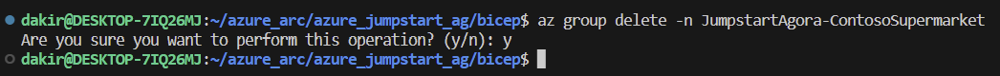
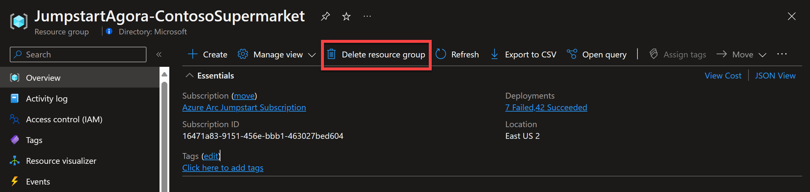
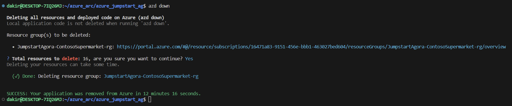

# Cleanup deployment

- To clean up your deployment, simply delete the resource group using Azure CLI or Azure portal.

  ```shell
  az group delete -n <name of your resource group>
  ```

  

  

- If you used Azure Developer CLI to deploy then ```azd down``` can be used instead.

  

  > __NOTE: If you have manually configured Defender for Cloud, please refer to the [dedicated page](https://azurearcjumpstart.io/azure_jumpstart_ag/contoso_supermarket/arc_servers/) to clean up Defender for Cloud resources.__

## Next steps

If you still having issues with the deployment, please refer to the [Troubleshooting](https://azurearcjumpstart.io/azure_jumpstart_ag/contoso_supermarket/troubleshooting/) section. Otherwise, if you have additional questions or feedback, please refer to the [FAQ](https://azurearcjumpstart.io/azure_jumpstart_ag/faq/) section.
