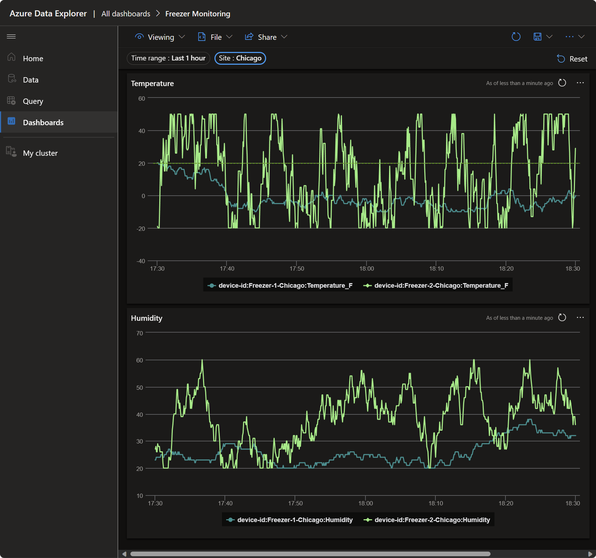
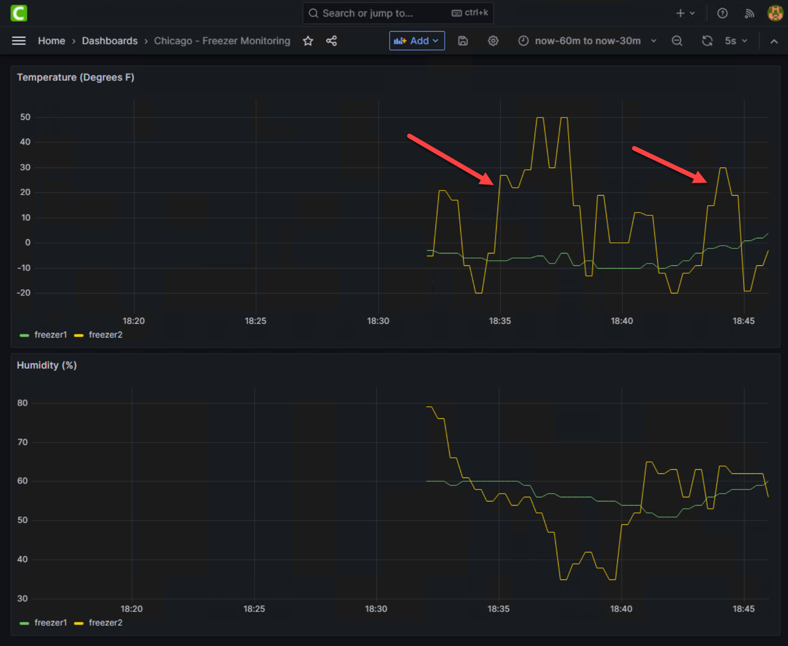
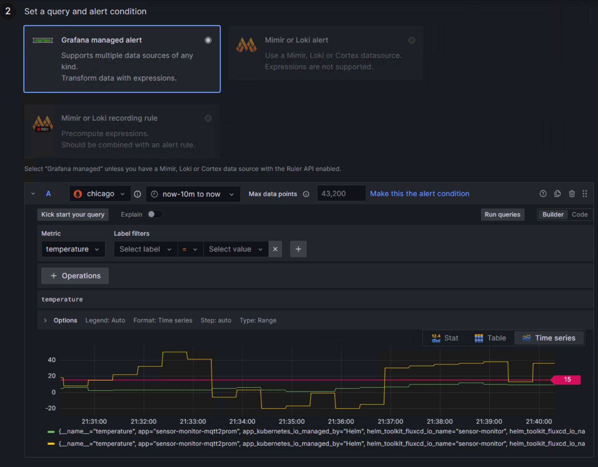

## Contoso Supermarket Freezer Monitor Overview

### Overview

Contoso Supermarket is obsessed with achieving the highest levels of food safety. To support this obsession Contoso has invested in technology to let it know when any food in a store's freezers is potentially unsafe due to the freezer reaching temperatures that would allow the food to thaw and pathogens to grow.

Contoso has installed IoT sensors in each freezer in each store to detect both temperature and humidity. The IoT sensors send current measurements via Message Queuing Telemetry Transport (MQTT) to a broker service in each store. The broker service forwards the data to [Azure IoT Hub](https://azure.microsoft.com/products/iot-hub/) and along to [Azure Data Explorer (ADX)](https://azure.microsoft.com/products/data-explorer/) database for aggregation with data from all stores and analysis. In addition, the sensor data is also sent to a dashboard in each store for visualizing sensor history and to enable early warning notifications to the store manager when a safety issue is imminent.

Contoso Supermarket is researching a number of additional health and safety systems that will leverage the same IoT infrastructure. These include:

- Air quality sensors to detect the presence of smoke or other contaminants
- Water quality sensors to detect the presence of contaminants in the water supply
- Motion and presence sensors to lights should be turned on for personal safety

The local collection and visualization of sensor data uses the same infrastructure as the [Infrastructure Observability](..\k8s_infra_observability\_index.md) stack, namely Prometheus and Grafana. This provides the store manager with a single pane of glass for monitoring both the infrastructure and the sensors, and minimizes the number of new technologies that the manager needs to learn and that Contoso must to support.

[Prometheus](https://prometheus.io/) is a highly efficient open-source monitoring system that collects and stores metrics from various sources in real-time. It provides a flexible query language for analyzing the collected metrics and offers robust alerting capabilities. On the other hand, [Grafana](https://grafana.com/) is a powerful open-source data visualization and analytics platform. It allows users to create interactive and customizable dashboards to visualize the collected metrics in real-time and also offers its own alerting capabilities.

### Architecture

As mentioned above, the environmental observability architecture for _Dev_, _Staging_, and _Prod_ environments leverage the same Kube Prometheus Stack as Infrastructure Observability, which includes Kubernetes manifests, Grafana dashboards, and Prometheus rules. Added to that are the IoT sensors (simulated in the scenario), [Mosquitto MQTT broker](https://mosquitto.org/), Azure IoT Hub, ADX, and a service that exposes IoT data to be scraped by Prometheus (MQTT2PROM).

Mosquitto open-source MQTT broker was chosen due to its popularity, is lightweight, and efficient, making it a good fit for the IoT sensors. Azure IoT Hub is a fully managed service that enables reliable and secure bi-directional communications between millions of IoT devices and a solution backend. It also provides a device registry that stores information about the devices and their capabilities.

The _Dev_ and _Staging_ environments are configured with individual Prometheus and Grafana instances, while the _Prod_ environment is configured with a central Grafana instance. This architecture allows for more granular monitoring and troubleshooting in the _Dev_ and _Staging_ environments, while still providing a centralized view of the infrastructure's health and performance in the _Prod_ environment.

## Freezer Monitoring dashboard

Contoso has an ADX dashboard for Freezer Monitoring analytics and monitoring. The dashboard is generated from live data sent from the IoT devices through the MQTT broker and IoT Hub to the ADX database using data integration.

## Manually import dashboard

> __NOTE: If you used the [Azure Developer CLI (azd) method](https://github.com/microsoft/azure_arc/blob/jumpstart_ag/docs/azure_jumpstart_ag/contoso_supermarket/deployment/_index.md#deployment-via-azure-developer-cli-experimental) to deploy the Contoso Supermarket scenario, you may skip this section as the dashboard is automatically imported for you during the automated deployment.__

To view the Freezer Monitoring dashboard you will first need to import it into ADX.

- On the Client VM, open Windows Explorer and navigate to folder _C:\Ag\adx_dashboards_ folder. This folder contains two ADX dashboard JSON files (_adx-dashboard-iotsensor-payload.json_ and _adx-dashboard-orders-payload.json_) with the ADX name and URI updated when the deployment PowerShell logon script is completed.

  

- Copy these ADX dashboard JSON files on your local machine in a temporary folder to import into ADX dashboards. Alternatively, you can log in to ADX Dashboards directly on the Client VM.

  > __NOTE: Depending on the account being used to log in to ADX portal, the Azure AD tenant of that account may have conditional access policies enabled and might prevent log in to ADX Dashboards from the Client VM as this VM is not managed by your organization.__

- On your local machine open the browser of your choice OR on the Client VM open the Edge browser and log in to [ADX Dashboards](https://dataexplorer.azure.com/). Use the same user account that you deployed Jumpstart Agora in your subscription. Failure to use the same account will prevent access to the ADX Orders database to generate dashboards.

- Once you are logged in to ADX dashboards, click on Dashboards in the left navigation to import the Freezer Monitoring dashboard.

  

- Select _Import dashboard from file_ to select previously copied file from the Client VM to your local machine or the _C:\Ag\adx_dashboards_ folder on the Client VM.
  

- Choose to import the _adx-dashboard-iotsensor-payload.json_ file.

  

- Confirm the dashboard name, accept the suggested name (or choose your own), and click Create.

  

- By default, the simulated IoT sensors are sending data to ADX so you will see at least a few minutes of data in the dashboard. Click Save to save the dashboard in ADX.

  

## Scenarios

Here are a few scenarios that Contoso Supermarket might encounter, and how they can be addressed using the data collected by the IoT sensors.

### Scenario 1: Identifying the broken freezer

The manager of the Chicago store has reported that food in one of the freezers has not been staying frozen. She has moved the food to the second freezer and called for service, but the technician reported that the freezer seems to be operating within parameters. Your job as the data analyst is to determine if the temperature sensor in the freezer has observed the issue, and provide the data to the store manager.

#### Confirm the issue in Azure Data Explorer

- Open the __Freezer Monitoring__ dashboard in ADX: https://dataexplorer.azure.com/dashboards

  

- The charts are quite busy so let's make it easier to see the problem in Chicago by filtering the dashboard to show only data for the __Chicago__ store.

  

- The store manager didn't tell you which freezer was having problems, but if you look at the dashboard below it's obvious that Freezer-2 (aka _device-id:Freezer-2-Chicago:Temperature_F_) is regularly exceeding the safe threshold of 20°F as indicated by the green dashed line. You can send this information to the store manager via a screenshot, or you can show the manager how she can use the Grafana dashboard to see see the same data.

  

- While you're viewing the dashboard, take a look at the Seattle store to see if there are any issues that should be reported to that store manager.

#### View the data in Grafana at the store

From the Client VM:

- Open the Edge browser, expand Grafana in the Favorites Bar, and select __Grafana Prod__
- Login with the username _admin_ and the Windows Administrator password provided when you created the deployment
- Click the hamburger menu next to __Home__ then click __Dashboards__

  
- Click __General__ to see the list of dashboards then click __Chicago - Freezer Monitoring__ to open the dashboard for Chicago

  
  - Notice that __freezer2__ is showing significant variability and frequently exceeding the safe threshold of 20°F.

    
- The manager can use this dashboard directly when talking to the technician about the freezer.

### Scenario 2: Send alert when freezer is too warm

As the manager of the Chicago store, you can use the Grafana dashboard to see the current temperature, but you're a busy person so you want to be notified when the temperature exceeds the safe threshold of 15°F so you can take action immediately.

__NOTE: This won't really send you email because the server is not configured to send smtp messages. However, it will help you understand the potential options available to a store manager.__

- In the Grafana dashboard, click the hamburger menu next to __Home__ then __Alerting__

  
- Add a Contact point
  - Click __Contact points__ in the navigation menu on the left

    
  - Click the __Add contact point__ button

    
  - Enter _Chicago Store Manager_ as the __Name__ and _chicago@contoso.com_ in the __Addresses__ field then click __Save contact point__

    
- Add an Alert rule
  - Click __Alert rules__ in the navigation menu

    
  - Click __Create alert rule__

    
  - Section 1
    - Enter _Freezer too warm - food at risk_ as the __Rule name__

      
  - Section 2
    - Select __chicago__ as the data source in query __A__
    - Select __temperature__ as the Metric in query __A__
    - Enter _15_ as the Threshold in expression __C__
    - Click __Preview__

      
    - View the preview

      
    - Since it's difficult to determine which series is which, let's fix the series names
      - Click __Options__
      - Under __Legend__ select __Custom__ then enter _{{sensor_type}}_
      - Click away from the 'Legend' box, then back into it for the series names to update

        
    - Notice in the chart the times where freezer2 exceeds the threshold and would trigger an alert
  - Section 3
    - Under __Folder__ type _Alerts_ and press __Enter__
    - Under __Evaluation group__ type _Alert Group_ and press __Enter__

      
  - Scroll to the top of the page and click __Save and exit__

    
- View your alert
  - Back on the __Alert rules__ page, type _freezer_ in the __Search__ box and press __Enter__
  - Expand the __Alerts > Alert Group__ folder to see your __Freezer too warm - food at risk__ alert
  - Expand the alert to view to __Silence__ it, __Show state history__, or quickly __edit__ or __delete__ the alert

    

### Scenario 3: Follow the data from the freezer to the dashboards

In order to troubleshoot problems with the IoT data flow, it's important to understand the components involved so let's take a look at how the data flows from from a simulated freezer to the dashboards in Azure Data Explorer and Grafana.

#### MQTT Simulator

The first component, which generates the data for both dashboards is the MQTT Simulator. The simulator is a Python script that runs in each AKS Edge Essentials cluster. It generates simulated temperature and humidity data for two freezers in each environment and sends the data via the MQTT protocol to the MQTT Broker.

To see data being produced by the MQTT Simulator

From the Client VM:

- Open __Visual Studio Code__
- Click on the __Kubernetes__ icon in the Activity Bar on the left

  
- Right-click on the __Chicago__ cluster and select __Set as Current Cluster__

  
- Expand __Chicago__ > __Namespaces__, right-click on __sensor-monitor__ and select __Use Namespace__

  
- Expand __Chicago__ > __Workloads__ > __Pods__ then right-click on the 'sensor-monitor-simulator-xxx' pod and select 'Logs'

  
- In the Logs view click __Run__ to see the logs

  
- This won't show you the values being produced, but it will show you that data is being published to the MQTT Broker

  

#### MQTT Broker

The MQTT Broker is a container running Mosquitto in each AKS Edge Essentials cluster like the simulator. It receives the data from the simulator and sends it to the Azure IoT Hub. It also makes the data available for a third service, MQTT2Prometheus, which we'll discuss in a moment.

To see data being received by the MQTT Broker

Assuming you have completed the steps to view the MQTT Simulator logs above:

- Expand __Chicago__ > __Workloads__ > __Pods__ then right-click on the 'sensor-monitor-simulator-xxx' pod and select 'Logs'

  
- In the Logs view click __Run__ to see the logs

  
- This won't show you the values being received or forwarded, but it will show you the connections from the 2 simulated freezer devices to the broker, as well as the connections from the broker to Azure IoT Hub for each freezer device. Finally, it shows the connection from __sensor-monitor-mqtt2prom__ which subscribes to the freezer data on the broker and makes it available to Prometheus, but more on that a bit later.

  

#### Azure IoT Hub

From the MQTT Broker the data is sent to Azure IoT Hub, which is a managed service, hosted in the cloud, that acts as a central message hub for bi-directional communication between your IoT application and the devices it manages. You can use IoT Hub to build IoT solutions with reliable and secure communications between millions of IoT devices and a cloud-hosted solution backend. You can connect virtually any device to IoT Hub.

To see whether data is being received by Azure IoT Hub for your devices

From your local machine:

- Open Resource Groups in the Azure Portal - [https://portal.azure.com](https://ms.portal.azure.com/#browse/resourcegroups)
- Click the new resource group you created for __Jumpstart Agora__
- Click __Ag-IotHub-xxxxx__ to open the IoT Hub

  
- Click __Queries__ in the left navigation menu

  
- Click __Run query__

  
  
- Scroll down to where you see __"deviceId": "Freezer-1-Chicago"__
- Review the __"connectionState"__ and __"lastActivityTime"__ values to see if the device is connected and sending data

  
- Repeat the last 2 steps above for __"Freezer-2-Chicago"__

#### Azure Data Explorer (ADX)

Azure Data Explorer (ADX) is a cloud service that ingests, stores, and analyzes diverse data from any data source. It is a fast, fully managed data analytics service for real-time analysis on large volumes of data streaming (i.e. log and telemetry data) from applications, websites, IoT devices, and more. ADX is a great choice for analyzing data from IoT devices because it can ingest data from a variety of sources, including IoT Hub, which is how we're getting the data from the MQTT Broker.

To see the ADX dashboard, review the steps from -[Scenario 1: View the data in Azure Data Explorer](#scenario-1-identifying-the-broken-freezer).

## Next steps

Use the following guides to explore different use cases of Contoso Supermarket in Jumpstart Agora.

- [PoS](https://placeholder)
- [CI/CD](https://placeholder)
- [Basic GitOps](https://placeholder)
- [Analytics](https://analytics)
- [Troubleshooting](https://troubleshooting)
