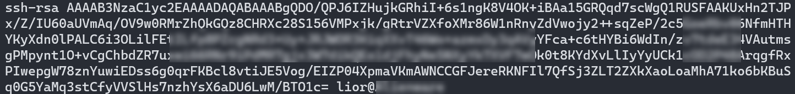
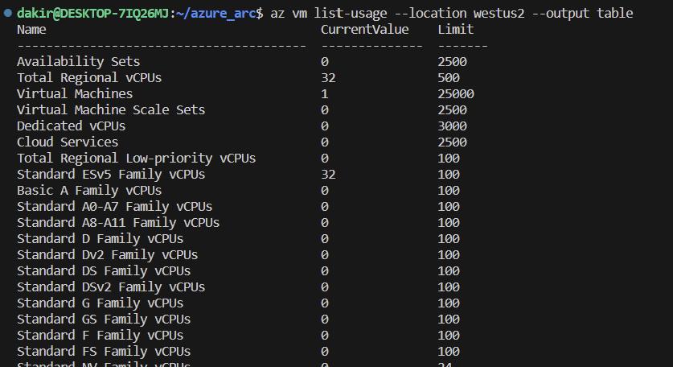
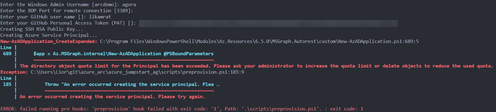
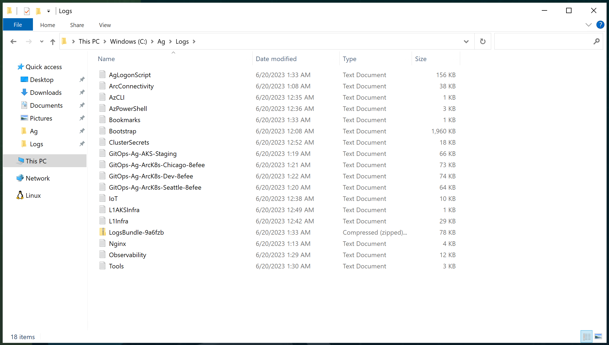
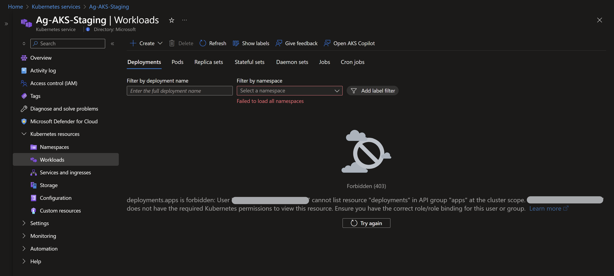

# Jumpstart Agora - Contoso Supermarket scenario troubleshooting

## Basic troubleshooting

Occasionally deployments of the Jumpstart Agora Contoso Supermarket scenario may fail at various stages. Common reasons for failed deployments include:

- Invalid Azure service principal id, service principal secret, or service principal Azure tenant ID provided in _azuredeploy.parameters.json_ file.

- Invalid SSH public key provided in _azuredeploy.parameters.json_ file.
  - An example SSH public key is shown here. Note that the public key includes "ssh-rsa" at the beginning. The entire value should be included in your _main.parameters.json_ file.

    

- User has not forked the [_jumpstart-agora-apps_ GitHub repository](https://github.com/microsoft/jumpstart-agora-apps). To simulate the developer experience, you must first fork the sample apps repo so that you have your own version of the underlying source code to work with. Instructions on how to fork this repo are included in the [deployment guide](https://azurearcjumpstart.io/azure_jumpstart_ag/contoso_supermarket/deployment/).

- Not enough vCPU quota available in your target Azure region - check vCPU quota and ensure you have at least 40 available vCPU.
  - You can use the command ```az vm list-usage --location <your location> --output table``` to check your available vCPU quota.

    

- Target Azure region does not support all required Azure services - ensure you are running Agora in one of the supported regions listed in the [deployment guide](https://azurearcjumpstart.io/azure_jumpstart_ag/contoso_supermarket/deployment/).

- Not enough Azure Active Directory quota to create additional service principals. You may receive a message stating "The directory object quota limit for the Principal has been exceeded. Please ask your administrator to increase the quota limit or delete objects to reduce the used quota."
  - If this occurs, you must delete some of your unused service principals and try the deployment again.

    

### Exploring logs from the _Ag-VM-Client_ virtual machine

Occasionally, you may need to review log output from scripts that run on the _Ag-VM-Client_ virtual machine in case of deployment failures. To make troubleshooting easier, the Agora deployment scripts collect all relevant logs in the _C:\Ag\Logs_ folder on _Ag-VM-Client_. A short description of the logs and their purpose can be seen in the list below:

| Log file | Description |
| ------- | ----------- |
| _C:\Ag\Logs\AgLogonScript.log_ | Output from the primary PowerShell script that drives most of the automation tasks. |
| _C:\Ag\Logs\ArcConnectivity.log_ | Output from the tasks that onboard servers and Kubernetes clusters to Azure Arc. |
| _C:\Ag\Logs\AzCLI.log_ | Output from Az CLI login. |
| _C:\Ag\Logs\AzPowerShell.log_ | Output from the installation of PowerShell modules. |
| _C:\Ag\Logs\Bookmarks.log_ | Output from the configuration of Microsoft Edge bookmarks. |
| _C:\Ag\Logs\Bootstrap.log_ | Output from the initial bootstrapping script that runs on _Ag-VM-Client_. |
| _C:\Ag\Logs\ClusterSecrets.log_ | Output of secret creation on Kubernetes clusters. |
| _C:\Ag\Logs\GitOps-Ag-*.log_ | Output of scripts that collect GitOps logs on the remote Kubernetes clusters. |
| _C:\Ag\Logs\IoT.log_ | Output of automation tasks that configure Azure IoT services. |
| _C:\Ag\Logs\L1AKSInfra.log_ | Output of scripts that configure AKS Edge Essentials clusters on the nested virtual machines. |
| _C:\Ag\Logs\Nginx.log_ | Output from the script that configures Nginx load balancing on the Kubernetes clusters. |
| _C:\Ag\Logs\Observability.log_ | Output from the script that configures observability components of the solution. |
| _C:\Ag\Logs\Tools.log_ | Output from the tasks that set up developer tools on _Ag-VM-Client_. |

  

### Accessing the Kubernetes resources on the clusters

After deploying Agora, if you try to access the Kubernetes resources on the clusters you will see the following error message. This is expected as you must have access/permissions to the cluster, the Kubernetes API, and the Kubernetes objects. You must grant yourself an appropriate RBAC permission to be able to view those resources.

  

- To able to access the Kubernetes resources on the AKS cluster from the Azure Portal, follow the guidance mentioned in [this article](https://learn.microsoft.com/azure/aks/kubernetes-portal?tabs=azure-cli#unauthorized-access).
- To able to access the Kubernetes resources on the AKS Edge Essentials clusters from the Azure Portal, follow the guidance mentioned in [this article](https://learn.microsoft.com/azure/azure-arc/kubernetes/cluster-connect).
